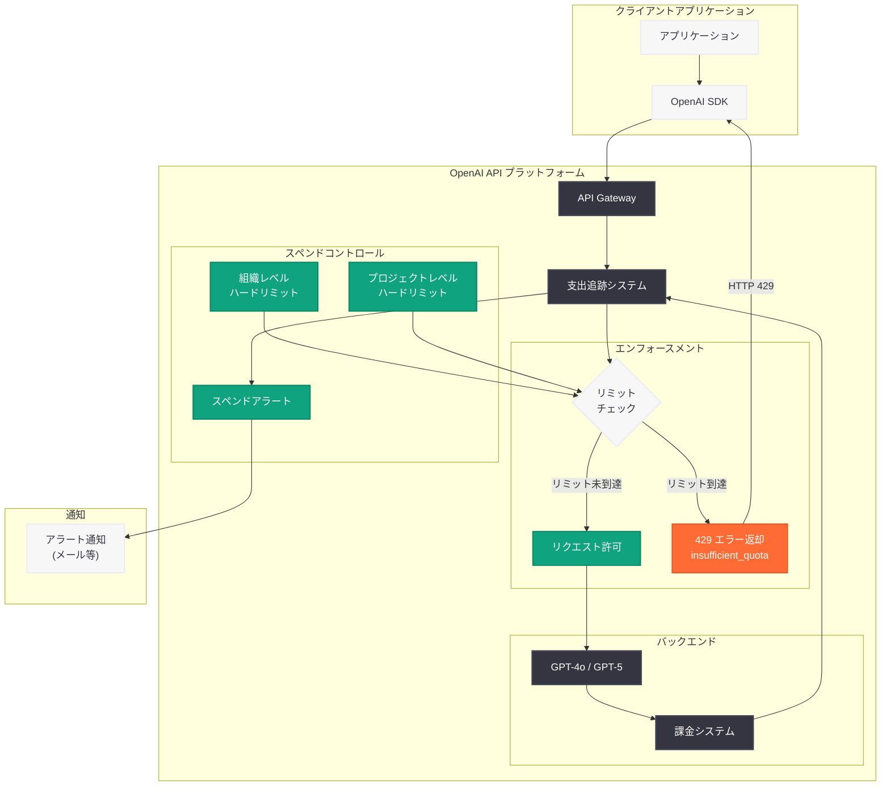

# OpenAI API ハードスペンドリミット: 組織・プロジェクト単位の月次支出上限

## メタデータ

| 項目 | 内容 |
|------|------|
| 発表日 | 2026-07-22 |
| ソース | OpenAI API Changelog |
| カテゴリ | API 更新・コスト管理 |
| 公式リンク | [developers.openai.com](https://developers.openai.com/api/docs/changelog) |

## 概要

OpenAI は 2026 年 7 月 22 日、API プラットフォームにおける組織 (Organization) およびプロジェクト (Project) 単位のハードスペンドリミット (Hard Spend Limits) 機能をリリースした。この機能により、月次の支出上限を設定し、追跡された支出が上限に達した時点で対象の API リクエストが HTTP 429 エラーを返すようになる。従来のスペンドアラート (通知のみ) に加えて、実際にトラフィックを遮断する強制的な支出制御が可能になった。

この機能は、予期しない API 利用コストの急増からチームを保護し、予算管理の確実性を高めるためのものである。特に本番環境において複数のプロジェクトが並行稼働する大規模組織にとって、プロジェクト単位での支出制御は運用上の重要な改善となる。スペンドアラートとハードリミットを組み合わせることで、段階的なコスト管理戦略を構築できる。

## 主な内容

### スペンドコントロールの種類

OpenAI API プラットフォームでは、2 種類のスペンドコントロールが提供されている。

| コントロール | 閾値到達時の動作 | ユースケース |
|-------------|-----------------|-------------|
| スペンドアラート (Spend Alert) | 通知を送信、API トラフィックは継続 | トラフィックを中断せずに支出を追跡 |
| ハードスペンドリミット (Hard Spend Limit) | 対象の API リクエストが 429 エラーを返す | 月次の組織またはプロジェクト上限を強制 |

スペンドアラートはキャップを強制するものではなく、通知のみの機能である。ハードスペンドリミットを追加した場合でもスペンドアラートは有効なままとなるため、ハードリミットによるトラフィック遮断の前に事前通知を受け取ることができる。

なお、OpenAI が組織の利用ティアに基づいて割り当てる承認済み月次利用上限 (approved monthly usage limit) は、ユーザーが設定するスペンドリミットとは別に存在する。

### 組織レベルの設定

組織レベルのハードスペンドリミットは、組織内の全プロジェクトにわたる API トラフィックに適用される。設定手順は以下の通りである。

1. プラットフォーム設定の Organization limits に移動する
2. **Spend** セクションで **Edit spend limit** を選択する
3. **Monthly spend limit** (月次支出上限) を入力する
4. **Enforce a hard limit** トグルを有効にする
5. **Save** を選択して保存する

### プロジェクトレベルの設定

プロジェクトレベルのハードスペンドリミットは、そのプロジェクトに課金される API トラフィックにのみ適用される。設定手順は以下の通りである。

1. Project settings に移動する
2. **Limits** を選択する
3. **Spend** セクションで **Edit spend limit** を選択する
4. **Monthly spend limit** (月次支出上限) を入力する
5. **Enforce a hard limit** トグルを有効にする
6. **Save** を選択して保存する

### 権限要件

スペンドリミットの設定には、該当する組織またはプロジェクトの設定を管理する権限 (RBAC / API Platform permissions) が必要である。

## 技術的な詳細

### エラーレスポンス

ハードスペンドリミットに到達した場合、API リクエストは以下のエラーを返す。

- **HTTP ステータスコード:** `429`
- **エラーコード:** `insufficient_quota`

このエラーは通常のレートリミット (rate limit) とは異なるため、エラーハンドリング時にはエラーコードを確認して区別する必要がある。

### 適用ルール

- 組織のハードリミットとプロジェクトのハードリミットは、単一のリクエストに対して同時に適用される
- いずれかの適用可能なハードリミットに到達した場合、対象リクエストは `429` エラーを返す
- リミットの引き上げまたは削除後、更新が伝播すればトラフィックは再開される
- リミットに到達したまま変更しない場合、次の月次請求サイクルでリセットされる

### エンフォースメントの特性

エンフォースメントは即座に行われるものではない。リミット状態が伝播する間にプラットフォームは少量の追加使用を処理する可能性があるため、記録された支出が設定金額をわずかに超過する場合がある。本番環境ではこのオーバーシュートを考慮した上限設定が推奨される。

### コードサンプル

以下は Python で `insufficient_quota` エラーをハンドリングする実装例である。

```python
from openai import OpenAI
import openai

client = OpenAI()


def call_api_with_quota_handling(messages: list[dict]) -> str | None:
    """ハードスペンドリミット到達時のエラーハンドリング例"""
    try:
        response = client.chat.completions.create(
            model="gpt-4o",
            messages=messages,
        )
        return response.choices[0].message.content

    except openai.RateLimitError as e:
        error_code = getattr(e, "code", None)

        if error_code == "insufficient_quota":
            # ハードスペンドリミットに到達
            # レートリミットとは異なり、リトライしても解消されない
            print("[QUOTA] ハードスペンドリミットに到達しました。")
            print("  - 組織またはプロジェクトの支出上限を確認してください")
            print("  - リミットの引き上げまたは月次リセットが必要です")
            # アラート送信やフォールバック処理を実装
            notify_ops_team(
                "API quota exhausted - hard spend limit reached"
            )
            return None
        else:
            # 通常のレートリミット - リトライ可能
            print(f"[RATE LIMIT] レートリミット到達: {e}")
            print("  - 指数バックオフでリトライしてください")
            raise


def notify_ops_team(message: str) -> None:
    """運用チームへの通知 (実装例)"""
    # Slack、PagerDuty、メール等への通知を実装
    print(f"[ALERT] {message}")


# 使用例
result = call_api_with_quota_handling(
    messages=[{"role": "user", "content": "Hello!"}]
)
if result is None:
    print("フォールバック処理を実行します")
```

### トラフィック復旧手順

API リクエストがクォータ関連の `429` エラーを返す場合、以下の手順で調査・復旧を行う。

1. **使用量の確認:** 現在の使用量を、リクエストに適用される組織およびプロジェクトのスペンドリミットと比較する
2. **リミットの引き上げまたは削除:** 月次リセット前にトラフィックを再開する必要がある場合、到達したハードリミットを引き上げるか削除する
3. **プリペイドクレジットの確認:** 追跡された支出が全てのハードリミットを下回っている場合、組織がプリペイドクレジットを使い切ったか、OpenAI の承認済み利用上限に到達していないか確認する
4. **エラー種別の区別:** エラーがレートリミットであり `insufficient_quota` ではない場合、レートリミットガイドを参照する

## アーキテクチャ



## 開発者への影響

### 本番環境における注意事項

ハードスペンドリミットは本番トラフィックを中断する可能性がある。以下の点を考慮して設計する必要がある。

- **グレースフルデグラデーション:** `insufficient_quota` エラーを検知した際のフォールバック処理を実装する。キャッシュの利用、代替サービスへの切り替え、またはユーザーへの適切なエラーメッセージの表示を検討する
- **オーバーシュートへの対応:** エンフォースメントの伝播遅延により、設定金額をわずかに超過する可能性がある。予算にはバッファを含めて設定する
- **モニタリングの整備:** スペンドアラートを活用し、ハードリミット到達前に運用チームが対応できる体制を整える

### コスト管理戦略の設計

段階的なコスト管理戦略として、以下の構成が推奨される。

1. **スペンドアラート (70-80%):** 月次予算の 70-80% でアラートを設定し、使用状況の確認と調整の時間を確保する
2. **追加アラート (90%):** 90% 到達時のアラートで緊急対応の準備を行う
3. **ハードリミット (100%):** 予算上限 + オーバーシュート許容分でハードリミットを設定する

### マルチプロジェクト運用

組織内で複数のプロジェクトを運用する場合、以下の戦略が有効である。

- **本番プロジェクト:** 十分に高いリミットを設定し、予期しない遮断を防ぐ。スペンドアラートによる監視を重視する
- **開発・テストプロジェクト:** 厳格なハードリミットを設定し、テスト時のコスト暴走を防止する
- **組織全体:** 全プロジェクトの合計として許容できる最大支出をガードレールとして設定する

### レートリミットとの区別

開発者は `429` エラーを受け取った際、レートリミット (rate limit) とクォータリミット (quota limit) を正確に区別する必要がある。

- **レートリミット:** 一時的な制限であり、指数バックオフによるリトライで解消される
- **クォータリミット (`insufficient_quota`):** 月次支出上限への到達であり、リトライでは解消されない。リミットの引き上げまたは月次リセットが必要

## 関連リンク

- [OpenAI API Changelog](https://developers.openai.com/api/docs/changelog)
- [Spend Limits Guide](https://developers.openai.com/api/docs/guides/spend-limits)
- [OpenAI API Rate Limits](https://platform.openai.com/docs/guides/rate-limits)
- [OpenAI Platform Settings](https://platform.openai.com/settings)

## まとめ

OpenAI API のハードスペンドリミット機能は、組織およびプロジェクト単位で月次支出の強制上限を設定できる重要なコスト管理機能である。上限到達時には API リクエストが HTTP 429 (`insufficient_quota`) エラーを返し、意図しないコスト超過を防止する。従来の通知のみのスペンドアラートと組み合わせることで、段階的な支出管理戦略を構築できる。

開発者は、本番環境ではハードリミットによるトラフィック遮断に備えたグレースフルデグラデーションの実装、エンフォースメントの伝播遅延によるオーバーシュートへの対応、およびレートリミットとクォータリミットの正確な区別が求められる。適切に構成することで、予算の確実な管理と安定したサービス運用の両立が可能となる。
