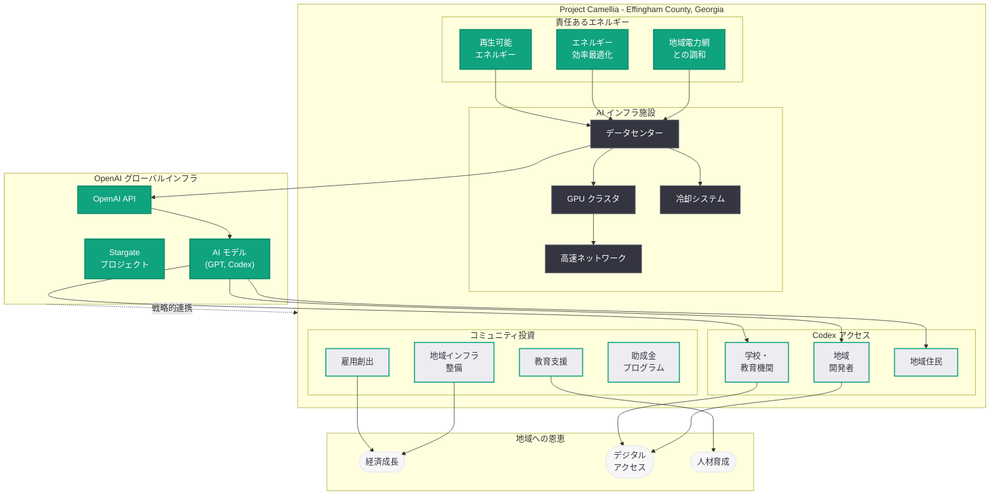

# Project Camellia: OpenAI が Effingham County コミュニティと共に AI インフラを構築

## メタデータ

| 項目 | 内容 |
|------|------|
| 発表日 | 2026-07-22 |
| ソース | OpenAI News |
| カテゴリ | Global Affairs (インフラ) |
| 公式リンク | [openai.com](https://openai.com/index/building-ai-infrastructure-with-the-effingham-county-community) |

## 概要

OpenAI は 2026 年 7 月 22 日、ジョージア州 Effingham County において AI インフラプロジェクト「Project Camellia」を発表した。本プロジェクトは、責任あるエネルギー利用、地域コミュニティへの投資、雇用創出、そして地域住民への Codex アクセス提供を柱とする包括的な取り組みである。

Project Camellia は、OpenAI の AI インフラ拡大戦略における重要なマイルストーンであり、単なるデータセンター建設にとどまらず、地域社会との共生を重視したアプローチを採用している点が特徴的である。AI の計算基盤を拡充しながら、その恩恵を地域コミュニティに直接還元するモデルケースとして位置づけられている。

## 主な内容

### Project Camellia の概要

Project Camellia は、ジョージア州 Effingham County に建設される OpenAI の AI インフラ施設プロジェクトである。「Camellia」(椿) という名称は、ジョージア州の州花であるチェロキーローズと並ぶ南部を代表する花に由来しており、地域との結びつきを象徴している。

本プロジェクトは以下の 4 つの柱で構成される。

1. **責任あるエネルギー利用:** 環境負荷を最小化する持続可能なエネルギー戦略
2. **コミュニティ投資:** 地域のインフラ整備と教育支援への資金提供
3. **雇用創出:** 建設期間および運用期間を通じた地域雇用の拡大
4. **Codex アクセス:** 地域住民や教育機関への AI ツール (Codex) の提供

### 責任あるエネルギーへのコミットメント

大規模 AI データセンターの運用には膨大な電力が必要であり、エネルギー消費は AI 産業全体の課題となっている。OpenAI は Project Camellia において、責任あるエネルギー戦略を以下のように推進する。

- **再生可能エネルギーの活用:** データセンターの電力需要を再生可能エネルギー源で賄う取り組み
- **エネルギー効率の最適化:** 最新の冷却技術や省電力設計を採用し、電力使用効率 (PUE) の最適化を図る
- **地域電力網への配慮:** 既存のコミュニティの電力供給に悪影響を与えないための計画的な電力調達
- **長期的な持続可能性:** 再生可能エネルギーへの投資を通じた地域全体のエネルギー転換への貢献

### コミュニティ投資計画

OpenAI は Project Camellia を通じて、Effingham County の地域社会に対する包括的な投資プログラムを実施する。

- **教育支援:** 地元の学校や教育機関に対する資金提供、STEM 教育プログラムの支援
- **インフラ整備:** データセンター建設に伴う道路、通信インフラなどの地域インフラ改善
- **地域団体への支援:** コミュニティ組織や非営利団体への助成金プログラム
- **デジタルリテラシー:** 地域住民向けの AI リテラシー教育プログラムの提供

### 雇用創出

Project Camellia は、建設フェーズから運用フェーズまで、多段階にわたる雇用機会を地域に提供する。

- **建設期間の雇用:** データセンター建設に伴う建設作業員、エンジニア、プロジェクト管理者などの直接雇用
- **運用期間の雇用:** 施設の維持管理、セキュリティ、技術運用などの長期的な雇用ポジション
- **間接的な経済効果:** 関連サービス産業 (飲食、宿泊、物流など) への波及効果
- **スキル開発:** 地域住民向けの技術トレーニングプログラムを通じた人材育成

### Codex アクセスの提供

Project Camellia の特筆すべき要素として、地域コミュニティへの Codex アクセス提供がある。OpenAI のコーディング支援 AI ツールである Codex を Effingham County の住民や教育機関に提供することで、AI 技術の恩恵を直接コミュニティに届ける。

- **教育機関向け:** 地元の学校や大学で Codex を活用したプログラミング教育を推進
- **地域開発者支援:** 地域のソフトウェア開発者やスタートアップに対する AI ツールの提供
- **デジタル格差の解消:** 都市部と地方部のテクノロジーアクセスの格差を縮小する取り組み
- **次世代人材の育成:** AI ツールを活用できる人材を地域内で育成し、地域経済の高度化を支援

## 技術的な詳細

### データセンターの技術要件

AI インフラとしてのデータセンターには、従来のクラウドデータセンターとは異なる特殊な要件がある。

- **高密度コンピューティング:** GPU クラスタによる大規模並列計算を支える電力・冷却インフラ
- **ネットワーク帯域:** モデル学習および推論に必要な超高速ネットワーク接続
- **冗長性と可用性:** AI サービスの可用性を確保するための冗長電源・冷却・ネットワーク設計
- **スケーラビリティ:** 将来の AI モデルの大規模化に対応するための拡張性の確保

### Effingham County の立地優位性

ジョージア州 Effingham County は AI データセンターの立地として以下の利点を有する。

- **地理的安定性:** 自然災害リスクが比較的低い地域
- **電力インフラ:** ジョージア州の電力網へのアクセス
- **土地の確保:** 大規模施設建設に十分な用地の確保が可能
- **交通アクセス:** サバンナ港や主要高速道路へのアクセスによる物流の利便性
- **ビジネス環境:** ジョージア州のビジネスフレンドリーな政策環境

### OpenAI のインフラ拡大戦略における位置づけ

Project Camellia は、OpenAI の広範な AI インフラ拡大戦略の一環である。OpenAI は AI モデルの学習と推論に必要な計算リソースを確保するため、複数の地域でインフラ投資を進めている。

- **Stargate プロジェクト:** SoftBank との合弁による大規模データセンター構想
- **クラウドパートナーシップ:** Microsoft Azure、Oracle Cloud との連携
- **自社インフラ:** 自社管理のデータセンター施設の建設
- **コミュニティモデル:** Project Camellia に代表される地域共生型のインフラ開発

## アーキテクチャ

## 開発者への影響

### AI インフラ容量の拡大

Project Camellia による AI インフラの拡充は、OpenAI API を利用する開発者にとって以下のメリットをもたらす可能性がある。

- **レイテンシの改善:** 米国南東部に新たなコンピューティング拠点が設置されることで、地理的に近い開発者やユーザーのレイテンシが改善される可能性がある
- **キャパシティの増加:** 全体的な計算リソースの増加により、ピーク時のスロットリングやレート制限が緩和される可能性がある
- **サービス信頼性の向上:** 地理的に分散したインフラにより、単一障害点のリスクが軽減される

### Codex の地域展開モデル

Effingham County への Codex アクセス提供は、OpenAI が AI ツールのアクセシビリティを地域単位で推進する新しいモデルを示している。

- **教育連携の先例:** 今後の他地域展開における教育機関との連携モデルの先駆けとなる
- **デジタル格差への対応:** テクノロジー企業がインフラ建設地のコミュニティに AI ツールアクセスを提供する取り組みの先例
- **開発者コミュニティの育成:** 地方部における新たな開発者コミュニティの形成を促進

### インフラ投資と地域共生の新パラダイム

Project Camellia は、大規模テクノロジーインフラの建設が単なる設備投資ではなく、地域社会との共生モデルとして設計できることを示している。この手法が成功すれば、今後の AI インフラ拡大において以下の影響が考えられる。

- **住民の支持獲得:** コミュニティへの直接的な恩恵を提示することで、データセンター建設への地域の支持を得やすくなる
- **規制環境の改善:** 地域経済への貢献を示すことで、データセンター建設に対する規制当局の理解を促進
- **持続可能な拡大:** 地域との良好な関係に基づく長期的で持続可能なインフラ拡大が可能になる

## 関連リンク

- [OpenAI 公式発表: Building AI infrastructure with the Effingham County community](https://openai.com/index/building-ai-infrastructure-with-the-effingham-county-community)
- [OpenAI News](https://openai.com/news)
- [OpenAI Codex](https://openai.com/codex)
- [OpenAI 公式ドキュメント](https://platform.openai.com/docs)

## まとめ

OpenAI の Project Camellia は、ジョージア州 Effingham County における AI インフラ構築プロジェクトとして、責任あるエネルギー利用、地域コミュニティへの投資、雇用創出、Codex アクセスの提供という 4 つの柱を掲げている。本プロジェクトの重要性は以下の 3 点に集約される。

第一に、AI インフラの拡大とコミュニティとの共生を両立させる新しいモデルを提示している点である。大規模データセンター建設に対する地域住民の懸念 (電力消費、環境影響など) に正面から取り組み、地域に直接的な恩恵を提供する仕組みを設計している。

第二に、Codex アクセスの地域提供という形で、AI 技術の民主化を具体的なアクションとして実行している点である。インフラ建設地のコミュニティに AI ツールを直接提供することで、テクノロジーの恩恵が地方部にも届く仕組みを構築している。

第三に、OpenAI のインフラ拡大戦略が多角的に進展していることを示している点である。Stargate プロジェクトやクラウドパートナーシップと並行して、地域共生型の自社インフラ開発を推進することで、AI の計算基盤を着実に拡充している。Project Camellia の成功は、今後の他地域での同様の取り組みの雛形となる可能性が高い。
