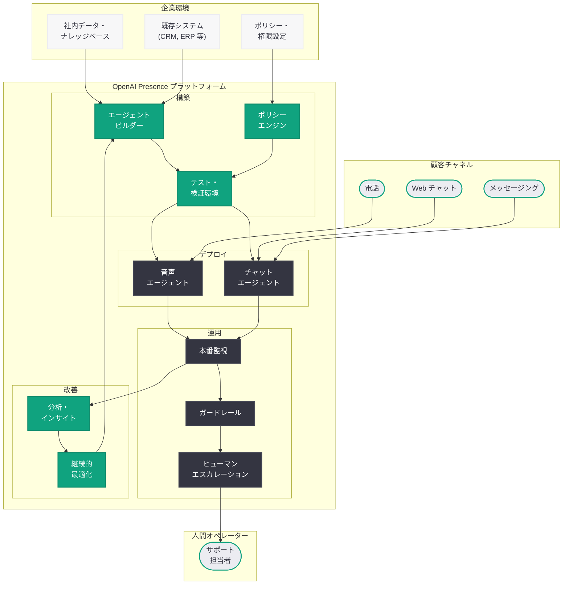

# OpenAI Presence: エンタープライズ向け AI エージェント管理プラットフォーム

## メタデータ

| 項目 | 内容 |
|------|------|
| 発表日 | 2026-07-22 |
| ソース | OpenAI News |
| カテゴリ | 新製品・エンタープライズ |
| 公式リンク | [openai.com](https://openai.com/index/introducing-openai-presence/) |

## 概要

OpenAI は 2026 年 7 月 22 日、エンタープライズ向けの新しいマネージドプラットフォーム「OpenAI Presence」を発表した。OpenAI Presence は、大規模かつミッションクリティカルなワークフローにおいて、AI エージェントの構築・デプロイ・運用・継続的改善をガバナンス付きで実現するプラットフォームである。顧客対応や社内業務など、大量のインタラクションが発生する高リスクな業務環境向けに設計されている。

本プラットフォームの登場は、OpenAI が API プロバイダーとしての役割を超え、エンタープライズ向けのフルマネージドソリューションを提供する段階に移行したことを示している。企業は AI エージェントを社内のデータ、ポリシー、既存ソフトウェア、ワークフローに接続し、ガバナンスとコンプライアンスを維持しながら本番運用できるようになる。現在、対象となるエンタープライズ向けに限定提供プログラムとして利用可能である。

## 主な内容

### プラットフォームの概要と位置づけ

OpenAI Presence は、AI エージェントのライフサイクル全体をカバーするマネージドエンタープライズプラットフォームである。従来、企業が AI エージェントを本番環境で運用するためには、構築・テスト・デプロイ・監視・改善の各フェーズで個別のツールやインフラを組み合わせる必要があった。OpenAI Presence はこれらを統合し、単一のプラットフォーム上で一貫した管理を可能にする。

VentureBeat の報道によると、OpenAI Presence は「顧客対応および社内業務ワークフローにまたがる AI エージェントのデプロイと管理のための新しいエンタープライズ製品」と位置づけられている。Business Insider は「企業が AI エージェントをより効果的に運用するために、これらのシステムを社内のデータ、ポリシー、既存ソフトウェア、ワークフローに接続する」支援を行うプラットフォームであると報じている。

### 音声およびチャットエージェントのデプロイ

OpenAI Presence の中核機能の一つは、リアルタイム音声エージェントとチャットボットのデプロイをサポートすることである。企業は以下の形式で AI エージェントを展開できる。

- **リアルタイム音声エージェント:** 電話やボイスインターフェースを通じた顧客対応に対応する AI エージェントを構築・デプロイ可能
- **チャットエージェント:** Web チャット、メッセージングプラットフォーム、社内ツールと統合したテキストベースの AI エージェントを展開可能

OpenAI 自身もこのソフトウェアを使用して自社のコールセンターを運用していることが SiliconAngle により報じられており、プラットフォームの実用性と信頼性を実証している。

### ポリシーと権限管理

エンタープライズ環境では、AI エージェントが企業のポリシーに従い、適切な権限範囲内で動作することが不可欠である。OpenAI Presence は以下の管理機能を提供する。

- **ポリシー定義:** 組織固有のポリシーを定義し、AI エージェントの動作範囲を制御
- **権限管理:** エージェントがアクセスできるシステムやデータ、実行可能なアクションを細かく設定
- **ビジネスシステム接続:** 既存の CRM、ERP、ナレッジベース、チケットシステムなどとの連携
- **テスト環境:** 本番デプロイ前にエージェントの動作をテストし、ポリシー準拠を検証

### 本番監視と継続的改善

デプロイ後の運用フェーズにおいて、OpenAI Presence は以下の監視・改善機能を提供する。

- **本番アウトカム監視:** エージェントの応答品質、解決率、顧客満足度などの指標をリアルタイムで追跡
- **パフォーマンス分析:** エージェントの動作パターンを分析し、改善ポイントを特定
- **継続的改善:** 監視データに基づいてエージェントの動作を継続的に最適化

### ヒューマンエスカレーション

AI エージェントが対応できない複雑なケースや、人間の判断が必要な場面において、適切に人間のオペレーターにエスカレーションする仕組みが組み込まれている。

- **判断基準の設定:** どのような状況でエスカレーションするかのルールを組織が定義
- **シームレスな引き継ぎ:** エージェントから人間への引き継ぎ時に、会話コンテキストと関連情報を自動で共有
- **ハイブリッド運用:** AI エージェントと人間オペレーターの協働を前提とした運用モデルをサポート

### ガードレールとコンプライアンス

規制産業やセンシティブなデータを扱う企業向けに、包括的なガバナンス機能を提供する。

- **ガードレール:** エージェントの応答内容や行動に対する制約を設定
- **コンプライアンス対応:** 業界固有の規制要件に準拠するためのフレームワーク
- **エスカレーションルールの統合:** ポリシー違反やリスクの高い状況を自動検出し、適切な対応を実行
- **監査ログ:** エージェントの全ての行動と判断プロセスを記録

## 技術的な詳細

### プラットフォームアーキテクチャ

OpenAI Presence は、エンタープライズ AI エージェントの構築から運用までを統合的に管理するレイヤードアーキテクチャを採用している。

#### エージェント構築レイヤー

- **マルチモーダル対応:** テキスト (チャット) と音声 (リアルタイム) の両方をサポート
- **ポリシーエンジン:** 企業固有のルールとガイドラインをエージェントの動作に反映
- **データ接続:** 社内システム、ナレッジベース、API との統合インターフェース

#### デプロイメントレイヤー

- **テスト・検証:** 本番デプロイ前のシミュレーション環境とポリシー準拠テスト
- **段階的ロールアウト:** トラフィックの段階的な移行をサポート
- **スケーラビリティ:** 大量のインタラクションに対応する水平スケーリング

#### 運用・監視レイヤー

- **リアルタイムモニタリング:** エージェントのパフォーマンスと品質をリアルタイムで監視
- **アラートシステム:** 異常検知時の自動通知
- **分析ダッシュボード:** KPI の可視化と傾向分析

### 統合ポイント

OpenAI Presence は以下のエンタープライズシステムとの統合を想定している。

- **CRM システム:** Salesforce、HubSpot 等の顧客管理システム
- **チケット管理:** Zendesk、ServiceNow 等のカスタマーサポートツール
- **ナレッジベース:** 社内 Wiki、ドキュメント管理システム
- **認証・認可:** SSO、RBAC による企業の ID 管理との連携
- **通信チャネル:** 電話、Web チャット、メッセージングアプリ

### ビジネスモデル

The Register の報道によると、OpenAI は「エージェントをデプロイするために企業に対してブーツ・オン・ザ・グラウンド (現場支援型) の料金を課す」コンサルティング的なアプローチを採用している。これは従来の API 従量課金モデルとは異なり、エンタープライズ向けのマネージドサービスとしてのポジショニングを示している。

## アーキテクチャ

## 開発者への影響

### エンタープライズ AI エージェント開発の民主化

OpenAI Presence の登場により、エンタープライズ向け AI エージェントの構築・運用に必要な技術的ハードルが大幅に下がる。従来、企業が本番環境で AI エージェントを運用するためには、以下の課題を個別に解決する必要があった。

- 独自のオーケストレーション基盤の構築
- ガバナンスとコンプライアンスフレームワークの実装
- 監視・アラートシステムの設計
- エスカレーションワークフローの構築
- マルチチャネル対応のインフラ整備

OpenAI Presence はこれらを統合プラットフォームとして提供することで、企業は AI エージェントのビジネスロジックとポリシー設計に集中できるようになる。

### 競合プラットフォームへの影響

OpenAI が直接エンタープライズ向けのエージェント管理プラットフォーム市場に参入したことで、以下の領域の既存プレイヤーに影響がある。

- **コンタクトセンター AI:** Five9、NICE、Genesys などの従来型コンタクトセンターソリューション
- **エージェントオーケストレーション:** LangChain、CrewAI、AutoGen 等のオープンソースフレームワーク
- **エンタープライズ AI プラットフォーム:** Microsoft Copilot Studio、Google Agent Builder 等のクラウドベンダー製品

### API 開発者への示唆

OpenAI Presence は既存の OpenAI API エコシステムの上に構築されていると考えられる。API を直接利用して独自のエージェントシステムを構築している開発者にとって、以下の点が注目される。

- **Realtime API の活用:** 音声エージェント機能は OpenAI の Realtime API を基盤としている可能性が高い
- **Assistants API との関係:** ポリシーエンジンやツール統合は Assistants API の拡張として実装されている可能性がある
- **エンタープライズグレードの要件:** 本番運用に必要なガバナンス、監視、エスカレーション機能の実装パターンが参考になる

### 導入を検討する企業への指針

OpenAI Presence は現在、限定提供プログラムとして対象企業に提供されている。以下の条件に該当する企業が主要ターゲットと考えられる。

- 大量の顧客インタラクションを処理する必要がある
- 高リスクなワークフローでガバナンスが不可欠である
- 既存の社内システムとの統合が求められる
- コンプライアンス要件が厳格である
- 人間のオペレーターとのハイブリッド運用を前提としている

## 関連リンク

- [OpenAI Presence 公式発表](https://openai.com/index/introducing-openai-presence/)
- [OpenAI Presence ビジネスページ](https://openai.com/business/openai-presence/)
- [OpenAI for Business](https://openai.com/business)
- [OpenAI Enterprise](https://openai.com/enterprise)
- [OpenAI Platform Documentation](https://platform.openai.com/docs)

## まとめ

OpenAI Presence は、OpenAI がエンタープライズ AI エージェント管理の領域に本格参入したことを示す重要な製品発表である。音声・チャットエージェントの構築からデプロイ、ポリシー管理、本番監視、ヒューマンエスカレーション、継続的改善までを一貫して管理できるマネージドプラットフォームとして、企業が AI エージェントを安全かつ効果的に本番運用するための基盤を提供する。

注目すべきポイントは以下の 3 点である。第一に、OpenAI が API プロバイダーからエンタープライズソリューションプロバイダーへと事業領域を拡大している点。第二に、コンサルティング的なビジネスモデルを採用し、企業の現場に密着した支援を行う方針を示している点。第三に、ガバナンス・コンプライアンス・ヒューマンエスカレーションを中核機能として位置づけ、高リスクワークフローでの AI エージェント活用を可能にしている点である。限定提供プログラムとして開始されており、今後の一般提供に向けた動向が注目される。
