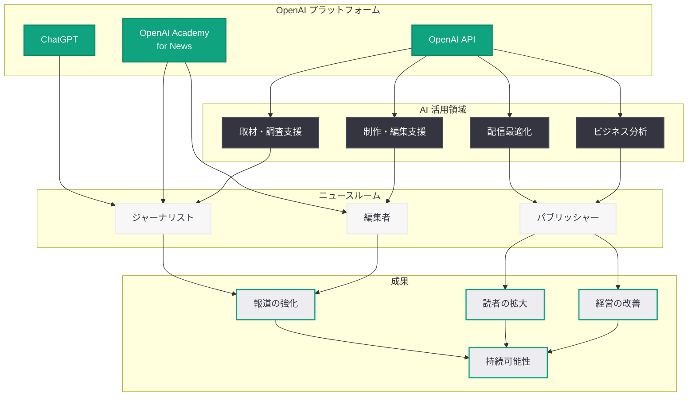

# ニュース組織が AI を活用して重要なミッションを推進する方法

## メタデータ

| 項目 | 内容 |
|------|------|
| 発表日 | 2026-07-22 |
| ソース | OpenAI News |
| カテゴリ | Company (パートナーシップ) |
| 公式リンク | [openai.com/index/how-news-organizations-are-using-ai](https://openai.com/index/how-news-organizations-are-using-ai) |

## 概要

OpenAI は「How news organizations are using AI to advance their vital missions」と題した記事を公開し、世界各地のニュース組織が AI をどのように活用して報道の強化、読者の拡大、ビジネスオペレーションの改善を実現しているかを紹介した。OpenAI のツールがジャーナリストやパブリッシャーを支援し、ニュースメディアの持続可能性と社会的使命の両立に貢献している全体像を示す内容である。

本記事は、OpenAI がメディア業界との関係を深化させる中で、AI がジャーナリズムの「代替」ではなく「強化」の手段であることを具体的な事例とともに示したものであり、報道機関と AI 企業の共存モデルを提示する重要な発表である。

## 主な内容

### 報道能力の強化

AI は報道の質と深さを高めるための強力なツールとして、世界各地のニュースルームに導入されている。主な活用領域は以下の通りである。

- **調査報道の加速:** 大量の公文書、裁判記録、財務データを AI が迅速に分析し、記者が重要なパターンや異常を発見しやすくする
- **データジャーナリズムの強化:** 統計データの分析、可視化の前処理、トレンド検出を AI が支援し、データに基づいた正確な報道を実現する
- **取材準備の効率化:** バックグラウンドリサーチ、過去記事の要約、関連情報の自動収集により、記者がより深い取材に集中できる環境を構築する
- **ファクトチェックの補助:** AI が主張の裏付けとなるソースを検索し、記者が事実確認プロセスを効率的に実施できるよう支援する

### 読者層の拡大

AI を活用したコンテンツ配信と読者体験の最適化により、ニュース組織は新たな読者層にリーチしている。

- **パーソナライゼーション:** 読者の関心やニーズに基づいてコンテンツを最適化し、エンゲージメントを向上させる
- **多言語対応:** AI 翻訳を活用して、記事を複数の言語で配信し、グローバルな読者層を獲得する
- **コンテンツフォーマットの多様化:** テキスト記事からニュースレター、音声要約、ソーシャルメディア投稿など、多様なフォーマットへの変換を AI が支援する
- **ローカルニュースのスケール:** 限られたリソースでも AI の支援により、より多くの地域コミュニティに質の高い報道を届ける

### ビジネスオペレーションの改善

ニュース組織の経営面でも AI は重要な役割を果たしている。

- **広告収入の最適化:** 読者データの分析に基づく広告配信の効率化と収益予測
- **購読者管理の高度化:** 解約リスクの予測、エンゲージメント分析、プロモーション最適化
- **コスト効率の向上:** 定型的な編集作業の自動化、レポート生成の効率化により運営コストを削減
- **新たな収益モデルの構築:** AI を活用した付加価値サービスの開発やデータ製品の提供

### OpenAI のジャーナリスト向けツール

OpenAI はジャーナリストやパブリッシャーに対して、以下のようなツールとプログラムを提供している。

- **ChatGPT:** リサーチ、ドラフト作成支援、情報の要約と整理に活用
- **OpenAI API:** ニュースルームの既存ワークフローに AI 機能を統合するためのインフラストラクチャ
- **OpenAI Academy for News Organizations:** ジャーナリストと編集者向けの AI 教育プログラム
- **People-First AI Fund:** 非営利ニュース組織への資金提供
- **コンテンツライセンスプログラム:** 報道機関のコンテンツを正当に利用し、対価を支払う枠組み

### 世界各地のパブリッシャーへの支援

OpenAI のジャーナリズム支援は米国にとどまらず、グローバルに展開されている。

- **グローバルパートナーシップ:** WAN-IFRA との協業を通じて世界各地のパブリッシャーに AI 活用のノウハウを提供
- **地域特化型プログラム:** 各地域のメディア環境やニーズに応じたカスタマイズされた支援
- **ローカル言語対応:** 英語圏以外のメディア組織にも AI ツールの恩恵が行き渡るよう、多言語対応を推進
- **新興市場への展開:** メディア産業が発展途上にある地域での AI 活用を支援し、ジャーナリズムの民主化に貢献

## 技術的な詳細

### ニュースルームにおける AI 活用アーキテクチャ

ニュース組織が OpenAI のツールを活用する際の典型的な技術構成は以下の通りである。

#### 取材・調査フェーズ

- **Chat Completions API:** 大量の文書から重要な情報を抽出し、記者のリサーチを加速する
- **Embeddings API:** 過去記事や参考資料のベクトル検索により、関連情報を即座に取得する
- **ChatGPT:** 対話形式でのリサーチ、情報の整理、仮説の検証に活用する

#### 制作・編集フェーズ

- **テキスト生成・校正:** 記事のドラフト校正、見出し候補の生成、要約の作成を支援する
- **翻訳 API:** 記事の多言語展開を自動化し、グローバルな配信を可能にする
- **音声 API:** テキスト記事の音声変換、ポッドキャスト素材の生成に活用する

#### 配信・分析フェーズ

- **パーソナライゼーションエンジン:** 読者の閲覧履歴と関心に基づくコンテンツ推薦
- **分析ダッシュボード:** エンゲージメントデータの自動分析と改善提案
- **自動配信最適化:** 配信タイミングとチャネルの最適化を AI が学習・実行する

## アーキテクチャ

## 開発者への影響

OpenAI のニュース組織向け AI 活用の全体像は、メディア技術者やニュースプロダクト開発者に以下のインパクトを与える。

- **ニュースルーム向け AI プロダクトの需要拡大:** 報道機関が AI を積極的に導入する流れの中で、ニュースルーム特化型のツールやインテグレーション開発の機会が増加する
- **API 統合パターンの標準化:** OpenAI API をニュースルームのワークフローに組み込むための設計パターンやベストプラクティスが成熟しつつある
- **倫理的 AI 設計の重要性:** ジャーナリズムにおける AI 活用では、正確性、公平性、透明性が厳しく求められるため、これらを担保する技術設計が不可欠である
- **多言語・多地域対応の技術課題:** グローバルなメディア組織を支援するには、多様な言語や文化的文脈に対応する AI システムの構築が求められる
- **持続可能なビジネスモデルとの統合:** AI を導入するだけでなく、それが報道機関の収益向上やコスト削減に直結する仕組みを設計する視点が重要になる

## 関連リンク

- [How news organizations are using AI (公式)](https://openai.com/index/how-news-organizations-are-using-ai)
- [OpenAI and Journalism](https://openai.com/index/openai-and-journalism/)
- [OpenAI Academy](https://openai.com/academy)
- [OpenAI News](https://openai.com/news)
- [OpenAI API ドキュメント](https://platform.openai.com/docs)
- [関連レポート: OpenAI とジャーナリズム](2026-06-19-openai-and-journalism.md)
- [関連レポート: Axios が AI を活用して高インパクトなローカルジャーナリズムを実現する方法](2026-03-04-axios-ai-journalism.md)

## まとめ

OpenAI は本記事を通じて、世界各地のニュース組織が AI を活用して報道の強化、読者の拡大、ビジネスオペレーションの改善を実現している具体的な姿を示した。AI はジャーナリストの代替ではなく、調査報道の加速、データ分析の効率化、コンテンツ配信の最適化、経営判断の支援など、報道のあらゆるフェーズで記者やパブリッシャーを補強する存在として位置付けられている。OpenAI Academy for News Organizations による教育プログラム、People-First AI Fund を通じた資金提供、コンテンツライセンスによる公正な対価の支払いなど、多層的なアプローチでメディアエコシステム全体の持続可能性を支える構想が明確になった。ニュース組織にとって AI の導入は、単なる業務効率化にとどまらず、ジャーナリズムの社会的使命をより効果的に果たすための戦略的な選択肢となっている。
