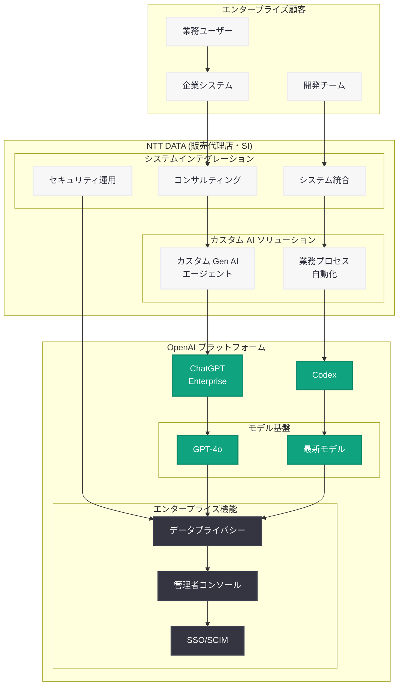

# NTT データ、OpenAI とのグローバル戦略的提携を拡大

## メタデータ

| 項目 | 内容 |
|------|------|
| 発表日 | 2026-07-22 |
| ソース | OpenAI News |
| カテゴリ | パートナーシップ・企業事例 |
| 公式リンク | [openai.com/index/ntt-data](https://openai.com/index/ntt-data/) |

## 概要

NTT DATA Group (NTT データグループ) が OpenAI とグローバル戦略的提携を締結し、日本初かつ世界で 2 社目 (PwC に次ぐ) となる ChatGPT Enterprise の公式販売代理店権を取得した。NTT データは、自社のシステムインテグレーション (SI) の専門知識と OpenAI の AI 技術を組み合わせ、世界中のエンタープライズ顧客に対して安全かつスケーラブルな AI ソリューションを提供する。

本提携により、NTT データは ChatGPT Enterprise、Codex、カスタム Gen AI エージェントなど OpenAI の製品群を企業向けに展開し、2027 年度末までに 1,000 億円の売上目標を掲げている。既に社内では 9,000 名の従業員が ChatGPT Enterprise と Codex を活用しており、インシデント分析の所要時間を Codex の導入により 30 分にまで短縮するなど、具体的な成果を上げている。

## 主な内容

### グローバル戦略的提携の詳細

NTT DATA Group と OpenAI のグローバル戦略的提携は、単なる技術パートナーシップにとどまらず、販売代理権を含む包括的なアライアンスである。この提携の主なポイントは以下の通り。

- **日本初の ChatGPT Enterprise 公式販売代理店:** NTT データは日本市場において ChatGPT Enterprise の唯一の公式ディストリビューターとなった
- **世界で 2 社目の販売代理権取得:** グローバルにおいて PwC に次ぐ 2 社目の販売代理店として、OpenAI のエンタープライズ製品のグローバル展開を担う
- **SI 専門知識と AI 技術の融合:** NTT データが持つシステム設計・構築・運用の豊富な実績と、OpenAI の最先端 AI 技術を統合し、企業の DX (デジタルトランスフォーメーション) を包括的に支援
- **グローバル展開:** 日本市場にとどまらず、NTT データのグローバルネットワークを活用した世界規模での AI ソリューション提供を計画

### 利用製品と技術スタック

NTT データが本提携を通じて展開・活用する OpenAI 製品群は以下の通りである。

| 製品 | 主な特徴 | 活用領域 |
|------|----------|----------|
| ChatGPT Enterprise | GPT-4o 等の最新モデルへの無制限アクセス、大規模コンテキストウィンドウ | 全社的な業務効率化、顧客向けソリューション |
| Codex | コーディングエージェント | インシデント分析、開発効率化 |
| カスタム Gen AI エージェント | 業務特化型 AI エージェント | 顧客固有の業務プロセス自動化 |

### 導入規模と実績

NTT データは自社内での先行導入により、OpenAI 製品の実用性を実証している。

- **社内利用者数:** 9,000 名の従業員が ChatGPT Enterprise と Codex を日常的に活用
- **インシデント分析の効率化:** Codex を活用したインシデント分析により、従来数時間を要していた作業を 30 分に短縮
- **売上目標:** 2027 年度末までに 1,000 億円 (約 7 億ドル) の売上達成を目指す

### セキュリティとコンプライアンス

エンタープライズ顧客への販売代理店として、NTT データはセキュリティ面での強化を重視している。

- **強化されたデータセキュリティ機能:** 企業のデータがモデルのトレーニングに使用されないことを保証
- **大規模 AI 導入のセキュア化:** 金融、製造、官公庁など高いセキュリティ要件を持つ業界に対応
- **NTT データのセキュリティ運用実績との統合:** 既存のセキュリティオペレーションセンター (SOC) やマネージドセキュリティサービスとの連携

## 技術的な詳細

### ChatGPT Enterprise の主要機能

NTT データが顧客に提供する ChatGPT Enterprise の主要な技術的特徴は以下の通りである。

| 機能 | 詳細 |
|------|------|
| 最新モデルへの無制限アクセス | GPT-4o をはじめとする最新モデルをレート制限なしで利用可能 |
| 大規模コンテキストウィンドウ | 長大なドキュメントや複雑なコードベースの一括処理が可能 |
| データプライバシー | ビジネスデータがモデルのトレーニングに使用されないことを保証 |
| 管理者コンソール | 組織全体の利用状況を可視化し、ポリシー管理を一元化 |
| SSO/SCIM 統合 | 既存の ID 管理基盤とのシームレスな連携 |
| カスタム GPTs | 業務ドメインに特化したカスタムエージェントの構築 |

### Codex によるインシデント分析

NTT データが Codex を活用して実現した 30 分でのインシデント分析は、以下のようなプロセスで実行されていると想定される。

```python
from openai import OpenAI

client = OpenAI()

# NTT データのインシデント分析パターン: Codex を活用した障害原因特定
response = client.chat.completions.create(
    model="codex",
    messages=[
        {
            "role": "system",
            "content": (
                "You are an incident analysis agent for enterprise systems. "
                "Analyze log files, stack traces, and system metrics to identify "
                "root causes and suggest remediation steps. "
                "Focus on time-to-resolution optimization."
            )
        },
        {
            "role": "user",
            "content": (
                "Analyze the following incident data including application logs, "
                "infrastructure metrics, and recent deployment changes to identify "
                "the root cause and recommend a fix."
            )
        }
    ],
    temperature=0.2,
)
```

### カスタム Gen AI エージェントの構築

NTT データは顧客の業務プロセスに特化したカスタム Gen AI エージェントを構築し提供する。SI 企業としての業務分析力を活かし、以下のような領域で業務特化型エージェントを展開する。

- **業務プロセス自動化エージェント:** 定型業務のワークフローを AI が自動実行
- **ナレッジマネジメントエージェント:** 社内文書やマニュアルから必要な情報を検索・要約
- **カスタマーサポートエージェント:** 問い合わせ対応の自動化と品質向上

## アーキテクチャ



## 開発者への影響

NTT データと OpenAI のグローバル戦略的提携は、エンタープライズ AI の導入と開発のあり方に以下のような影響を与える。

- **SI 企業を通じた AI 導入の加速:** 自社で直接 OpenAI と契約するのではなく、NTT データのような SI 企業を介して AI を導入する新たなチャネルが確立された。これにより、AI に関する専門知識が限られる企業でも、SI パートナーの支援を受けながら高度な AI 活用を実現できる
- **カスタムエージェント開発の需要拡大:** NTT データが顧客向けにカスタム Gen AI エージェントを構築するビジネスモデルは、エージェント開発に携わるエンジニアの需要を大幅に増加させる。OpenAI の API や Assistants API、Function Calling を活用したエージェント構築スキルの重要性が高まる
- **Codex のエンタープライズ運用モデル:** インシデント分析を 30 分に短縮した事例は、Codex を運用 (Ops) 領域に適用する具体的なモデルを示している。SRE やプラットフォームエンジニアにとって、Codex を既存の監視・アラートシステムと統合するアーキテクチャ設計が新たな課題となる
- **日本市場での OpenAI エコシステム拡大:** NTT データが販売代理店となったことで、日本企業が ChatGPT Enterprise を導入するハードルが大幅に低下する。日本語での技術サポート、導入支援、運用サービスが NTT データを通じて提供されるため、中堅・大企業の導入が加速すると予想される
- **グローバル SI パートナー連携のモデルケース:** PwC に次ぐ 2 社目のグローバル販売代理店として、SI 企業と AI プラットフォーム企業の提携モデルが確立された。今後、同様のパートナーシップが他の大手 SI 企業にも拡大する可能性がある

## 関連リンク

- [NTT DATA と OpenAI のパートナーシップ (公式)](https://openai.com/index/ntt-data/)
- [ChatGPT Enterprise](https://openai.com/chatgpt/enterprise)
- [OpenAI Codex](https://openai.com/codex)
- [関連レポート: CyberAgent が ChatGPT Enterprise と Codex で AI 活用を加速](2026-04-09-cyberagent-chatgpt-enterprise-codex.md)
- [関連レポート: Rakuten が Codex で問題修復速度を 2 倍に向上](2026-03-11-rakuten-codex.md)
- [関連レポート: OpenAI、エンタープライズ AI の次なるフェーズを発表](2026-04-08-next-phase-of-enterprise-ai.md)
- [OpenAI API ドキュメント](https://platform.openai.com/docs)

## まとめ

NTT DATA Group が OpenAI とグローバル戦略的提携を締結し、日本初かつ世界で 2 社目となる ChatGPT Enterprise の公式販売代理店権を取得した。社内 9,000 名による先行導入で Codex によるインシデント分析の 30 分への短縮を実現し、2027 年度末までに 1,000 億円の売上目標を掲げている。NTT データの SI 専門知識と OpenAI の AI 技術の融合により、ChatGPT Enterprise、Codex、カスタム Gen AI エージェントを組み合わせたエンタープライズ向け AI ソリューションがグローバルに展開される。本提携は、SI 企業を通じた AI 導入という新たなチャネルを確立し、日本市場を含むグローバルでのエンタープライズ AI 普及を加速させる重要なマイルストーンとなる。
