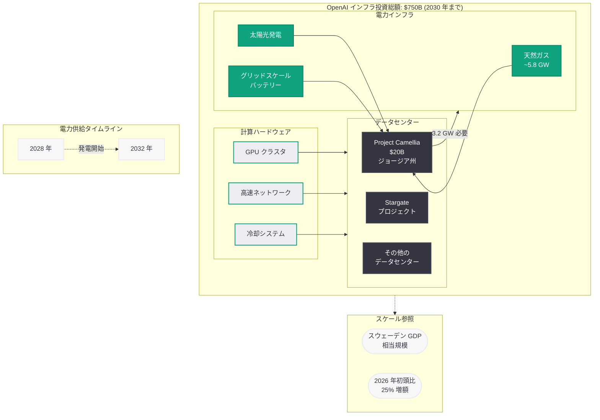

# OpenAI の AI インフラ投資が 7,500 億ドルに拡大 - 2030 年までの戦略的支出計画

## メタデータ

| 項目 | 内容 |
|------|------|
| 発表日 | 2026-07-22 |
| ソース | OpenAI News / Industry Report |
| カテゴリ | Business / Infrastructure |
| 公式リンク | [openai.com](https://openai.com/index/ai-infrastructure-spending-2030) |

## 概要

OpenAI は 2030 年までの AI インフラ投資額を 7,500 億ドル (約 112 兆円) に拡大すると発表した。これは 2026 年初頭の見積もりから 25% の増額であり、スウェーデンの GDP に匹敵する規模である。The Wall Street Journal が最初に報じた本計画には、ジョージア州における 200 億ドル規模のデータセンターキャンパス「Project Camellia」が含まれており、OpenAI の計算インフラ拡充に向けた野心的な戦略の全容が明らかになった。

本発表は、AI 産業における計算リソース需要の急速な拡大と、それに伴うエネルギー・インフラ課題の深刻さを浮き彫りにしている。OpenAI が自社インフラへの大規模投資を加速させる背景には、AI モデルの学習・推論に必要な計算能力の指数関数的増大がある。

## 主な内容

### 投資規模: 7,500 億ドルの全体像

OpenAI の 2030 年までのインフラ支出計画は、以下の領域を包含する。

- **計算インフラ:** GPU クラスタ、サーバー、ネットワーク機器の調達・構築
- **データセンター:** 複数拠点における大規模データセンターキャンパスの建設
- **エネルギー調達:** 電力供給インフラの整備、再生可能エネルギーへの投資
- **スケールの参照:** 7,500 億ドルはスウェーデンの GDP に匹敵し、2026 年初頭の見積もりから 25% 増

### Project Camellia - ジョージア州データセンター

Project Camellia は OpenAI のインフラ戦略における主要プロジェクトの一つである。

- **投資額:** 200 億ドル (約 3 兆円)
- **所在地:** ジョージア州 Effingham County、サバンナ北西の 1,400 エーカー
- **電力需要:** Georgia Power から最低 3.2 ギガワット
- **電力供給時期:** 2028 年から 2032 年の間に発電容量を確保
- **費用負担:** OpenAI がインフラおよび電力サービス費用の全額を負担
- **グリッド柔軟性:** 電力需要ピーク時に最大 1 ギガワットの消費削減に対応
- **税制優遇:** Effingham County から 15 年間にわたる固定資産税 50% 減免

### 電力供給の詳細

Georgia Power は 2025 年 12 月に PSC (公益事業委員会) から追加 9,885 メガワットの発電承認を取得しており、OpenAI との契約はその新規容量の約 3 分の 1 を占める。

- 約 5.8 GW が天然ガスから供給 (うち約 4 分の 1 がより汚染度の高い単純サイクルタービン)
- 残りはグリッドスケールバッテリーおよび太陽光発電
- 新規化石燃料容量は Georgia Power の既存天然ガス発電設備の 2 倍以上に相当

### 規制環境

ジョージア州の PSC は、100 MW を超える新規大口需要家に関連するコストが既存の料金支払者に転嫁されることを防止する規則を採択している。これにより、OpenAI のデータセンターによる電力需要増加が一般市民の電気料金上昇につながらない仕組みが整備されている。

### 建設体制

OpenAI は最近、データセンター建設を統括する Brett Mayo 氏を採用した。Mayo 氏は以前 xAI において Memphis の Colossus データセンター建設を監督していた人物である。ただし、Colossus は迅速に建設されたものの、NAACP および Southern Environmental Law Center が大気質への影響について訴訟を提起するなど、法的課題に直面した経緯がある。

### Stargate プロジェクトとの関係

OpenAI のもう一つの主要インフラプロジェクトである Stargate データセンターは、関税の影響により計画の進行に困難を抱えていると報じられている。Project Camellia と Stargate の両プロジェクトは、7,500 億ドルの総投資計画の中核を構成する。

## アーキテクチャ

## 財務・ビジネスへの影響

### 投資規模の意味

7,500 億ドルという投資額は、AI 産業史上最大級のインフラ投資であり、以下の観点でビジネスに大きな影響を与える。

- **資本調達:** これほどの規模の投資を実行するには、IPO、パートナーシップ、融資など多様な資金調達手段が必要となる。OpenAI は 2026 年に IPO を計画しており、本投資計画はその資金需要の根拠を示している
- **競争環境:** Google、Meta、Amazon など他の AI 企業も大規模インフラ投資を進めており、計算リソースの確保が競争優位の鍵となっている
- **投資回収:** 膨大な固定費を回収するためには、API 収益、ChatGPT サブスクリプション、エンタープライズ契約の大幅な拡大が必要
- **地域経済:** Project Camellia だけでも 200 億ドルの投資がジョージア州にもたらされ、雇用創出と税収増加に貢献する

### リスク要因

- **Stargate の遅延:** 関税の影響によるプロジェクト進行の困難
- **電力供給の不確実性:** 2028 年から 2032 年の電力供給タイムラインは長期にわたり、不確実性が残る
- **GPU 初号機の稼働時期未定:** Project Camellia においていつ最初の GPU が稼働するかは未公表
- **規制リスク:** 環境訴訟や規制強化の可能性

## 環境・エネルギーへの考慮

### 環境への懸念

Project Camellia のエネルギー計画には重大な環境面の懸念が存在する。

- **化石燃料依存:** 電力供給の大部分 (約 5.8 GW) が天然ガスに依存し、うち約 4 分の 1 がより汚染度の高い単純サイクルタービンから供給される
- **既存設備の倍増:** 新規化石燃料容量は Georgia Power の既存天然ガス発電設備を 2 倍以上に拡大する
- **電力構成の非公開:** OpenAI も Georgia Power も Project Camellia に具体的にどのエネルギー源が使われるかを公開していない
- **先行事例の教訓:** Brett Mayo 氏が以前関与した xAI の Colossus データセンターでは、NAACP と Southern Environmental Law Center が大気質への影響について訴訟を提起している

### グリッド柔軟性への取り組み

OpenAI は電力需要ピーク時に最大 1 ギガワットの消費削減に応じることを約束しており、これは地域電力網の安定性への配慮を示している。しかし、3.2 GW の総需要に対して 1 GW の削減余地は、ピーク時でもなお 2.2 GW 以上の電力消費が継続することを意味する。

### 既存料金支払者の保護

ジョージア州 PSC の規則により、100 MW 超の新規大口需要家のコストが既存の料金支払者に転嫁されることは防止されている。OpenAI がインフラおよび電力サービス費用の全額を負担する契約は、この規制要件に沿ったものである。

## 開発者への影響

本投資計画の実現は、OpenAI API を利用する開発者に以下の影響を与える可能性がある。

- **計算容量の大幅拡大:** 7,500 億ドルのインフラ投資により、API のスループットとキャパシティが大幅に向上する見込み
- **レイテンシの改善:** 地理的に分散したデータセンター群により、より多くの地域で低レイテンシアクセスが実現する可能性
- **新モデルの基盤:** 大規模計算リソースは次世代 AI モデルの学習を可能にし、より高性能な API サービスにつながる
- **コスト動向:** 大規模投資の回収必要性と効率化のバランスにより、API 価格の動向に注目が集まる
- **サービス安定性:** 複数拠点のインフラにより、単一障害点のリスクが低減され、サービスの可用性が向上する

## 関連リンク

- [OpenAI 公式発表: AI Infrastructure Spending 2030](https://openai.com/index/ai-infrastructure-spending-2030)
- [Project Camellia: Effingham County コミュニティとの AI インフラ構築](reports/2026/2026-07-22-building-ai-infrastructure-effingham-county.md)
- [Stargate Compute Infrastructure](reports/2026/2026-04-29-stargate-compute-infrastructure.md)
- [OpenAI News](https://openai.com/news)
- [OpenAI 公式ドキュメント](https://platform.openai.com/docs)

## まとめ

OpenAI の 7,500 億ドルインフラ投資計画は、AI 産業の計算リソース需要がいかに急速に拡大しているかを如実に示している。以下の 3 点が本発表の核心である。

第一に、投資規模の前例のない大きさである。スウェーデンの GDP に匹敵する 7,500 億ドルという金額は、一企業のインフラ投資としては史上最大級であり、AI 産業が国家経済レベルの資本を必要とする段階に入ったことを意味する。

第二に、エネルギー課題の深刻さである。Project Camellia だけで 3.2 GW の電力を必要とし、その大部分が天然ガスに依存する計画は、AI の発展と環境負荷の間にある根本的な緊張関係を浮き彫りにしている。OpenAI は電力需要ピーク時の消費削減を約束しているが、化石燃料依存度の高さに対する環境団体からの批判は避けられない。

第三に、実行リスクの存在である。Stargate プロジェクトの関税による遅延、Project Camellia の電力供給タイムラインの長さ (2028-2032 年)、そして GPU 稼働開始時期の未定は、この野心的な計画が直面する現実的な課題を示している。計画の発表から実現までの間に、規制環境、技術動向、そして AI 市場そのものが大きく変化する可能性がある。
