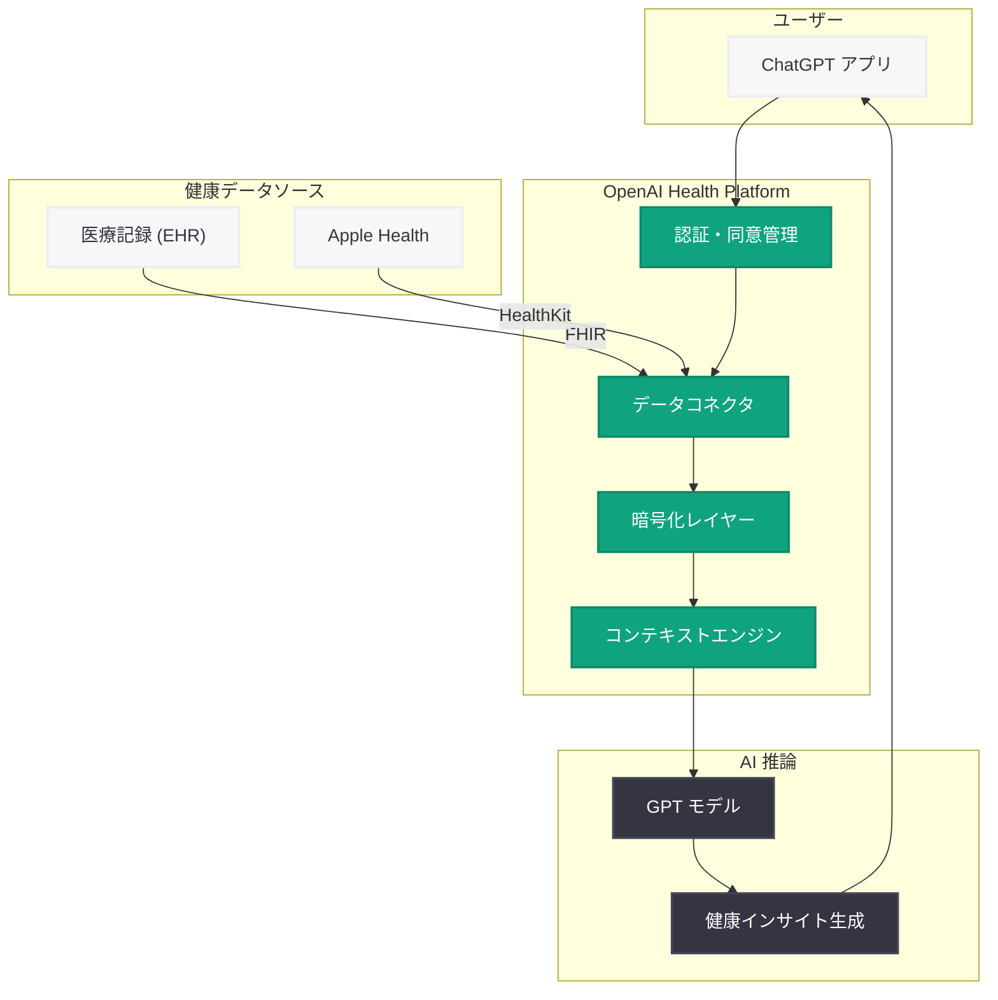

# ChatGPT に Health 機能が登場 - 医療記録と Apple Health の連携で健康管理を支援

## メタデータ

| 項目 | 内容 |
|------|------|
| 発表日 | 2026-07-23 |
| ソース | OpenAI News/Blog |
| カテゴリ | Product (新機能) |
| 公式リンク | [openai.com/index/health-in-chatgpt](https://openai.com/index/health-in-chatgpt) |

## 概要

OpenAI は 2026 年 7 月 23 日、ChatGPT に「Health」機能を正式にローンチしたことを発表した。この新機能により、対象となる米国ユーザーは医療記録 (Electronic Health Records) や Apple Health のデータを ChatGPT に安全に接続し、自身の健康状態に関するよりパーソナライズされたインサイトを得ることが可能になる。

Health in ChatGPT は、AI が個人の健康データを文脈として活用することで、一般的な健康情報の提供にとどまらず、ユーザー固有の健康状態に基づいた具体的なアドバイスや情報整理を実現する。これは OpenAI がヘルスケア分野に本格参入する重要なマイルストーンであり、AI アシスタントが日常の健康管理においてより実用的な役割を果たす新しいパラダイムを示している。

## 主な内容

### Health in ChatGPT の概要

Health in ChatGPT は、ユーザーが自身の健康データを ChatGPT に接続し、AI の力を活用して健康に関する理解を深めるための機能である。

- **パーソナライズされた健康インサイト:** ユーザー固有の医療データに基づいた、より文脈に即した回答を提供
- **データの統合的な理解:** 複数のソースからの健康情報を横断的に分析し、包括的な視点を提供
- **自然言語による対話:** 医療用語や検査結果を分かりやすい言葉で説明し、健康リテラシーの向上を支援

### 医療記録 (Medical Records) の接続

ユーザーは自身の電子医療記録を ChatGPT に接続することが可能になる。

- **EHR 連携:** 医療機関が保有する電子健康記録 (Electronic Health Records) との安全な接続
- **検査結果の解説:** 血液検査や画像診断の結果を ChatGPT が分かりやすく解説
- **時系列での健康追跡:** 過去の医療記録を基に、健康状態の変化やトレンドを把握
- **医療情報の整理:** 複数の医療機関にまたがる情報を統合的に管理・理解

### Apple Health との統合

Apple Health アプリとの連携により、日常的な健康データも活用可能になる。

- **アクティビティデータ:** 歩数、消費カロリー、運動記録などの身体活動データ
- **バイタルサイン:** 心拍数、血圧、血中酸素濃度などの生体情報
- **睡眠データ:** 睡眠時間、睡眠の質、睡眠パターンの分析
- **栄養データ:** 食事記録や栄養摂取量のトラッキング情報

### プライバシーとセキュリティ

健康データという機密性の高い情報を扱うため、OpenAI は強固なプライバシー・セキュリティ対策を実装している。

- **ユーザー同意の徹底:** データ接続はすべてユーザーの明示的な同意に基づいて行われる
- **データの暗号化:** 転送時および保存時のデータは暗号化により保護
- **アクセス制御:** ユーザーはいつでもデータ接続の解除やデータの削除が可能
- **HIPAA 準拠:** 米国の医療情報保護法 (HIPAA) に準拠した設計
- **目的外利用の禁止:** 健康データはモデルのトレーニングには使用されない

### 利用対象と提供地域

現時点では、以下の条件を満たすユーザーが利用可能である。

- **地域:** 米国内の対象ユーザーに限定して提供
- **年齢制限:** 成人ユーザーが対象
- **アカウント要件:** ChatGPT のアカウントを保有し、Health 機能を有効化したユーザー
- **段階的展開:** 対象ユーザーに段階的にロールアウト

## 技術的な詳細

### データ連携の仕組み

Health in ChatGPT のデータ連携は、標準化された医療データ規格を活用して実現されている。

- **FHIR (Fast Healthcare Interoperability Resources):** 医療データの相互運用性を確保する国際標準規格を採用
- **HealthKit 連携:** Apple の HealthKit フレームワークを通じて Apple Health データにアクセス
- **OAuth 認証:** 医療機関のデータアクセスには OAuth ベースの認証フローを使用
- **リアルタイム同期:** 接続されたデータソースからの最新情報を反映

### コンテキストウィンドウでの活用

健康データは ChatGPT の対話においてコンテキストとして活用される。

- **選択的な情報提供:** ユーザーの質問に関連する健康データのみをコンテキストとして使用
- **データの要約:** 大量の医療記録を AI が要約し、効率的にコンテキストに組み込む
- **プライバシー保護:** 不要な情報は対話のコンテキストから除外

## アーキテクチャ

## 開発者への影響

### ヘルスケア AI アプリケーションへの示唆

Health in ChatGPT のローンチは、ヘルスケア分野の開発者やスタートアップに対して以下の影響を与える。

- **プラットフォーム競争の激化:** OpenAI が直接的にヘルスケア AI 機能を提供することで、サードパーティの健康管理アプリとの競争が激しくなる可能性がある
- **API 拡張の可能性:** 今後、健康データコンテキストを活用した API が開発者向けに提供される可能性があり、ヘルスケアアプリの構築が容易になる見込み
- **プライバシー基準の引き上げ:** OpenAI が設定するプライバシー・セキュリティの基準が業界全体のベンチマークとなり、開発者にも同等の対応が求められる

### 医療機関・保険業界への影響

- **患者エンゲージメント:** AI を活用した健康インサイトにより、患者がより積極的に自身の健康管理に参加することが期待される
- **医療データの標準化促進:** FHIR 規格の採用が加速し、医療データの相互運用性が向上する可能性がある
- **遠隔医療との連携:** 将来的に遠隔医療プラットフォームとの統合が進む可能性がある

### 規制・コンプライアンスの考慮事項

- **HIPAA 準拠の必須化:** ヘルスケア AI を開発する際は HIPAA 準拠が不可欠であることが改めて示された
- **FDA 規制への注意:** AI による健康アドバイスが医療機器規制の対象となるかについて、継続的な監視が必要
- **州法への対応:** 米国の各州で異なるプライバシー法への対応も考慮する必要がある

## 関連リンク

- [OpenAI 公式発表](https://openai.com/index/health-in-chatgpt)
- [OpenAI プライバシーポリシー](https://openai.com/policies/privacy-policy)
- [Apple Health](https://www.apple.com/health/)
- [FHIR 規格](https://www.hl7.org/fhir/)
- [ChatGPT](https://chat.openai.com)

## まとめ

Health in ChatGPT は、AI アシスタントが個人の健康管理を支援する新しい時代の幕開けを象徴する機能である。医療記録と Apple Health データの安全な接続により、ユーザーは自身の健康状態をより深く理解し、情報に基づいた意思決定を行うことが可能になる。現時点では米国の対象ユーザーに限定されているが、HIPAA 準拠の厳格なプライバシー保護と暗号化によるセキュリティ対策が実装されており、健康データの取り扱いに対する OpenAI の慎重な姿勢が伺える。今後の国際展開や API の開発者向け提供、さらなる医療データソースとの連携拡大が注目される。
