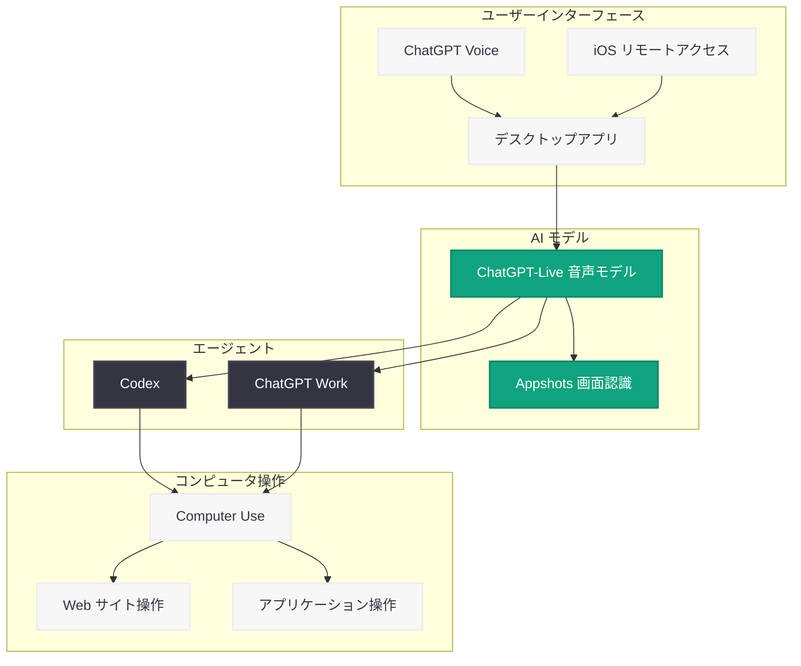

# ChatGPT Voice がデスクトップアプリに対応 - エージェント制御を音声で実現

## メタデータ

| 項目 | 内容 |
|------|------|
| 発表日 | 2026-07-24 |
| ソース | OpenAI News/Blog (Product) |
| カテゴリ | 新機能 / Product Update |
| 公式リンク | [openai.com](https://openai.com/index/chatgpt-voice-desktop) |

## 概要

OpenAI は 2026 年 7 月 24 日、ChatGPT デスクトップアプリケーションにおける ChatGPT Voice の対応を発表した。本機能により、ユーザーは音声によるインタラクションを通じて AI エージェントを制御し、コンピュータ上で複雑なタスクを実行できるようになる。

従来のスマートフォン版 Voice モードが「よりスムーズな会話」に焦点を当てていたのに対し、デスクトップ版は「アクション実行」を主軸に設計されている点が大きな差別化要因である。ChatGPT-Live 音声モデルファミリーを基盤とし、Codex や ChatGPT Work との連携により、開発者やビジネスユーザーの生産性を大幅に向上させることが期待される。

## 主な内容

### エージェント音声制御

ChatGPT Voice は ChatGPT Work および Codex と統合されており、ユーザーは音声による指示で複数のエージェントを同時に制御できる。たとえば、開発者が「新しいスレッドを作成して、プルリクエストを作って、バグの根本原因を見つけて」と一度の音声コマンドで指示するだけで、複数のタスクが並行して実行される。

### Computer Use による操作

Voice モードは Computer Use 機能を活用し、Web サイトやアプリケーションへのアクセスが可能である。音声で「この Web サイトを開いて情報を確認して」といった指示を出すことで、ChatGPT が実際に画面上の操作を代行する。

### マルチステップコマンド

ユーザーは多段階にわたる複雑なコマンドを口述できる。ChatGPT が入力を必要とする場面では、ユーザーに確認を求め、音声でのやりとりを通じてタスクを完遂する。これにより、キーボードやマウスに触れることなく、複雑なワークフローを実行できる。

### スマートフォン版との違い

| 項目 | スマートフォン版 | デスクトップ版 |
|------|----------------|--------------|
| 会話の自然さ | スムーズな会話、割り込み対応に優れる | アクション指向の会話設計 |
| アクション実行 | 非対応 | マルチステップワークフロー対応 |
| エージェント連携 | 非対応 | Codex、ChatGPT Work と統合 |
| Computer Use | 非対応 | Web サイト・アプリケーション操作可能 |

## macOS Appshots 機能

### 画面認識によるコンテキスト理解

macOS 向けの「Appshots」機能により、ChatGPT Voice はユーザーの画面上に表示されているコンテンツにアクセスできる。ユーザーがアプリに対して画面アクセスの許可を付与すると、alt テキストを含む画面上の情報を取得し、文脈を踏まえた応答やアクション実行が可能となる。

### ユースケース

- コードエディタの内容を認識し、音声でリファクタリングを指示
- ブラウザに表示されたエラーメッセージを読み取り、解決策を提案
- ドキュメントの内容を把握した上で、関連するタスクを自動実行
- 複数アプリケーション間の情報を横断的に参照しながらタスクを遂行

## 技術的な詳細

### ChatGPT-Live 音声モデルファミリー

本機能は 2026 年 7 月初旬にリリースされた ChatGPT-Live 音声モデルファミリーを基盤としている。このモデルは「より自然なリアルタイム会話」を実現するために設計されており、デスクトップ環境でのエージェント制御に最適化されている。

### iOS によるリモートアクセス

iOS アプリからリモートアクセスを通じて Codex を音声で操作することも可能である。外出先からでもデスクトップ上のエージェントに音声指示を出し、開発タスクを進められる。

## アーキテクチャ

## 開発者への影響

### ワークフローの革新

ChatGPT Voice のデスクトップ対応は、開発者の日常的なワークフローに大きな変革をもたらす。

- **ハンズフリー開発:** コードレビュー、プルリクエスト作成、バグ調査を音声指示で実行可能に
- **マルチタスキングの強化:** コーディング中に音声でエージェントに別タスクを指示し、並行作業を実現
- **Codex との音声連携:** 音声による指示で Codex にコード生成やリファクタリングを依頼し、結果を確認

### アクセシビリティの向上

- 手を使えない状況でも開発作業を継続できる
- キーボード操作が困難なユーザーにとって新たな開発手段を提供
- 画面の alt テキスト読み取りにより、視覚的情報へのアクセスも改善

### 導入時の考慮事項

- macOS 環境では Appshots 機能を活用するためにアプリへの画面アクセス許可が必要
- チーム開発において音声コマンドのベストプラクティスを確立する必要がある
- セキュリティポリシーの観点から、Computer Use 機能でアクセス可能な範囲の検討が推奨される
- iOS リモートアクセスを活用する場合のネットワーク要件を事前に確認すべき

## 提供状況

| プラットフォーム | 機能 | 状況 |
|----------------|------|------|
| macOS | ChatGPT Voice + Appshots | 2026 年 7 月 24 日よりグローバル展開開始 |
| デスクトップ全般 | ChatGPT Voice + エージェント制御 | 2026 年 7 月 24 日よりグローバル展開開始 |
| iOS | Codex リモートアクセス | 2026 年 7 月 24 日よりグローバル展開開始 |

## 競合動向

同時期に Anthropic も Claude の音声モードをアップデートし、Opus、Sonnet、Haiku の各モデルを活用して Gmail、Calendar、Slack、Notion、Canva などのアプリケーション内でタスクを完了する機能を提供している。音声による AI エージェント制御は、主要 AI 企業間で競争が激化している領域である。

## 関連リンク

- [ChatGPT Voice デスクトップ対応 公式発表](https://openai.com/index/chatgpt-voice-desktop)
- [ChatGPT-Live 音声モデル](https://openai.com/index/chatgpt-live)
- [Codex](https://openai.com/codex)
- [ChatGPT デスクトップアプリ](https://openai.com/chatgpt/desktop)
- [OpenAI News](https://openai.com/news)

## まとめ

ChatGPT Voice のデスクトップ対応は、AI エージェントとのインタラクション方法を根本的に変える重要なアップデートである。ChatGPT-Live 音声モデルを基盤に、Codex や ChatGPT Work との統合、Computer Use 機能の活用、macOS での Appshots による画面認識を実現し、音声だけで複雑なマルチステップワークフローを実行可能にした。従来のスマートフォン版が会話の自然さに重点を置いていたのに対し、デスクトップ版は「アクションの実行」を中心に設計されており、開発者やビジネスユーザーにとって実用的な生産性向上ツールとなる。iOS からのリモートアクセスも含め、場所を選ばない音声エージェント制御の時代が到来したと言える。
