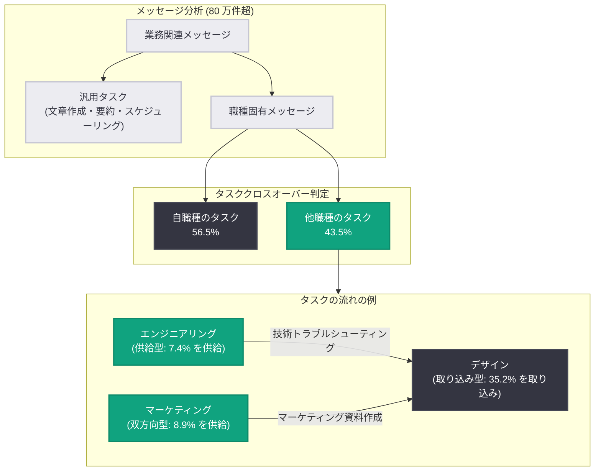

# AI が仕事の範囲を拡張する: 80 万件超のメッセージ分析が示す「タスククロスオーバー」現象

## メタデータ

| 項目 | 内容 |
|------|------|
| 発表日 | 2026-07-27 |
| ソース | OpenAI News (Company / Research report) |
| カテゴリ | 研究成果 |
| 公式リンク | https://openai.com/index/how-ai-is-expanding-what-people-do-at-work |

## 概要

OpenAI は、米国の ChatGPT ユーザーによる 80 万件超の業務関連メッセージを分析した新しい研究レポート "Work at the Frontier: How AI is Expanding What People Do at Work" を公開しました。分析の結果、業務関連メッセージの 16.8%、職種固有 (非汎用) メッセージの 43.5% が「別の職種に伝統的に関連付けられてきたタスク」であることが判明しました。OpenAI はこの現象を **タスククロスオーバー (task crossover)** と名付けています。

この研究は、AI が「仕事のやり方」だけでなく「誰がどの仕事を担うか」という分業構造そのものを変えつつあることを示す実証データです。中小企業の経営者が自らコピーを書き、契約書をレビューし、財務分析を行う。営業担当者がアナリストに依頼していた顧客データの探索を自分で行う。マーケターが開発者を待たずにウェブサイトの問題を解決する。こうした役割の拡張が、求人票や職種名が書き換えられるより前に、AI の利用データに現れ始めています。本レポートは、AI と仕事の変化をリアルタイムで探る新シリーズ "Work at the Frontier" の第 1 弾です。

## 主な内容

### 職種固有の AI 利用の約半分が職種の境界を越えている

従来の「AI と仕事」の研究の多くは、ある職種に紐づくタスクの固定リストから出発し、モデルがそれらを遂行できるかを問うものでした。今回の研究は視点を変え、「誰がどのタスクを引き受けるか」が変化している証拠を示しています。

汎用的な作業 (文章作成、要約、スケジューリングなど) を除外した職種固有メッセージのうち、43.5% がユーザー自身の職種の外側にあるタスクでした。特に以下の職種で顕著です。

| 職種 | 職種外タスクの割合 (職種固有メッセージ中) |
|------|------------------------------------------|
| カスタマーエクスペリエンス | 77% |
| デザイナー | 75% |
| 人事 (HR) | 69% |
| 法務 | 56% |
| マーケター | 53% |

これらの職種は、他の役割からタスクを「借りて」います。かつては他部門への引き継ぎ (ハンドオフ) が必要だった作業を、最初にその必要性に直面した本人が完結できるようになったことを示唆しています。

### 遠くまで「伝播」するタスクとそうでないタスク

タスクの伝播範囲は均等ではありません。個別タスクで見ると、**財務計算**と**技術トラブルシューティング**は、分析対象の他の 7 職種グループすべてで職種外タスクの上位 3 位に入りました。**マーケティング資料の作成**も 5 つの職種グループに現れ、特にデザイナーの間で顕著でした。

タスク群 (バンドル) レベルで見ると、クロスオーバーには 2 つの方向性があります。

| 職種 | 自職種メッセージ中の職種外タスク割合 (取り込み) | 他職種メッセージ中に占める割合 (供給) | 特徴 |
|------|------------------------------------------------|--------------------------------------|------|
| デザイン | 35.2% | 1.7% | 外部タスクを多く取り込むが、デザインタスク自体はほぼ伝播しない |
| エンジニアリング | 18.5% | 7.4% | 取り込みは少ないが、他職種への主要なタスク供給源 |
| マーケティング | 24.3% | 8.9% (サンプル中最高) | 取り込みと供給の両方向で突出 |

- **デザイン**: 外部タスクの「輸入超過」型。デザイナーは他職種の仕事を多く引き受ける一方、デザイン作業が他職種に現れることはまれです。
- **エンジニアリング**: 「輸出」型。ソフトウェアのトラブルシューティングや技術システムの操作など、他職種の人々が引き受けるタスクの重要な供給源です。
- **マーケティング**: 双方向型。複数ドメインのタスクを組み合わせつつ、マーケティング作業自体も組織全体に広く伝播します。

### 小規模ビジネスほどタスククロスオーバーが多い

企業の規模と構造は、AI が仕事を変える様相に影響します。大企業の従業員は専門チームや確立されたワークフロー、社内サービスにアクセスできますが、小規模組織では問題に最も近い人が委任せずに自ら対応する傾向があります。

| ワークスペース規模 | 職種外タスクの割合 (平均的ユーザー) |
|--------------------|-------------------------------------|
| 2〜5 シート | 18.9% |
| 100 シート超 | 16.3% |

平均的ユーザーでは組織が小さいほど職種外タスクの割合が高くなりますが、ヘビーユーザーでは同様の単調な傾向は見られませんでした。中程度のユーザーは、小規模組織で他部門の機能を要する仕事に直面した際に AI を頼る一方、ヘビーユーザーは組織規模によらず安定した AI 支援ワークフローを確立している、あるいは中核職務の中でより集中的に AI を使っている可能性があります。専門リソースが乏しい環境ほど、AI は「ジェネラリストツール」として特に有用と考えられます。

### タスクリスト自体が変わりつつある

AI の利用データは、仕事がどこへシフトしているかを示す先行指標です。企業が職務記述書を書き換えたり新しい職種名を作ったりする前に、労働者が新しい活動の組み合わせを試している様子を観察できます。つまり、利用パターンは、従来の労働市場統計が後になってようやく捉える職業変化の**早期シグナル**となり得ます。

## 技術的な詳細

本レポートは研究レポートであるため、コードサンプルの代わりに分析手法を解説します。

### 分析手法

1. **データソース**: 米国の ChatGPT ユーザーによる 80 万件超の業務関連メッセージ
2. **汎用タスクの除外**: 文章作成、要約、スケジューリングなど、多くの職種に広く共有される活動は「generic (汎用)」に分類し、クロスオーバーの証拠から除外。これにより、職種の境界を越えた移動を過大評価しないようにしています
3. **職種マッピング**: 残った非汎用メッセージについて、そのタスクがユーザー自身の職種の内側か外側かを判定。各メッセージが「どの職種の仕事に最も近いか」を分類し、伝統的なタスクの供給元 (traditional task source) と実際の利用者の職種 (worker occupation) のマトリクス (ヒートマップ) を構築
4. **分析対象の職種グループ**: カスタマーエクスペリエンス、デザイン、エンジニアリング、金融、人事、法務、マーケティング、営業の 8 グループ
5. **組織規模の分析**: ワークスペースのシート数 (2〜5 席から 100 席超まで) ごとに職種外タスク比率を比較し、利用強度 (平均的ユーザー / ヘビーユーザー) 別に傾向を検証

### タスククロスオーバーの概念図

### 主要統計サマリー

| 指標 | 数値 |
|------|------|
| 分析対象メッセージ数 | 80 万件超 |
| 業務関連メッセージ中の職種外タスク | 16.8% |
| 職種固有メッセージ中の職種外タスク | 43.5% |
| カスタマーエクスペリエンスの職種外タスク | 77% |
| デザイナーの職種外タスク | 75% |
| 人事の職種外タスク | 69% |
| 法務の職種外タスク | 56% |
| マーケターの職種外タスク | 53% |
| デザインの外部タスク取り込み / 供給 | 35.2% / 1.7% |
| エンジニアリングの外部タスク取り込み / 供給 | 18.5% / 7.4% |
| マーケティングの外部タスク取り込み / 供給 | 24.3% / 8.9% |
| 職種外タスク割合 (2〜5 シート組織) | 18.9% |
| 職種外タスク割合 (100 シート超組織) | 16.3% |

## 開発者への影響

- **AI ツール設計の視点転換**: AI 製品は特定職種の効率化だけでなく、「専門外タスクの遂行支援」という利用実態を前提に設計する価値があります。特に財務計算や技術トラブルシューティングは全職種で需要が高い横断タスクです
- **中小企業向けプロダクトの機会**: 小規模組織ほどクロスオーバーが多いため、専門チームを持たない企業向けの「ジェネラリスト支援」機能に市場機会があります
- **組織・人材戦略への示唆**: 職務記述書や職種名の変更に先行して仕事の中身が変化しているため、AI 利用ログは組織再設計やスキル戦略の早期シグナルとして活用できます
- **政策・研究への基盤**: OpenAI は "Work at the Frontier" シリーズとして、政策と実務を導くデータドリブンな知見を今後も定期的に発信する予定です

## 関連リンク

- [How AI is expanding what people do at work (OpenAI News)](https://openai.com/index/how-ai-is-expanding-what-people-do-at-work)
- [The AI Jobs Transition Framework (PDF)](https://cdn.openai.com/pdf/the-ai-jobs-transition-framework_report.pdf)
- [OpenAI News](https://openai.com/news)
- [OpenAI Research](https://openai.com/research)

## まとめ

OpenAI の新研究は、80 万件超の実利用データから、AI が職種の境界を溶かす「タスククロスオーバー」現象を定量化しました。職種固有メッセージの 43.5% が他職種のタスクであり、カスタマーエクスペリエンス (77%) やデザイナー (75%) で特に顕著です。エンジニアリングとマーケティングのタスクは組織全体に広く伝播する一方、デザインは外部タスクを取り込む側に偏るなど、方向性の違いも明らかになりました。小規模組織ほどクロスオーバーが多く、AI が専門リソースの不足を補う「ジェネラリストツール」として機能していることを示唆します。AI 利用パターンは、従来の労働統計より早く職業の変化を捉える先行指標となる可能性があり、本レポートはその継続観測シリーズ "Work at the Frontier" の第 1 弾です。
