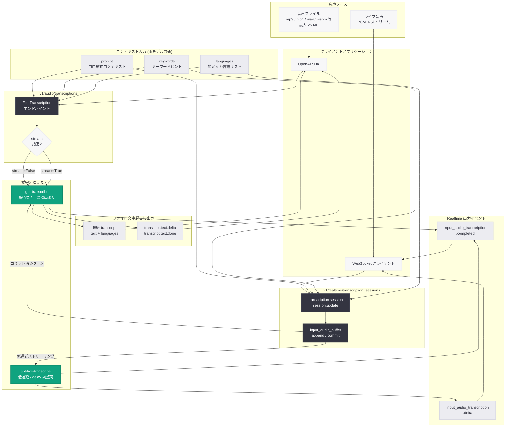

# GPT Transcribe および GPT Live Transcribe のリリース: 高精度ファイル文字起こしと低遅延ストリーミング文字起こし

## メタデータ

| 項目 | 内容 |
|------|------|
| 発表日 | 2026-07-28 |
| ソース | OpenAI API Changelog |
| カテゴリ | 新モデル・API 更新 |
| 対象モデル | `gpt-transcribe`, `gpt-live-transcribe` |
| 対象 API | `v1/audio/transcriptions`, `v1/realtime` |
| 公式リンク | [developers.openai.com/api/docs/changelog](https://developers.openai.com/api/docs/changelog) |

## 概要

OpenAI は 2026 年 7 月 28 日、2 つの新しい音声認識 (speech-to-text) モデルをリリースした。1 つは高精度なファイル文字起こしと Realtime におけるコミット済みターンの最終文字起こしを担う `gpt-transcribe`、もう 1 つは低遅延のストリーミング文字起こしに特化した `gpt-live-transcribe` である。用途に応じて「精度優先」と「遅延優先」のモデルを明確に使い分ける構成になった。

両モデルの共通点は、文字起こし精度を高めるための 3 つのコンテキスト入力をサポートすることである。自由形式のコンテキスト (`prompt`)、キーワードヒント (`keywords`)、複数の想定入力言語 (`languages`) を指定でき、ドメイン固有の専門用語、多言語音声、およびコードスイッチング (会話中の言語切り替え) を含む音声への対応が改善されている。特に `languages` パラメータは、従来モデルの単数形 `language` フィールドを置き換えるものであり、複数言語を同時に想定できる点が大きな変更点である。

## 主な内容

### 2 つのモデルの位置づけ

公式ドキュメントに記載されている両モデルのモデルカード情報は以下の通りである。

| 項目 | `gpt-transcribe` | `gpt-live-transcribe` |
|------|------------------|------------------------|
| 説明 | ファイルおよび Realtime 入力の文字起こし向け高精度 speech-to-text モデル | ライブ音声から低遅延の transcript デルタを返すストリーミング speech-to-text モデル |
| 入力モダリティ | audio, text | audio, text |
| 出力モダリティ | text | text |
| サポートエンドポイント | `v1/audio/transcriptions`, `v1/realtime/transcription_sessions` | `v1/realtime/transcription_sessions` |
| サポート機能 | streaming | streaming |
| 言語検出出力 | あり (`languages` を返す) | なし |
| 料金 | 音声 1 分あたり 0.0045 USD | Realtime 音声 1 分あたり 0.017 USD |

`gpt-transcribe` はファイル文字起こしと Realtime の両方で利用できる汎用モデルである。一方 `gpt-live-transcribe` は Realtime の transcription session 専用であり、`v1/audio/transcriptions` を含む他のエンドポイントはすべて非サポートと明記されている。

### 共通のコンテキスト入力

両モデルは以下の 3 つのコンテキスト入力を受け付ける。公式ドキュメントに記載されているパラメータ名と説明は以下の通りである。

| パラメータ | 内容 | 補足 |
|-----------|------|------|
| `prompt` | 録音の話題や状況などに関する自由形式のコンテキスト | モデルの長さ制限を超えるとリクエストが拒否される |
| `keywords` | 音声中に登場しうるリテラルな語句 (製品名、薬品名、略語など) | あくまでヒントであり、必ず出力されるわけではない。1 語句 1 行で指定し、`<`、`>`、CR、LF を含められない |
| `languages` | 想定される入力言語のリスト | ISO 639-1 (`en`, `fr`)、一部の ISO 639-3 (`eng`, `yue`, `cmn`)、および `zh` の地域ロケール (`zh-cn`, `zh-tw`, `zh-hk`) を受け付ける。無効なコードは拒否される |

**重要な注意点:** 公式ドキュメントは、これらの新モデルが単数形の `language` フィールドではなく `languages` を使用すること、および両方のフィールドを同時に送信してはならないことを明記している。従来の `gpt-4o-transcribe` や `whisper-1` からの移行時には、このパラメータ名の変更に対応する必要がある。

また、コンテキスト入力は音声そのものを説明するために使うべきであり、タスクの指示を再記述するために使うべきではないとされている。キーワードはヒントとして機能するため、実際に発話された場合にのみ transcript に含まれる。

### ファイル文字起こしのワークフロー

`v1/audio/transcriptions` エンドポイントでは、ファイルをアップロードして最終的な transcript を取得するか、処理の進行に合わせてテキストをストリーミングで受け取ることができる。公式ドキュメントは、完成済みファイルの文字起こしをストリーミングする場合には Realtime セッションを開く必要がないことを明示している。

ファイル文字起こしにおける制約は以下の通りである。

- **最大ファイルサイズ:** 25 MB。これを超えるファイルは分割が必要であり、文の途中で切断しないことが推奨されている
- **対応フォーマット:** `mp3`, `mp4`, `mpeg`, `mpga`, `m4a`, `wav`, `webm`
- **ストリーミングイベント:** `transcript.text.delta` (部分テキスト)、`transcript.text.done` (最終テキストと `languages`)、`transcript.text.segment` (話者分離時のセグメント)

### Realtime 文字起こしのワークフロー

Realtime 文字起こしでは、公式ドキュメントは出発点として `gpt-live-transcribe` を推奨している。`gpt-transcribe` は「コミット済み音声ターンの後に文字起こしを開始する必要がある場合」または「検出言語の出力が必要な場合」に使用するとされ、WebSocket 接続を必要とする。`gpt-transcribe` は Realtime または専用の transcription session において、それ以前に文字起こしされたターンを自動的にコンテキストとして利用する。

セッション設定は `session.update` イベントで送信され、session オブジェクトの `type` は `"transcription"` となる。設定は `session.audio.input` 配下にネストされる。

- `format`: 音声フォーマット (例: `{ "type": "audio/pcm", "rate": 24000 }`)
- `transcription`: モデル指定とコンテキスト入力 (`model`, `prompt`, `keywords`, `languages`, `delay`)
- `turn_detection`: `null` を指定すると自動ターン検出が無効化され、ターンを手動でコミットする運用になる

音声送信とターン確定に使うクライアントイベントは以下の通りである。

- `input_audio_buffer.append`: base64 エンコードされた PCM16 ペイロード (`audio` フィールド) を送信する
- `input_audio_buffer.commit`: VAD が無効な場合にターンを終了する

サーバから受信する transcript イベントは以下の 2 種類である。

| イベント | 主なフィールド | 内容 |
|---------|--------------|------|
| `conversation.item.input_audio_transcription.delta` | `item_id`, `content_index`, `delta` | 部分的な transcript の差分 |
| `conversation.item.input_audio_transcription.completed` | `item_id`, `content_index`, `transcript` | 確定した transcript |

公式ドキュメントは、異なる発話ターン間の completion イベントの順序が保証されないことを明記している。そのため、イベントは `item_id` によってアイテムと対応付ける必要がある。`gpt-transcribe` を使用する場合、completion イベントには検出言語も含まれる (例: `"languages": [{ "code": "fr" }]`)。予測が信頼できない場合は空配列となる。`gpt-live-transcribe` は言語検出を返さない。

### 遅延と精度のトレードオフ

`gpt-live-transcribe` では `delay` パラメータによって遅延と精度のバランスを調整できる。公式ドキュメントに記載されている値は以下の 5 段階である。

`minimal`, `low`, `medium`, `high`, `xhigh`

実際のミリ秒単位のタイミングは変動するため、代表的な音声でベンチマークすることが推奨されている。本レポートでは、公式ドキュメントに具体的な数値が記載されていないため、各段階の遅延値は記載しない。

### `gpt-live-transcribe` の制約

公式ドキュメントは `gpt-live-transcribe` について以下の制約を明記している。

- 単語レベルのタイムスタンプを提供しない
- 話者ラベル (speaker labels) を提供しない
- 信頼度スコア (confidence scores) を提供しない

これらが必要な場合は、ファイル文字起こしを利用するか、アプリケーション側でフォールバックを実装する必要がある。

### 既存モデルとの機能比較

公式ドキュメントに記載されている機能サポート状況は以下の通りである。

| 機能 | `gpt-transcribe` | `gpt-4o-transcribe` / `-mini` | `gpt-4o-transcribe-diarize` | `whisper-1` |
|------|------------------|------------------------------|----------------------------|-------------|
| 新規実装での推奨 | 推奨 | 既存統合のみ | 話者分離用途 | 特定機能のみ |
| `prompt` | サポート | サポート | 非サポート | サポート (224 トークン上限) |
| `keywords` / `languages` | サポート | 非サポート (`language` を使用) | 非サポート | `language` を使用 |
| ストリーミング | サポート | サポート | サポート | 非サポート |
| 話者分離 (diarization) | 非サポート | 非サポート | サポート | 非サポート |
| 単語タイムスタンプ | 非サポート | 非サポート | 非サポート | サポート |
| 英語への翻訳 | 非サポート | 非サポート | 非サポート | サポート |

公式ドキュメントは `gpt-4o-transcribe`、`gpt-4o-mini-transcribe`、および `gpt-realtime-whisper` について、既存の統合ではサポートされるが新規実装には推奨されないとしている。話者分離が必要な場合は `gpt-4o-transcribe-diarize`、単語タイムスタンプや `srt` / `vtt` 字幕、英語翻訳が必要な場合は `whisper-1` を引き続き使用する必要がある。

## 技術的な詳細

### ファイル文字起こしのコードサンプル

以下は、公式ドキュメントに記載されているパラメータ構成に基づく実装例である (公式サンプルからの逐語コピーではなく、説明のための例示コードである)。

```python
from openai import OpenAI

client = OpenAI()

with open("support-call.wav", "rb") as audio_file:
    result = client.audio.transcriptions.create(
        model="gpt-transcribe",
        file=audio_file,
        # 録音の話題や状況を自由形式で記述する
        prompt="プレミアムプランとアカウント AC-42 に関するカスタマーサポート通話",
        # keywords と languages は Python SDK では extra_body 経由で指定する
        extra_body={
            "keywords": ["premium plan", "AC-42", "billing"],
            "languages": ["en", "ja"],
        },
    )

print(result.text)
# 検出言語は languages フィールドに含まれる (例: [{"code": "ja"}])
# 信頼できる検出ができない場合は空配列となる
print(result.languages)
```

**注意:** 公式ドキュメントによると、Python SDK では `keywords` と `languages` は `extra_body` を経由して渡す。JavaScript SDK ではリクエストオプションの `body` を経由して渡す。

### ストリーミングファイル文字起こしのコードサンプル

以下は例示コードである。

```python
from openai import OpenAI

client = OpenAI()

with open("long-recording.mp3", "rb") as audio_file:
    stream = client.audio.transcriptions.create(
        model="gpt-transcribe",
        file=audio_file,
        stream=True,
    )

    for event in stream:
        # transcript.text.delta: 部分テキスト
        # transcript.text.done: 最終テキストと languages
        # transcript.text.segment: 話者分離時のセグメント
        print(event)
```

### Realtime セッション設定

以下は、公式ドキュメントに記載されているセッション設定の構造である。

```json
{
  "type": "session.update",
  "session": {
    "type": "transcription",
    "audio": {
      "input": {
        "format": { "type": "audio/pcm", "rate": 24000 },
        "transcription": {
          "model": "gpt-live-transcribe",
          "prompt": "A customer support call about a premium plan and account AC-42.",
          "keywords": ["premium plan", "AC-42", "billing"],
          "languages": ["en", "fr"],
          "delay": "low"
        },
        "turn_detection": null
      }
    }
  }
}
```

コンテキスト入力はセッション途中でも別の `session.update` イベントで更新できる。

### モデル選択の判断基準

公式ドキュメントの記述に基づくと、モデル選択の判断基準は以下のように整理できる。

| 要件 | 推奨モデル | 理由 |
|------|-----------|------|
| 完成済み音声ファイルの高精度文字起こし | `gpt-transcribe` | ファイル文字起こしの推奨モデル |
| ライブ音声の低遅延ストリーミング | `gpt-live-transcribe` | Realtime 文字起こしの出発点として推奨 |
| Realtime でコミット済みターン後に文字起こし開始 | `gpt-transcribe` | 該当ケースでの指定モデル |
| Realtime で検出言語の出力が必要 | `gpt-transcribe` | `gpt-live-transcribe` は言語検出を返さない |
| 話者ラベル付き transcript | `gpt-4o-transcribe-diarize` | 新モデルは話者分離非サポート |
| 単語タイムスタンプ、`srt` / `vtt` 字幕、英語翻訳 | `whisper-1` | 新モデルは非サポート |

## アーキテクチャ

以下の図は、ファイル文字起こしと Realtime ストリーミング文字起こしの 2 つのフローを示す。



## 開発者への影響

### パラメータ名の変更への対応

最も直接的な影響は `language` から `languages` へのパラメータ名変更である。既存の `gpt-4o-transcribe` や `whisper-1` を使用したコードから `gpt-transcribe` へ移行する場合、以下の対応が必要となる。

- 単数形 `language` を複数形 `languages` の配列に置き換える
- 両方のフィールドを同時に送信しない (公式ドキュメントで明示的に禁止されている)
- Python SDK では `languages` および `keywords` を `extra_body` 経由で渡す実装に変更する

### 機能非互換への注意

新モデルは推奨モデルである一方、既存モデルが持つ一部機能をサポートしていない。既存実装が以下の機能に依存している場合、単純なモデル ID の差し替えでは動作しない。

- **話者分離:** `gpt-4o-transcribe-diarize` を継続使用する必要がある
- **単語タイムスタンプ:** `whisper-1` の `response_format="verbose_json"` + `timestamp_granularities=["word"]` を継続使用する必要がある
- **`srt` / `vtt` 字幕出力:** `whisper-1` を継続使用する必要がある
- **英語への翻訳:** `whisper-1` の `v1/audio/translations` を継続使用する必要がある

### アーキテクチャ設計上の選択肢の増加

公式ドキュメントは「ストリーミング」と「ライブ音声」が独立した選択であることを明示している。つまり、完成済みファイルの文字起こしをストリーミングで受け取る場合には Realtime セッションを開く必要がない。Realtime が必要なのはライブ音声または永続接続が必要な場合に限られる。この整理により、以下のような設計判断が可能になる。

- 長時間の録音ファイルに対する進捗表示: `v1/audio/transcriptions` + `stream=True` で実現できる (Realtime 不要)
- ライブ字幕: Realtime + `gpt-live-transcribe` の `delay` チューニング
- ライブ会話の高精度アーカイブ: Realtime + `gpt-transcribe` によるコミット済みターンの最終 transcript

### 遅延と精度の運用チューニング

`gpt-live-transcribe` の `delay` パラメータ (`minimal` / `low` / `medium` / `high` / `xhigh`) により、アプリケーション要件に応じた調整が可能になった。ただし公式ドキュメントは実際のミリ秒単位のタイミングが変動するとしているため、代表的な音声によるベンチマークが必須である。

### 精度評価のアプローチ

公式ドキュメントは、単語誤り率 (WER) のみに依存せず、アクセント、ノイズ、ドメイン用語を含む代表的な音声でテストすることを推奨している。特に `keywords` と `prompt` の効果は音声の内容に依存するため、実データによる検証が重要である。

### イベント順序の非保証への対応

Realtime 文字起こしにおいて、異なる発話ターン間の completion イベントの順序は保証されない。UI へ transcript を表示する実装では、受信順に追記するのではなく `item_id` をキーとしてアイテムを管理し、順序を明示的に制御する必要がある。

## 検証できなかった項目

本レポートは Evidence-Based Approach に従い、公式ドキュメントで確認できた事実のみを記載している。以下の項目は公式ドキュメントに記載がないため、本レポートには含めていない。

- `gpt-transcribe` および `gpt-live-transcribe` のコンテキスト長 / 入力トークン上限 (モデルカードに未記載)
- 両モデルの最大音声長 (モデルカードに未記載)
- `delay` 各段階の具体的なミリ秒値
- WER などのベンチマークスコア
- `prompt` の具体的な長さ制限値 (「モデルの長さ制限」という記述のみ)

## 関連リンク

- [OpenAI API Changelog](https://developers.openai.com/api/docs/changelog) (本レポートの一次ソース)
- [Transcription (Speech-to-Text) 概要ガイド](https://developers.openai.com/api/docs/guides/transcription)
- [File transcription ガイド](https://developers.openai.com/api/docs/guides/speech-to-text)
- [Realtime transcription ガイド](https://developers.openai.com/api/docs/guides/realtime-transcription)
- [gpt-transcribe モデルカード](https://developers.openai.com/api/docs/models/gpt-transcribe)
- [gpt-live-transcribe モデルカード](https://developers.openai.com/api/docs/models/gpt-live-transcribe)
- [Transcription and speech の料金](https://developers.openai.com/api/docs/pricing#transcription-and-speech)

## まとめ

OpenAI は 2026 年 7 月 28 日、`gpt-transcribe` と `gpt-live-transcribe` の 2 つの音声認識モデルをリリースした。`gpt-transcribe` は `v1/audio/transcriptions` と Realtime の両方で利用できる高精度モデルであり、Realtime ではコミット済みターンの最終 transcript と検出言語を提供する。`gpt-live-transcribe` は Realtime の transcription session 専用の低遅延ストリーミングモデルであり、`delay` パラメータによって遅延と精度のバランスを 5 段階で調整できる。

両モデルの共通の強みは、`prompt` (自由形式コンテキスト)、`keywords` (キーワードヒント)、`languages` (複数の想定入力言語) という 3 つのコンテキスト入力である。特に `languages` は従来の単数形 `language` を置き換えるものであり、多言語音声やコードスイッチングへの対応が改善されている。

移行時の注意点として、パラメータ名の変更 (`language` から `languages`)、Python SDK における `extra_body` 経由の指定、および話者分離・単語タイムスタンプ・英語翻訳が新モデルでは非サポートである点を確認する必要がある。これらの機能が必要な場合は `gpt-4o-transcribe-diarize` または `whisper-1` を継続して使用する。
