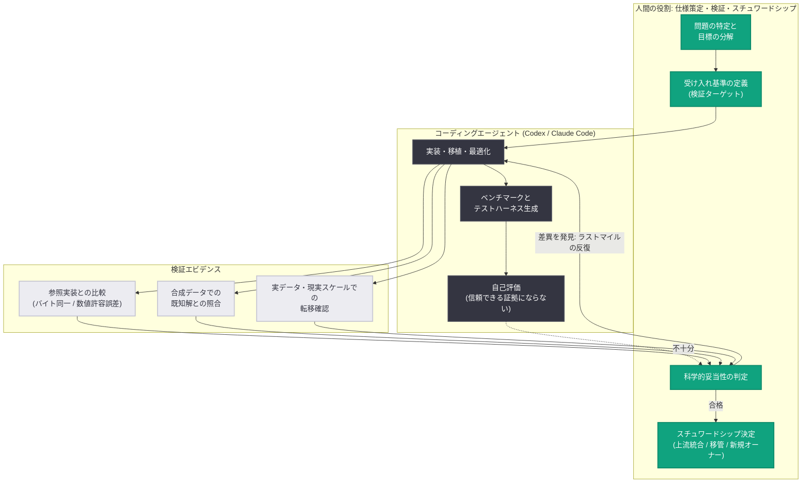

# エージェント AI 時代の科学計算: コーディングエージェントによる科学ソフトウェア近代化のフィールドレポート

## メタデータ

| 項目 | 内容 |
|------|------|
| 発表日 | 2026-07-28 |
| ソース | OpenAI News (Publication / Research) |
| カテゴリ | 研究成果 |
| 公式リンク | https://openai.com/index/scientific-computing-agentic-ai |
| 論文 (PDF) | https://cdn.openai.com/pdf/scientific-computing-in-the-age-of-agentic-ai-an-exploratory-field-report.pdf |

> **情報取得に関する注記**: 本記事ページ (`https://openai.com/index/scientific-computing-agentic-ai`) は WebFetch および curl の直接アクセスで HTTP 403 を返しました。本レポートは以下の検証済みソースに基づいています。
>
> 1. Internet Archive のスナップショット (`20260728183027`) から取得した記事本文
> 2. `cdn.openai.com` から直接ダウンロードした公式論文 PDF (55 ページ、全文抽出済み)
> 3. OpenAI News RSS フィード (`https://openai.com/news/rss.xml`) のエントリメタデータ
>
> 記事ページのケーススタディはクライアントサイドでタブ描画されるため、スナップショット HTML からは cyvcf2 タブのみ本文を取得できました。他のケーススタディの詳細は公式論文 PDF から取得しています。

## 概要

OpenAI は、科学計算の分野で AI コーディングエージェントがどのように使われているかを調査した探索的フィールドレポート **"Scientific computing in the age of agentic AI: an exploratory field report"** を公開しました。ライフサイエンス領域を中心とした 8 件のケーススタディを、各プロジェクトを実際に遂行した研究者自身が執筆し、OpenAI がそれらを横断して共通テーマを抽出したものです。プロジェクトの範囲は、軽微な保守・パッケージング作業から、20,000 行超の C/C++ アライナの Rust 全面移植、GPU ネイティブ再設計までにわたります。

背景にあるのは、科学ソフトウェアの構造的な問題です。多くの研究ツールは論文の付随コードとして小規模な学術チームによって書かれ、パッケージング、テスト、最適化、長期サポートに割ける時間がほとんどありません。論文が引用する先行研究では、9,000 件超の公開 R スクリプトのうち **74% がクリーン環境での初回実行に失敗**し、自動クリーニング後も **56% が依然として失敗**しました。また 98 件の omics ツールのうち **57.1% が公式インストール手順に従っても失敗**し、**27.6% は手作業の介入後もインストールできず**、1 件の失敗の解消には平均で約 **70 分**の追加作業を要しました。コーディングエージェントはこの「エンジニアリング労働力の不足」を直接埋める可能性があります。

レポートの結論は明快です。エージェントによってエンジニアリング労働と専門性はボトルネックではなくなりつつある一方、**新たなボトルネックはエージェントの出力を科学的に妥当と検証すること**であり、これは依然として人間の判断に依存します。研究者の役割は実装から**検証とオーケストレーション**へシフトしています。

## 主な内容

### 8 件のケーススタディ

論文 Table 1 に基づくサマリーです。数値はすべて各ケーススタディ執筆者による自己報告値であり、OpenAI は「内部的な整合性の確認と公開成果物の選定は行ったが、すべてのベンチマークを独立に再現・検証したわけではない」と明記しています。

| # | 対象ソフトウェア | 内容 | 報告された成果 |
|---|-----------------|------|---------------|
| A | **MHCflurry** (免疫学、T 細胞提示ペプチド予測) | 保守されなくなった TensorFlow/Keras バックエンドを PyTorch へ移行。約 130 ファイル、約 10,000 行を変更 | MHCflurry 2.2.0 としてリリース。既存の学習済み重みを無変更でロード可能、全予測量が小さい許容誤差内で一致 |
| B | **rustar-aligner** (+ svb, kuva) | 保守停止した RNA-seq アライナ STAR (20,000 行超の C/C++) を Rust でゼロから再実装 | 酵母 RNA-seq リード 10,000 本で、position・CIGAR・MAPQ・NH タグ・proper-pair フラグの一致率が single-end 99.815%、paired-end 99.883%。svb は最も広く使われるライブラリ比 1.7〜2.9 倍高速な圧縮を達成 |
| C | **RustQC** (+ FastQC-Rust, Trim Galore) | nf-core/rnaseq の 15 個の QC ツールを単一パスのバイナリに統合。並行して FastQC と Trim Galore の忠実な書き直し | 1 億 8,600 万リードのデータセットで、逐次実行時間の合計を 15 時間 34 分から 14 分 54 秒 (60 倍超) に短縮、ディスク I/O を 2.5 TB から 0.1 TB に削減、数値出力は等価。Trim Galore は 7 倍、FastQC-Rust は 3 倍高速化し、同じ 3 倍の改善を上流の Java 版 FastQC にも反映 |
| D | **HelixForge** (MinosAI) | バリアントコーラー評価用スパイクインデータ生成。BamSurgeon の bwa-mem / Picard / samtools のオーケストレーションを独自 htslib + CUDA C++ エンジンに置換 | 1 ドナー・10 Mb 領域で編集ステージが 98.6 倍、エンドツーエンドで 59.6 倍高速化。平均変異頻度誤差が 0.076 から 0.034 に低下し、リアラインメント由来のアーティファクトがほぼ消失 |
| E | **hifiasm** (PacBio HiFi ゲノムアセンブラ) | リード補正、編集距離計算、トレース生成、オーバーラップチェイニングのホットパス最適化 | 200 Mb のホールドアウト合成ベンチマークで実行時間 25.1% 削減 (事前規定したリード順序品質しきい値を満たしたうえで)。Human Pangenome Project のヒト長鎖リードでは 14.7% 削減 |
| F | **cyvcf2** (VCF 高速読み書き Python ライブラリ) | 10 年分の技術的負債を抱えたビルド・テスト・リリース基盤の近代化。scikit-build-core を導入 | ビルドおよびデプロイプロセス、パッケージングとリリースワークフローを近代化するリファクタが上流にマージ |
| G | **bayesm-rs** (ベイズ階層モデル / 選択モデル) | CRAN bayesm 3.1.7 の選択されたサンプラーを Rust で再実装。その後 HART 由来の非線形異質性と HMC/NUTS カーネルを拡張 | 事前規定した事後分布一致許容誤差を満たし、評価ワークロードで 2〜20 倍高速化。拡張は初回実装で「妥当に見えるが欠陥のある」結果を生成し、修正後に収束診断とシミュレーションベース校正を通過 |
| H | **HI.SIM** (ショットガンリードシミュレータ) | 反復的な浮動小数点除算の除去、不要なメモリ確保・コピーの削減、書き込みのバッファリングなど局所的な最適化 | 4 種のワークロードベンチマーク全体で実行時間 30.97% 削減。出力はバイト単位で同一 |

### 使用されたモデルとエージェント

記事本文は「8 件のうち 5 件は Codex 単独、3 件は Codex と Claude Code の組み合わせ」と記載しています。論文の各ケーススタディでは、より具体的な記述が確認できます。

| ケース | 記載された使用モデル / ハーネス |
|--------|-------------------------------|
| A (MHCflurry) | 2026 年 1 月下旬から 3 月中旬にかけて、Claude Code と Codex が contributor 役と reviewer 役を交代しながら移行を実施 |
| B (rustar-aligner ほか) | Claude Code (Sonnet 4.5 / 4.6) を全般で使用 |
| D (HelixForge) | OpenAI GPT-5.5 Pro API と Codex。NVIDIA H200 GPU 上で実行 |
| E (hifiasm) | GPT-5.5 |
| G (bayesm-rs) | GPT-5.2 (Codex エージェント経由) |
| H (HI.SIM) | GPT-5.2 でゼロショットに 23.72% 削減、追加パスで GPT-5.6 がさらに 9.5% 削減 |

ケース A では、Claude Code 単独で微妙な数値問題が解消しなくなった段階で **2 つ目のエージェント (Codex) をレビュアーとして追加**する判断が人間側の重要な介入として挙げられています。執筆者は「敵対的ペアリングは単一エージェントに勝る。2 つのエージェントは互いに異なる誤りを捕捉するため、停滞から脱出できたようだ」と述べています。

### プロジェクトの 6 分類

論文は、スコープの小さい順に 6 つの重複しうるプロジェクト形態を整理しています。

1. 軽量な保守とパッケージング作業
2. 既存機能の的を絞った最適化
3. リリース済み挙動を保持したままのフレームワーク間互換性移行
4. セマンティクスを保持したままの新しいプログラミング言語への移植
5. 大規模なアルゴリズム変更を含む性能重視の完全書き直し
6. 新規ツール・ライブラリ、または既存ライブラリ内の新しい方法論的機能の実装

### 3 つの共通テーマ

論文は、8 件中 7 件のケーススタディに共通する 3 つのテーマを特定しました。例外は HI.SIM で、初回プロンプト以降は実質的に人間の介入がありませんでした。

**1. 検証負荷は影響範囲と挙動変更の度合いに比例して増大する**

挙動を保持する小さな変更は、バイトレベルまたは厳密な数値比較で確認できます。一方、既存能力を保持しつつも厳密な出力等価を要求しない広範な書き直しでは、代表的なデータセット、数値結果、下流ワークフローにまたがる複雑な比較が必要になりました。厳密な参照出力が存在しないプロジェクトでは、既知の性質を持つ合成データや、事前に固定した受け入れ基準に対する検証が必要でした。

**2. プロジェクトは一発勝負ではなく段階的なフィードバック駆動の反復で進行した**

執筆者たちは広い目標を小さな変更に分解し、エージェントがテストと修正を繰り返すための中間ベンチマーク / テストハーネスを整備しました。初期実装は迅速に得られる一方、エッジケース、微妙な数値差、現実的なワークロードでのみ現れる失敗の解消には大幅に多くの反復が必要でした。**実装の「ラストマイル」が最も手間を要した**という報告が繰り返されています。

**3. エージェントの自己評価は完了の信頼できる証拠にならなかった**

記事本文は「エージェントは明白な誤りを含んでいてもしばしば自信を示した」と述べています。有効だった検証アプローチは、外部参照または測定可能な受け入れ目標を用いるものでした。具体的には、出力の厳密一致、既存ツールとのパリティ、適切な統計的挙動、合成データを用いて事前に確立した答えなどです。

検証ハーネス自体が誤りの源になる例も報告されています。HelixForge では、ダウンサンプリングに起因する strand-balance 監査の偽陽性によって、問題が監査ステップ側にあったにもかかわらずエージェントが GPU 実装を変更してしまいました。rustar-aligner では、**パリティ 90% を超えて進むために両実装で個々のリードを丹念にトレースする作業**が必要でした。

### 実データでの評価の重要性

性能改善が小規模・合成ワークロードを超えて転移するかの判断には、実データの使用が重要でした。RustQC では、多くのエッジケースが現実的なスケールでのみ表面化し、最小データセットでは不十分でした。hifiasm では、実際のヒトリードでの実行時間削減 (14.7%) がホールドアウト合成ベンチマーク (25.1%) より小さく、性能向上がデータセットによって減衰しうることを示しています。

### 長期的なスチュワードシップが不可欠

保守のギャップは、研究ソフトウェアの反復速度、再現性、信頼性を長年にわたって制約してきました。コーディングエージェントは並行実装を作るコストを大幅に下げますが、それは同時に**似通った書き直しが乱立してユーザーを分断し、1 つのツールを信頼できる状態に保つために必要な専門家の注意を拡散させる**リスクも生みます。成熟した科学ソフトウェアには、ソースコードの翻訳だけでは再現できない非文書化の慣習、互換性要件、ユーザーの信頼が蓄積されています。

ケーススタディは複数の道筋を示しています。

| アプローチ | 事例 |
|-----------|------|
| 上流の元プロジェクトへ取り込む | MHCflurry の移行は元プロジェクト内で完結してリリース。cyvcf2 は既存メンテナが評価できるよう規模の異なる 2 本の PR を用意し、大きい方がマージ |
| 書き直しを作ったうえで改善を上流に還元 | FastQC は Rust 版 (FastQC-Rust) を公開したうえで、そこで見つけた性能改善を元の Java 実装へ移植。原著者が正典プロジェクトの置換を望まなかったため |
| 新たなコミュニティスチュワードシップへ移管 | STAR は能動的な保守が停止していたため、rustar-aligner は scverse コンソーシアムへ寄贈し、nf-core でパイプライン統合とテストを実施 |

論文は「既存メンテナとの調整が可能な場合は可能な限り早期に始めるべき」「別実装が必要な場合は明確なオーナーと信頼できる保守計画が必要」と述べ、それがなければ「今日のモダンな書き直しは、信頼できる科学インフラではなく明日の放棄されたコードになりうる」と警告しています。後方互換性、バグ報告、ライセンス、アトリビューション、リリース後の保守の扱いは、技術作業に付随する事務的な詳細ではなく、プロトタイプが広く使われるコードベースへ育つかを決める本質的な要因だとしています。

### 経済的価値の試算 (illustrative)

論文は経済的インパクトについて複数の**定型化されたシナリオ**を提示していますが、「実現された節約の厳密な推定ではなく、桁のオーダーを示す例示として解釈すべき」と明記しています。以下の数値はいずれも仮定に依存する概算です。

| シナリオ | 前提 | 試算値 |
|---------|------|--------|
| 計算資源の直接削減 | European Nucleotide Archive の 2025 年 RNA-seq ラン約 120 万件がすべて基本 QC を通過し、レガシーツールを RustQC に置換 | QC 関連の年間計算時間を約 120 万〜370 万 CPU 時間削減 |
| 保守労力 | NumPy の 2025 年のマージ済み PR のうちタイトルに `MAINT` を含む 326 件がすべてエージェント支援に適し、1 変更あたり 2 時間の実装時間を節約 (レビュー・テスト・リリース承認の時間は削減しない) | 年間約 650 メンテナ時間、時給 75〜150 ドル換算で約 49,000〜98,000 ドル |
| 再利用失敗の回避 | 研究ソフトウェアの再利用試行 1,000 回、失敗率 27.6〜56%、そのうち 4 分の 1 から半分を近代化で防止 | 追加で約 69〜280 件の解析が実行可能になり、約 80〜330 研究者時間を回復。1,000 回の試行あたり 6,000〜49,000 ドル、100 パッケージ換算で 60 万〜490 万ドル |

### 限界の明示

論文は自らの限界を明確にしています。

- **回顧的である**: 対象プロジェクトは本研究のために発注されたものではなく、共通プロトコルの下で実施されたものでもない。ケーススタディは作業完了後に執筆者から収集された
- **代表性がない**: エージェント支援科学ソフトウェアプロジェクトや開発者の代表サンプルではなく、現行実践の狭い断面図である
- **定量測定ではない**: 人的労力、節約時間、経済的優位性の評価は主に執筆者の定性的判断に依拠し、前向きに収集された定量測定ではない
- **他の取り組みの存在**: Fulcrum Genomics、Johan Henriksson のグループ、Huang Laboratory など、より包括的なエージェント支援開発プログラムを進める他のグループがある

## 技術的な詳細

本件は研究レポートであり、新しい API やエンドポイントの発表ではありません。したがってテンプレートのコードサンプル節は省略し、代わりにケーススタディから抽出された検証設計の実践を整理します。

### 検証ターゲットの設計パターン

プロジェクトが既存挙動とどのような関係を意図するかによって、検証ターゲットが決まります。

| 検証ターゲット | 適用場面 | 実際の事例 |
|---------------|---------|-----------|
| バイト単位の出力同一性 | 挙動を完全保持する局所最適化 | HI.SIM (エージェント自身が受け入れ目標としてバイト同一性を設定し、ベンチマークワークロードと回帰チェックを構築した唯一の例) |
| 数値許容誤差内での一致 | フレームワーク互換性移行 | MHCflurry (リリース済み重みからの予測を許容誤差内で比較) |
| 既存ツールとのリードレベルパリティ | 言語間の忠実な再実装 | rustar-aligner (STAR とのリード単位挙動比較) |
| パイプライン出力の等価性 | ワークフロー統合 | RustQC (数値出力等価性と MultiQC 互換性を維持し、切り替えが 1 行の設定変更に近く可逆であること) |
| ドメイン固有の精度指標 | ハードウェア固有再設計 | HelixForge (変異挿入精度の評価) |
| 事前規定した統計的しきい値 | 統計ライブラリの書き直し | bayesm-rs (事前規定した許容誤差での事後分布母平均の比較、収束診断、シミュレーションベース校正) |
| 事前規定した品質プロキシしきい値 | 厳密な参照出力が作れない最適化 | hifiasm (ホールドアウトワークロードとリード順序しきい値) |
| 自動チェック + 人間によるレビュー / 目視 | 新規ライブラリ | svb (ワイヤ互換性テストとコードレビューの併用)、kuva (数値・構造テストとレンダリング済みプロットの目視検査の併用) |

論文は「コンパイルが通ることと出力が『妥当に見える』ことだけでは、正しさの証拠としては非常に弱い」と述べ、実際に観察された微妙な誤りとして、変更された数値デフォルト、不適切なメモリ確保やストリーミング挙動、暗黙にスキップされたケースを挙げています。

### エージェント支援科学ソフトウェア開発のワークフロー

### 報告された主要数値サマリー

すべて各ケーススタディ執筆者の自己報告値であり、OpenAI による独立再現ではありません。

| 指標 | 数値 |
|------|------|
| ケーススタディ数 | 8 件 (ライフサイエンス中心) |
| 論文ページ数 | 55 ページ |
| RustQC: 1 億 8,600 万リードの QC 実行時間 | 15 時間 34 分 → 14 分 54 秒 (60 倍超) |
| RustQC: ディスク I/O | 2.5 TB → 0.1 TB |
| RustQC: 統合した QC ツール数 | 15 個 (nf-core/rnaseq の QC サブワークフロー) |
| Trim Galore / FastQC-Rust の高速化 | 7 倍 / 3 倍 (3 倍は上流 Java 版 FastQC にも反映) |
| HelixForge: 編集ステージ / エンドツーエンド | 98.6 倍 / 59.6 倍高速化 |
| HelixForge: 平均変異頻度誤差 | 0.076 → 0.034 |
| rustar-aligner: STAR との一致率 (酵母 10,000 リード) | single-end 99.815% / paired-end 99.883% |
| rustar-aligner: 再実装した C/C++ 規模 | 20,000 行超 |
| svb: 圧縮速度 | 最も広く使われるライブラリ比 1.7〜2.9 倍 |
| kuva: 実装したプロットタイプ数 | 60 種類超 |
| MHCflurry: 変更規模 | 約 130 ファイル、約 10,000 行 |
| hifiasm: 実行時間削減 | 合成 200 Mb で 25.1% / ヒト chr20 実データで 14.7% |
| hifiasm: コードベース規模 | 178,086 行、59 個の C/C++ ソース / ヘッダファイル |
| bayesm-rs: 高速化 / 要した人的時間 | 2〜20 倍 / エンジニア時間 5 時間未満 |
| HI.SIM: 実行時間削減 | GPT-5.2 で 23.72%、GPT-5.6 の追加パスで さらに 9.5%、4 ワークロード集計で 30.97% |
| 研究コードの再現性 (先行研究) | R スクリプト 9,000 件超のうち 74% が初回失敗、自動クリーニング後も 56% が失敗 |
| omics ツールの再現性 (先行研究) | 98 件のうち 57.1% が手順通りで失敗、27.6% は手作業介入後もインストール不能、1 件あたり平均約 70 分の追加作業 |

## 開発者への影響

- **エージェントの自己申告を完了の根拠にしない**: 本レポートで最も一般化可能な教訓です。エージェントは誤りを含んでいても自信を示します。外部参照または測定可能な受け入れ目標 (厳密一致、既存ツールとのパリティ、事前に答えを確立した合成データなど) を先に設計してからエージェントに実装させるワークフローが、8 件のうち 7 件で採られました
- **検証ハーネス自体もレビュー対象**: HelixForge の偽陽性監査の例が示すように、検証コードがエージェント支援で書かれている場合、ハーネス側のバグが実装側の不要な変更を誘発します。抽象度の複数レベルで人間のレビューが必要です
- **「ラストマイル」を工程見積りに織り込む**: 初期実装は速く得られますが、エッジケースと微妙な数値差の解消が最も時間を要します。段階的な分解と中間ベンチマークの整備が前提になります
- **合成データだけで性能改善を判断しない**: RustQC ではエッジケースが現実的スケールでのみ表面化し、hifiasm では実データでの改善幅が合成ベンチマークより小さくなりました
- **複数エージェントの敵対的ペアリング**: MHCflurry のケースでは、Claude Code と Codex を contributor / reviewer として交代させることで停滞を脱したと報告されています。異なるエージェントは異なる誤りを捕捉します
- **オープンソース保守者との早期調整**: 書き直しの公開準備が整う前に、後方互換性、バグ報告、ライセンス、アトリビューション、リリース後の保守の担当を決める必要があります。上流への還元 (MHCflurry、cyvcf2、Java 版 FastQC) か、コミュニティへの移管 (rustar-aligner → scverse / nf-core) が実践例です
- **既存メンテナに評価させるための複数案提示**: cyvcf2 では、規模の異なる 2 本の PR を用意してメンテナが利点を比較できるようにしました。エージェントの効率性がこれを可能にしています

## 関連リンク

- [Scientific computing in the age of agentic AI (OpenAI News)](https://openai.com/index/scientific-computing-agentic-ai)
- [Scientific computing in the age of agentic AI: an exploratory field report (PDF)](https://cdn.openai.com/pdf/scientific-computing-in-the-age-of-agentic-ai-an-exploratory-field-report.pdf)
- [OpenAI News](https://openai.com/news)
- [OpenAI Research](https://openai.com/research)

## まとめ

OpenAI のフィールドレポートは、ライフサイエンス中心の 8 件の実プロジェクトを通じて、コーディングエージェントが科学計算の技術的負債を実際に解消しつつあることを示しました。保守・パッケージングの近代化 (cyvcf2) から、20,000 行超の C/C++ アライナの Rust 全面移植 (rustar-aligner、STAR との一致率 99.8% 超)、15 個の QC ツールの単一バイナリ統合 (RustQC、60 倍超の高速化)、GPU ネイティブ再設計 (HelixForge、エンドツーエンド 59.6 倍) まで、スコープは大きく異なります。

一貫した知見は、**エンジニアリング労働と専門性はもはや主要な制約ではなく、ボトルネックはエージェント出力の科学的妥当性の検証に移った**という点です。エージェントは明白な誤りを含んでいても自信を示すため、8 件中 7 件では人間が成功の主たる判定者として残りました。研究者の労力は実装から、問題の仕様化、検証設計、科学的解釈へと再配分されています。

同時にレポートは、書き直しのコストが下がることの副作用も警告しています。似通った実装が乱立してユーザーを分断し、専門家の注意が拡散すれば、どの書き直しも実運用に足る検証を得られない生態系が生まれかねません。長期的なスチュワードシップとアトリビューションの明確化、既存メンテナとの早期の調整が、モダンな書き直しを信頼できる科学インフラへ育てる条件です。

なお本レポートは回顧的・探索的な調査であり、共通プロトコルの下で実施されたものではありません。掲載された数値はすべて各ケーススタディ執筆者の自己報告値で、OpenAI が独立に再現・検証したものではないことが論文自身によって明記されています。
