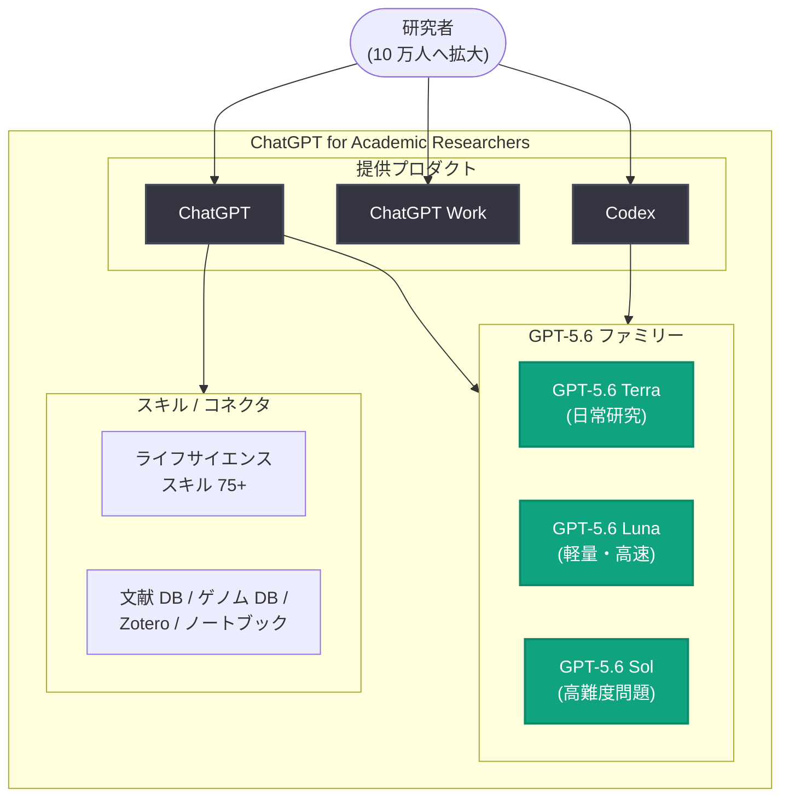

# ChatGPT for Academic Researchers: 10 万人の研究者に最先端 AI モデルを無償提供

## メタデータ

| 項目 | 内容 |
|------|------|
| 発表日 | 2026-07-29 |
| ソース | OpenAI News |
| カテゴリ | 製品発表 / 教育・研究支援 |
| 公式リンク | https://openai.com/index/chatgpt-for-academic-researchers |

## 概要

OpenAI は、選定された学術機関の研究者 100,000 人にフロンティアモデルへの無料アクセスを提供するプログラム「ChatGPT for Academic Researchers」を発表した。科学、数学、工学の各分野の研究者が高度な問題に取り組み、発見を加速し、研究助成金の申請から仮説検証までの生産性を向上させることを目的としている。

2026 年夏に 10,000 人の研究者からスタートし、プリンストン高等研究所 (IAS) やパリ高等師範学校 (ENS) などの機関ですでにアクセスが開始されている。2027 年までに 100,000 人への拡大を計画しており、本プログラムは 2027 年までに総額 2.5 億ドル以上を外部の科学研究支援に投じるというコミットメントの一環である。

## 主な内容

### プログラムの概要

- **対象規模**: 2026 年夏に 10,000 人から開始し、2027 年までに 100,000 人へ拡大
- **提供モデル**: ローンチ時点で GPT-5.6 Sol Pro を含むフロンティアモデル群
- **コラボレーション**: 承認された研究者は同一機関から最大 4 人の共同研究者を招待可能
- **プライバシー**: ワークスペースにはビジネスグレードのプライバシー・セキュリティ保護が適用され、データはデフォルトでモデルの学習に使用されない
- **用途**: ゲノム解析、タンパク質モデリング、文献レビュー、グラント申請書作成、論文出版など幅広い研究ワークフローを支援

ChatGPT Edu を導入済みの機関では、本プログラムによる無料アクセスは機関のワークスペースを通じて調整される。

### 2.5 億ドル規模の科学研究支援の一環

本プログラムは、2027 年までに 2.5 億ドル (250 million USD) 以上を外部の科学研究・発見の支援に投じるコミットメントの一部である。関連する取り組みは以下のとおり。

| 取り組み | 内容 |
|---------|------|
| NextGenAI | 研究機関を支援する 5,000 万ドルのイニシアチブ |
| Genesis Mission | 米国エネルギー省との協業。国立研究所・大学の研究者にフロンティア AI を提供 |
| ChatGPT for Academic Researchers | 本プログラム。100,000 人の研究者に無料アクセスを提供 |

### AI による研究加速の現状

OpenAI が公開したデータによると、AI は研究ツールとして急速に普及している。

- 毎週約 130 万人が高度な科学・数学の用途で ChatGPT を利用し、約 840 万件のメッセージを生成
- 数学分野では、過去 6 か月で AI が孤立した問題への散発的な利用から、数学研究の日常的な一部へと変化
- ChatGPT の貢献を謝辞に記載する論文が増加傾向

具体的な研究事例も紹介されている。

- **核融合研究**: 物理学者 Rogerio Jorge 氏のチームが、産業界や国立研究所で核融合エネルギー装置の設計に使われるオープンソースソフトウェアの開発に AI を活用
- **理論計算機科学**: Barna Saha 氏、Yinzhan Xu 氏、Christopher Ye 氏が GPT-5.5 Pro を用いて高次元幾何問題の計算効率に関する新しい限界を確立する証明を開発し、結果を自ら検証・改良

また、AI 利用強度が同分野内で上位 20% の研究者は、4 時間以上の作業時間を要すると推定されるタスクを AI に依頼する割合が他の研究者のほぼ 2 倍 (約 7% 対 3.5%) であり、より野心的な仕事に取り組む傾向が示された。

### 参加者が利用できる機能

参加者は ChatGPT、ChatGPT Work、Codex を通じてフロンティアモデルに無料でアクセスできる。

- **モデル**: ローンチ時点で GPT-5.6 ファミリーを提供
  - GPT-5.6 Terra: 日常的な研究向けに能力と効率のバランスを重視
  - GPT-5.6 Luna: 軽量タスク向けの高速応答
  - GPT-5.6 Sol: 最も困難な科学・数学の問題に対応
- **拡張機能**: 拡張された Deep Research、より高い利用上限、より大きなコンテキストウィンドウ
- **ライフサイエンススキル**: 遺伝学、ゲノミクス、シーケンシング、シングルセル解析、タンパク質モデリング、創薬にまたがる 75 以上のスキル
- **コネクタ**: 科学文献、公開ゲノム・臨床データベース、衛星画像、計算ノートブック、データプラットフォーム、文献管理ツール (Zotero など) への接続

ベンチマークの実績として、研究レベルの数学的推論を測定する FrontierMath Tier 4 で GPT-5.6 Sol は 83% を達成 (GPT-5.5 は 72.5%)。複雑な生物学的データ解析と科学的推論を評価する GeneBench Pro では GPT-5.6 Sol Pro がタスクの 31.5% を解決した。

| ベンチマーク | GPT-5.6 Sol | 比較 |
|-------------|------------|------|
| FrontierMath Tier 4 (研究レベル数学) | 83% | GPT-5.5: 72.5% |
| GeneBench Pro (生物学データ解析) | 31.5% (Sol Pro) | - |

### トレーニングと研究サポート

- 初心者から高度な応用開発者まで、経験レベルに応じたトレーニングを提供
- 研究ワークフローに精通したスペシャリストによるツール統合支援
- 研究者同士が実践的なアプローチを共有し、分野横断的な活用事例を学び合う機会を今後拡充
- 研究者からのフィードバックをモデル改善に活用

### 応募方法

- 初期プログラムは選定された学術機関の資格を満たす研究者が対象
- 対象機関は、高い研究活動水準を持つ学位授与機関 (大学・カレッジ) であることが条件
- 応募者は所属機関の確認と、進行中の研究および科学的な利用目的に関する情報の提供が必要
- 承認された研究者は同一機関から最大 4 人の共同研究者を招待可能 (各共同研究者も所属確認が必要で、プログラムの総アカウント数にカウントされる)

## アーキテクチャ

## 開発者・研究者への影響

- **研究アクセスの民主化**: 資金力のある一部の研究室に限らず、より多くの研究者がフロンティアモデルを無償で利用可能になる
- **研究ワークフローの高度化**: 75 以上のライフサイエンススキルとコネクタにより、ゲノム解析からタンパク質モデリング、文献管理までを ChatGPT/Codex 上で完結できる
- **エージェント的な研究実行**: Codex によるコード作成・デバッグ、データセット解析、再現可能なワークフロー構築が研究の実行フェーズを支援する
- **データ保護**: ビジネスグレードのセキュリティが適用され、研究データはデフォルトで学習に使用されないため、機密性の高い研究にも利用しやすい
- **エコシステムへの波及**: OpenAI の科学研究支援 (NextGenAI、Genesis Mission) と合わせ、学術分野での AI 活用が加速する見通し

## 関連リンク

- [ChatGPT for Academic Researchers (公式発表)](https://openai.com/index/chatgpt-for-academic-researchers)
- [GPT-5.6 の紹介](https://openai.com/index/gpt-5-6/)
- [対象機関の確認](https://chatgpt.com/sophia/eligible-institutions)
- [ライフサイエンス研究スキル (GitHub)](https://github.com/openai/plugins/tree/main/plugins/life-science-research)
- [ChatGPT Edu / 高等教育向けソリューション](https://openai.com/business/solutions/education/)
- [NextGenAI イニシアチブ](https://openai.com/index/introducing-nextgenai/)
- [Genesis Mission (米国エネルギー省との協業)](https://openai.com/index/advancing-the-next-era-of-national-science/)
- [OpenAI News](https://openai.com/news)

## まとめ

ChatGPT for Academic Researchers は、100,000 人の学術研究者に GPT-5.6 ファミリーを含むフロンティアモデルへの無料アクセスを提供する大規模プログラムである。2026 年夏の 10,000 人から始まり 2027 年までに拡大し、2.5 億ドル超の科学研究支援コミットメントの中核を成す。75 以上のライフサイエンススキル、拡張された Deep Research、Codex によるエージェント的な研究実行支援に加え、トレーニングや専門家サポートも提供され、ビジネスグレードのデータ保護のもとで研究に活用できる。AI が数学や核融合研究などで実際の成果を生み始めている中、フロンティア AI の恩恵を研究コミュニティ全体に広げる戦略的な取り組みといえる。
