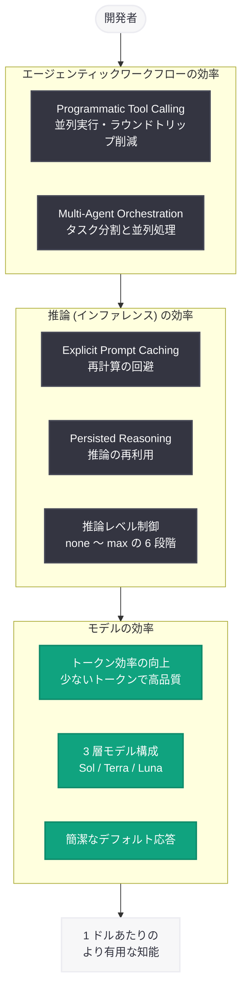

# GPT-5.6 の効率化技術解説: フロンティア性能とフロンティア効率の融合

## メタデータ

| 項目 | 内容 |
|------|------|
| 発表日 | 2026-07-29 |
| ソース | OpenAI News |
| カテゴリ | 技術解説 / モデル |
| 公式リンク | https://openai.com/index/gpt-5-6-frontier-intelligence-efficiency |

> **注記**: 本レポート作成時点で記事本文の全文取得ができなかったため (openai.com がボット向けにプレースホルダーページを返却)、公式の記事概要と、既報の GPT-5.6 正式リリース情報 ([2026-07-18 レポート](2026-07-18-gpt-5-6-product-launch.md)) に基づいて構成している。概要から直接確認できない詳細については「推測」と明示する。

## 概要

OpenAI は 2026 年 7 月 29 日、GPT-5.6 における効率化技術を解説する記事「How GPT-5.6 fuses frontier intelligence with frontier efficiency」を公開した。本記事は、GPT-5.6 が**モデル、推論 (インファレンス)、エージェンティックワークフロー**の 3 つのレイヤーにわたって AI の効率を改善し、「1 ドルあたりのより有用な知能 (more useful intelligence per dollar)」の提供を実現していることを説明する技術解説である。

2026 年 7 月 18 日に一般提供が開始された GPT-5.6 は、Sol / Terra / Luna の 3 層構成と数々の新機能を導入した。今回の記事は、その背後にある効率化の設計思想を掘り下げるものであり、フロンティアモデルの性能向上とコスト効率の改善が二律背反ではなく、同時に達成可能であるという OpenAI の技術的立場を示している。

## 主な内容

### 3 つのレイヤーにわたる効率化

概要によれば、GPT-5.6 の効率改善は以下の 3 つのレイヤーで実現されている。

| レイヤー | 効率化の対象 | 期待される効果 |
|----------|--------------|----------------|
| モデル | アーキテクチャとトークン効率 | 少ないトークンで同等以上の品質 |
| 推論 (インファレンス) | サービング基盤と計算リソース配分 | レイテンシとコストの削減 |
| エージェンティックワークフロー | ツール呼び出しとマルチステップ処理 | ラウンドトリップ削減、タスク完遂効率の向上 |

### モデルレベルの効率: トークン効率の向上

GPT-5.6 は正式リリース時点で、GPT-5.5 と比較して以下のモデルレベルの効率改善が確認されている (既報の GA 発表より)。

- **トークン効率:** フロンティア性能をより少ないトークンで達成
- **簡潔なデフォルト応答:** GPT-5.5 よりも冗長性を抑えた出力を生成し、出力トークンコストを削減
- **6 段階の推論レベル:** none から max まで、タスクの難易度に応じて推論計算量を調整可能

また、Sol / Terra / Luna の 3 層構成自体が効率化戦略の一部であり、ワークロードの要件に応じて適切な価格帯 (入力 $1〜$5 / 出力 $6〜$30 per MTok) のモデルを選択できる。

### 推論 (インファレンス) レベルの効率

**(推測を含む)** 記事概要の「inference」に対応する効率化として、GPT-5.6 で導入済みの以下の機能が該当すると考えられる。

- **Explicit Prompt Caching:** キャッシュ対象プレフィックスを開発者が明示制御し、繰り返しリクエストの計算コストを削減 (キャッシュ読み取りは割引レート)
- **Persisted Reasoning:** ターン間で推論アイテムを再利用し、マルチターン対話での再計算を回避
- **Pro モード:** 必要な場面にのみ追加計算リソースを投入する選択的なスケーリング

### エージェンティックワークフローの効率

**(推測を含む)** エージェント処理における効率化としては、以下の GA 済み機能が中核を成すと考えられる。

- **Programmatic Tool Calling (PTC):** モデルが JavaScript を生成し、隔離された V8 ランタイム内で複数ツール呼び出しを並列実行・ループ・条件分岐処理する。従来複数回の API ラウンドトリップが必要だった処理が単一リクエストで完結し、レイテンシとコストを大幅に削減する
- **Multi-Agent Orchestration (ベータ):** サブエージェントへのタスク分割と並列処理により、長大なタスクの実行効率を改善

### 「1 ドルあたりのより有用な知能」という指標

概要に登場する「more useful intelligence per dollar」という表現は、単純なトークン単価の引き下げではなく、**同一コストで達成できるタスク成果の最大化**を効率の指標とする考え方を示している。トークン効率、キャッシュ、選択的推論、エージェント処理の最適化を組み合わせることで、実タスクベースでのコストパフォーマンスを改善するアプローチである。

## 技術的な詳細

### 効率化機能を組み合わせた利用例

以下は、GPT-5.6 の効率化機能 (階層別モデル選択、明示的キャッシュ、推論レベル調整) を組み合わせたコードサンプルである。

```python
from openai import OpenAI

client = OpenAI()

# 効率重視の構成:
# - 大量処理には Luna、複雑なタスクには Sol を使い分け
# - システムプロンプトを明示的にキャッシュ
# - タスク難易度に応じた推論レベルを指定
response = client.responses.create(
    model="gpt-5.6-luna",  # 効率型モデル ($1 / $6 per MTok)
    input=[
        {
            "role": "system",
            "content": "あなたはカスタマーサポートの分類アシスタントです。"
                       "問い合わせをカテゴリに分類してください。",
            "prompt_cache_breakpoint": True  # ここまでをキャッシュ
        },
        {
            "role": "user",
            "content": "請求書の金額が先月と違うのですが確認できますか?"
        }
    ],
    prompt_cache_options={"mode": "explicit"},
    reasoning={"effort": "low"},  # 単純タスクには低い推論レベル
    max_output_tokens=256
)

print(response.output_text)
```

### Programmatic Tool Calling によるラウンドトリップ削減

```python
from openai import OpenAI

client = OpenAI()

# 従来: 検索 → 結果取得 → 詳細取得 × N 回のラウンドトリップ
# PTC: モデルが生成する JavaScript が単一リクエスト内で
#      並列ツール呼び出しをオーケストレーション
response = client.responses.create(
    model="gpt-5.6-sol",
    input=[{
        "role": "user",
        "content": "主要 3 都市の今日の天気を取得し、比較表を作成してください。"
    }],
    tools=[{
        "type": "function",
        "name": "get_weather",
        "description": "Get weather for a city",
        "parameters": {
            "type": "object",
            "properties": {"city": {"type": "string"}},
            "required": ["city"]
        }
    }],
    tool_choice="programmatic"
)

print(response.output_text)
```

## アーキテクチャ

GPT-5.6 における 3 レイヤーの効率化スタックを以下に示す。



## 開発者への影響

- **コスト設計の見直し:** トークン単価の比較だけでなく、キャッシュ、推論レベル、PTC によるラウンドトリップ削減を含めた「タスク単位の総コスト」でモデル選定を評価すべき段階に入った
- **モデルの使い分け戦略:** 単純タスクは Luna、標準タスクは Terra、複雑なエージェント処理は Sol という階層的な振り分けにより、品質を維持しながら大幅なコスト削減が可能
- **推論レベルの適正化:** すべてのリクエストに高い推論レベルを適用するのではなく、タスク難易度に応じて `reasoning.effort` を調整することで計算コストを最適化できる
- **エージェント設計の簡素化:** PTC により、アプリケーション側で実装していたツールオーケストレーションロジックの多くをモデル側に委譲でき、開発・運用コストも削減される

## 関連リンク

- [GPT-5.6 効率化技術解説 (本記事)](https://openai.com/index/gpt-5-6-frontier-intelligence-efficiency)
- [GPT-5.6 公式発表ページ](https://openai.com/index/gpt-5-6/)
- [OpenAI API ドキュメント](https://platform.openai.com/docs)
- [OpenAI モデル一覧](https://platform.openai.com/docs/models)
- [OpenAI Pricing](https://openai.com/pricing)
- [OpenAI News](https://openai.com/news)

## まとめ

本記事は、GPT-5.6 が「フロンティア性能」と「フロンティア効率」を両立させたモデルであることを、モデル・推論・エージェンティックワークフローの 3 レイヤーにわたる効率化技術の観点から解説するものである。トークン効率の向上、3 層モデル構成、明示的キャッシュ、推論レベル制御、Programmatic Tool Calling といった機能群は、いずれも「1 ドルあたりのより有用な知能」という共通の目標に向けた設計である。開発者にとっては、単価比較ではなくタスク単位の総コストで効率を評価し、機能を組み合わせて最適化する運用が今後の標準となる。なお、記事本文の全文が取得できなかったため、レイヤーごとの具体的な対応機能の一部は既報の GA 発表情報に基づく推測を含む。詳細は公式リンクの原文を参照されたい。
