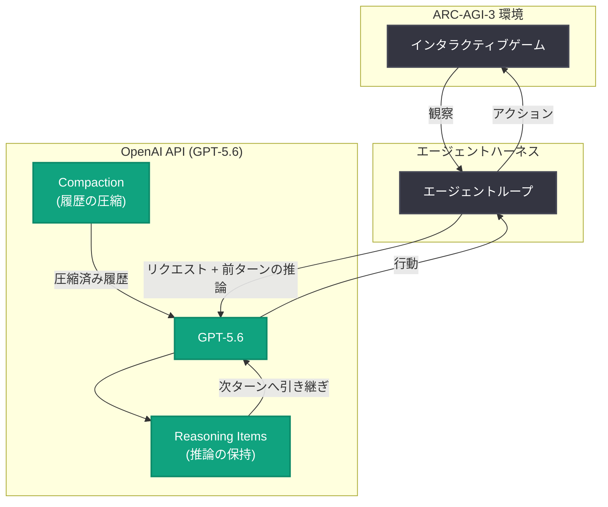

# 2 つの API 設定で ARC-AGI-3 ベンチマークのスコアが 3 倍に

## メタデータ

| 項目 | 内容 |
|------|------|
| 発表日 | 2026-07-29 |
| ソース | OpenAI News |
| カテゴリ | 技術解説 / API 活用 |
| 公式リンク | https://openai.com/index/how-two-settings-tripled-our-arc-agi-3-scores |

> **注記**: 本レポート作成時点で記事本文の取得ができなかったため (openai.com が自動アクセスをブロック)、公式概要文と OpenAI API に関する一般的な公開情報に基づいて構成している。概要文で確認できる事実と、そこからの推測を明確に区別して記載する。

## 概要

OpenAI は、2 つの API 設定を有効化するだけで GPT-5.6 の ARC-AGI-3 ベンチマークスコアが約 3 倍に向上したという技術解説記事を公開した。公式概要によれば、鍵となったのは「推論の保持 (retaining reasoning)」と「コンパクション (compaction) の有効化」の 2 点であり、スコアだけでなく実行効率も改善したとされる。

ARC-AGI-3 は、事前知識に頼らない流動的知能 (fluid intelligence) を測ることを目的とした ARC Prize 系列の最新ベンチマークで、エージェントがインタラクティブな環境を多ターンで探索しながら課題を解く形式を採る。多ターンのエージェントタスクでは、モデルの能力そのものだけでなく「コンテキストをどう管理するか」が成績を大きく左右することを示す事例として、エージェント開発者に広く応用できる知見を含む発表である。

## 主な内容

### 設定 1: 推論の保持 (Reasoning Retention)

**概要文で確認できる事実**: スコア向上の要因の 1 つは「推論を保持する (retaining reasoning)」設定である。

**推測を含む解説**: OpenAI の Responses API では、推論モデルが生成する reasoning item (思考の中間生成物) を次のターンに引き継ぐことができる。`previous_response_id` によるサーバー側の会話継続、あるいは `include: ["reasoning.encrypted_content"]` で暗号化された推論内容を受け取りクライアント側で次リクエストに渡す方式が公式に提供されている。

多ターンのエージェントループで推論を引き継がない場合、モデルはターンごとに状況分析を最初からやり直すことになる。ARC-AGI-3 のような「環境を観察し、仮説を立て、行動して検証する」タイプのタスクでは、前のターンで立てた仮説や気付きが失われると探索が振り出しに戻るため、推論の保持が特に大きな効果を持つと考えられる。

### 設定 2: コンパクションの有効化 (Compaction)

**概要文で確認できる事実**: もう 1 つの要因は「コンパクションの有効化 (enabling compaction)」である。

**推測を含む解説**: コンパクションは、長大化した会話履歴をモデルのコンテキストウィンドウに収まるよう自動的に圧縮・要約する仕組みである。長時間のエージェント実行では履歴がコンテキスト上限に達し、古い情報の単純な切り捨て (truncation) が発生すると重要な手掛かりが失われる。コンパクションを有効にすると、重要な情報を保ちながら履歴を圧縮できるため、次の効果が期待できる。

- 長いエピソードでも初期の観察結果や成功パターンを参照し続けられる
- コンテキスト超過によるエラーや強制打ち切りを回避できる
- 入力トークン量が減り、コストとレイテンシの両面で効率が向上する

概要文の「boosting scores and efficiency (スコアと効率の両方を向上)」という記述は、この圧縮によるトークン効率の改善を指していると考えられる。

### 結果: スコアが約 3 倍に

**概要文で確認できる事実**: 2 つの設定により GPT-5.6 の ARC-AGI-3 スコアが約 3 倍 (tripled) になった。具体的なスコア数値は記事本文が取得できなかったため本レポートでは確認できていない。

この結果が示唆するのは、「モデルの重みを一切変えずに、API の使い方だけで性能が数倍変わり得る」という点である。ベンチマーク結果を比較する際には、モデル本体の能力に加えてハーネス (実行環境) の設定が大きな変数になることを意味する。

## 技術的な詳細

以下は Responses API の公開仕様に基づく一般的な実装例であり、記事中のコードそのものではない点に注意。

### コードサンプル: 推論を保持した多ターンエージェントループ

```python
from openai import OpenAI

client = OpenAI()

previous_response_id = None

for step in range(max_steps):
    observation = env.get_observation()

    response = client.responses.create(
        model="gpt-5.6",
        # 前ターンの推論 (reasoning item) を含む状態を引き継ぐ
        previous_response_id=previous_response_id,
        input=[{"role": "user", "content": observation}],
        reasoning={"effort": "high"},
        tools=game_tools,
    )

    previous_response_id = response.id
    env.apply_action(response)
```

サーバー側ステートを使わない場合は、`include=["reasoning.encrypted_content"]` を指定して暗号化済み推論を取得し、次リクエストの `input` に含めて渡す方式でも同様に推論を保持できる。

### 2 つの設定の比較

| 項目 | 推論の保持 | コンパクション |
|------|-----------|---------------|
| 解決する問題 | ターン間で思考が失われる | 履歴がコンテキスト上限を超える |
| 主な効果 | 仮説・戦略の継続、探索の一貫性 | 長期タスクの完走、トークン効率 |
| 効く場面 | 多ターンの試行錯誤タスク | 長時間・長履歴のエージェント実行 |

## アーキテクチャ

2 つの設定を有効にしたエージェントループの構成 (公開仕様に基づく概念図)。



## 開発者への影響

- **設定の見直しだけで性能が大きく変わる**: モデルを変更しなくても、推論の保持とコンパクションの有効化という設定変更のみで、多ターンタスクの成績が数倍変わり得る。エージェントを構築している開発者はまず自分のハーネス設定を確認する価値がある
- **多ターンエージェントでは推論の引き継ぎが標準的なベストプラクティスに**: `previous_response_id` や暗号化推論の受け渡しにより、ターンをまたいだ思考の一貫性を確保できる
- **長時間実行タスクにはコンパクションが有効**: コンテキスト超過による失敗を防ぎつつ、トークン消費を抑えられるため、スコアとコスト効率の両立が可能
- **ベンチマーク比較時の注意**: 公表スコアの差はモデル能力だけでなくハーネス設定に起因する場合がある。再現・比較の際は API 設定を揃える必要がある

## 関連リンク

- [記事原文: How enabling two settings tripled our scores on the ARC-AGI-3 benchmark](https://openai.com/index/how-two-settings-tripled-our-arc-agi-3-scores)
- [OpenAI Responses API リファレンス](https://platform.openai.com/docs/api-reference/responses)
- [OpenAI Reasoning モデルガイド](https://platform.openai.com/docs/guides/reasoning)
- [ARC Prize (ARC-AGI 公式サイト)](https://arcprize.org/)
- [OpenAI News](https://openai.com/news)

## まとめ

OpenAI は、推論の保持とコンパクションという 2 つの API 設定を有効化するだけで、GPT-5.6 の ARC-AGI-3 スコアが約 3 倍に向上したことを公表した。多ターンのエージェントタスクでは、モデルの生の能力と同じくらい「思考を捨てないこと」と「コンテキストを溢れさせないこと」が重要であることを示す実例であり、エージェントを開発するすべての開発者にとって、ハーネス設定を見直す動機となる発表である。なお、本レポートは記事本文が取得できなかったため公式概要文に基づいており、具体的なスコア数値や実装詳細は原文で確認されたい。
