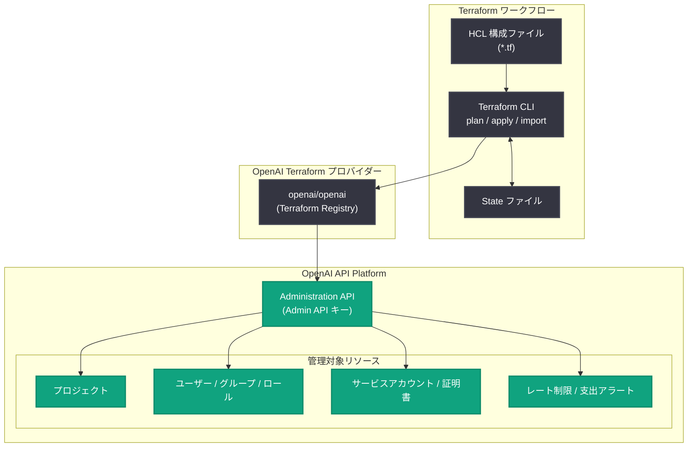

# OpenAI 公式 Terraform プロバイダーのリリース

## メタデータ

| 項目 | 内容 |
|------|------|
| 発表日 | 2026-07-29 |
| ソース | OpenAI API Changelog |
| カテゴリ | API 更新 / 開発者ツール |
| 公式リンク | https://developers.openai.com/api/docs/changelog |

## 概要

OpenAI は 2026 年 7 月 29 日、OpenAI API プラットフォームのリソースを IaC (Infrastructure as Code) として管理するための公式 Terraform プロバイダーをリリースした。プロジェクト、ユーザー、グループ、ロール、アクセス割り当て、サービスアカウント、証明書、招待、プロジェクト単位のレート制限などを Terraform のコードとして宣言的に管理できるようになる。

これまで OpenAI の組織リソース管理は、ダッシュボードでの手動操作か Administration API の直接呼び出しに限られていた。本プロバイダーの登場により、変更のレビューと適用 (plan / apply)、既存リソースのインポート、構成ドリフトの検出と是正といった Terraform 標準のワークフローが利用可能になり、エンタープライズ環境でのガバナンスと再現性が大幅に向上する。プロバイダーは [Terraform Registry](https://registry.terraform.io/providers/openai/openai/latest) から入手できる。

## 主な内容

### 管理可能なリソース

公式 changelog およびガイドによると、本プロバイダーで以下のリソースを管理できる。

| リソース | 説明 |
|----------|------|
| プロジェクト (projects) | 組織内のプロジェクトの作成・設定管理 |
| ユーザー (users) | 組織メンバーの管理 |
| グループ (groups) | ユーザーグループの管理 |
| ロール (roles) | ロール定義の管理 |
| アクセス割り当て (access assignments) | ロール・グループベースのアクセス制御 |
| サービスアカウント (service accounts) | ワークロード ID または API キー認証のマシンユーザー |
| 証明書 (certificates) | 証明書の管理 |
| 招待 (invitations) | 組織へのユーザー招待 |
| レート制限 (rate limits) | プロジェクト単位のレート制限設定 |
| 支出アラート (spend alerts) | コスト管理のためのアラート設定 |

### Terraform 標準ワークフローのサポート

公式ドキュメントでは、以下の Terraform 標準機能への対応が明記されている。

- **変更のレビューと適用**: `terraform plan` で差分を確認し、レビュー後に `terraform apply` で適用
- **既存リソースのインポート**: ダッシュボードで作成済みのリソースを Terraform 管理下に取り込む (Terraform 1.5 以降が必要)
- **ドリフトの検出と是正**: コード外で加えられた変更を検出し、宣言された構成に収束させる

### 前提条件と認証

- Terraform 1.0 以降 (インポート機能は 1.5 以降)
- Admin API キーを作成できる権限を持つ組織

認証には Administration API 用の **Admin API キー**を使用する。通常の API キーとは異なり、Admin API キーは管理系エンドポイント専用である点に注意が必要である。キーは環境変数またはシークレットマネージャーで管理し、Terraform ファイルやソース管理に含めないことが推奨されている。

```bash
export OPENAI_ADMIN_KEY="<your-admin-api-key>"
```

オプションで `OPENAI_ORG_ID` と `OPENAI_PROJECT_ID` を設定すると、`OpenAI-Organization` および `OpenAI-Project` ヘッダーが付与される。未設定の場合、組織・プロジェクトはキーから推定される。

## 技術的な詳細

### コードサンプル

公式ガイドに掲載されているプロバイダー設定とプロジェクト作成の例。

```hcl
terraform {
  required_version = ">= 1.0"

  required_providers {
    openai = {
      source  = "openai/openai"
      version = ">= 1.0.0"
    }
  }
}

provider "openai" {}

resource "openai_project" "example" {
  name = "terraform-managed"
}

output "project_id" {
  value = openai_project.example.project_id
}
```

### 基本的なワークフロー

```bash
# 初期化 (プロバイダーのダウンロード)
terraform init

# フォーマットと構文検証
terraform fmt
terraform validate

# 変更内容の確認
terraform plan

# レビュー後に適用
terraform apply
```

再現性を担保するため、`.terraform.lock.hcl` をコミットしてプロバイダーバージョンを固定し、更新時は `terraform init -upgrade` を使用することが推奨されている。

### ユースケース別ガイド

公式ドキュメントには以下のユースケース別ガイドが用意されている。

- **Projects and access**: プロジェクトとロール・グループベースのアクセス管理
- **Service accounts**: ワークロード ID または API キー認証のサービスアカウント
- **Model, tool, and data controls**: モデルアクセス、ホスト型ツール、データ保持の制御
- **Rate limits and spend**: 既存レート制限の取り込みと支出アラートの設定
- **Import and reconciliation**: 既存リソースの取り込みとドリフト検出

## アーキテクチャ



## 開発者への影響

- **手動運用からの脱却**: ダッシュボードでの手動操作に依存していたプロジェクト・ユーザー・アクセス管理を、コードレビュー可能な宣言的構成に置き換えられる
- **ガバナンスの強化**: 変更が `terraform plan` の差分としてレビューされるため、監査証跡と承認フローを CI/CD パイプラインに組み込める
- **ドリフト検出**: コード外で加えられた設定変更 (レート制限の手動変更など) を検出し、意図した構成へ是正できる
- **既存環境の移行**: インポート機能により、すでに運用中の OpenAI 組織を段階的に Terraform 管理へ移行できる (Terraform 1.5 以降)
- **マルチ環境の統一管理**: 開発・ステージング・本番などのプロジェクトを同一モジュールで複製し、環境間の設定差異を排除できる
- **注意点**: Admin API キーが必要であり、通常の API キーでは動作しない。キーの権限が強力なため、シークレット管理の徹底が必須となる

## 関連リンク

- [OpenAI API Changelog](https://developers.openai.com/api/docs/changelog)
- [OpenAI Terraform ガイド (公式ドキュメント)](https://developers.openai.com/api/docs/guides/terraform)
- [Terraform Registry: openai/openai プロバイダー](https://registry.terraform.io/providers/openai/openai/latest)
- [OpenAI API リファレンス](https://platform.openai.com/docs/api-reference)

## まとめ

OpenAI 公式 Terraform プロバイダーのリリースにより、OpenAI API プラットフォームの組織リソースを IaC として管理できるようになった。プロジェクト、ユーザー、グループ、ロール、サービスアカウント、証明書、レート制限、支出アラートなど幅広いリソースに対応し、plan / apply によるレビュー、既存リソースのインポート、ドリフト検出といった Terraform 標準ワークフローをフルサポートする。エンタープライズ環境で OpenAI を利用する組織にとって、ガバナンス・監査・再現性の観点で大きな前進となるアップデートである。
