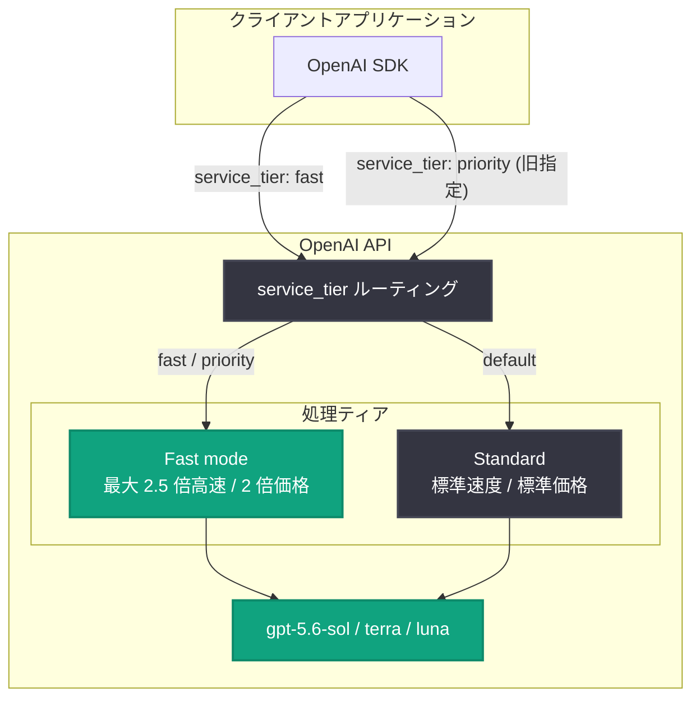

# OpenAI API が Fast mode を導入 (Priority Processing を置き換え)、GPT-5.6 の価格を引き下げ

## メタデータ

| 項目 | 内容 |
|------|------|
| 発表日 | 2026-07-30 |
| ソース | OpenAI API Changelog |
| カテゴリ | API 更新 / 料金改定 |
| 公式リンク | https://developers.openai.com/api/docs/changelog |

## 概要

OpenAI は 2026 年 7 月 30 日、API Changelog にて 2 つの重要な更新を発表した。1 つ目は料金改定で、GPT-5.6 Luna の価格を 80%、GPT-5.6 Terra の価格を 20% 引き下げた。2 つ目は新機能「Fast mode」の導入で、従来の Priority Processing を置き換えるものである。

Fast mode は GPT-5.6 Sol において、標準処理の 2 倍の価格で最大 2.5 倍の速度を提供する。後方互換性は維持されており、`priority` を指定したリクエストは自動的に Fast mode で処理される。レイテンシが重要なユーザー向けアプリケーションを運用する開発者にとって、選択肢とコスト構造が明確になる更新である。

## 主な内容

### GPT-5.6 の価格引き下げ

GPT-5.6 ファミリーのうち 2 モデルが値下げされた。

- **GPT-5.6 Luna**: 80% の価格引き下げ
- **GPT-5.6 Terra**: 20% の価格引き下げ

改定後の標準価格 (短コンテキスト、100 万トークンあたり) は以下の通り (料金ページより)。

| モデル | 入力 | キャッシュ入力 | キャッシュ書き込み | 出力 |
|--------|------|--------------|------------------|------|
| gpt-5.6-sol | $5.00 | $0.50 | $6.25 | $30.00 |
| gpt-5.6-terra | $2.00 | $0.20 | $2.50 | $12.00 |
| gpt-5.6-luna | $0.20 | $0.02 | $0.25 | $1.20 |

なお、Changelog には引き下げ率のみが記載されており、改定前の価格は公式ページ上に掲載されていない。

### Fast mode の導入 (Priority Processing の後継)

Priority Processing は 2026 年 7 月 30 日に「Fast mode」へと改称された。単なる名称変更にとどまらず、`gpt-5.6-sol` では速度が強化され、標準処理と比較して**最大 2.5 倍の高速化**と、より安定したレイテンシを実現する。

**Priority Processing と Fast mode の比較:**

| 項目 | Priority Processing (旧) | Fast mode (新) |
|------|------------------------|----------------|
| 提供期間 | 2026-07-30 まで | 2026-07-30 から |
| 指定方法 | `service_tier: "priority"` | `service_tier: "fast"` (旧値 `"priority"` も有効) |
| GPT-5.6 Sol の速度 | 標準比で高速 | 標準比で最大 2.5 倍 |
| 価格 | 標準よりプレミアム | 標準の約 2 倍 (料金ページ準拠) |
| 後方互換性 | - | `priority` 指定は自動的に Fast mode を使用 |

**Fast mode の料金 (短コンテキストのみ、100 万トークンあたり):**

| モデル | 入力 | キャッシュ入力 | キャッシュ書き込み | 出力 |
|--------|------|--------------|------------------|------|
| gpt-5.6-sol | $10.00 | $1.00 | $12.50 | $60.00 |
| gpt-5.6-terra | $4.00 | $0.40 | $5.00 | $24.00 |
| gpt-5.6-luna | $0.40 | $0.04 | $0.50 | $2.40 |

キャッシュ入力トークンの割引は標準処理と同様に適用される。

## 技術的な詳細

Fast mode は Responses API (`v1/responses`) と Chat Completions API (`v1/chat/completions`) の両方で利用できる。有効化の方法は 2 つある。

1. **リクエスト単位**: `service_tier` パラメータに `"fast"` (または `"priority"`) を指定する
2. **プロジェクト単位**: 設定画面 (Settings → General → Project) で Project Service Tier を Fast に設定する。明示的な `service_tier` 指定のないリクエストが段階的に Fast mode へ移行する

レスポンスオブジェクトの `service_tier` フィールドで、実際に使用されたティアを確認できる。GPT-5.6 以前のモデルでは、`priority` と `fast` のどちらを指定してもレスポンスには `priority` が返される点に注意が必要である。

**制約事項:**

- 長コンテキスト、ファインチューニング済みモデル、Embeddings は非対応
- マルチモーダルリクエスト (画像入力を含む) は対応
- レート制限は標準処理とモデルごとに共有
- **ランプレート制限**: 100 万 TPM 以上を送信し、かつ 15 分以内に TPM を 50% 超増加させた場合に発動する可能性がある。制限された場合、リクエストは標準の速度・価格で処理され、`service_tier: "default"` が返される
- Fast mode と Scale Tier は同等の SLA 扱いとなり、対象の Enterprise 契約ではレイテンシ目標未達時にサービスクレジットが提供される場合がある

### コードサンプル

Python (Responses API):

```python
from openai import OpenAI

client = OpenAI()

response = client.responses.create(
    model="gpt-5.6-sol",
    input="Hello!",
    service_tier="fast",
)
print(response)
```

curl:

```bash
curl https://api.openai.com/v1/responses \
  -H "Authorization: Bearer $OPENAI_API_KEY" \
  -H "Content-Type: application/json" \
  -d '{
    "model": "gpt-5.6-sol",
    "input": "Hello!",
    "service_tier": "fast"
  }'
```

## アーキテクチャ



## 開発者への影響

- **コード変更は不要**: 既存の `service_tier: "priority"` 指定はそのまま動作し、自動的に Fast mode として処理される。移行作業なしで速度向上の恩恵を受けられる
- **GPT-5.6 Luna のコストが大幅減**: 80% の値下げにより、大量処理や低コスト用途での Luna 採用のハードルが大きく下がる。Terra も 20% の値下げで中間グレードの選択肢として魅力が増す
- **レイテンシ重視アプリの選択肢が明確化**: ユーザー向けのリアルタイムアプリケーションでは、2 倍のコストで最大 2.5 倍の速度と安定したレイテンシを得られる Fast mode が有力な選択肢となる
- **トラフィック急増時の注意**: ランプレート制限があるため、Fast mode へのトラフィック移行はフィーチャーフラグなどを用いて段階的に行う必要がある。ETL やバッチ処理には Fast mode を使わず、Batch API (標準の 50% 価格) を検討すべきである
- **ダッシュボードでの確認**: 使用状況ダッシュボードでサービスティア別にグループ化して Fast mode の利用状況を確認できる (GPT-5.6 以前のモデルでは `priority` と表示される)

## 関連リンク

- [OpenAI API Changelog](https://developers.openai.com/api/docs/changelog)
- [Fast mode ガイド](https://developers.openai.com/api/docs/guides/fast-mode)
- [OpenAI API 料金ページ](https://developers.openai.com/api/docs/pricing)
- [OpenAI API リファレンス](https://platform.openai.com/docs/api-reference)

## まとめ

2026 年 7 月 30 日の更新は、価格と速度の両面で GPT-5.6 ファミリーの利便性を高めるものである。GPT-5.6 Luna の 80% 値下げと Terra の 20% 値下げによりコスト効率が大きく改善し、Priority Processing を置き換える Fast mode は `gpt-5.6-sol` で最大 2.5 倍の高速化を実現した。後方互換性が確保されているため既存コードの変更は不要であり、開発者はワークロードの特性に応じて Standard、Fast mode、Batch を使い分けるコスト・速度戦略を組み立てやすくなった。
