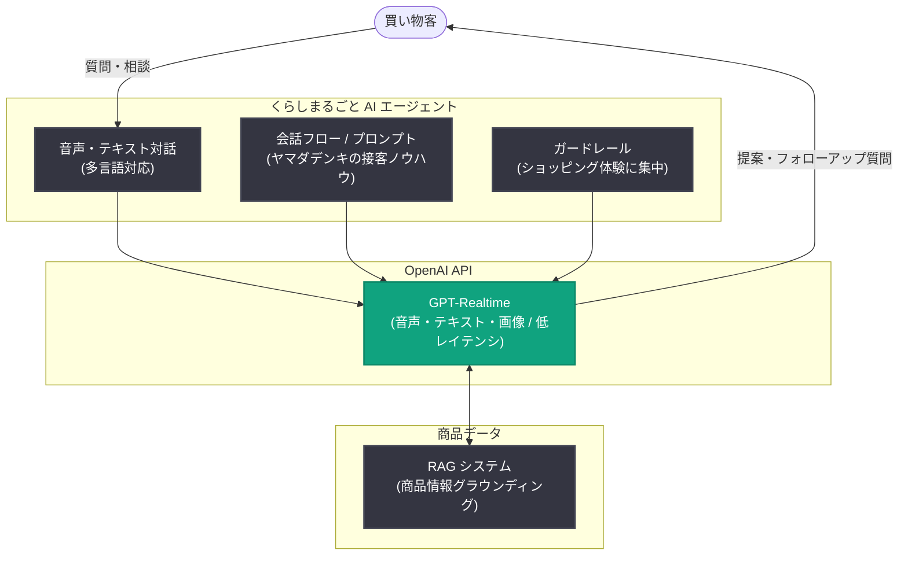

# avatarin が GPT-Realtime で 24 時間 365 日対応の小売接客エージェントを構築

## メタデータ

| 項目 | 内容 |
|------|------|
| 発表日 | 2026-07-30 |
| ソース | OpenAI News (Customer Story) |
| カテゴリ | 導入事例 |
| 公式リンク | https://openai.com/index/avatarin |

## 概要

ANA ホールディングス発の AI 接客企業である avatarin は、ヤマダホールディングスと提携し、OpenAI の GPT-Realtime を活用した 24 時間 365 日対応の多言語ショッピングエージェント「くらしまるごと AI エージェント」を構築した。日本の家電量販店が抱える「人員が限られる中で、営業時間外にも専門的な販売サポートを提供する」という課題に対し、経験豊富な販売員の知識を AI エージェントに落とし込んだ事例である。

ヤマダデンキのオンラインストアで実施された 2 週間の公開キャンペーンでは、約 30,000 人がエージェントを利用し、アンケート回答の 92% がポジティブという結果を得た。avatarin の CEO 深堀昂氏は、これを「従来型チャットボットの延長ではなく、AI で接客のあり方そのものを拡張する試み。小売における『インターフェース革命』の始まり」と位置づけている。

## 主な内容

### 質問への回答から、人を理解する接客へ

avatarin はヤマダデンキとのプロジェクト以前から OpenAI API を音声認識、問い合わせ分析、従業員トレーニングに活用しており、AI を実務に適用するための知見を蓄積していた。今回のショッピングエージェントは、その知見を初めて顧客に直接届ける大規模な機会となった。

GPT-Realtime を採用した最大の理由は、音声、テキスト、画像の理解を単一の対話体験に統合できる点である。深堀氏は「単一モデルの性能が、専用の音声認識システムで見てきたものを超えていた。音声、テキスト、画像を低レイテンシで横断的に扱える。人が機械のルールに合わせるのではなく、技術のほうが人のコミュニケーションに自然に適応できる」と述べている。

従来のチャットボットが正しいキーワードを待つのに対し、avatarin のエージェントは文脈を聞き取る。「顧客が求めているのはチャットボットではなく知性。『4 人家族用の冷蔵庫が必要だが、キッチンが狭い。どれを選べばよいか』という質問に答えられることが本当の接客だ」と深堀氏は説明する。

### 設計の 3 つの柱

avatarin はエージェントを以下の 3 つの本質的な要素を中心に設計した。

1. **会話を遅らせずに商品情報の正確性を保つ**: RAG (検索拡張生成) システムでエージェントの応答を商品情報にグラウンディングしつつ、GPT-Realtime が対話の応答性を維持する。これにより、買い物客は流れるような音声対話を楽しみながら、関連する商品データに基づいた情報を受け取れる。
2. **ヤマダデンキの販売ノウハウを会話設計に変換する**: 販売員が収集すべき情報は商品カテゴリによって大きく異なる。avatarin はヤマダデンキの接客知識を会話フローとプロンプティングに組み込んだ。顧客が要件を変えたり話題が一時的に逸れたりしても適応できるよう設計され、ガードレールが会話をショッピング体験に集中させる。
3. **答えるだけでなく、問いかけるエージェント**: 従来型チャットボットの多くは顧客からの次の指示を待つが、avatarin はより能動的なアプローチを採用した。エージェントがフォローアップの質問を投げかけて顧客の真のニーズを掘り起こし、単純な一問一答からガイド付きの商品探索へと会話を導く。

OpenAI は avatarin と協力し、複雑なプロンプトの構造化、常時稼働の音声サービスにおける API コストの最適化、実装のベストプラクティスの共有を行った。この支援により、avatarin はヤマダデンキのサービスモデルを正確・応答的でブランドらしい体験に変換することに集中できた。

### 会話がインサイトになる

2 週間の公開キャンペーンで得られた成果は以下のとおり。

| 指標 | 結果 |
|------|------|
| 利用者数 | 約 30,000 人 |
| 対応時間 | 24 時間 365 日 (音声・テキストの多言語対応) |
| アンケート | 回答の 92% がポジティブ |

重要な発見は規模だけではない。すべての会話から、買い物客が何を気にかけ、なぜ迷い、何が意思決定を後押しするかが明らかになった。深堀氏は「従来のオンラインショッピングではこうしたインサイトは見えにくかったが、AI エージェントでは会話の一部として得られる」と説明する。

閉店後にも質問でき、販売圧力を感じずに予算や不安について率直に話せるという新しい買い物の瞬間も生まれた。各会話の最後には短い音声アンケートが実施され、フィードバックの収集がショッピング体験の自然な延長となった。顧客からは「実際の販売員より話しやすい」「ストレスを感じずに何度でも質問できる」といった声が寄せられた。

### One Intelligence. One Brand. Every interface.

avatarin は、単一の AI エージェントが Web、電話、実店舗を横断してシームレスに顧客対応する世界を構想している。チャネルごとに別々のシステムを持つのではなく、同じ知性が顧客のコンテキストを引き継ぐことで「1 人の顧客、1 つの会話、1 つのブランド」という継続性を実現する。

家電、住宅、金融サービスなどを展開するヤマダホールディングスにとって、このビジョンは AI を日常生活全体の信頼できるパートナーにする可能性を持つ。深堀氏は「単一目的 AI の時代は終わった。OpenAI が汎用・マルチモーダル知性の次の時代をリードすると信じている」と述べている。

## アーキテクチャ

## 開発者への影響

- **音声エージェントの単一モデル化**: 専用の音声認識システムを組み合わせる構成ではなく、GPT-Realtime 単体で音声・テキスト・画像を低レイテンシに処理する構成が、実運用の小売サービスで実証された。音声パイプラインの簡素化を検討する際の参考事例となる。
- **RAG と Realtime API の両立**: 応答速度が重視されるリアルタイム音声対話でも、RAG による商品情報のグラウンディングで正確性を担保できることが示された。会話の流暢さと事実性のトレードオフを解消する設計パターンとして有用である。
- **能動的な対話設計**: ユーザーの指示を待つのではなく、エージェント側からフォローアップ質問でニーズを掘り起こす設計が高い満足度 (92% ポジティブ) につながった。会話フローとプロンプトへのドメイン知識の組み込み、およびガードレールによる話題の制御が鍵となる。
- **常時稼働サービスのコスト最適化**: 24 時間 365 日稼働する音声サービスでは API コストの最適化が重要であり、OpenAI がプロンプト構造化やコスト最適化を支援した点は、同種のサービスを設計する際の考慮事項を示している。
- **会話ログのインサイト活用**: 顧客との会話自体が、迷いの理由や意思決定の要因といった従来の EC では得にくいインサイトの源泉になる。会話終了時の音声アンケートなど、フィードバック収集を体験に自然に組み込む手法も参考になる。

## 関連リンク

- [How avatarin built a 24/7 retail agent with GPT-Realtime (OpenAI 公式)](https://openai.com/index/avatarin)
- [Realtime API ドキュメント](https://platform.openai.com/docs/guides/realtime)
- [OpenAI API リファレンス](https://platform.openai.com/docs/api-reference)
- [OpenAI News](https://openai.com/news)

## まとめ

avatarin はヤマダホールディングスと提携し、GPT-Realtime を基盤とする 24 時間 365 日対応の多言語ショッピングエージェントを構築した。2 週間のキャンペーンで約 30,000 人が利用し、アンケート回答の 92% がポジティブという成果を上げた。RAG による正確性の担保、販売ノウハウの会話設計への変換、能動的に問いかけるエージェント設計という 3 つの柱が特徴である。単なるチャットボットの置き換えではなく、会話から顧客インサイトを獲得し、Web・電話・実店舗を単一の知性でつなぐ「One Intelligence. One Brand. Every interface.」という小売の将来像を示す事例となっている。
