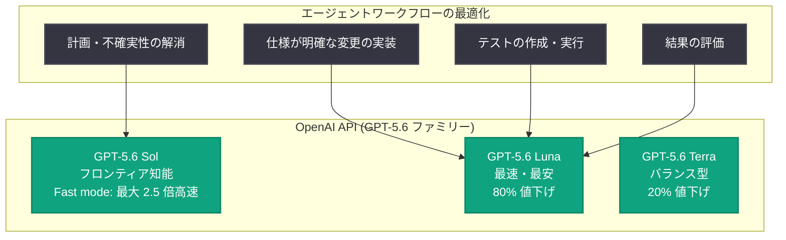

# GPT-5.6 で価格性能フロンティアを前進 — Luna 80%・Terra 20% の値下げと Fast mode の導入

## メタデータ

| 項目 | 内容 |
|------|------|
| 発表日 | 2026-07-30 |
| ソース | OpenAI News (Product) |
| カテゴリ | API 更新 / 料金改定 |
| 公式リンク | https://openai.com/index/advancing-the-price-performance-frontier-with-gpt-5-6 |

## 概要

OpenAI は 2026 年 7 月 30 日、GPT-5.6 ファミリーの大幅な料金改定を発表した。最速・最安モデルの GPT-5.6 Luna は 80% の値下げ、日常業務向けのバランス型モデル GPT-5.6 Terra は 20% の値下げとなる。前日に発表された「GPT-5.6 が自らの推論効率化に貢献した」という効率改善の成果を、そのまま顧客への価格引き下げとして還元する形だ。

あわせて、API に **Fast mode** が導入され、従来の Priority Processing を置き換える。GPT-5.6 Sol では、Fast mode により Standard 処理比で最大 2.5 倍の高速化を、知能の低下なしに 2 倍の価格で利用できる。これらの更新により、企業は AI への投資 1 ドルあたりの成果を高め、時間が重要な場面ではより速く動けるようになる。

## 主な内容

### 新しい API 料金 (2026 年 7 月 30 日から適用)

| モデル | 入力 (per 1M tokens) | 出力 (per 1M tokens) | 値下げ率 |
|--------|---------------------|---------------------|----------|
| GPT-5.6 Luna | $0.20 | $1.20 | 80% 引き下げ |
| GPT-5.6 Terra | $2.00 | $12.00 | 20% 引き下げ |
| GPT-5.6 Sol | 変更なし | 変更なし | — |

- 値下げは Codex および ChatGPT Work の有料サブスクリプションにおける使用量カウントにも反映される。サブスクリプション価格とクォータ予算は変更されず、Terra と Luna の利用が消費するクレジットが少なくなる
- 料金変更は同日中に AWS でも順次展開される

### Fast mode の導入 (Priority Processing の後継)

- GPT-5.6 Sol 向けの Fast mode は、Standard 処理比で**最大 2.5 倍の速度**を実現。価格は 2 倍で、知能の低下はない
- 後方互換性あり。`priority` タグ付きの既存 API リクエストは自動的に Fast mode を使用する
- Codex の `/fast` と整合する形で提供される

### 成果に合わせた知能の選択 (Matching intelligence to the outcome)

OpenAI は「AI を効率的に使うことは成果 (outcome) の定義から始まる」と述べている。リスクの大きさ、エラーのコスト、緊急性、規模によって、知能・速度・信頼性・コストの最適なバランスは決まり、そのバランスはワークフローのステップごとに変わり得る。

記事で示された Luna の価格性能に関する数値は以下の通り。

- Luna は 1 年前のフロンティア級モデルに匹敵する性能を、**タスクあたり約 6% のコスト (roughly 6 cents on the dollar)** かつ**約 9 倍の速度**で提供
- プロフェッショナル業務のベンチマーク Agents' Last Exam では、Luna は Fable 5 を上回りつつ、タスクあたりの推定コストは**約 99% 低い**

実務では、必要な成果と品質基準を定義した上で、評価 (evals) を使って「追加の知能が結果を実質的に改善する箇所」と「より速く低コストな処理で同じ品質を出せる箇所」を見極めることが推奨されている。例としてコーディングワークフローでは、Sol で不確実性を解消して計画を立て、Luna で仕様が明確な変更の実装・テストの作成と実行・結果の評価を行う、という分担が挙げられている。

### 効率フロンティアを前進させる仕組み

OpenAI の効率面での優位は、モデル本体、推論システム、そしてツールとコンテキストをつなぐエージェントハーネスの 3 層の改善から生まれている。

- GPT-5.6 モデルは作業に対してより直接的な経路をとる
- ルーティングの改善によりハードウェアの稼働率を維持
- 最適化された本番ソフトウェアがトークンをより効率的に生成
- スマートなコンテキスト管理により、エージェントが完了済みの作業を繰り返すことを回避

さらに、GPT-5.6 Sol 自身が次の効率改善の発見と実装を担い始めている。人間主導のプロセスの中で、Sol は本番カーネルを自律的に書き換えて最適化し、トークン生成を改善する数百の実験を設計・実行し、トレーニングを監視して問題発生時に介入した。カーネル最適化はモデル提供のエンドツーエンドコストを 20% 削減し、実験によりトークン生成効率は 15% 以上向上した。モデルが自律的に働けるほど効率改善が加速する、というフィードバックループが形成されつつある。

### スケールを前提としたコンピュート戦略

豊富な知能への需要に応えるには、より多くのコンピュートと、より生産的なコンピュートの両方が必要になる。OpenAI はレジリエントなインフラポートフォリオを構築し、各ワークロードを最適なシステムにマッチングさせている。

- **低コスト側**: Luna と Terra の新価格により、大規模ドキュメント分析、顧客対応の分類、定型的な実装作業といった大量処理が、はるかに大きなスケールで経済的に実行可能になる
- **フロンティア側**: Fast mode により、応答時間が重要な場面で Sol へのより高速なアクセスが可能になる

## アーキテクチャ

ワークフローのステップごとに最適なモデルを使い分ける例 (コーディングワークフロー)。



## 技術的な詳細

### 提供状況

- GPT-5.6 Terra と Luna は引き続き ChatGPT Work、Codex、OpenAI API で利用可能
- ChatGPT Work と Codex では、Free / Go ユーザーは Terra にアクセスでき、Plus / Pro / Business / Enterprise ユーザーは Terra と Luna を選択できる
- Fast mode は API で Priority Processing を置き換え、Codex の `/fast` と整合する。`priority` タグ付きの既存リクエストはそのまま動作する

### コードサンプル

```python
from openai import OpenAI

client = OpenAI()

# 大量処理には値下げされた Luna を使用
response = client.chat.completions.create(
    model="gpt-5.6-luna",
    messages=[
        {"role": "user", "content": "この顧客問い合わせを分類してください: ..."}
    ]
)
print(response.choices[0].message.content)

# 応答時間が重要な場面では Sol + Fast mode (旧 priority タグも自動対応)
response = client.chat.completions.create(
    model="gpt-5.6-sol",
    service_tier="priority",  # 自動的に Fast mode として処理される
    messages=[
        {"role": "user", "content": "この障害の根本原因を分析して修正計画を立ててください"}
    ]
)
```

注: 上記は記事の内容 (モデル名と priority タグの後方互換性) に基づく利用イメージ。正確なパラメータは公式ドキュメントを参照。

## 開発者への影響

- **大量処理の経済性が一変**: Luna の 80% 値下げ ($0.20 / $1.20 per 1M tokens) により、ドキュメント分析、分類、定型実装などの高ボリュームワークロードを大規模に運用することが現実的になる。ツール利用とマルチステップワークフローに対応するため、適用範囲は単純なテキスト処理にとどまらない
- **モデル使い分けの設計が重要に**: Sol で計画し Luna で実装するといった、ステップごとのモデルルーティング設計とその評価 (evals) が、コスト最適化の中心的なプラクティスになる
- **Priority Processing からの移行は自動**: Fast mode は後方互換であり、`priority` タグ付きの既存リクエストはコード変更なしで Fast mode として動作する
- **サブスクリプション利用者にも恩恵**: ChatGPT Work と Codex では、Terra / Luna の利用が消費するクレジットが減少し、同じクォータでより多くの作業が可能になる
- **AWS 経由の利用も対象**: 料金変更は AWS でも同日中に展開が始まる

## 関連リンク

- [発表記事 (原文)](https://openai.com/index/advancing-the-price-performance-frontier-with-gpt-5-6)
- [GPT-5.6 の発表](https://openai.com/index/gpt-5-6/)
- [GPT-5.6 のフロンティア知能と効率化 (エンジニアリング詳細)](https://openai.com/index/gpt-5-6-frontier-intelligence-efficiency/)
- [GPT-5.6 Luna モデルドキュメント](https://developers.openai.com/api/docs/models/gpt-5.6-luna)
- [GPT-5.6 Terra モデルドキュメント](https://developers.openai.com/api/docs/models/gpt-5.6-terra)
- [API 料金の詳細](https://openai.com/business/pricing/#api)

## まとめ

GPT-5.6 ファミリーの効率改善 (Sol 自身によるカーネル最適化でサービングコスト 20% 削減、トークン生成効率 15% 以上向上) が、Luna 80%・Terra 20% という大幅値下げとして顧客に還元された。Luna は $0.20 / $1.20 per 1M tokens という価格で、Agents' Last Exam では Fable 5 を約 99% 低い推定コストで上回るとされ、高品質な大量処理の経済性を大きく変える。あわせて導入された Fast mode は Priority Processing を後方互換の形で置き換え、Sol を最大 2.5 倍高速に利用可能にする。「価格性能フロンティア」の両端 (低コストの大量処理と高速なフロンティア知能) を同時に押し広げる発表であり、開発者にはワークフローのステップごとに最適なモデルを割り当てる設計と評価の実践が求められる。
