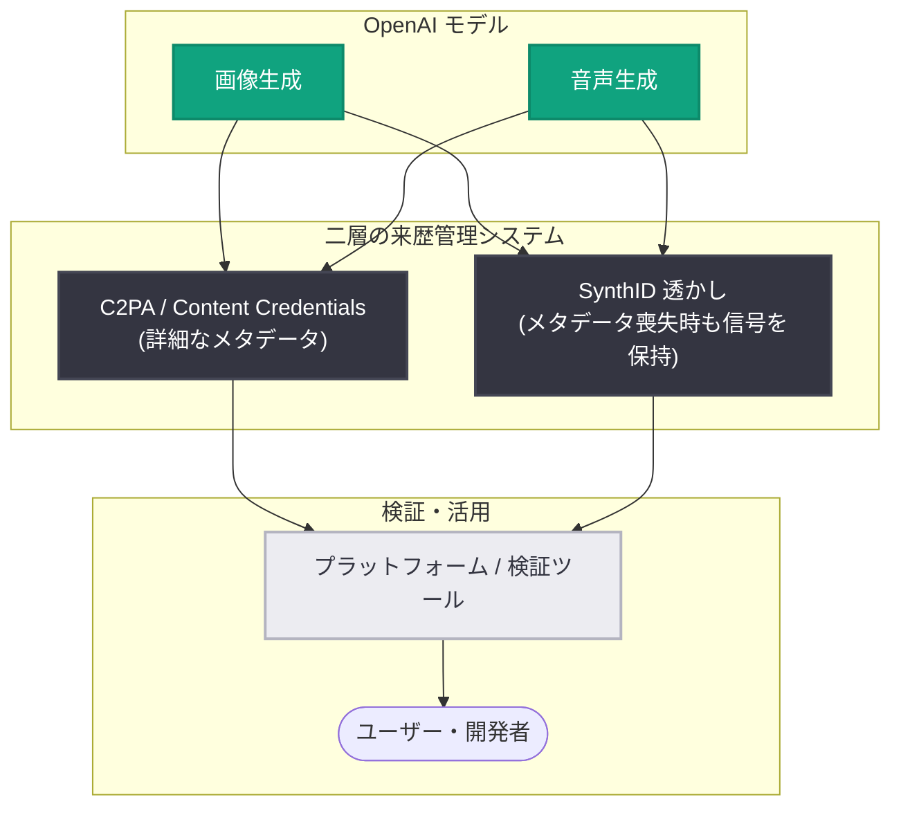

# 欧州における責任ある AI の推進: OpenAI の安全性・透明性・来歴管理への取り組み

## メタデータ

| 項目 | 内容 |
|------|------|
| 発表日 | 2026-07-31 |
| ソース | OpenAI News |
| カテゴリ | ポリシー / ガバナンス / 安全性 |
| 公式リンク | https://openai.com/index/advancing-responsible-ai-across-europe |

## 概要

OpenAI は、欧州における責任ある AI ガバナンスを支えるための包括的な取り組みを紹介する記事を公開した。欧州では数百万人のユーザーが学習・創作・仕事・日常業務に OpenAI のツールを利用しており、企業や政府機関の採用も進んでいる。EU AI Act (EU AI 規則) の施行が次の段階に入る中、OpenAI は安全性 (Safety)、セキュリティ (Security)、透明性 (Transparency)、来歴管理 (Provenance) の 4 領域における取り組みの強化を報告した。

記事では、EU の汎用 AI (GPAI) 行動規範への賛同、Preparedness Framework や Frontier Governance Framework といった安全性フレームワーク、C2PA と SynthID を組み合わせた二層の来歴管理システム、そしてサイバーセキュリティ分野での「OpenAI EU Cyber Action Plan」など、具体的な施策が示されている。

## 主な内容

### 1. 責任ある AI への長期的コミットメント

OpenAI は「AGI が全人類に利益をもたらすことを保証する」というミッションのもと、AI 規制は「実用的・比例的・リスクベース (pragmatic, proportionate and risk-based)」であるべきという立場を表明している。欧州における具体的な貢献として、以下の 2 つの行動規範に賛同・貢献している。

- **EU 汎用 AI (GPAI) 行動規範**: EU AI Act における汎用 AI モデル提供者の義務履行を支援する自主的枠組み
- **AI 生成コンテンツの透明性に関する行動規範**: AI 生成コンテンツの識別可能性を高めるための枠組み

### 2. 安全でセキュアな AI の構築・展開

OpenAI はモデルのリリース前に徹底的なテストを実施し、その結果を**システムカード**として公開している。安全性を支える主な仕組みは以下の通り。

| 仕組み | 内容 |
|--------|------|
| システムカード | モデルの能力・リスク評価・緩和策を文書化して公開 |
| Red Teaming Network | 外部専門家によるモデルの脆弱性・悪用可能性の検証 |
| Model Spec | モデルの望ましい挙動を定義する設計指針の公開 |
| Preparedness Framework | 高度 AI の重大リスクを特定・評価・管理する枠組み (2023 年導入、2025 年更新) |
| Frontier Governance Framework | 安全・セキュリティ実践と EU AI Act の GPAI 規範などの法的要件との整合を説明する枠組み |

外部連携としては、**Frontier Model Forum** への参画、米国 **CAISI** (Center for AI Standards and Innovation) および英国 **AISI** (AI Security Institute) との協力、第三者評価の受け入れなどを実施している。

### 3. 透明性と信頼の推進 (来歴管理)

AI 生成コンテンツの来歴 (provenance) を追跡可能にするため、OpenAI は二層のシステムを採用している。

- **C2PA (Content Credentials)**: コンテンツに詳細なコンテキスト情報をメタデータとして付与する業界標準
- **SynthID 透かし**: メタデータが失われた場合でもコンテンツ内に信号を保持する電子透かし技術

この二層アプローチは、メタデータの喪失やプラットフォーム間でラベルが伝わらないといった現実的な課題に対応するためのものであり、OpenAI は「多層的アプローチ (layered approach)」を支持している。適用範囲は画像に加えて**音声出力**へ拡大中であり、テキストを含むマルチモーダルへの拡張も、標準やツールの成熟に応じて進める方針が示された。

### 4. サイバーセキュリティにおける実践的ガバナンス

- **Trusted Access for Cyber (TAC) プログラム**: 悪用リスクを低減しつつ、正当な防御目的での AI 利用を支援するプログラム
- **OpenAI EU Cyber Action Plan**: 2026 年 5 月初旬に開始。EU および各国のサイバーセキュリティ機関、民間パートナー、重要インフラ事業者と協力する計画で、欧州委員会の「Action Plan on Cybersecurity and Artificial Intelligence」とも整合している

### 5. エコシステム全体との継続的な取り組み

EU AI Act の実施の進展に合わせ、OpenAI はコンプライアンス対応を継続的に強化する方針を示した。顧客・開発者向けには、モデル文書、システムカード、安全性情報、利用ポリシー、来歴・検証ツールのガイダンスといった実践的リソースを提供しており、EU AI Act への対応方針の詳細はヘルプセンターで公開されている。

## 開発者への影響

- **EU AI Act 対応の負担軽減**: OpenAI の GPAI 行動規範への賛同とコンプライアンス文書 (システムカード、Frontier Governance Framework など) により、OpenAI モデルを利用する開発者・企業が自社の EU AI Act 対応で参照できる資料が充実する
- **透明性義務への対応支援**: AI 生成コンテンツの表示義務に対して、C2PA メタデータや SynthID 透かしなどのシグナル・ツール・ガイダンスが提供され、開発者が自社サービスで透明性要件を満たしやすくなる
- **音声・マルチモーダルへの来歴管理拡大**: 画像に加えて音声出力にも来歴管理が拡大されるため、音声生成機能を組み込むアプリケーションでもコンテンツの真正性を示せるようになる
- **サイバーセキュリティ用途の明確化**: TAC プログラムにより、防御目的のセキュリティ用途での AI 活用の道筋が明確になる

## 関連リンク

- [Advancing responsible AI across Europe (公式記事)](https://openai.com/index/advancing-responsible-ai-across-europe)
- [EU AI Act - 欧州委員会 デジタル戦略](https://digital-strategy.ec.europa.eu/en/policies/regulatory-framework-ai)
- [汎用 AI 行動規範 (GPAI Code of Practice)](https://digital-strategy.ec.europa.eu/en/policies/contents-code-gpai)
- [OpenAI Model Spec](https://model-spec.openai.com/)
- [OpenAI Preparedness Framework](https://openai.com/preparedness/)
- [OpenAI Safety (デプロイの安全性)](https://openai.com/safety/)
- [C2PA (Coalition for Content Provenance and Authenticity)](https://c2pa.org/)
- [OpenAI ヘルプセンター: EU AI Act への対応](https://help.openai.com/en/articles/12141645)
- [OpenAI News](https://openai.com/news)

## まとめ

本記事は、EU AI Act の施行が進む中での OpenAI の欧州向けガバナンス方針を包括的に示したものである。ポイントは以下の 3 点に整理できる。

1. **規制との協調**: GPAI 行動規範と AI 生成コンテンツ透明性行動規範への賛同により、EU の規制枠組みと自社の安全性実践 (Preparedness Framework、Frontier Governance Framework) を整合させている
2. **技術による透明性**: C2PA と SynthID を組み合わせた二層の来歴管理システムを画像から音声、将来的にはマルチモーダルへと拡大し、AI 生成コンテンツの識別可能性を高めている
3. **実践的なセキュリティ協力**: TAC プログラムと OpenAI EU Cyber Action Plan を通じて、欧州のサイバーセキュリティ機関・重要インフラ事業者との連携を進めている

新機能や API の変更ではないが、EU 域内で OpenAI モデルを利用してサービスを提供する開発者・企業にとって、コンプライアンス対応の指針となる重要な発表である。
