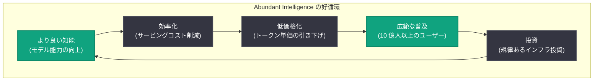

# Building abundant intelligence: 豊富な知能を実現するフルスタックアプローチ

## メタデータ

| 項目 | 内容 |
|------|------|
| 発表日 | 2026-07-31 |
| ソース | OpenAI News |
| カテゴリ | 公式発表 / 企業戦略 |
| 公式リンク | https://openai.com/index/building-abundant-intelligence |

## 概要

OpenAI は、高度な AI をより有能に、より低価格に、より広範に役立つものにするための「フルスタックアプローチ」を解説する記事を公開した。中心となるのは「abundance (豊富さ)」という概念であり、AGI が全人類に利益をもたらすという同社のミッションと、事業の経済エンジンの両方に組み込まれているとする。記事は「AI インフラは大きいから価値があるのではない」と明言し、インフラの価値は、より有能な知能をより多くの人に低コストで届けることにあると強調している。

本記事は、直近に発表された GPT-5.6 ファミリーの大幅値下げ、コンピュート効率化の成果、利用データ、そしてインフラ投資の規律を 1 つのストーリーとして統合するポジションペーパーであり、「より良い知能が普及を促し、普及がさらなる投資を支える」という好循環 (フライホイール) を軸に構成されている。

## 主な内容

### 1. 好循環のサイクル (フライホイール)

記事の核となるのは以下の循環構造である。

> "Better intelligence drives broader adoption. Broader adoption supports more investment."
> (より良い知能が普及を促し、普及がさらなる投資を支える)



### 2. 豊富さの経済学: 大幅な価格改定

記事は、2026 年 7 月 30 日に発表された GPT-5.6 ファミリーの価格改定を「abundance の経済学」の実例として位置づけている。

| モデル | 変更内容 | 入力価格 (100 万トークン) | 出力価格 (100 万トークン) |
|--------|----------|--------------------------|--------------------------|
| GPT-5.6 Luna | 80% 値下げ | $0.20 | $1.20 |
| GPT-5.6 Terra | 20% 値下げ | $2.00 | $12.00 |
| GPT-5.6 Sol (Fast モード) | 最大 2.5 倍の速度 | 標準の 2 倍の価格 | 標準の 2 倍の価格 (知能は同等) |

重要なのは、OpenAI が「顧客はトークンそのものを買っているのではない」と述べている点である。真に重要な指標はトークン単価ではなく、**成功した成果 (successful outcome) あたりのコスト**であるとし、価格戦略の評価軸を再定義している。

### 3. コンピュート効率化の成果

記事では、AI 自身がインフラ効率化に貢献しているという注目すべき事例が紹介されている。

- **GPT-5.6 Sol による自己改善**: GPT-5.6 Sol が自社のサービングソフトウェアの最適化を支援し、エンドツーエンドのサービングコストを **20% 削減**
- **投機的デコーディングの改善**: トークン生成効率が **15% 以上向上**
- **ARC-AGI-3 での効率改善**: モデル自体は変更せず、周辺システム (ハーネス設定) の改善のみで、公開タスクのスコアが **13.3% から 38.3%** に向上し、出力トークンは **6 分の 1** に削減

これらは「モデルの能力向上」だけでなく、「同じモデルからより多くの価値を引き出す」という効率化の方向性を示している。

### 4. フルスタックの利点と利用データ

OpenAI は、モデル開発からインフラ、製品までを一貫して手がけるフルスタック構造の利点を、以下の利用データで裏付けている。

- **10 億人以上**のアクティブユーザー、**200 万社以上**の企業が利用
- 登録 6 か月後、ユーザーは 1 日あたり約 **50% 多く**メッセージを送信し、約 **2 倍**の種類の作業に AI を利用
- OpenAI 社内では、Codex によるエージェント作業が週間出力トークンの **99.8%** を占める (財務部門も主要な利用チーム)
- ChatGPT Work は「尋ねる (asking)」から「実行する (doing)」への移行を体現

### 5. インフラ投資の規律

記事は、インフラ投資について「単なる計算力増強や、より大きなモデル、より低いトークン価格が目標ではない」と述べ、以下の規律を示している。

- **投資判断の根拠**: ユーザー・ワークロードの成長、企業契約、API 消費量、稼働率、収益、モデルの能力・効率の進歩
- **資金源**: 製品収益、民間資本、商業パートナーシップ
- **調達の柔軟性**: 所有・提携・購入を状況に応じて選択
- **目標**: "the right capacity, at the right time, against credible demand" (確実な需要に対して、適切な容量を適切な時期に)

なお、本記事にはギガワット単位のデータセンター容量や具体的な投資額 (ドル) は記載されておらず、定性的な投資方針のみが言及されている。

## 技術的な詳細

本記事自体は戦略的なポジションペーパーであり、新しい API や機能の発表は含まれない。ただし、言及されている GPT-5.6 ファミリーの価格改定と Fast モードは API に直接反映されている。

### コードサンプル (値下げされた GPT-5.6 Luna の利用例)

```python
from openai import OpenAI

client = OpenAI()

# GPT-5.6 Luna: 入力 $0.20 / 出力 $1.20 (100 万トークンあたり、80% 値下げ後)
response = client.chat.completions.create(
    model="gpt-5.6-luna",
    messages=[
        {"role": "user", "content": "大量のドキュメントを要約してください。"}
    ]
)
print(response.choices[0].message.content)
```

## 開発者への影響

- **コスト構造の大幅な改善**: GPT-5.6 Luna の 80% 値下げにより、大量トークンを消費するワークロード (要約、分類、エージェントの中間推論など) のコストが劇的に低下し、これまで採算が合わなかったユースケースが現実的になる
- **評価指標の転換**: OpenAI が「成功した成果あたりのコスト」を重視する方針を明示したことで、開発者もトークン単価ではなくタスク完了率とトータルコストで最適化する設計が推奨される
- **ハーネス設計の重要性**: ARC-AGI-3 の事例 (モデル不変でスコア約 3 倍、トークン 6 分の 1) は、モデル選定と同等以上に、プロンプト・設定・周辺システムの調整が性能とコストを左右することを示している
- **エージェント活用の加速**: Codex が OpenAI 社内の出力トークンの 99.8% を占めるという事実は、エージェントワークロードが今後の主流になることを示唆しており、エージェント前提のアーキテクチャ設計が重要になる
- **長期的な価格低下トレンド**: 「abundance」が事業戦略の中核である以上、今後も継続的な値下げと効率化が期待でき、長期プロジェクトのコスト見積もりに織り込める

## 関連リンク

- [Building abundant intelligence (原文)](https://openai.com/index/building-abundant-intelligence)
- [Advancing the price-performance frontier with GPT-5.6 (価格改定の発表)](https://openai.com/index/advancing-the-price-performance-frontier-with-gpt-5-6/)
- [GPT-5.6: Frontier intelligence, efficiency (効率化エンジニアリング)](https://openai.com/index/gpt-5-6-frontier-intelligence-efficiency/)
- [How two settings tripled our ARC-AGI-3 scores (ARC-AGI-3 分析)](https://openai.com/index/how-two-settings-tripled-our-arc-agi-3-scores/)
- [OpenAI 公式ドキュメント](https://platform.openai.com/docs)
- [OpenAI API 料金ページ](https://openai.com/api/pricing/)
- [OpenAI News](https://openai.com/news)

## まとめ

「Building abundant intelligence」は、OpenAI の事業戦略を「豊富さ (abundance)」という 1 つの概念に集約した記事である。GPT-5.6 Luna の 80% 値下げ、AI 自身によるサービングコスト 20% 削減、10 億人以上のユーザー基盤といった具体的な成果を、「より良い知能 → 広範な普及 → さらなる投資」という好循環の証拠として提示している。開発者にとっては、大幅な価格低下による新ユースケースの開拓と、「成功した成果あたりのコスト」という新しい最適化軸への転換が最大のポイントとなる。
