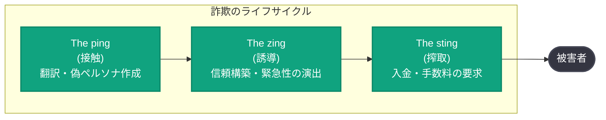
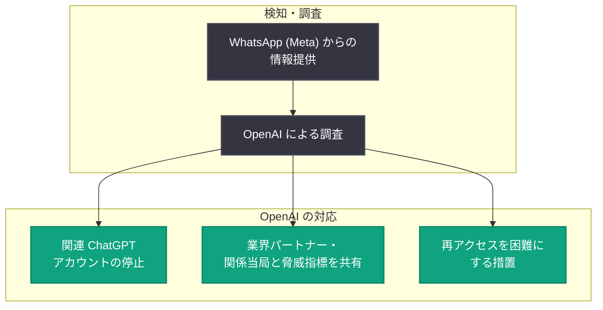

# 犯罪的詐欺組織の摘発: カンボジア拠点の詐欺ネットワークによる ChatGPT 悪用を阻止

## メタデータ

| 項目 | 内容 |
|------|------|
| 発表日 | 2026-07-31 |
| ソース | OpenAI News |
| カテゴリ | 安全性 / 脅威インテリジェンス |
| 公式リンク | https://openai.com/index/disrupting-malicious-uses-of-ai-criminal-scam-operation |

## 概要

OpenAI は、カンボジアを拠点とする組織的な犯罪詐欺グループが ChatGPT を悪用していた活動を特定し、阻止したことを発表した。この組織は投資詐欺 (暗号資産・スポット金取引)、ロマンス詐欺、ギャンブル詐欺、法執行機関のなりすましなど、複数の詐欺スキームを同時に運用しており、調査は WhatsApp (Meta) からの情報提供を発端として開始された。

本件で特に注目されるのは、詐欺活動そのものへの AI の悪用に加えて、組織の内部業務 (採用、労働管理、従業員懲戒など) にも ChatGPT が利用されていた点である。それらの記録からは人身売買を示唆する兆候も確認されており、オンライン詐欺・組織犯罪・人身売買の境界が曖昧になっている実態が浮き彫りになった。

## 主な内容

### 詐欺組織の概要

摘発された組織はカンボジアを拠点とし、単一の詐欺に限定せず、以下の複数の手口を機会主義的に組み合わせて運用していた。

- **投資詐欺**: 暗号資産やスポット金取引を装った偽の投資勧誘
- **ロマンス詐欺**: 恋愛感情を利用した金銭搾取
- **ギャンブル詐欺**: 偽のボーナスや偽の当選金による誘導
- **法執行機関のなりすまし**: 架空の罰金の支払い要求

### 詐欺の 3 段階の手口

記事では、詐欺のライフサイクルを 3 段階に整理している。

1. **The ping (接触)**: WhatsApp や Telegram でのメッセージの翻訳・生成、偽ペルソナ用の SNS コンテンツ作成、デート用プロフィールの調査
2. **The zing (誘導)**: 感情的な圧力と信頼構築。「保証されたリターン」や「リスクフリー」の投資の約束、恋愛的な言葉の使用、会話の秘密保持の指示、期限付きボーナスによる緊急性の演出
3. **The sting (搾取)**: 報酬解除のための入金、有効化手数料、架空の罰金の支払いを指示し、送金スクリーンショットや口座情報の提出を要求

### AI の具体的な悪用方法

組織は ChatGPT を以下の用途に悪用していた。

- **偽ペルソナの作成・運用**: デートプロフィール、架空の投資専門家、偽の警察官
- **偽造文書の画像生成**: パスポート、法的通知、株式購入確認書、ギャンブルプラットフォームの UI、偽の暗号資産取引画面
- **宣伝コンテンツ**: 詐欺スキームを宣伝するコンテンツの作成
- **内部業務**: 社内告知の起草、スタッフ間メッセージの翻訳、採用・在留資格・労働条件・従業員懲戒に関する文書化

### 人身売買の兆候

組織の内部業務での利用記録からは、以下のような人身売買を示唆する兆候が確認された。

- ポイペト (Poipet) での「chatter」職の求人広告作成 (航空券、宿泊、食事、ビザ、労働許可を約束)
- 従業員の債務、給与控除、懲戒罰金、ローン返済の記録管理
- 在留資格、労働許可、ビザの超過滞在、採用インセンティブに関する議論の翻訳
- 拘束、脱走の試み、人身売買被害者の刑事責任に言及する会話

これらは Wall Street Journal や Amnesty International の報告と整合的であり、詐欺の実行者自身が搾取の被害者である可能性が指摘されている。

### OpenAI の対応

- 関連する ChatGPT アカウントを停止 (BAN)
- 業界パートナーおよび関係当局と脅威指標 (threat indicators) を共有
- 攻撃者がサービスへ再アクセスすることを困難にする措置を実施

### 被害規模

被害総額は不明だが、詐欺師自身の通信によれば数百人のターゲットと接触した可能性があり、個々の被害者が数千ドルを失ったとの言及も確認されている (独立した検証は不可)。

## 記事が強調する 2 つのトレンド

1. **詐欺ネットワークの多角化**: 組織的詐欺ネットワークは高度に多角化しており、複数の詐欺スキームを同時に運用する
2. **犯罪の境界の曖昧化**: オンライン詐欺、組織犯罪、人身売買の境界は曖昧であり、被害者に向けられた詐欺活動だけでなく、それを組織し利益を得る犯罪組織自体を標的とする必要がある

## 開発者・ユーザーへの影響

- **一般ユーザー**: 「保証されたリターン」「リスクフリー投資」「会話の秘密保持の要求」「期限付きボーナス」といった典型的な詐欺のシグナルを認識することが自衛につながる
- **プラットフォーム事業者**: WhatsApp (Meta) からの情報提供が調査の発端になったように、業界間での脅威インテリジェンス共有が悪用阻止に有効であることが示された
- **AI 開発者**: AI の悪用は詐欺の実行 (コンテンツ生成) だけでなく、犯罪組織の運営業務 (翻訳、文書化、管理) にも及ぶため、悪用検知は幅広い利用パターンを対象とする必要がある

## 関連リンク

- [公式発表: Disrupting a Criminal Scam Operation](https://openai.com/index/disrupting-malicious-uses-of-ai-criminal-scam-operation)
- [OpenAI: Disrupting Malicious Uses of AI (脅威インテリジェンスレポート)](https://openai.com/global-affairs/disrupting-malicious-uses-of-ai/)
- [OpenAI Usage Policies](https://openai.com/policies/usage-policies/)
- [OpenAI Safety](https://openai.com/safety/)
- [OpenAI News](https://openai.com/news)

## まとめ

OpenAI は WhatsApp (Meta) からの情報提供をきっかけに、カンボジア拠点の犯罪詐欺組織による ChatGPT の悪用を特定し、アカウント停止、脅威指標の共有、再アクセス防止措置を実施した。この組織は投資・ロマンス・ギャンブル詐欺や法執行機関のなりすましを「ping → zing → sting」の 3 段階で展開し、偽ペルソナや偽造文書の生成に AI を悪用していた。さらに、組織内部の労務管理記録からは人身売買を示唆する兆候も確認され、オンライン詐欺と組織犯罪・人身売買の境界の曖昧化という重要なトレンドが示された。本件は、AI プラットフォーム事業者間の協力と脅威インテリジェンス共有が犯罪組織の摘発に有効であることを示す事例である。
