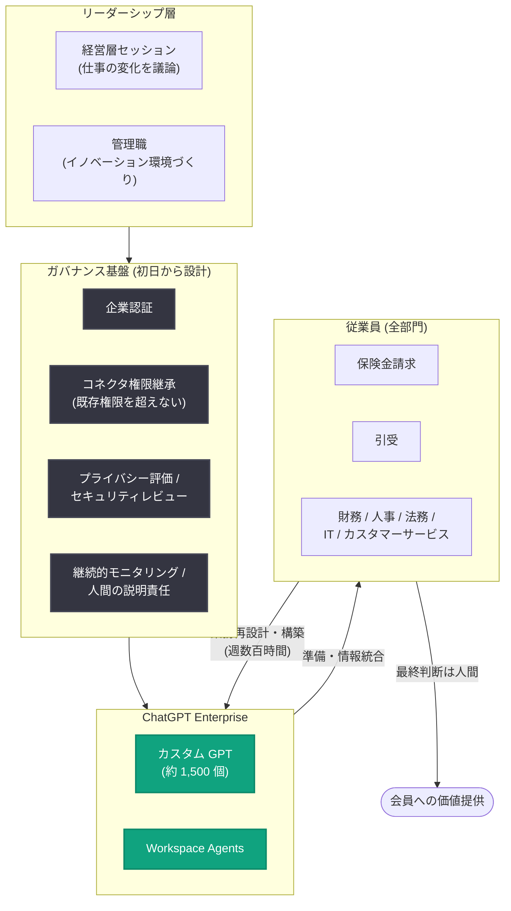

# Univé が AI 対応の人材を育成: ChatGPT Enterprise によるリーダーシップとガバナンスの融合

## メタデータ

| 項目 | 内容 |
|------|------|
| 発表日 | 2026-07-31 |
| ソース | OpenAI News |
| カテゴリ | 導入事例 (ChatGPT Enterprise) |
| 公式リンク | https://openai.com/index/unive |

## 概要

オランダ最大級の協同組合型保険会社 Univé が、ChatGPT Enterprise を活用して「AI 対応の人材 (AI-ready workforce)」を組織全体で育成した事例が公開された。Univé は保険・住宅ローン・金融サービス・リスク予防を通じて数百万の会員にサービスを提供しており、「問題が起こる前に防ぐ」ことを使命としている。

本事例の特徴は、AI を単なる IT ツールの導入ではなく組織全体の変革と位置づけた点にある。経営層へのリーダーシップ投資と、展開初日から設計に組み込まれたガバナンスを両輪とし、ライセンスの 97% が有効化、保有者の 85% が毎週アクティブ、約 1,500 個のカスタム GPT が社員によって作成されるという高い定着率を実現した。

## 主な内容

### AI を「組織能力」として構築するアプローチ

Univé は AI 導入の目的を「ツールの展開」ではなく「全社員が AI を安全・責任ある形で効果的に使える組織能力の構築」と定義した。ChatGPT Enterprise は、同社のガバナンス枠組みの中で迅速に採用できる安全なプラットフォームとして選定された。

Data & AI ディレクターの Yous van Halder 氏は次のように述べている。

> "Most organisations try to scale AI by building more solutions. We chose to scale AI by creating more builders."
> (多くの組織はソリューションを増やすことで AI をスケールさせようとするが、我々はビルダーを増やすことで AI をスケールさせる道を選んだ)

### リーダーシップへの投資

- 経営層全体を集めた AI リーダーシップセッションを開催
- 内容は製品デモではなく「仕事そのものがどう変わるか」を考えさせるもの
- 管理職の役割を「AI 施策の承認者」から「責任あるイノベーションの環境づくりの担い手」へ転換

### ガバナンスを「加速装置」として設計

ガバナンスは後付けではなく、展開初日から設計に組み込まれた。

| 要素 | 内容 |
|------|------|
| 認証 | 企業認証 (エンタープライズ SSO) |
| アクセス制御 | コネクタの権限継承。AI のアクセス権限は基幹システムの権限に従い、社員の既存権限を超えない |
| 評価 | プライバシー評価とセキュリティレビュー |
| 運用 | 継続的モニタリングと明確な人間の説明責任 |

この設計により、ガバナンスを「障壁ではなくイノベーションの加速装置」として機能させた。

### 従業員主導の展開

- 詳細な事業計画書を求めず、社員に「許可・仕組み・専用時間」を付与
- 社員は毎週合計数百時間をかけて業務の再設計、カスタム GPT の構築、Workspace Agents の実験、ノウハウ共有を実施
- 保険金請求、引受、財務、人事、法務、IT、カスタマーサービスなど、ほぼ全部門で活用

## 具体的なユースケース

### ペット保険の請求処理

Workspace Agent が以下を担当し、従来数時間かかった準備作業が数分で完了するようになった。

1. 請求書類の収集
2. 獣医請求書の確認
3. 契約条件との照合
4. 不足情報の特定
5. 異常検知
6. 追跡可能な推奨案の作成

ただし、最終判断は必ず訓練を受けた担当者が行い、完全な責任を負う体制を維持している。

### 引受 (アンダーライティング) 業務

始業前にエージェントが作業キューを整理し、承認済みの社内情報源からデータを統合、不足書類やリスク指標を提示する。これにより引受担当者は情報収集ではなく「判断」に集中できるようになった。

## アーキテクチャ

## 主な成果 (数値)

| 指標 | 数値 |
|------|------|
| ライセンス有効化率 | 97% |
| 週次アクティブ率 (ライセンス保有者) | 85% |
| アクティブユーザーあたりの週平均プロンプト数 | 40 |
| 社員が作成したカスタム GPT | 約 1,500 個 |

社内の議論は「AI を使うべきか」から「次に何を作るか」へと移行した。

## 企業・組織への影響

本事例は、規制の厳しい金融・保険業界においても、ガバナンスと従業員主導の展開を両立できることを示している。

- **ガバナンスは加速装置になり得る**: 権限継承やレビュー体制を初日から組み込むことで、安全性を担保しつつ迅速な展開が可能
- **ビルダーの育成がスケールの鍵**: 中央集権的にソリューションを増やすのではなく、社員自身が構築者となることで持続的な採用を実現
- **人間の判断を中心に据えた設計**: エージェントは準備・情報統合を担い、最終判断と責任は人間が保持する
- **成功指標の再定義**: 生産性だけでなく、持続的な採用率と社員の能力で成功を測定

van Halder 氏は「AI will not replace your employees. (AI が社員を置き換えることはない)」と述べ、AI と共に構築する社員こそが組織の可能性を再定義すると強調している。

## 今後の計画

- 現在のプロンプト中心の活用から、AI が定型業務を先回りして準備し、承認済みシステムを横断して協働する「エージェント型ワークフロー」への進化を想定
- 目標は AI 採用の拡大自体ではなく、AI が業務の不可欠な一部となる新しいオペレーティングモデルの構築
- サービスの質と利便性の向上、会員価値の創出、予防の強化、人間の判断が重要な領域への専門家の集中を目指す
- 競争優位は AI の利用そのものではなく、協同組合としての使命の遂行から生まれるとしている

## 関連リンク

- [Univé builds an AI-ready workforce (公式記事)](https://openai.com/index/unive)
- [ChatGPT Enterprise](https://openai.com/chatgpt/enterprise/)
- [ChatGPT Enterprise ヘルプセンター](https://help.openai.com/en/collections/5688074-chatgpt-enterprise)
- [OpenAI News](https://openai.com/news)
- [OpenAI ビジネス向け事例](https://openai.com/stories/)

## まとめ

Univé の事例は、「ソリューションを増やす」のではなく「ビルダーを増やす」という発想で AI をスケールさせた点が最大の特徴である。経営層へのリーダーシップ投資、初日から組み込まれたガバナンス、そして社員への許可・時間・仕組みの付与という 3 つの柱により、ライセンス有効化率 97%、週次アクティブ率 85% という高い定着率と約 1,500 個のカスタム GPT 作成を実現した。規制産業における ChatGPT Enterprise 導入のリファレンスモデルとなる事例である。
