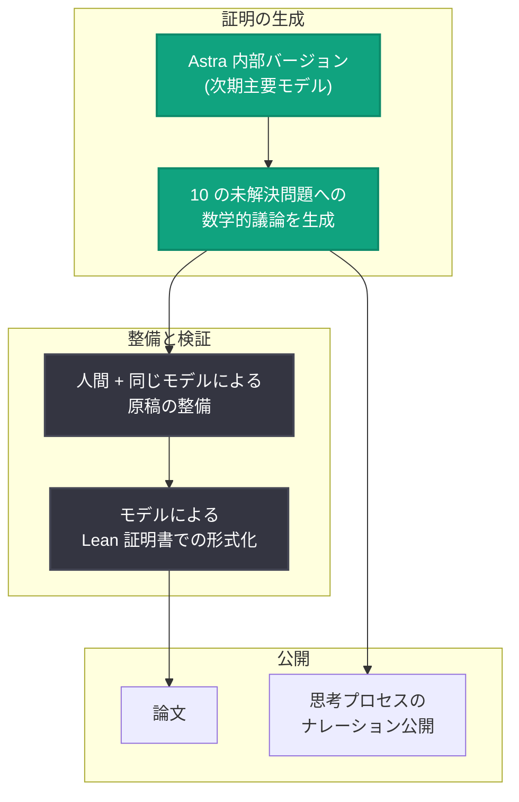

# Ten advances in mathematics and theoretical computer science: 数学・理論計算機科学における 10 の進展

## メタデータ

| 項目 | 内容 |
|------|------|
| 発表日 | 2026-08-01 |
| ソース | OpenAI Research |
| カテゴリ | 研究成果 (Publication) |
| 公式リンク | https://openai.com/index/ten-advances-in-mathematics |

## 概要

OpenAI は、数学および理論計算機科学における長年の未解決問題に対する 10 の新しい結果を発表した。対象となった問題はいずれも、主要な結果について少なくとも 10 年間 (多くはそれ以上) 進展がなかったものであり、高次元幾何学、符号理論、算術回路計算量、群論、作用素環論、量子計算量、格子暗号、極値組合せ論という幅広い分野にまたがる。

これらの結果は、OpenAI の次期主要モデルである **Astra の内部バージョン**によって達成された。全問題の解を発見するのに要したトークン総量は、Sol API 料金換算で約 **2,000 ドル**に相当するという。証明の数学的な議論はモデルが生成し、人間が同じモデルを使って原稿を整備した後、モデル自身が各証明を **Lean 証明書**として形式化した。各解答について、モデルの思考プロセスのナレーション (reasoning walkthrough) も併せて公開されている。

## 主な内容

### 背景: 数学コミュニティ支援の取り組み

OpenAI は、科学者や数学者の発見を加速するツールの提供を目指しており、10 万人の科学者・数学者に最高性能の ChatGPT モデルへの無料アクセスを提供する「ChatGPT for Academic Researchers」イニシアチブを最近発表している。また、モデル開発中に未解決の研究問題での評価を継続している。

2026 年 5 月には、未公開モデルの評価中に発見された Erdős の単位距離予想 (unit-distance conjecture) の AI による反証を公開しており、この成果はすでに後続研究を生んでいる。記事の脚注では、実数上の sum-product 予想の反証 (Bloom, Sawin, Schildkraut, Zhelezov) など 5 件の後続論文が挙げられている。

### 10 の結果

| # | 問題 | 結果 |
|---|------|------|
| 1 | 高次元球充填 (High-dimensional sphere packing) | 球充填密度の新しい上界。Cohn–Elkies 閾値まで到達 |
| 2 | 二元符号・球面符号 (Binary and spherical codes) | 任意の最小距離における二元符号の最大サイズの指数的に改善された上界。高次元球面符号でも同様の結果 |
| 3 | 非 sofic 群 (Non-sofic groups) | 非 sofic 群の存在を確立する構成。群論の中心的な未解決問題に解答 |
| 4 | Connes の剛性予想 (Connes's rigidity conjecture) | 特定の群がその von Neumann 環によって一意に決定されるという長年の予想の反証 |
| 5 | 算術回路計算量 (Arithmetic circuit complexity) | パーマネント計算の算術回路・算術式に対する新しい下界。算術式については n^4/log n オーダーの下界 |
| 6 | 量子並列反復 (Quantum parallel repetition) | 一般の 2 プレイヤー量子ゲームに対する指数的並列反復定理。古典計算量理論の基礎原理を量子へ拡張 |
| 7 | 最近ベクトル問題 (Closest vector problem) | 近似困難性の多項式因子までの証明。ポスト量子暗号に関連する格子問題の基礎的課題 |
| 8 | Ehrhart の体積予想 (Ehrhart's volume conjecture) | 重心が唯一の内部格子点である凸体の最大体積を、すべての次元で決定 |
| 9 | 多色 Ramsey 数 (Multicolor Ramsey numbers) | 多色三角形 Ramsey 数の超指数的下界。Erdős 問題 183 を解決 |
| 10 | 極値数予想 (Extremal number conjectures) | 極値グラフ理論のコンパクト性予想・退化性予想に関する結果。Erdős 問題 146 と 180 を解決 |

### 結果生成のワークフロー

証明の生成から検証・公開までのプロセスは以下の通りである。

注目すべきは、証明の正しさを人間のレビューだけに頼らず、Lean による機械検証可能な証明書で担保している点である。これにより、AI が生成した証明の信頼性に関する懸念に正面から対処している。

### 数学コミュニティへの責任

OpenAI は、数学研究に貢献できるシステムの出現が「テクノロジー企業だけでは答えられない問い」を提起すると認めている。AI の数学への影響を懸念する立場 (Leiden declaration on AI and Mathematics の署名者を含む) への敬意を明示した上で、以下の立場を表明している。

- **帰属の誠実さ**: AI システムが完全に生成した証明に人間の著者性を主張することは、システムの貢献と人間の知的作業の本質の双方を誤って伝えることになる
- **責任の所在**: 原稿の整備と Lean での形式化は OpenAI が支援し、正しさに責任を負うが、数学的議論そのものはシステムが生成した
- **コミュニティへの期待**: 数学コミュニティがこれらの結果に深く関与し、文脈の中に位置づけ、その背後にあるアイデアを新しい研究と発見につなげることを期待する

また、AI システムがより高度な研究協力者へと進化する中で、科学者・数学者への広範なアクセス提供が基本的に重要であると強調している。

## 技術的な詳細

本発表は研究成果の公開であり、新しい API や製品機能の発表は含まれない。ただし、以下の技術的示唆がある。

- **Astra**: OpenAI の「次期主要モデル」として初めて名前が言及された。内部バージョンでの評価段階にある
- **コスト効率**: 10 の未解決問題の解の発見に要したトークンは Sol API 料金で約 2,000 ドル相当。フロンティア数学研究がこのコスト水準で実行可能であることを示した
- **形式検証パイプライン**: 自然言語の証明生成から Lean 証明書による形式化までをモデル自身が実行しており、AI 生成証明の検証フローとして確立されつつある

## 研究者・開発者への影響

- **未解決問題への AI 適用の実証**: 10 年以上進展のなかった問題群を 1 つのモデルが横断的に解決したことは、AI が数学研究の実用的な協力者になったことを示す。数学・理論計算機科学の研究者は、自分野の未解決問題への AI 適用を現実的な選択肢として検討できる
- **検証可能性の標準化**: Lean 証明書と思考プロセスのナレーションを併せて公開するスタイルは、AI 生成の研究成果に対する透明性・検証可能性の事実上の標準になり得る
- **低コストでの研究加速**: 約 2,000 ドル相当のトークンでこれらの成果が得られたことは、研究機関にとって計算予算の観点から AI 活用の障壁が低いことを意味する
- **暗号分野への波及**: 最近ベクトル問題の近似困難性の結果はポスト量子暗号の安全性の理論的基盤に関わるものであり、格子ベース暗号の研究者・実装者は内容の精査が推奨される
- **著者性・帰属の議論**: AI 生成証明の著者性に関する OpenAI の立場表明は、学術出版・研究評価における AI の扱いの議論を加速させる。論文投稿や業績評価のポリシー整備が各機関で必要になる

## 関連リンク

- [Ten advances in mathematics and theoretical computer science (原文)](https://openai.com/index/ten-advances-in-mathematics)
- [OpenAI Research](https://openai.com/research)
- [Lean (定理証明支援系)](https://lean-lang.org/)
- [OpenAI News](https://openai.com/news)

## まとめ

OpenAI は次期主要モデル Astra の内部バージョンを用いて、球充填、符号理論、非 sofic 群、Connes 剛性予想、算術回路計算量、量子並列反復、最近ベクトル問題、Ehrhart 体積予想、多色 Ramsey 数、極値数予想という 10 の長年の未解決問題に新しい結果をもたらした。解の発見コストは Sol API 換算で約 2,000 ドル相当と低く、すべての証明は Lean 証明書で形式化され、思考プロセスも公開されている。同時に、AI 生成証明の帰属を誠実に扱うという立場を表明し、数学コミュニティとの協働を呼びかけた。AI が数学研究の実質的な協力者となったことを示す画期的な発表である。
