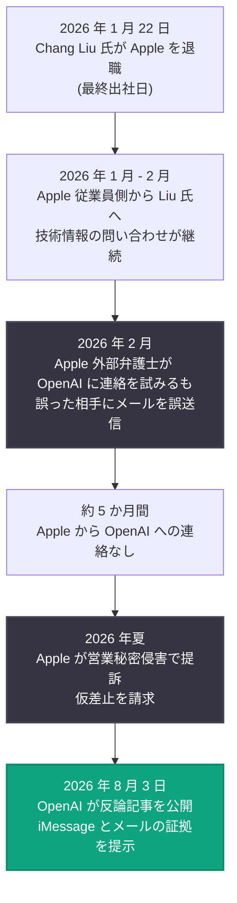

# Apple is getting this wrong: Apple の訴訟に対する OpenAI の公式反論

## メタデータ

| 項目 | 内容 |
|------|------|
| 発表日 | 2026-08-03 |
| ソース | OpenAI News |
| カテゴリ | 法務 / 企業ニュース |
| 公式リンク | https://openai.com/index/apple-is-getting-this-wrong |

## 概要

OpenAI は 2026 年 8 月 3 日、Apple が同社に対して提起した営業秘密 (trade secrets) をめぐる訴訟への公式反論「Apple is getting this wrong」を公開した。OpenAI は Apple の訴訟を「careless, aggressive and oddly personal (杜撰で攻撃的、そして奇妙に個人攻撃的)」と評し、細部へのこだわりで知られる Apple の評判にふさわしくないものだと批判している。

本記事の特徴は、単なる声明にとどまらず、Apple 側の主張の誤りを裏付ける証拠として、元 Apple 従業員と Apple 側従業員との間で交わされた iMessage のやり取りや、Apple の外部弁護士による誤送信メールを実際に公開した点にある。OpenAI は「Apple の営業秘密を保有しておらず、必要ともしていない」と主張し、仮差止請求は誤った情報に基づく不要なものだと反論した。

## 主な内容

### 訴訟前のやり取りに関する反論

OpenAI は、Apple が主張する「提訴前の誠実な協議」の経緯に事実誤認があると指摘している。

- **誤送信の問題**: Apple は 2026 年 2 月に OpenAI へ連絡したが返答がなかったと主張していた。しかし実際には、Apple の外部弁護士がアジア系の姓を混同し、誤った相手にメールを送信していた。この事実は OpenAI の指摘後に Apple 側が認めた
- **存在しなかった協議**: Apple は OpenAI の法務責任者 (General Counsel) と協議したと主張していたが、その会話は存在しなかったことも Apple 側が認めた
- **5 か月間の沈黙**: Apple 側は当時「問題は解決中 (resolving any issues)」と伝えており、具体的な申し立ては一度も提起されないまま、その後 5 か月間連絡がなく提訴に至ったと OpenAI は主張している

記事末尾には、Apple の外部弁護士 Gabriel Gross 氏が OpenAI の Che Chang 氏に宛てて誤送信し、実際には存在しなかった会話があったと不正確に主張したことを示すメールが証拠として公開されている。

### Chang Liu 氏に関する主張への反論

Apple は、元従業員の Chang Liu 氏が退職後に Apple の機密情報へアクセスしたと非難している。これに対し OpenAI は以下のように反論した。

- 実際には Apple 側の従業員が Liu 氏に連絡し、情報の所在特定への協力を求めていた
- Apple が問題視する「残存アクセス (residual access)」は、退職時のシステムアクセス管理を Apple 自身が適切に行っていないことに起因する、業界共通の問題である

### 公開された iMessage の内容

OpenAI は、Liu 氏 (最終出社日 2026 年 1 月 22 日) と Apple 従業員との間のメッセージを公開した。主なやり取りには以下が含まれる。

- Apple 従業員が Liu 氏のファイル転送を手伝い、64 GB ドライブを用意したり、AirDrop でのコピーを繰り返し試みる様子
- 退職後も Apple 従業員側から製品出荷計画や技術的な詳細について質問し、Liu 氏が回答する場面 (該当箇所の多くは「Redacted - Apple Information」として黒塗り)
- Apple 従業員が Liu 氏の iCloud にサインインしたままにしており、後日ログアウトした際に「I said NO」(コピーを保持しない選択をした) と報告した記録
- 2 月 14 日にも Apple 従業員側から技術情報の確認や担当者の紹介を求める連絡が続いていた記録

これらの証拠により、OpenAI は「機密情報へのアクセスを試みたのは Liu 氏ではなく、むしろ Apple 側から接触が続いていた」という構図を示そうとしている。

### Tang Tan 氏に関する主張への反論

Apple は、元幹部の Tang Tan 氏が営業秘密の取得・使用を試みたと非難している。これに対し OpenAI は以下のように反論した。

- Tan 氏はチームに対し、他社の機密情報を求めない・使用しないよう一貫して明確に指示してきた
- 同氏は 24 年以上 Apple に勤務し、最も革新的なリーダーの一人として知られていた人物である

### OpenAI の結論

- 提訴前に問題提起があれば喜んで説明したはずであり、申し立てを真摯に受け止めて解決に向けた協力を申し出た
- Apple の仮差止請求 (preliminary injunction) は誤った情報に基づくものであり、OpenAI は Apple の営業秘密を保有も希望もしていないため不要である
- OpenAI は今後も革新的な製品と技術の開発に注力する

## 経緯のタイムライン

## 開発者・ユーザーへの影響

本件は法務・企業間紛争であり、API や製品仕様への直接的な影響はない。ただし、以下の間接的な影響が考えられる。

- **ハードウェア開発への注目**: 本訴訟は Apple 出身者が関わる OpenAI のハードウェア開発体制をめぐるものであり、訴訟の帰趨によっては OpenAI のデバイス関連プロジェクトの進行に影響が及ぶ可能性がある
- **人材移動をめぐる業界慣行**: 「残存アクセス」問題や退職時のオフボーディング管理など、AI 業界における人材移動と情報管理の実務に議論を促す可能性がある
- **仮差止の行方**: 仮差止が認められた場合、OpenAI の特定プロジェクトの一時停止などが生じ得るが、OpenAI は請求自体が不要であると反論している
- **企業間関係の変化**: Apple と OpenAI はこれまで ChatGPT の Apple Intelligence 統合などで協力関係にあったため、両社の関係悪化がエコシステム連携に波及するかが注目される

## 関連リンク

- [Apple is getting this wrong (OpenAI 公式)](https://openai.com/index/apple-is-getting-this-wrong)
- [OpenAI News](https://openai.com/news)
- [OpenAI 公式サイト](https://openai.com)

## まとめ

OpenAI は Apple の営業秘密訴訟に対し、異例の証拠公開を伴う強い反論を行った。Apple 側の主張の根幹をなす「提訴前の協議」や「元従業員による不正アクセス」について、誤送信メールや iMessage の記録を提示して事実誤認を指摘し、「Apple の営業秘密を保有も希望もしていない」と明言した。訴訟自体は係属中であり、仮差止請求の判断と両社の関係の行方が今後の焦点となる。
