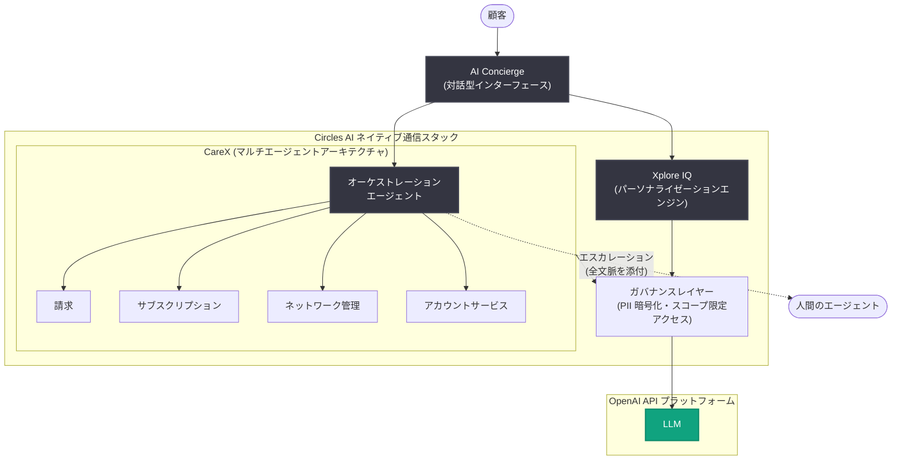

# Circles、OpenAI 技術で通信事業のパーソナライゼーションを実現 — ARPU 22% 向上・解約率 9% 削減

## メタデータ

| 項目 | 内容 |
|------|------|
| 発表日 | 2026-08-03 |
| ソース | OpenAI News |
| カテゴリ | 導入事例 (Customer Story) |
| 公式リンク | https://openai.com/index/circles |

## 概要

シンガポール発のテクノロジー企業 Circles は、OpenAI API と Codex を活用して「AI ネイティブな通信事業スタック」を構築し、サポート・パーソナライゼーション・オペレーション・マネタイゼーションをリアルタイムに連携させる顧客体験を実現した。通信事業者は利用状況、請求、ネットワークアクティビティ、位置情報といった豊富な顧客シグナルを保有しているものの、それらをタイムリーでパーソナライズされたアクションに変換することが長年の課題であり、Circles はこの課題を起点に通信事業の体験を再構築した。

その中核となるのが、OpenAI の API プラットフォームを基盤とした対話型インターフェース「AI Concierge」である。シンガポールでは AI によるパーソナライゼーションにより ARPU (ユーザー 1 人あたりの平均収益) が 22% 向上し、解約率 (チャーン) が 9% 減少した。また、AI Concierge を支えるマルチエージェントアーキテクチャ「CareX」は、カスタマーサポートにおいて 65% の自律解決率を達成している。さらに社内開発では Codex の活用により開発効率が 29% 向上した。

## 主な内容

### Circles について

- 2014 年にシンガポールで創業したテクノロジー企業
- SaaS プラットフォームを通じて、デジタル通信事業者による AI 活用型カスタマーエクスペリエンスの立ち上げ・運営を支援
- シンガポールで自社コンシューマー向け通信事業「Circles.Life」も運営
- 6 大陸・14 か国の通信事業者と協業

### AI Concierge の構築

従来の通信事業者のサポートは受動的であり、顧客はメニューを辿り、情報を繰り返し伝え、問題発生後に対応を待つ必要があった。Circles は OpenAI API 上に AI Concierge を構築し、能動的で文脈を理解した顧客エンゲージメントを提供する対話型インターフェースを実現した。

AI Concierge は検索、アカウント管理、サポート、パーソナライズされたレコメンデーションを単一の体験に統合する。ローミングオプションの閲覧中や請求に関する問題の調査中といった顧客のリアルタイムな文脈を理解し、適切なスペシャリストエージェントへリクエストをルーティングし、関連するアクションを推奨し、顧客が情報を繰り返したり複数のワークフローを辿ったりすることなく問題を解決する。

> "AI should empower users, not force-fit them into outdated journeys. OpenAI's role has been critical in enabling Circles to scale this vision globally. With the AI concierge, we are moving beyond providing simple answers to delivering real-world outcomes, along with balancing cost and latency to maximize value for operators and customers alike."
>
> (AI はユーザーに力を与えるべきであり、時代遅れの体験に無理に押し込めるものではありません。このビジョンをグローバルに拡大するうえで、OpenAI の役割は極めて重要でした。AI Concierge により、単純な回答の提供を超えて現実世界の成果を届けるとともに、コストとレイテンシのバランスを取り、事業者と顧客双方の価値を最大化しています)
>
> — Awais Malik 氏 (Circles、Global Chief Growth Officer)

### CareX によるサポートのオーケストレーション

CareX は AI Concierge を支える Circles 独自のマルチエージェントアーキテクチャである。各顧客の履歴と現在のアクティビティを理解するオーケストレーションエージェントと、請求、サブスクリプション、ネットワーク管理、アカウントサービスを担当するスペシャリストエージェントを組み合わせている。

従来型チャットボットと異なり、CareX は顧客のリクエストを「理解し、行動し、解決する」よう設計されている。例えば顧客が請求に関する問題を提起した場合、オーケストレーションエージェントが顧客のアプリ上の文脈、アカウント履歴、リクエスト内容を統合したうえで、適切なスペシャリストエージェントにルーティングする。エージェントは問題解決に必要な情報のみを受け取る。必要に応じて、AI エージェントは完全な文脈を添えて人間のエージェントへシームレスにエスカレーションする。

このアプローチは既に測定可能な成果を上げている。初期導入では、ある通信事業者が最初の 1 週間で 55% の自律解決を達成した。現在、CareX は対応ワークフローにおけるカスタマーサービスの 65% を人間の介入なしに自律的に解決している。今後リアルタイム音声サポートへ拡大するにあたり、テキストと音声を含むワークフロー全体で 95% の自律解決を目標としている。

### Xplore IQ による顧客価値のパーソナライズ

Xplore IQ は OpenAI API 上に構築された Circles の AI パーソナライゼーションエンジンである。顧客の行動、アカウント履歴、リアルタイムシグナルを組み合わせ、ローミングパックやプランアップグレードの推奨から、解約が起こる前のチャーン防止まで、最も関連性の高い「次のアクション」を特定する。

画一的なキャンペーンをハイパーパーソナライズされたレコメンデーションに置き換えることで、Xplore IQ は事業者が適切なタイミングで顧客とエンゲージすることを支援する。シンガポールでは、AI によるレコメンデーションを受け取った顧客と受け取らなかった顧客を比較して効果を測定した。AI 活用グループはプランアップグレードとアドオンサブスクリプションの増加により ARPU が 22% 向上し、タイムリーで関連性の高いレコメンデーションにより解約率が 9% 低下した。

### Codex によるエンジニアリング速度の向上

Circles は顧客向け AI 製品に加え、社内でも Codex を活用し、エンジニアリング、情報セキュリティ (infosec)、インシデント管理の各チームで開発速度を向上させている。各チームは設計、コーディング支援、テストの加速に Codex を使用しつつ、検証と最終レビューはスペシャリストが責任を持つ体制を維持している。

Codex は設計、コーディング支援、ユニットテストへの関与を通じて開発効率を 29% 向上させ、エンジニアがより付加価値の高いプロダクトイノベーションに時間を集中できるようにした。

### ガバナンスの重視

通信事業者向けの AI 構築には、顧客と事業者双方を守るセーフガードが必要となる。Circles は顧客情報がモデルレイヤーに到達する前に自動制御を適用しており、LLM に渡す前に個人識別情報 (PII) を特定・暗号化している。スペシャリストエージェントには、顧客プロファイル全体への無制限アクセスではなく、特定の解決タスクに必要な情報へのスコープ限定アクセスのみが付与される。

また、人間へのエスカレーションパス、段階的ロールアウト、レート制限、ロールバックメカニズム、商用セーフガードを用いて、AI 活用体験が通信環境全体に拡大しても運用上のコントロールを維持している。

## 導入成果 (統計情報)

| 指標 | 成果 | 対象・条件 |
|------|------|-----------|
| ARPU | +22% | シンガポール、AI レコメンデーション受領グループとの比較 (プランアップグレード・アドオン増) |
| 解約率 (チャーン) | -9% | シンガポール、タイムリーなレコメンデーションによる |
| 自律解決率 (現在) | 65% | CareX、対応ワークフローのカスタマーサービス (人間の介入なし) |
| 自律解決率 (初期導入) | 55% | ある事業者における導入後最初の 1 週間 |
| 自律解決率 (目標) | 95% | テキスト・音声を含むワークフロー全体 |
| 開発効率 | +29% | Codex による設計・コーディング支援・ユニットテスト |

## アーキテクチャ

記事の内容に基づく Circles の AI ネイティブ通信スタックの構成を以下に示す。

社内開発では、これとは別に Codex がエンジニアリング・情報セキュリティ・インシデント管理チームの設計、コーディング支援、ユニットテストに活用されている。

## 開発者・企業への影響

- **マルチエージェント設計の実例**: 顧客履歴を理解するオーケストレーションエージェントとドメイン特化のスペシャリストエージェントを組み合わせる構成は、大規模なカスタマーサポート自動化の参考パターンとなる
- **効果測定の手法**: AI レコメンデーションを受けたグループと受けていないグループの比較により ARPU +22%、解約率 -9% を測定しており、AI 施策の ROI を定量評価する好例となっている
- **段階的な自律化**: 初週 55% から現在 65%、目標 95% という段階的な自律解決率の向上は、人間へのエスカレーションを維持しながら AI の対応範囲を広げるアプローチを示している
- **ガバナンス設計**: LLM へ渡す前の PII 特定・暗号化、エージェントへのスコープ限定アクセス、段階的ロールアウト、レート制限、ロールバックといった規制産業での AI 運用に必要な統制の実装例を提供している
- **Codex の社内活用**: 顧客向け製品と並行して開発チームの生産性向上 (+29%) に Codex を使う、二面的な AI 活用モデルを示している

## 今後の展望

Circles は OpenAI とともに AI ネイティブ通信スタックの拡張を進めており、CareX のオブザーバビリティ強化と、顧客とのやり取りをより自然でアクセスしやすくするリアルタイム音声サポートの導入を計画している。長期的には、従来のアプリナビゲーションを超えた対話型で文脈を理解する通信体験を構想しており、事業者がより能動的でパーソナライズされた顧客エンゲージメントを提供できるよう支援するとしている。

## 関連リンク

- [Circles powers telco personalization with OpenAI technology (OpenAI 公式)](https://openai.com/index/circles)
- [OpenAI API プラットフォーム](https://platform.openai.com/docs)
- [Codex](https://openai.com/codex/)
- [Circles 公式サイト](https://circles.co)
- [OpenAI News](https://openai.com/news)

## まとめ

Circles は OpenAI API を基盤に、マルチエージェントアーキテクチャ「CareX」とパーソナライゼーションエンジン「Xplore IQ」からなる AI ネイティブな通信スタックを構築し、シンガポールで ARPU +22%、解約率 -9%、カスタマーサポートの 65% 自律解決という定量的な成果を実証した。社内では Codex により開発効率を 29% 向上させ、PII 暗号化やスコープ限定アクセスなどのガバナンスを中核に据えた設計は、規制産業における大規模 AI 導入のモデルケースとなっている。今後はリアルタイム音声サポートの導入により、ワークフロー全体で 95% の自律解決を目指す。
