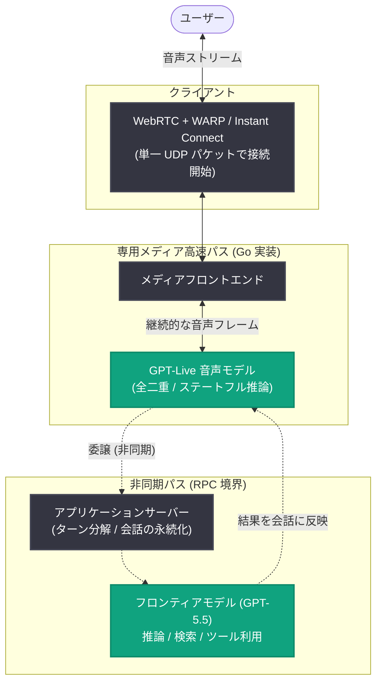
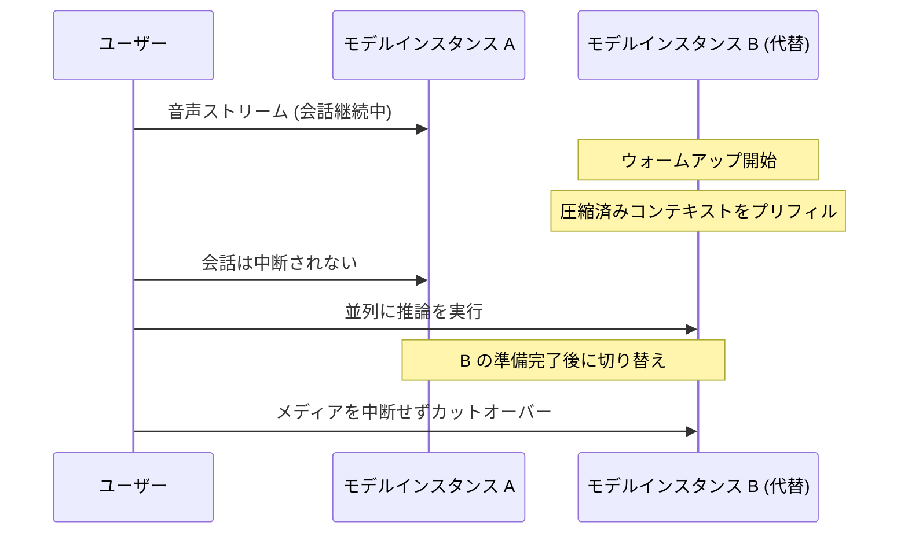

# GPT-Live: 応答性の高い音声 AI を実現するリアルタイムシステムを 6 か月で構築

## メタデータ

| 項目 | 内容 |
|------|------|
| 発表日 | 2026-08-03 |
| ソース | OpenAI News (Engineering) |
| カテゴリ | エンジニアリング / 音声 AI インフラ |
| 公式リンク | https://openai.com/index/continuous-voice-interaction-with-gpt-live |

## 概要

OpenAI は、第 3 世代音声システム「GPT-Live」を支えるリアルタイムシステムの構築過程を解説するエンジニアリング記事を公開した。GPT-Live は全二重 (full-duplex) の音声モデルを採用し、従来の音声 AI が依存していたターン検出器 (turn detector) をオーディオパスから排除することで、より即時的で自然な会話を実現している。深い推論やツール利用が必要な場合には、会話の流れを妨げることなく GPT-5.5 などのフロンティアモデルに委譲できる。

この体験を大規模に提供するため、OpenAI は過去 6 か月間でモデル推論、コンテキスト管理、メディアトランスポートを再構築した。記事では、ステートフル推論、動的コンテキスト管理、非同期委譲、プロトコルレベルの最適化という各レイヤーでの応答性向上の取り組みが詳細に説明されている。

## 主な内容

### ターン制からストリーミングへの移行

従来の音声アーキテクチャには以下の課題があった。

- **カスケード型システム**: 音声認識 (speech-to-text)、LLM、音声合成 (text-to-speech) が直列に実行されるため、レイテンシが増大し、声のトーンやペースといった手がかりが失われていた
- **speech-to-speech モデル**: 音声を直接処理することで改善されたが、推論を開始するタイミングの判断は依然としてターン検出器に依存していた。検出器が早すぎればユーザーの発話が遮られ、遅すぎれば応答が鈍く感じられる

GPT-Live は音声モデル自体に会話の主導権を持たせる。音声はモデルに直接流れ込み、モデルから流れ出る。深い推論やツール利用は非同期で実行され、フロンティアモデルの呼び出しや会話の永続化などの処理はライブパスの外で行われる。システムの主たる役割は、途切れのないメディアループを維持することにある。

### 継続的推論を可能にするアーキテクチャ

ライブメディアシステムでは、すべてのオーディオフレームをスケジュール通りに配信する必要がある。トランスポート、処理、推論のいずれかで遅延が生じると、可聴のポーズやアーティファクトになる。

主な設計上の決定は以下の通り。

- **メディアフローとアプリケーションロジックの分離**: 音声はクライアントと音声モデルの間の専用高速パスを移動する。委譲、ツール利用、その他のアプリケーション処理は非同期 RPC 境界の背後で実行される。遅いツール呼び出しやバックエンドサービスは自身の結果を遅らせることはあっても、メディアのフローを停止させることはない
- **Go による再実装**: メディアフロントエンドと推論ロジックを、従来の Python `asyncio` 実装から Go で書き直した。これによりフレーム配信の滑らかさが大幅に改善し、新システムの p95 が旧システムの p50 に匹敵する水準となった
- **WebRTC をトランスポート基盤に採用**: 低レイテンシメディア向けに設計されており、パケットロス、クロックドリフト、クライアント接続の変化があっても動作を継続できる。パケットが遅延した場合、WebRTC は音声をわずかに引き伸ばしてギャップを防ぎ、その後短時間再生を加速してリアルタイムに追いつく

### ステートフルな会話の維持

音声セッションは長時間アクティブなまま維持される一方で、コンテキストは継続的に増大し、モデルインスタンスは需要に応じて起動・停止する。これに対処するため、モデルインスタンス間のシームレスなハンドオフ機構を構築した。

- 移行が必要な場合、既存インスタンスと並行して代替インスタンスをウォームアップし、現在のセッションコンテキストをプリフィルして、両方に対して並列に推論を実行し、新インスタンスの準備が完了した時点で切り替える
- 同じ機構が**動的コンテキスト圧縮 (compaction)** も支える。会話が長引くとコンテキストがモデルの上限を超える可能性があるが、圧縮は時間がかかる操作であり、過去のコンテキストを変更するためモデルの KV キャッシュ (過去に処理したトークンのアテンションのキーと値を保持) を無効化してしまう
- そこで圧縮を管理された移行の一種として扱う。元のモデルインスタンスが会話を続ける間に、システムがコンテキストを圧縮し、新しいコンテキストで代替インスタンスを準備する。準備完了後、メディアを中断することなく切り替えられるため、長時間の通話でも必要に応じて圧縮を実行できる

### 会話をブロックしない委譲

GPT-Live は「話す」ことと深く「考える」ことを分離する 2 モデルアーキテクチャを採用しており、これを 1 つのシステムのように感じさせるために 2 つの課題を解決した。

**委譲の高速化:**

- 音声セッション開始時に、アプリケーションサーバーがフロンティアモデル用の推論セッションを作成し、初期の会話コンテキストをプリフィルして、最初の委譲リクエスト前にプロンプト処理を完了させておく
- その推論セッションを音声会話の間維持し、連続するリクエストに対して安定したセッションアフィニティを使用する。プロンプトキャッシングと組み合わせることでレイテンシを改善しつつ、ワーカー障害からの復旧も容易に保つ
- 推論の強度 (reasoning effort)、出力上限、ツールスキーマ、モデルとツール間のラウンドトリップも調整し、会話が有用な結果をより早く受け取れるようにした

**連続音声からの離散ターンの導出:**

- ChatGPT の会話 UI や分析・安全性インフラの一部は、ユーザーとアシスタントのターンを前提に動作するため、アプリケーションサーバーが重なり合う曖昧な会話を離散的なメッセージに分解する
- 部分的な文字起こしとタイミング信号を使ってどの話者が発話権 (floor) を持つかを推定し、メッセージのキューを構築する。最新メッセージは暫定的で、テキスト、タイミング、話者の割り当てはすべて変わり得る
- ユーザーの発話中のアシスタントの短い相槌 ("mm hmm" や "okay" など) は独立したメッセージにすべきではないが、実質的な割り込みはメッセージにすべき、といった話者の重なりへの対応も行う
- システムは会話の 2 つのビューを維持する。現在の状態の**投機的ビュー** (UI 表示用) と、発話内容の**確定的な記録** (分析パイプラインのログ用) である

### より高速なプロトコルによるセッション開始

応答性はユーザーがボタンをクリックした瞬間から始まる。標準的な WebRTC セッションの開始には多数のプロトコルハンドシェイクとネットワークラウンドトリップが必要であり、QUIC のようなラウンドトリップ最小化を重視する後発プロトコル以前の設計であるため、プロトコル間で処理が重複することがあった (例: 各プロトコルが独自の anti-DoS 機構を持つ)。

- **WARP**: WebRTC コミュニティの協力者とともにオープン仕様のセットとして設計。IETF の TSVWG ワーキンググループで提案を進めており、libwebrtc と Pion には既に WARP サポートが追加され、他の WebRTC 実装でも対応が進行中
- **Instant Connect**: WebRTC 接続前に SDP パラメータを共有するシグナリング交換をクリティカルパスから除去する仕組み。サーバー容量を予約せず、既存の WebRTC 実装を変更することなく、パラメータを事前にネゴシエートする。事前ネゴシエートしたパラメータが有効であれば、最初のメディアパケット到着時にサーバーがセッションを実体化できる。無効な場合は既に進行中の標準シグナリングフローに追加レイテンシなしでフォールバックする

Instant Connect と WARP により、SDP 交換をクリティカルパスから外し、トランスポートハンドシェイクを集約した結果、クライアントは**単一の UDP パケット**でセッションを開始できるようになった。

### 実データによる本番環境での安全なテスト

ユーザーへの提供前に、本番の ChatGPT Voice セッションの一部を徐々に増やしながら、既存の Advanced Voice Mode と新システムの両方にルーティングするサイレントテストを実施した。Advanced Voice Mode が通常通りユーザーにサービスを提供する一方、シャドウパスは読み取り専用モードで推論を実行し、ユーザーが聞く内容を変えることなく、実際のクライアント、ネットワーク、セッション長、地理的分布にシステムをさらした。

得られた教訓は以下の通り。

- **キャパシティは GPU スループットに還元できない**: 音声セッションは開いたままフレームを送信し続けるため、CPU 側のストリームハンドラ、キュー、ネットワークパスも推論と並行してスケールする必要がある。実負荷下では、サポートコンポーネントが負荷テストの予測より早く飽和し、推論リクエストの蓄積とレイテンシの複合的悪化を引き起こした。キャパシティの問いを「GPU が何リクエストを処理できるか」から「すべてのフレームをスケジュール通りに保ちながらシステムが何セッションを同時に維持できるか」に変更した
- **地理が第一級の関心事**: 遠隔のキャパシティへのルーティングは起動時とストリーミング中の複数の時点で遅延を追加する。モデルのロールアウトをリージョンのキャパシティやトラフィックステアリング設定と合わせて検証し、レイテンシを送信元の地理ごとに分解するようにした
- **現実的なセッションライフサイクルでのみ現れる障害**: 長時間セッションはメモリと永続化の圧力を露呈し、再接続は圧縮と状態復元を試し、通常のクライアント切断はシャットダウンハンドシェイクの競合を明らかにした
- **可観測性とロールアウト制御の改善**: 異なるレイテンシ源を混同するメトリクスや、不健全な個別エンジンを隠す集約ダッシュボード、テスト済み構成とデプロイ済み構成のドリフトが見つかった。これに対し、より粒度の細かいテレメトリ、既知の正常構成に対する検証、段階的ランプ、個別パスの迅速な分離・無効化機能を追加した

## アーキテクチャ

### ステートフル推論のハンドオフ機構

## 開発者への影響

- **GPT-Live API の予告**: この記事のアーキテクチャは今後提供予定の GPT-Live API の基盤となることが明言されており、Realtime API の後継として全二重・低レイテンシの音声体験を開発者が利用できるようになる見込み
- **WARP のオープン仕様化**: WARP は IETF TSVWG で標準化が進められており、libwebrtc と Pion に既にサポートが追加されている。WebRTC ベースのリアルタイムアプリケーションを構築する開発者は、この最適化の恩恵を受けられる可能性がある
- **リアルタイムシステム設計の知見**: メディアパスとアプリケーションロジックの分離、Go による低ジッタ実装 (p95 が旧 p50 に匹敵)、ハンドオフによる無停止コンテキスト圧縮、シャドウトラフィックによる本番テストなど、音声 AI に限らずレイテンシ重視のシステム設計全般に応用できるパターンが示されている
- **ChatGPT Voice の機能拡張**: このアーキテクチャは、ChatGPT デスクトップアプリでのコンピュータ操作やエージェントのコーディネーションといった新機能を支えている

## 関連リンク

- [記事原文: How we built a realtime system for responsive voice AI in six months](https://openai.com/index/continuous-voice-interaction-with-gpt-live)
- [Introducing GPT-Live (GPT-Live 発表記事)](https://openai.com/index/introducing-gpt-live/)
- [Delivering low-latency voice AI at scale (先行する音声インフラ再構築の記事)](https://openai.com/index/delivering-low-latency-voice-ai-at-scale/)
- [OpenAI 公式ドキュメント](https://platform.openai.com/docs)
- [OpenAI News](https://openai.com/news)

## まとめ

GPT-Live は「音声は流れ続けなければならない」という原則のもとに構築された第 3 世代音声システムである。全二重音声モデルによるターン検出器の排除、Go 実装の専用メディアパス、ハンドオフ機構による無停止のコンテキスト圧縮、GPT-5.5 への非同期委譲、WARP と Instant Connect による単一 UDP パケットでのセッション開始という各レイヤーの最適化により、人間の会話に期待されるサブ秒の応答性を大規模に実現した。このアーキテクチャは ChatGPT Voice のエージェント連携機能を支えており、今後の GPT-Live API の基盤にもなる。
