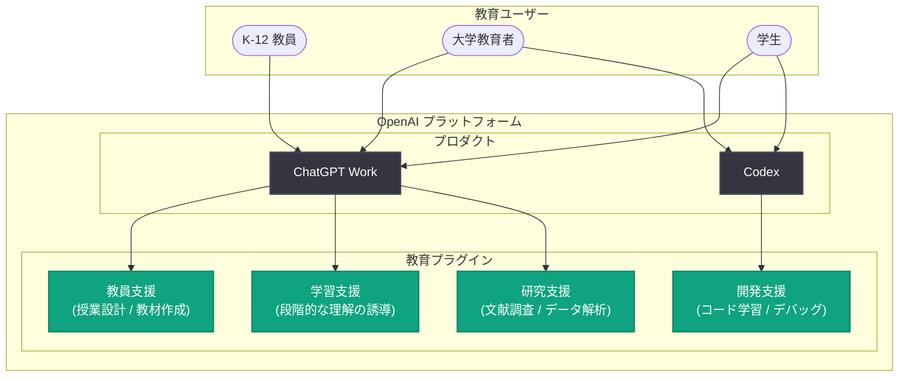

# New Ways to Learn and Teach with ChatGPT Work and Codex: 教育向け新プラグインの発表

## メタデータ

| 項目 | 内容 |
|------|------|
| 発表日 | 2026-08-04 |
| ソース | OpenAI News |
| カテゴリ | 新機能 / 教育・研究支援 |
| 公式リンク | https://openai.com/index/learn-teach-chatgpt-work-codex |

> **注記**: 本レポート作成時点で記事本文の取得ができなかったため (HTTP 403)、公式発表の概要および関連する公開情報に基づいて構成している。詳細な仕様・数値は公式リンクで確認されたい。

## 概要

OpenAI は、K-12 (初等・中等教育) の教員、大学教育者、学生の学習・研究・開発を支援する ChatGPT Work と Codex の新しい教育プラグインを発表した。教育現場のワークフローに合わせて設計されたプラグイン群を通じて、授業設計や教材作成といった教員の業務から、学生の学習・研究、プログラミング教育までを一貫して支援することを目的としている。

本発表は、ChatGPT Edu や ChatGPT for Academic Researchers (2026 年 7 月発表) に続く教育分野への取り組みの一環であり、汎用 AI アシスタントを教育のユースケースに特化させる「プラグイン」というかたちで、教育者と学習者双方の生産性向上を図るものである。

## 主な内容

### 対象ユーザー

発表によると、新しい教育プラグインは以下の 3 つのユーザー層を対象としている。

| 対象 | 主な支援領域 |
|------|-------------|
| K-12 教員 | 授業計画、教材作成、評価・フィードバックなどの日常業務 |
| 大学教育者 | 講義設計、研究活動、学生指導 |
| 学生 | 学習、研究、ソフトウェア開発スキルの習得 |

### ChatGPT Work における教育プラグイン

ChatGPT Work は、組織のワークスペースでチームの業務を支援する OpenAI の法人・組織向けプロダクトである。今回の教育プラグインにより、学校や大学のワークスペースにおいて、教育業務に特化したスキルセットを ChatGPT に追加できるようになる。想定される活用例は次のとおり。

- **教員向け**: カリキュラムに沿った授業案・教材・小テストの作成、採点補助、個々の学生に合わせたフィードバック文面の下書き
- **教育者・研究者向け**: 文献調査、シラバス設計、研究資料の整理・要約
- **学生向け**: 対話を通じた段階的な学習支援 (答えを与えるのではなく理解を導くアプローチ)

### Codex における教育プラグイン

Codex は、コードの作成・レビュー・デバッグをエージェント的に実行する OpenAI のソフトウェアエンジニアリングエージェントである。教育プラグインにより、プログラミング教育・学習の文脈で Codex を活用しやすくなる。

- **学生の開発学習**: 課題やプロジェクトにおけるコードの理解支援、デバッグの手順を追った解説
- **教育者の授業運営**: プログラミング課題の作成、サンプルコードや自動テストの整備
- **研究開発**: 研究用スクリプトやデータ解析ワークフローの構築支援

## アーキテクチャ

新しい教育プラグインが ChatGPT Work / Codex とユーザーをどのように結び付けるかの概念図を示す。

## 教育分野における OpenAI の取り組みの流れ

今回の発表は、OpenAI が継続的に進めてきた教育分野への展開の延長線上にある。

| 時期 | 取り組み | 内容 |
|------|---------|------|
| 2024 年 | ChatGPT Edu | 大学向けの ChatGPT 導入プログラム |
| 2025 年 | Study Mode | 答えを与えず理解を導く学習モード |
| 2026 年 7 月 | ChatGPT for Academic Researchers | 10 万人の研究者へのフロンティアモデル無償提供 |
| 2026 年 8 月 | 本発表 | ChatGPT Work / Codex の教育プラグイン |

## 開発者・ユーザーへの影響

- **教員の業務負荷の軽減**: 授業準備・教材作成・フィードバックといった時間のかかる業務をプラグインで効率化でき、教員が生徒との対話により多くの時間を割けるようになる
- **組織単位での導入のしやすさ**: ChatGPT Work のワークスペースにプラグインとして追加するモデルのため、学校・大学が管理されたかたちで教育向け AI 機能を展開できる
- **プログラミング教育の実践化**: Codex を教育文脈で使うことで、学生が実際の開発ワークフロー (コードレビュー、デバッグ、テスト) に近いかたちで学習できる
- **学習の質への配慮**: 単なる答えの提示ではなく、学習・研究のプロセスを支援する設計は、AI 利用と学習効果の両立という教育現場の課題に対応するものである
- **プラグインエコシステムの拡大**: ライフサイエンス研究スキルなどに続き、教育分野のプラグインが加わることで、ドメイン特化のプラグインエコシステムがさらに広がる

## 関連リンク

- [New Ways to Learn and Teach with ChatGPT Work and Codex (公式発表)](https://openai.com/index/learn-teach-chatgpt-work-codex)
- [ChatGPT for Academic Researchers](https://openai.com/index/chatgpt-for-academic-researchers)
- [ChatGPT Edu / 教育向けソリューション](https://openai.com/business/solutions/education/)
- [Codex](https://openai.com/codex/)
- [OpenAI News](https://openai.com/news)

## まとめ

本発表は、ChatGPT Work と Codex に教育向けの新しいプラグインを追加し、K-12 教員・大学教育者・学生の学習・研究・開発を支援するものである。教員の授業準備から学生のプログラミング学習までをドメイン特化のプラグインでカバーすることで、教育機関が管理されたワークスペースの中で AI を実務的に活用できるようになる。ChatGPT Edu や ChatGPT for Academic Researchers に続く一連の教育分野への投資として、OpenAI が教育を重要な戦略領域と位置付けていることを示す発表といえる。
