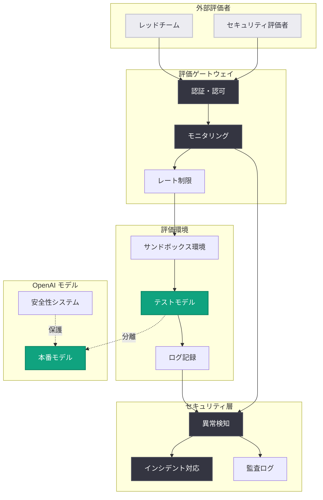
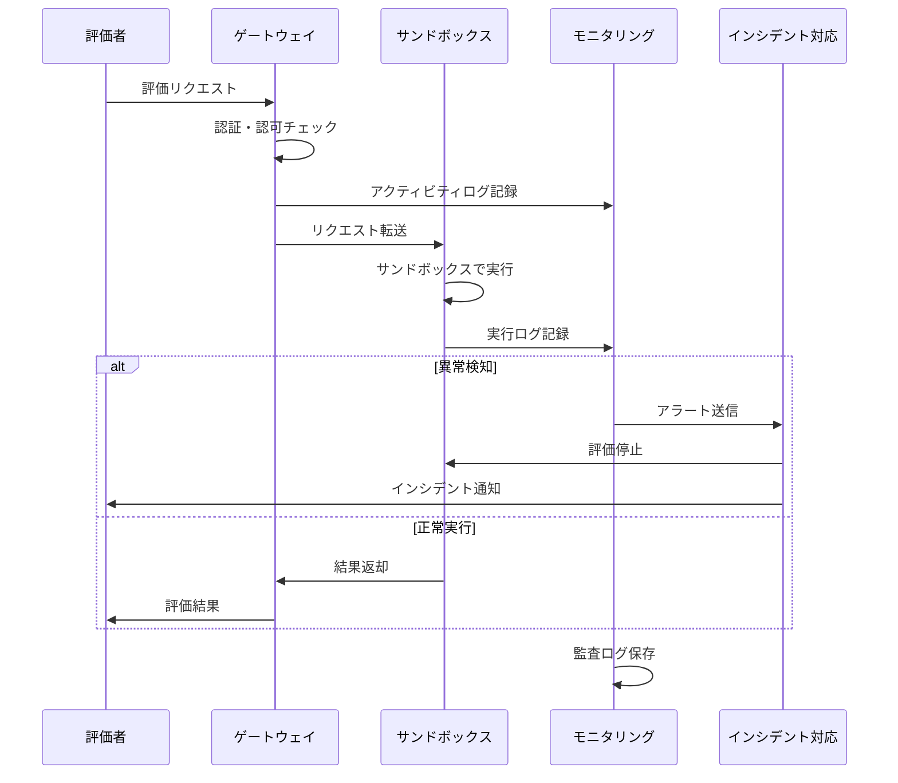

# 第三者によるサイバーセキュリティ評価に関する OpenAI モデルのインシデントと新たな安全策

## メタデータ

| 項目 | 内容 |
|------|------|
| 発表日 | 2026-08-04 |
| ソース | OpenAI News |
| カテゴリ | セキュリティ / モデル評価 / 安全性 |
| 公式リンク | https://openai.com/index/third-party-cyber-evaluations-involving-openai-models |

## 概要

OpenAI は、第三者によるサイバーセキュリティ評価に関連するインシデントについて公式に説明し、モデルの安全性評価を強化するための新たな対策を発表しました。この発表は、AI モデルのセキュリティ評価プロセスにおける透明性と安全性を向上させることを目的としており、AI システムの責任ある開発と展開における重要なマイルストーンとなります。

OpenAI は、外部のセキュリティ専門家やレッドチームによる評価の重要性を認識しつつ、評価プロセス自体のセキュリティとガバナンスを強化する必要性を強調しています。この取り組みは、AI 業界全体におけるセキュリティ評価の標準化と透明性の向上に貢献することが期待されます。

## 主な内容

### インシデントの背景と概要

第三者によるサイバーセキュリティ評価の過程で発生したインシデントについて、OpenAI は透明性を重視した説明を行いました。

**インシデントの特徴**:
- **評価環境の課題**: 外部評価者によるモデルのセキュリティテストにおいて、予期しない動作や潜在的なリスクが特定されました
- **迅速な対応**: 問題が特定された後、OpenAI は速やかに対応策を実施し、影響範囲を最小限に抑えました
- **透明性の実践**: インシデントを公開することで、AI 業界全体におけるセキュリティ評価の透明性を高める姿勢を示しています

### 新たな安全策の導入

OpenAI は、モデル評価プロセスを強化するために、包括的な安全対策を導入すると発表しました。

#### 1. 評価プロトコルの標準化

**明確なガイドラインの策定**:
- 第三者評価者向けの詳細な評価プロトコルを策定
- 評価範囲と許容される手法を明確に定義
- レッドチーム活動における倫理的な境界線を設定

**実装のポイント**:
- 評価前の事前審査プロセスの導入
- 評価スコープの明確な文書化
- 評価者との合意形成メカニズム

#### 2. セキュリティレビュープロセスの強化

**多層的なセキュリティ対策**:
- **事前審査**: 評価実施前の包括的なセキュリティレビュー
- **継続的モニタリング**: 評価期間中のリアルタイム監視システム
- **インシデント対応**: 問題発生時の迅速な対応メカニズムの確立

#### 3. 評価者認証プログラム

**信頼性の確保**:
- 第三者評価者に対する厳格な資格要件の設定
- セキュリティ評価の標準手法に関するトレーニングプログラムの提供
- 評価者の能力と信頼性を保証する認証システムの構築

## 技術的な詳細

### モデル評価のセキュリティアーキテクチャ

OpenAI は、モデル評価プロセスにおけるセキュリティを多層的に強化しています。以下の図は、新しい評価フレームワークのアーキテクチャを示しています。



### 評価プロセスのフェーズ

新しい評価フレームワークは、以下の段階で構成されています。

#### フェーズ 1: 事前準備と認証

```python
# 評価者認証の実装例
class EvaluatorAuthentication:
    def __init__(self, credentials):
        self.credentials = credentials
        self.permissions = []
        self.audit_trail = []
    
    def authenticate(self):
        """評価者の認証を実行"""
        if self.verify_credentials():
            self.assign_permissions()
            self.log_authentication()
            return True
        return False
    
    def verify_credentials(self):
        """認証情報の検証"""
        # 認証プロバイダーとの連携
        # 評価者証明書の確認
        # 多要素認証の実施
        pass
    
    def assign_permissions(self):
        """スコープベースのアクセス制御"""
        # 評価範囲に基づいた権限の付与
        # 最小権限の原則を適用
        pass
```

#### フェーズ 2: サンドボックス評価

```python
# セキュアな評価環境での実行
from openai import OpenAI
from datetime import datetime

class SecureEvaluation:
    def __init__(self, sandbox_api_key):
        # サンドボックス専用の API キー
        self.client = OpenAI(api_key=sandbox_api_key)
        self.audit_log = []
    
    def run_evaluation(self, test_cases):
        """セキュアな評価環境でテストを実行"""
        for test in test_cases:
            try:
                # 評価専用モデルを使用
                response = self.client.chat.completions.create(
                    model="gpt-4o-eval",
                    messages=test["messages"],
                    max_tokens=test.get("max_tokens", 1000)
                )
                
                # 結果をログに記録
                self.log_evaluation(test, response)
                
            except Exception as e:
                # エラーハンドリングとインシデント報告
                self.report_incident(test, e)
    
    def log_evaluation(self, test, response):
        """評価結果の詳細ログ記録"""
        self.audit_log.append({
            "timestamp": datetime.now().isoformat(),
            "test_id": test["id"],
            "response_id": response.id,
            "metadata": test.get("metadata", {})
        })
```

#### フェーズ 3: 監視と異常検知



## 開発者への影響

この新しいセキュリティフレームワークは、以下の点で開発者とステークホルダーに影響を与えます。

### プラットフォーム利用者への影響

**安全性の向上**:
- 厳格な評価プロセスにより、本番環境でのモデルの安全性が向上します
- モデルのセキュリティリスクに関する透明性が高まります
- より信頼性の高い AI サービスの利用が可能になります

**透明性の強化**:
- モデルのセキュリティ評価プロセスがより透明になり、信頼性が向上します
- OpenAI が公開する評価ガイドラインは、業界全体のベストプラクティスとなる可能性があります

### セキュリティ研究者への影響

**明確なガイドライン**:
- 第三者評価を実施する際の明確なプロトコルとガイドラインが提供されます
- 評価の範囲と方法論が標準化されます

**認証プログラム**:
- 評価者としての資格を得るための標準化されたプロセスが導入されます
- 専門性と信頼性を証明する認証の取得が可能になります

**責任ある開示**:
- セキュリティ上の問題を報告するための明確なチャネルが確立されます
- OpenAI と外部セキュリティ研究者との協力関係が強化されます

### 組織のセキュリティチームへの影響

**評価フレームワークの参照**:
- 自社の AI システム評価に適用できる参考フレームワークの提供
- AI モデルのセキュリティリスクを評価・管理するための方法論

**コンプライアンス対応**:
- セキュリティ評価の標準化により、コンプライアンス要件への対応が容易になります
- 監査証跡の確立により、規制要件への対応が改善されます

## ベストプラクティス

### 1. セキュリティ評価の実施

AI モデルを展開する組織が参考にできるベストプラクティス。

**定期的な評価**:
- モデルの定期的なセキュリティ評価を実施
- バージョンアップごとの再評価
- 新機能追加時の追加評価

**多様な視点**:
- 内部チームと外部専門家の両方による評価
- 異なる背景を持つ評価者の参加
- レッドチームによる敵対的テスト

**文書化と追跡**:
- 評価プロセスと結果の詳細な文書化
- 発見事項の追跡と管理
- 改善措置の実施状況の記録

### 2. インシデント対応

セキュリティインシデントが発生した場合の対応手順。

**迅速な検知**:
- 異常動作の早期検知システムの構築
- リアルタイムモニタリングの実施
- 自動アラートの設定

**隔離と分析**:
- 影響範囲の迅速な隔離
- 詳細な原因分析の実施
- 関連システムへの影響評価

**透明な報告**:
- ステークホルダーへの適切な情報開示
- タイムリーなコミュニケーション
- 教訓の共有

### 3. 評価者との協力

外部セキュリティ研究者との効果的な協力関係の構築。

**明確な範囲設定**:
- 評価の範囲と制約の明確な定義
- 禁止事項の明示
- 期待される成果物の指定

**コミュニケーション**:
- 定期的なコミュニケーションチャネルの確立
- 質問や懸念事項への迅速な対応
- 進捗状況の共有

**フィードバックと改善**:
- 発見事項に対する迅速なフィードバック
- 改善措置の実施と報告
- 継続的な改善サイクルの確立

## 業界への影響

### AI セキュリティの標準化

OpenAI の取り組みは、AI セキュリティ評価の業界標準を形成する可能性があります。

**評価フレームワークの確立**:
- 他の AI プロバイダーが参考にできる標準的なフレームワーク
- 評価手法の標準化と共有
- ベストプラクティスの普及

**規制対応のベースライン**:
- 今後の AI 規制に対応するためのベースライン
- コンプライアンス要件の明確化
- 業界自主規制の促進

### 透明性と信頼性の向上

この発表は、AI 業界全体における透明性の向上に貢献します。

**オープンな議論**:
- セキュリティインシデントのオープンな議論の促進
- 業界全体がインシデントから学ぶ機会の創出
- 知識の共有とコラボレーション

**信頼構築**:
- 透明性を通じた公衆との信頼関係の構築
- AI システムに対する信頼性の向上
- 責任ある AI 開発の推進

## 関連リンク

- [OpenAI 公式発表](https://openai.com/index/third-party-cyber-evaluations-involving-openai-models)
- [OpenAI Safety & Security](https://openai.com/safety)
- [OpenAI Preparedness Framework](https://openai.com/preparedness)
- [Responsible Disclosure Policy](https://openai.com/security/disclosure)
- [OpenAI API セキュリティベストプラクティス](https://platform.openai.com/docs/guides/safety-best-practices)
- [OpenAI Platform Documentation](https://platform.openai.com/docs)

## まとめ

OpenAI による第三者サイバーセキュリティ評価に関する発表は、AI システムの安全性と信頼性を向上させるための重要な一歩です。

**主要なポイント**:

- **透明性の実践**: セキュリティインシデントを公開することで、業界全体の透明性を向上
- **プロアクティブな対応**: 問題発生時の迅速な対応と予防的な安全策の実装
- **業界標準の確立**: AI モデルのセキュリティ評価における新しい標準の提示
- **協力的エコシステム**: 内部チームと外部研究者の協力関係の強化
- **継続的改善**: セキュリティプロセスの継続的な評価と改善

**今後の展望**:

この取り組みは、AI 技術の責任ある開発と展開において、セキュリティと透明性が不可欠であることを示しています。開発者、セキュリティ研究者、組織は、OpenAI のアプローチから学び、自らの AI システムのセキュリティ評価プロセスを強化することが推奨されます。

業界全体として、標準化されたセキュリティ評価フレームワークの採用と、透明性を重視した運用が、AI 技術への信頼を構築する鍵となるでしょう。
