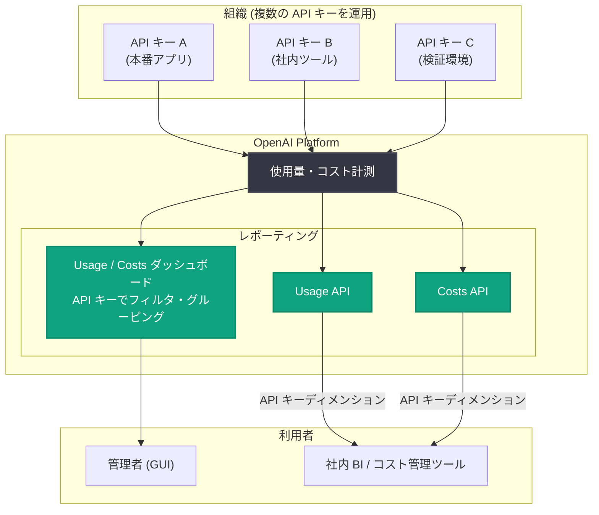

# Usage・Costs ダッシュボードが API キー単位のフィルタリングとグルーピングに対応

## メタデータ

| 項目 | 内容 |
|------|------|
| 発表日 | 2026-08-04 |
| ソース | OpenAI API Changelog |
| カテゴリ | API 更新 / ダッシュボード機能 |
| 公式リンク | https://developers.openai.com/api/docs/changelog |

## 概要

OpenAI は 2026 年 8 月 4 日、API Changelog にて Usage・Costs ダッシュボードの機能強化を発表した。組織の Usage ダッシュボードおよび Costs ダッシュボードにおいて、API キー単位でのデータのフィルタリングとグルーピングが可能になった。

あわせて、プログラムからのレポート作成・分析を目的とした Usage API と Costs API でも、API キーというディメンション (集計軸) がサポートされた。これにより、複数の API キーを用途別・チーム別・アプリケーション別に発行して運用している組織では、キー単位での使用量とコストの内訳を GUI と API の両方から把握できるようになる。

## 主な内容

### ダッシュボードでの API キー単位の分析

[Usage・Costs ダッシュボード](https://platform.openai.com/settings/organization/usage) において、API キーによるデータのフィルタリングとグルーピングが可能になった。Changelog の原文は以下の通り。

> Customers can now filter and group data by API key in the Usage and Costs dashboards.

- **フィルタリング**: 特定の API キーに絞り込んで使用量やコストを表示できる
- **グルーピング**: API キーごとにデータを分割して比較できる

### Usage API / Costs API での API キーディメンション対応

ダッシュボードだけでなく、プログラムから使用量・コストを取得する Usage API と Costs API でも API キーのディメンションがサポートされた。Changelog の原文は以下の通り。

> The Usage API and Costs API also support the API key dimension for programmatic reporting and analysis.

これにより、社内のコスト管理ツールや BI ダッシュボードに API キー単位の集計を組み込むことができる。

## 技術的な詳細

Usage API と Costs API は、組織の管理者向けに提供される Admin API の一部であり、Admin API キー (`sk-admin-...`) で認証してアクセスする。

- **Usage API**: `GET /v1/organization/usage/{endpoint}` (例: `completions`) で、トークン数やリクエスト数などの使用量データを時間バケット単位で取得する
- **Costs API**: `GET /v1/organization/costs` で、日次のコストデータを取得する

Usage API では、API キーによる絞り込みに `api_key_ids` パラメータ、API キー単位の集計に `group_by` パラメータの `api_key_id` 値が利用できる。今回の更新により、これらの API キーディメンションがコスト分析を含むレポート用途で利用可能になった。

なお、Changelog 本文には具体的なパラメータ仕様は記載されていないため、最新のパラメータ詳細は [API リファレンス](https://platform.openai.com/docs/api-reference/usage) を参照してほしい。

### コードサンプル

Usage API で API キーごとに使用量をグルーピングして取得する例 (curl):

```bash
curl "https://api.openai.com/v1/organization/usage/completions?start_time=1754265600&bucket_width=1d&group_by=api_key_id" \
  -H "Authorization: Bearer $OPENAI_ADMIN_KEY" \
  -H "Content-Type: application/json"
```

特定の API キーに絞り込む例 (curl):

```bash
curl "https://api.openai.com/v1/organization/usage/completions?start_time=1754265600&api_key_ids=key_abc123" \
  -H "Authorization: Bearer $OPENAI_ADMIN_KEY" \
  -H "Content-Type: application/json"
```

Python でコストデータを取得し、API キー単位で集計する例:

```python
import requests

ADMIN_KEY = "sk-admin-..."
headers = {"Authorization": f"Bearer {ADMIN_KEY}"}

response = requests.get(
    "https://api.openai.com/v1/organization/costs",
    headers=headers,
    params={
        "start_time": 1754265600,  # 集計開始時刻 (Unix 秒)
        "group_by": "api_key_id",  # API キー単位でグルーピング
    },
)
data = response.json()

for bucket in data["data"]:
    for result in bucket["results"]:
        print(result)
```

## アーキテクチャ



## 開発者への影響

- **キー単位のコスト可視化**: アプリケーションやチームごとに API キーを分けて発行していれば、どのキーがどれだけの使用量・コストを発生させているかをダッシュボード上で直接確認できる
- **チャージバック (コスト按分) の自動化**: Usage API / Costs API の API キーディメンションを使えば、部門別・プロダクト別のコスト按分レポートをプログラムで自動生成できる
- **異常検知への活用**: キー単位の使用量を定期的に取得することで、特定のキーの使用量急増 (漏えいや不具合の兆候) を早期に検出する仕組みを構築しやすくなる
- **キー運用の設計指針**: 用途ごとに API キーを分割して発行する運用が、そのままコスト管理の粒度になる。今後は「1 アプリケーション 1 キー」のような運用がより有効になる
- **既存コードへの影響なし**: 推論系 API (Responses API や Chat Completions API など) の呼び出し方法に変更はなく、レポーティング側の機能追加のみである

## 関連リンク

- [OpenAI API Changelog](https://developers.openai.com/api/docs/changelog)
- [Usage・Costs ダッシュボード](https://platform.openai.com/settings/organization/usage)
- [Usage API リファレンス](https://platform.openai.com/docs/api-reference/usage)
- [Admin API キーについて](https://platform.openai.com/docs/api-reference/admin-api-keys)

## まとめ

2026 年 8 月 4 日の更新により、Usage・Costs ダッシュボードで API キー単位のフィルタリングとグルーピングが可能になり、Usage API / Costs API でも API キーディメンションによるプログラマティックなレポート作成に対応した。複数の API キーを運用する組織にとって、コストの内訳把握、チャージバックの自動化、使用量の異常検知が容易になる。推論系 API への影響はなく、既存コードの変更は不要である。
