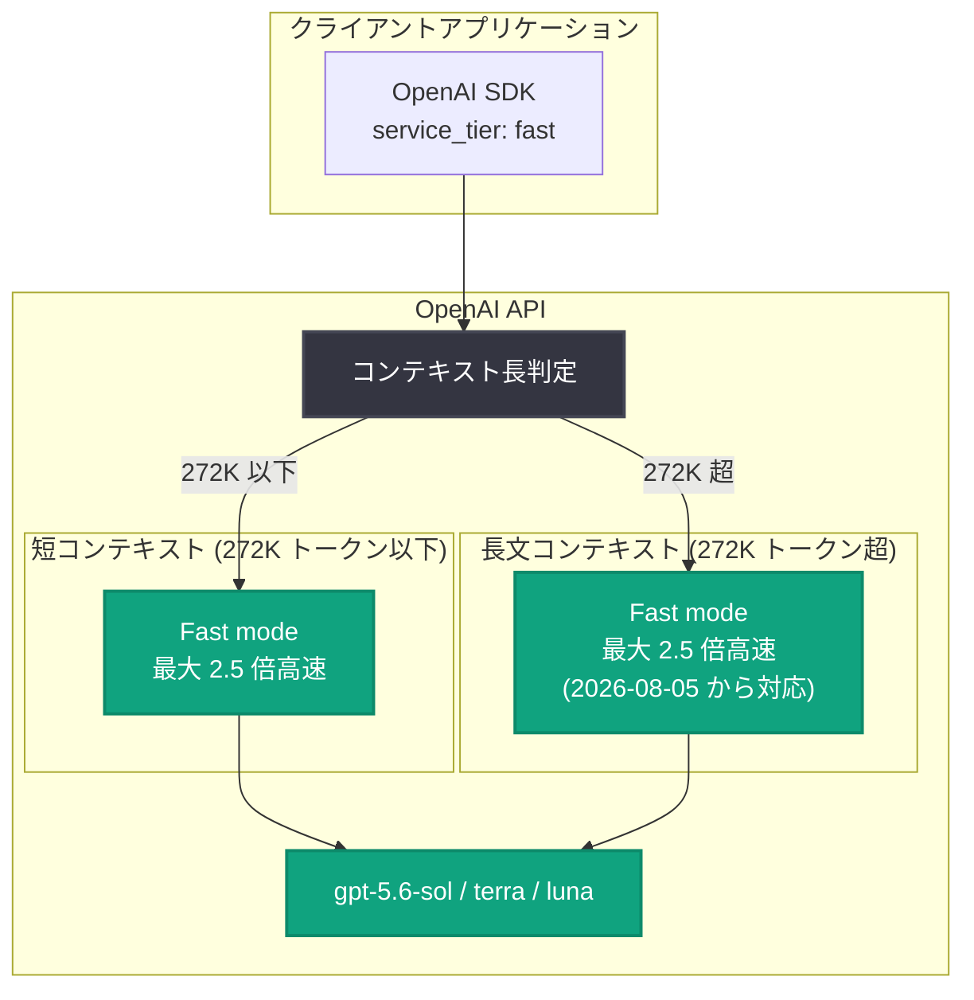

# Fast mode が GPT-5.6 Sol / Terra / Luna の長文コンテキスト (272K トークン超) に対応

## メタデータ

| 項目 | 内容 |
|------|------|
| 発表日 | 2026-08-05 |
| ソース | OpenAI API Changelog |
| カテゴリ | API 更新 |
| 公式リンク | https://developers.openai.com/api/docs/changelog |

## 概要

OpenAI は 2026 年 8 月 5 日、API Changelog にて Fast mode が GPT-5.6 Sol / GPT-5.6 Terra / GPT-5.6 Luna の長文コンテキストリクエストに対応したことを発表した。これにより、272K トークンを超えるプロンプトでも Fast mode を利用でき、Standard ティア比で最大 2.5 倍の速度が得られる。

Fast mode は 2026 年 7 月 30 日に Priority Processing を置き換える形で導入された機能であり、導入時点では長文コンテキストは非対応であった (既存レポート: [2026-07-30 Fast mode 導入と GPT-5.6 値下げ](2026-07-30-api-fast-mode-gpt-5-6-price-cuts.md) 参照)。今回の更新は導入から約 1 週間でその制約を解消するものであり、大規模なドキュメント処理や長大なコンテキストを扱うアプリケーションでも高速処理の恩恵を受けられるようになった。

## 主な内容

### 長文コンテキストリクエストへの対応

Changelog の原文では以下のように記載されている。

> "Fast mode now supports long-context requests for GPT-5.6 Sol, GPT-5.6 Terra, and GPT-5.6 Luna."

- **対象モデル**: `gpt-5.6-sol`、`gpt-5.6-terra`、`gpt-5.6-luna` の 3 モデル
- **対象リクエスト**: 272K トークンを超えるプロンプト ("long-context prompts exceeding 272K tokens can run in Fast mode")
- **速度**: Standard ティア比で最大 2.5 倍 ("delivering speeds up to 2.5× faster than the Standard tier")

### 導入時の制約の解消

2026-07-30 の Fast mode 導入時点では、長文コンテキスト、ファインチューニング済みモデル、Embeddings は非対応とされていた。今回の更新により、このうち長文コンテキストの制約が GPT-5.6 ファミリーの 3 モデルで解消された。

**Fast mode の対応範囲の変化:**

| 項目 | 2026-07-30 (導入時) | 2026-08-05 (今回) |
|------|--------------------|------------------|
| 短コンテキスト (272K トークン以下) | 対応 | 対応 |
| 長文コンテキスト (272K トークン超) | 非対応 | 対応 (Sol / Terra / Luna) |
| 最大速度 (Standard 比) | 最大 2.5 倍 | 最大 2.5 倍 |

### 長文コンテキストの Fast mode 料金

Changelog エントリ自体には価格の記載はなく、料金ページへのリンクが案内されている。料金ページによると、長文コンテキストの Fast mode 料金 (100 万トークンあたり) は以下の通りで、Standard ティアの長文コンテキスト料金のちょうど 2 倍に設定されている。

**Fast mode (長文コンテキスト、100 万トークンあたり):**

| モデル | 入力 | キャッシュ入力 | キャッシュ書き込み | 出力 |
|--------|------|--------------|------------------|------|
| gpt-5.6-sol | $20.00 | $2.00 | $25.00 | $90.00 |
| gpt-5.6-terra | $8.00 | $0.80 | $10.00 | $36.00 |
| gpt-5.6-luna | $0.80 | $0.08 | $1.00 | $3.60 |

**参考: Standard ティア (長文コンテキスト、100 万トークンあたり):**

| モデル | 入力 | キャッシュ入力 | キャッシュ書き込み | 出力 |
|--------|------|--------------|------------------|------|
| gpt-5.6-sol | $10.00 | $1.00 | $12.50 | $45.00 |
| gpt-5.6-terra | $4.00 | $0.40 | $5.00 | $18.00 |
| gpt-5.6-luna | $0.40 | $0.04 | $0.50 | $1.80 |

なお、短コンテキストの Fast mode 料金 (gpt-5.6-sol: 入力 $10.00 / 出力 $60.00 など) は 2026-07-30 の導入時から変更されていない。

## 技術的な詳細

利用方法は従来の Fast mode と同一である。Responses API (`v1/responses`) または Chat Completions API (`v1/chat/completions`) で `service_tier` パラメータに `"fast"` (後方互換の `"priority"` も有効) を指定する。272K トークンを超えるプロンプトを送信した場合、従来は Fast mode の対象外であったが、今回の更新以降は Fast mode で処理され、長文コンテキスト料金が適用される。

実際に使用されたティアは、レスポンスオブジェクトの `service_tier` フィールドで確認できる。

### コードサンプル

Python (Responses API) で長大な入力を Fast mode で処理する例。

```python
from openai import OpenAI

client = OpenAI()

# 272K トークンを超える長文ドキュメントを読み込む
with open("large_document.txt") as f:
    document = f.read()

response = client.responses.create(
    model="gpt-5.6-sol",
    input=f"以下のドキュメントを要約してください。\n\n{document}",
    service_tier="fast",  # 長文コンテキストでも Fast mode が適用される
)

print(response.output_text)
print(response.service_tier)  # 実際に使用されたティアを確認
```

curl:

```bash
curl https://api.openai.com/v1/responses \
  -H "Authorization: Bearer $OPENAI_API_KEY" \
  -H "Content-Type: application/json" \
  -d '{
    "model": "gpt-5.6-terra",
    "input": "<272K トークンを超える長文プロンプト>",
    "service_tier": "fast"
  }'
```

## アーキテクチャ



## 開発者への影響

- **長文ワークロードの高速化**: 大規模コードベースの解析、長大なドキュメントの要約、大量の会話履歴を含むリクエストなど、272K トークンを超えるワークロードでも最大 2.5 倍の速度が得られるようになった
- **コード変更は最小限**: すでに `service_tier: "fast"` (または `"priority"`) を指定しているアプリケーションでは、長文リクエストが自動的に Fast mode の対象となる。新たなパラメータの追加は不要である
- **コスト管理に注意**: 長文コンテキストの Fast mode 料金は Standard の 2 倍である。特に gpt-5.6-sol では入力 $20.00 / 出力 $90.00 (100 万トークンあたり) と高額になるため、レイテンシ要件のないバッチ処理では Standard や Batch API の利用を検討すべきである
- **プロンプトキャッシュの活用**: キャッシュ入力は通常入力の 10 分の 1 の価格であり、長文コンテキストでは特にキャッシュヒットによるコスト削減効果が大きい
- **モデル選択の幅が拡大**: Sol だけでなく Terra / Luna も長文 Fast mode に対応しているため、速度・品質・コストのバランスに応じて 3 モデルから選択できる

## 関連リンク

- [OpenAI API Changelog](https://developers.openai.com/api/docs/changelog)
- [OpenAI API 料金ページ (Fast mode)](https://developers.openai.com/api/docs/pricing?latest-pricing=fast)
- [Fast mode ガイド](https://developers.openai.com/api/docs/guides/fast-mode)
- [既存レポート: Fast mode 導入と GPT-5.6 値下げ (2026-07-30)](2026-07-30-api-fast-mode-gpt-5-6-price-cuts.md)

## まとめ

2026 年 8 月 5 日の更新により、Fast mode は GPT-5.6 Sol / Terra / Luna の 3 モデルで 272K トークンを超える長文コンテキストリクエストに対応した。速度は Standard ティア比で最大 2.5 倍、料金は Standard の長文コンテキスト料金の 2 倍である。2026-07-30 の Fast mode 導入時に存在した長文コンテキスト非対応の制約が約 1 週間で解消されたことで、レイテンシが重要な長文ワークロードを持つ開発者は、既存の `service_tier` 指定のまま高速処理の恩恵を受けられるようになった。
