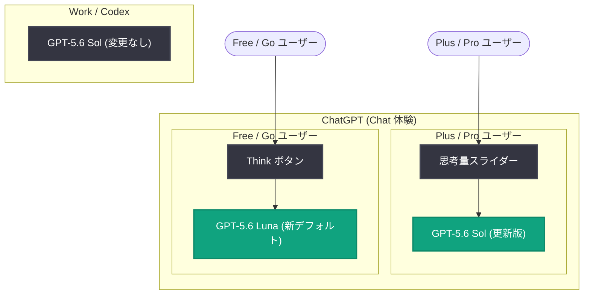

# Improving GPT‑5.6 Sol in ChatGPT—and expanding access to GPT-5.6 Luna for free users

## メタデータ

| 項目 | 内容 |
|------|------|
| 発表日 | 2026-08-06 |
| ソース | OpenAI News |
| カテゴリ | 新機能 |
| 公式リンク | https://openai.com/index/improving-gpt-5-6-sol-in-chatgpt |

## 概要

OpenAI は、ChatGPT の日常的な会話体験を改善するアップデートを発表した。Plus および Pro ユーザー向けには、GPT-5.6 Sol が更新され、事実に関する信頼性の向上とより焦点を絞った回答が実現された。また、回答にどの程度の思考を費やすかを選択できる新しいスライダーが導入された。

無料ユーザー向けには、デフォルトモデルが GPT-5.6 Luna に更新され、テキストチャットが無制限に利用可能になる。さらに、より深い思考が必要な質問に対しては、新しい Think ボタンで高度な推論機能にアクセスできるようになった。毎週 10 億人が利用する ChatGPT の利用実態に合わせたチューニングと、最新モデルへのアクセス拡大を同時に実現するアップデートである。

## 主な内容

### より焦点を絞った回答

ChatGPT における GPT-5.6 Sol のアップデートは、より直接的な回答、より引き締まったフォーマット、役に立たない余分な詳細の回避を目的として設計されている。

- **簡単な質問**: 必要なコンテキストを含む直接的な回答を提供
- **複数ステップの計画、リサーチ、執筆などの複雑な作業**: 主要な推奨事項を明確に保ちながら、より充実した回答を提供
- 質問に応じて詳細レベルを適応させ、不要なフォーマットを回避
- 単に同意することが有益でない場合には、役立つ訂正を提示

### より信頼できる事実性

新しい GPT-5.6 Sol は、特に日付、数値、情報源、ルール、前提条件に依存する回答において、検索で見つけた情報源をより適切に活用することで、間違いを減らすように設計されている。

事実の詳細が要求される金融、医療、法律関連のプロンプトを用いた内部評価では、少なくとも 1 つの事実誤認を含む回答の発生率が、GPT-5.5 Instant と比較して以下のように減少した。

| モデル | 事実誤認を含む回答の減少率 (対 GPT-5.5 Instant) |
|--------|------------------------------------------------|
| GPT-5.6 Luna | 約 62% 減少 |
| GPT-5.6 Sol | 約 68% 減少 |

### Instant と Thinking の一貫した体験

今回のアップデートでは、ChatGPT の Instant 体験と Thinking 体験がより近づけられ、さまざまな会話においてトーンと挙動の一貫性が向上した。Instant からより高い思考レベルに移行しても、独自のトーンやスタイルを持つ別のモデルに切り替わったように感じるのではなく、同じモデルがより包括的な回答のために追加の時間をかけているように感じられる設計となっている。

Plus および Pro ユーザーは、Web、モバイル、デスクトップの ChatGPT で新しいスライダーを使用して、回答に費やす思考量を選択できる。日常的な質問には素早い回答を、計画、リサーチ、執筆、コーディング、より深い思考が必要な意思決定にはスライダーを上げて対応できる。

### 無料ユーザーへのアクセス拡大

無料ユーザー向けに、最新モデルへのアクセスが以下のように拡大される。

- **GPT-5.6 Luna がデフォルトモデルに**: 今週中に Free および Go ユーザーのデフォルトモデルが GPT-5.6 Luna に更新
- **無制限のテキストチャット**: 来週から、レート制限なしでテキストチャットを継続可能 (不正利用防止のガードレールの対象)
- **Think ボタン**: より深い推論が必要な難しい質問に対して、GPT-5.6 Luna に回答をじっくり考える時間を与える新しいボタンを提供
- **制限の継続**: ファイルアップロード、画像、その他のツールには引き続き制限が適用

## 技術的な詳細

### 提供スケジュールと適用範囲

| 項目 | 内容 |
|------|------|
| GPT-5.6 Sol 更新版 + スライダー (Plus/Pro) | 発表当日から利用可能 |
| GPT-5.6 Luna デフォルト化 (Free/Go) | 今週中に適用 |
| 無制限テキストチャット + Think ボタン (Free/Go) | 来週から適用 |
| 適用範囲 | ChatGPT の Chat 体験のみ |

今回の GPT-5.6 Sol は日常的なチャット向けに最適化されているため、ChatGPT の Chat 体験でのみ利用可能となる。Work および Codex を支える GPT-5.6 Sol のバージョンは、今回のリリースでは変更されない。

### 安全性: 18 歳未満ユーザーへの保護策

[システムカード](https://cdn.openai.com/pdf/GPT_5_6_August_Updates.pdf)には、18 歳未満と判断されるユーザーを保護するための追加的な安全対策が記載されている。

- **モデルトレーニングによる回避**: 恋愛ロールプレイ、年齢制限のあるチャレンジ、現実の人間関係の代替としての振る舞いを回避
- **年齢に応じた境界設定**: 性的コンテンツ、摂食障害やボディイメージのリスク、年齢制限のある商品、危険な活動、生々しい暴力表現に対する年齢に応じた制限
- **信頼できる人とのつながりの促進**: ティーンがサポートを必要とする可能性がある場合、信頼できる人とのつながりを促す応答
- **システムレベルの保護と評価**: トレーニングを補強するシステムレベルの保護策と、18 歳未満のユーザーに対するモデル性能の新しい評価を追加

## アーキテクチャ

## 開発者への影響

- **API への直接的な影響はなし**: 今回のアップデートは ChatGPT の Chat 体験に限定されており、Work および Codex を支える GPT-5.6 Sol は変更されないため、API 経由の利用や既存のワークフローへの影響はない
- **事実性の改善傾向**: 金融、医療、法律分野での事実誤認が GPT-5.5 Instant 比で 62-68% 減少しており、事実性を重視したモデルチューニングの方向性は、今後の API 向けモデルにも波及する可能性がある
- **推論量の可変制御という UX パターン**: スライダーや Think ボタンによる推論量の制御は、API における reasoning effort パラメータと同様の考え方であり、エンドユーザー向けアプリケーション設計の参考になる
- **無料ユーザー層の拡大**: 無制限テキストチャットにより ChatGPT の利用者層がさらに拡大し、AI アシスタントの利用が一般化することで、開発者が構築するサービスへのユーザー期待値も変化する可能性がある

## 関連リンク

- [公式発表 (OpenAI News)](https://openai.com/index/improving-gpt-5-6-sol-in-chatgpt)
- [GPT-5.6 August Updates システムカード (PDF)](https://cdn.openai.com/pdf/GPT_5_6_August_Updates.pdf)
- [OpenAI News](https://openai.com/news)
- [OpenAI 公式ドキュメント](https://platform.openai.com/docs)

## まとめ

OpenAI は ChatGPT の GPT-5.6 Sol を更新し、より焦点を絞った回答と事実に関する信頼性の向上 (事実誤認が GPT-5.5 Instant 比で最大 68% 減少) を実現した。Plus および Pro ユーザーは新しいスライダーで思考量を調整でき、Instant と Thinking の体験が一貫したものになった。無料ユーザーには GPT-5.6 Luna がデフォルトモデルとして提供され、無制限のテキストチャットと Think ボタンによる高度な推論へのアクセスが拡大される。18 歳未満のユーザー向けの安全対策も強化されており、「より多くの人により多くの知能を」という OpenAI のミッションを体現するアップデートである。なお、今回の変更は ChatGPT の Chat 体験に限定され、Work および Codex 向けのモデルは変更されない。
