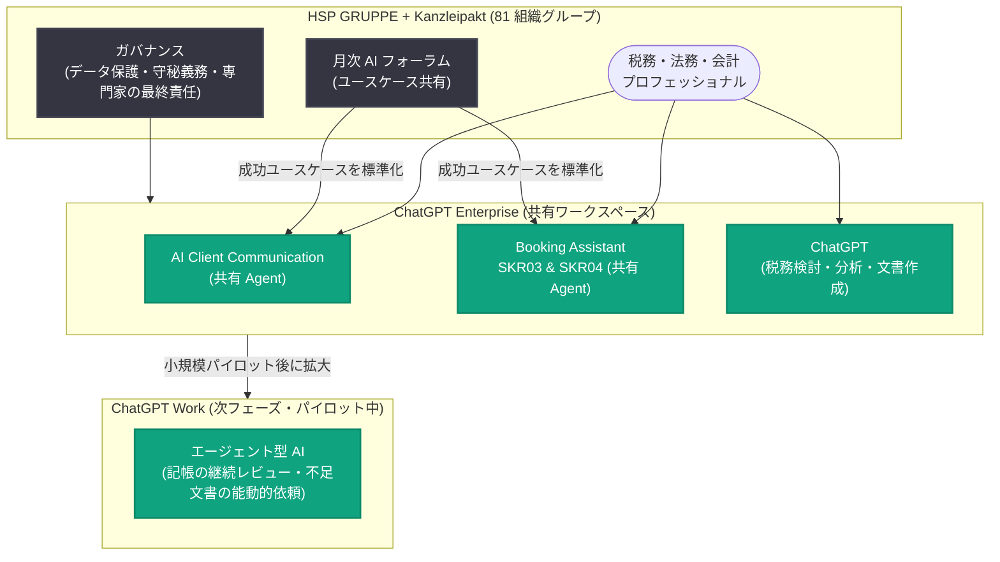

# HSP GRUPPE、ChatGPT Enterprise で税務アドバイザリーの AI 活用能力を構築 — 週次アクティブ利用率 84%・年間約 40,000 時間の追加キャパシティを試算

## メタデータ

| 項目 | 内容 |
|------|------|
| 発表日 | 2026-08-07 |
| ソース | OpenAI News |
| カテゴリ | 導入事例 (Customer Story) |
| 公式リンク | https://openai.com/index/hsp-gruppe |

## 概要

ドイツの税務アドバイザリー・監査・法律事務所ネットワークである HSP GRUPPE は、ChatGPT Enterprise を税務相談、リーガルリサーチ、クライアントコミュニケーション、財務分析、ナレッジ共有といった業務の中核に組み込み、「AI をソフトウェア導入ではなく組織変革として扱う」アプローチで大規模な活用を実現した。本事例の利用データは、HSP GRUPPE と Kanzleipakt が共有する ChatGPT Enterprise ワークスペース (81 の組織グループをカバー) を対象としている。

2026 年 2 月 1 日から 7 月 14 日までの評価期間において、週次アクティブ利用率 84% (週次アクティブユーザー 755 名、ユニークユーザー 913 名)、メッセージ交換数 50 万件超を達成した。調査対象従業員の 98.6% が生産性向上を、84.6% が業務品質の向上を報告している。保守的な社内シナリオでは年間約 40,000 時間の追加キャパシティ、理論上の年間売上ポテンシャルとして約 380 万ユーロを試算している (実現済み・保証された収益ではない)。現在は次のフェーズとして ChatGPT Work によるエージェント型 AI のパイロットを進めている。

## 主な内容

### HSP GRUPPE について

- 20 年以上にわたり、士業事務所プロセスのデジタル化・標準化に継続的に投資してきたドイツの事務所ネットワーク
- 法的に独立した税務アドバイザリー、監査、法律事務所で構成される
- 生成 AI 以前から、プロセスの標準化、品質管理の組み込み、継続的改善の文化醸成をネットワーク全体で推進

ChatGPT の登場時、HSP はこれを単なる生産性ツールではなく「プロフェッショナルの仕事そのものがどう進化しうるか」を再考する機会と捉えた。リーダーシップは「AI がメール作成や文書要約を速くする」という問いではなく、「AI が士業事務所のオペレーティングモデルの一部になったとき何が起こるか」というより広い問いを立てた。

> "Technology is moving faster than organizations can transform. Our challenge wasn't introducing AI—it was helping the organization absorb it."
>
> (テクノロジーは組織が変革できるスピードよりも速く進化しています。私たちの課題は AI を導入することではなく、組織がそれを吸収できるよう支援することでした)
>
> — Carsten Schulz 氏 (HSP GRUPPE、CEO)

### 展開アプローチ: ソフトウェア導入ではなく組織変革

HSP は AI をソフトウェアのロールアウトではなく組織変革として位置づけ、以下の要素を重視して ChatGPT Enterprise を導入した。

- **導入・定着 (アダプション) の重視**: 単なる実験の奨励ではなく、スケール可能な組織能力の構築を目標とした
- **月次 AI フォーラム**: 従業員が実践的なユースケースを共有し、互いに学び合う場を毎月開催
- **ガバナンス**: ChatGPT Enterprise のセキュリティ機能を技術的基盤としつつ、クライアント関連情報の利用は HSP 内部のデータ保護・守秘義務・ガバナンス要件で統制
- **専門家の最終責任**: 専門的なレビューと最終責任は常に担当の税務・法務・会計プロフェッショナルが持つ

### 成功ユースケースの共有 Agent への標準化

ネットワーク全体でプロフェッショナルが日常業務への AI 適用方法を見出す一方、組織は成功したユースケースをカスタム Agent として標準化した。

| 共有 Agent | 内容 |
|-----------|------|
| AI Client Communication | 初稿作成、構成、明瞭さ、一貫性のあるクライアント志向のトーンを支援。専門的レビューと最終責任は担当の税務・法務・会計スペシャリストが保持 |
| Booking Assistant SKR03 & SKR04 | 特定の仕訳 (記帳) に関する質問の準備・分類を支援 (SKR03/SKR04 はドイツの標準勘定科目体系)。最終的な専門判断は従業員が行う |

これらの共有 Agent により、反復作業を削減しながら、AI エキスパートだけでなくすべての従業員がベストプラクティスを利用できるようになった。

### プロフェッショナルによる活用例

- **Frank Heibel 氏 (Managing Partner)**: 複雑な税務問題の検討やクライアントコミュニケーションの洗練に、ChatGPT を技術的な壁打ち相手 (スパーリングパートナー) として活用。「ChatGPT は本物のスパーリングパートナーになった。仕事ができるレベルが完全に変わる」と述べている
- **Magdalene Posnak 氏 (Partner)**: 複数の不動産投資の評価に要する時間を約 9 時間から約 2 時間に短縮し、削減した時間をクライアントアドバイザリーに充当
- **Marco Sell 氏 (Managing Director)**: AI を活用したダッシュボードにより、ミーティング中にクライアントと一緒に財務シナリオを検討
- **Jan-Henrik Leifelt 氏 (弁護士・税理士)**: 専門的判断を「置き換える」のではなく「強化する」ために ChatGPT を活用

共通するのは「情報の準備に費やす時間を減らし、専門性の発揮に費やす時間を増やす」という点である。

> "An analysis of several real estate investments used to take me around nine hours. With ChatGPT, I can prepare it in about two—and use the time saved for client advisory."
>
> (複数の不動産投資の分析には以前は約 9 時間かかっていました。ChatGPT を使えば約 2 時間で準備でき、節約した時間をクライアントアドバイザリーに使えます)
>
> — Magdalene Posnak 氏 (HSP GRUPPE、Partner)

### ChatGPT Work による次の波への準備

HSP は既に ChatGPT Work を用いた AI 活用の次フェーズを準備している。アクセス取得から数週間で、開発者・管理者の小規模グループによるパイロットを開始し、その後より広いワークスペースへ拡大する計画である。目標は、本格展開の前に、エージェント型 AI が複雑なワークフローを安全に自動化する方法を、ガバナンス・品質・コストのバランスを取りながら理解することにある。

HSP にとって経済的メリットは人員削減ではない。ネットワーク内の事務所はすでにキャパシティの限界で稼働しており、大量のバックログを抱えている。そのため ChatGPT で節約した時間は、追加のクライアントワーク、ターンアラウンドタイムの短縮、アドバイザリーキャパシティの拡大、クライアントサービスの強化に振り向けられる。

Schulz 氏が例として挙げるのが年次決算業務である。現在、会計担当者は記帳完了から数か月後に年次決算の作成を始めて初めて情報の不足に気づくことが多い。HSP は ChatGPT Work が年間を通じて記帳を継続的にレビューし、不足情報を特定し、クライアントに文書を能動的に依頼することで、会計担当者がファイルを開く前に準備の大部分が完了している状態を実現できないか検討している。「AI が人を支援する」段階から「AI がプロセス全体の仕事をオーケストレーションする」段階への移行が、HSP の変革の次のステージとなる。

> "We identified 88 opportunities for automation. But I think that's already thinking too small. The real question isn't how we automate today's processes. It's how we redesign them."
>
> (私たちは 88 の自動化機会を特定しました。しかしそれでもまだ発想が小さいと思います。本当の問いは、今日のプロセスをどう自動化するかではなく、プロセスをどう再設計するかです)
>
> — Carsten Schulz 氏 (HSP GRUPPE、CEO)

## 導入成果 (統計情報)

評価期間: 2026 年 2 月 1 日〜7 月 14 日 (HSP GRUPPE と Kanzleipakt の共有ワークスペース、81 組織グループ)。

| 指標 | 成果 |
|------|------|
| 週次アクティブ利用率 | 84% (週次アクティブユーザー 755 名、6 か月間のユニークユーザー 913 名) |
| メッセージ交換数 | 50 万件超 |
| 生産性向上を報告した従業員 | 98.6% |
| 業務品質の向上を報告した従業員 | 84.6% |
| 週次の時間節約を報告した回答者 | 95.9% (63.5% が週 2 時間以上、25.7% が週 5 時間以上を節約) |
| クライアントサービスの向上 | 79.7% |
| 職務満足度の向上 | 78.1% |
| 追加年間キャパシティ (保守的な社内シナリオ) | 約 40,000 時間 (約 28,000 時間は一般に請求可能な専門業務、約 12,000 時間は管理・クライアントサービス・サポート) |
| 理論上の年間売上ポテンシャル | 約 380 万ユーロ (保守的な時間単価に基づくキャパシティシナリオであり、実現済み・保証された収益ではない) |

なお、年次キャパシティプランニングにおいて、従業員が AI 支援による追加キャパシティを認識し、例年より大幅に多くの業務を計画するという先行指標が既に現れており、財務面の完全なインパクト評価は 2026 年後半に実施予定としている。

## AI 活用の構成

## リーダーシップの教訓

HSP の経験から導かれる教訓として、記事では以下が挙げられている。

- **AI を個人のツールではなく組織能力として扱う**: 成功した実験を、全員が恩恵を受けられる反復可能なワークフローへとスケールさせる
- **まず運用基盤に投資する**: 強固なプロセス、ガバナンス、品質システムが AI 導入を加速する
- **継続的学習の文化をつくる**: 定期的な AI フォーラムにより、成功したアイデアが組織全体に素早く広がる
- **タスクではなくワークフローを再設計する**: 最大の価値は、個別の作業の自動化ではなく、エンドツーエンドのプロセスの再考から生まれる
- **専門的判断を中心に AI を構築する**: AI が専門性を置き換えるのではなく強化するときに最大の価値が生まれる

### 実践のヒント

- AI の機能ではなく、ビジネス課題から始める
- 従業員がチームを越えて成功ユースケースを共有できる定期的なフォーラムを設ける
- AI スペシャリストとドメインエキスパートをペアにし、成功した実験をスケール可能なワークフローに変える
- 組織全体に拡大する前に、小規模グループで新機能をパイロットする
- 展開状況だけでなく、定着度とビジネスインパクトを測定し、AI が真の価値を生んでいる領域を把握する

## 企業・導入担当者への影響

- **規制の厳しい士業での導入モデル**: データ保護・守秘義務・専門家による最終責任というガバナンスを維持しながら、税務・法務・会計業務に AI を組み込む実装例を提供している
- **共有 Agent による民主化**: 成功ユースケースをカスタム Agent (AI Client Communication、Booking Assistant SKR03 & SKR04) として標準化することで、AI エキスパート以外の従業員にもベストプラクティスを展開するパターンを示している
- **定着度重視の測定**: 週次アクティブ利用率 84% という定着指標と、生産性 (98.6%)・品質 (84.6%)・時間節約 (95.9%) という自己報告指標を組み合わせた効果測定の好例となっている
- **キャパシティ再投資の考え方**: 節約時間を人員削減ではなく、バックログ解消・アドバイザリー強化・クライアントサービス向上に振り向けるという、フル稼働状態の専門組織における AI の経済価値の捉え方を示している
- **エージェント型 AI への段階的移行**: ChatGPT Enterprise での定着を基盤に、ChatGPT Work を小規模パイロットから始めてワークフロー全体の自動化へ進む段階的アプローチを示している

## 今後の展望

HSP は最大の AI 活用効果はまだこれからだと考えている。Kanzleipakt とともに、DATEV (ドイツの税理士向け業務システム) を中核とする AI・事務所プロセス・開発の合同チームを設立し、分散的に成功した実験を評価して、文書化されたスケール可能なリファレンスワークフローへと変換する計画である。ChatGPT Work とエージェント機能の成熟に伴い、個々のプロフェッショナルの支援を超えて、従業員とクライアントの双方を能動的に支援するワークフロー全体の自動化へと進む方針を示している。

> "Everyone talks about AI replacing tax advisors. I think that's the wrong conversation. The real opportunity is helping qualified professionals become dramatically more effective."
>
> (誰もが AI が税理士を置き換えると話していますが、それは間違った議論だと思います。本当の機会は、資格を持つプロフェッショナルが劇的に効果的になれるよう支援することにあります)
>
> — Carsten Schulz 氏 (HSP GRUPPE、CEO)

## 関連リンク

- [How HSP GRUPPE builds AI capabilities for tax advisory (OpenAI 公式)](https://openai.com/index/hsp-gruppe)
- [ChatGPT Enterprise](https://openai.com/chatgpt/enterprise/)
- [HSP GRUPPE 公式サイト](https://www.hsp-gruppe.de/)
- [OpenAI News](https://openai.com/news)
- [OpenAI ヘルプセンター (ChatGPT Enterprise)](https://help.openai.com/en/collections/5688074-chatgpt-enterprise)

## まとめ

HSP GRUPPE は ChatGPT Enterprise を「ソフトウェア導入ではなく組織変革」として展開し、月次 AI フォーラムによる学習文化、共有 Agent による成功ユースケースの標準化、専門家の最終責任を維持するガバナンスを組み合わせることで、週次アクティブ利用率 84%、6 か月で 50 万件超のメッセージ交換という高い定着を実現した。従業員の 98.6% が生産性向上を報告し、保守的なシナリオでも年間約 40,000 時間の追加キャパシティ (理論上の売上ポテンシャル約 380 万ユーロ) を試算している。節約時間は人員削減ではなくクライアントサービスとアドバイザリーの強化に再投資され、次のフェーズでは ChatGPT Work によるエージェント型 AI でワークフロー全体の再設計を目指す。規制の厳しい士業における AI 導入のモデルケースといえる。
