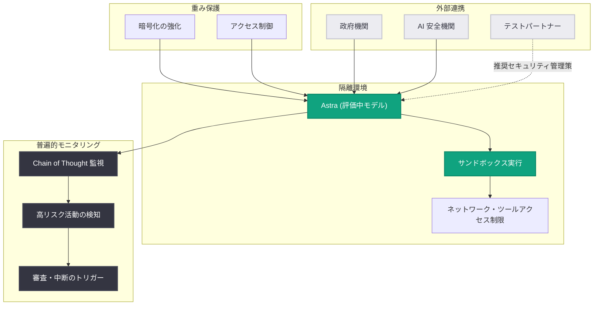

# 重大なサイバー能力の新たなフロンティアへの対応: Astra の予備評価とセーフガード強化

## メタデータ

| 項目 | 内容 |
|------|------|
| 発表日 | 2026-08-07 |
| ソース | OpenAI News |
| カテゴリ | セキュリティ / 安全性 / Preparedness Framework |
| 公式リンク | https://openai.com/index/responding-next-frontier-critical-cyber-capabilities |

## 概要

OpenAI は、次期モデル「Astra」の内部予備評価において、エージェント型コーディングとサイバーセキュリティ分野で大幅な能力向上を確認し、Preparedness Framework が定める「Critical (重大)」レベルのサイバー能力に到達する可能性を排除できないと結論づけたことを公表しました。これは、これまで「High」評価にとどまっていた既存モデル (GPT-5.6-Sol を含む) から一段階進んだ能力シフトの可能性を示すものであり、OpenAI は透明性の観点から、この予備評価の結果と講じている対策を安全・セキュリティコミュニティと共有しています。

本発表では、隔離されたテスト環境やモデル重みの保護強化などのセキュリティ管理策、Chain of Thought (思考の連鎖) の普遍的モニタリング、政府機関や AI 安全機関との連携など、Critical しきい値への接近に備えた多層的な対応が説明されています。なお、Astra は先日報告された Hugging Face の悪用事案には関与していないことが明記されています。

## 主な内容

### Preparedness Framework における Critical しきい値

Preparedness Framework は、フロンティアモデルがもたらす重大リスクを追跡・評価するために OpenAI が 2023 年 12 月に初公開したフレームワークです。サイバーセキュリティ分野における「Critical」しきい値は、以下のいずれかを満たす場合に該当します。

- **ゼロデイ脆弱性の自律的な悪用**: 人間の介入なしに、堅牢化された実世界の多数の重要システムに対するゼロデイ脆弱性を特定・悪用できる
- **エンドツーエンドの新規攻撃戦略**: 高レベルの目標を与えるだけで、堅牢化されたターゲットに対する新規のサイバー攻撃戦略を立案・実行できる

### Astra の予備評価結果

**評価のポイント**:

- **能力の大幅な向上**: エージェント型コーディングとサイバーセキュリティ評価において、既存モデルを大きく上回る性能を確認
- **Critical の可能性を排除できず**: 評価は継続中であるものの、予備評価での性能が高く、Critical しきい値到達の可能性を否定できないと判断
- **従来モデルとの比較**: GPT-5.6-Sol を含む過去のモデルは「High」評価にとどまっていた
- **Hugging Face 事案との関係**: Astra は Hugging Face における悪用事案には関与していないことを明記

### 講じている対策

OpenAI は、Critical レベルの能力を持つ可能性があるモデルに対して、以下の 5 つの柱で対応を進めています。

#### 1. 強化されたセキュリティ管理

- 隔離されたテスト環境での評価実施
- ネットワークおよびツールアクセスの制限
- モデル重み (weights) の保護と暗号化の強化
- 監視・検知能力の追加
- サンドボックス化された実行環境

#### 2. 内部活動の一時停止

強化されたセキュリティ要件を満たさない Astra 関連の内部活動を停止し、要件を満たす環境でのみ作業を継続します。

#### 3. 普遍的モニタリング

訓練・評価を含むすべてのエージェント型用途において、Chain of Thought を監視し、高リスク活動を検知した場合には審査・中断を行うセキュリティ対応をトリガーします。

#### 4. 外部連携

関連する政府機関および選定された AI 安全機関 (AI Safety Institute) と協力し、能力テストを実施します。

#### 5. 第三者向けガイダンス

高リスク評価を安全に実行するための推奨セキュリティ管理策を、テストパートナーに提供します。

## 技術的な詳細

### セーフガードのアーキテクチャ

以下の図は、Astra に適用されている多層的なセキュリティ管理の全体像を示しています。

### Preparedness Framework の能力レベル

| レベル | 定義 (サイバーセキュリティ分野) | 該当モデル |
|--------|------------------------------|-----------|
| High | 攻撃作戦を大幅に強化しうる能力 | GPT-5.6-Sol などの既存モデル |
| Critical | ゼロデイ脆弱性の自律的な特定・悪用、または堅牢化ターゲットへの新規攻撃戦略のエンドツーエンド実行 | Astra (可能性を排除できず、評価継続中) |

### 過去の対応との連続性

- **2023 年 12 月**: Preparedness Framework を初公開
- **2025 年 6 月**: 生物学分野で High しきい値への接近時に同様のプロアクティブな対応を実施
- **2026 年 8 月**: サイバーセキュリティ分野で Critical しきい値の可能性に対応 (本発表)

## 開発者への影響

- **Astra 関連の展開スケジュール**: Critical 評価が確定するまで、強化されたセキュリティ要件下でのみ開発が進むため、一般提供の時期や条件に影響する可能性があります
- **防御的ユースケースの拡大**: OpenAI は、高度なサイバー能力を持つモデルは攻撃者より先に防御側が脆弱性を発見・修正するために活用されるべきという立場を示しており、セキュリティ分野での防御的な活用機会が広がる可能性があります
- **エージェント型ワークフローの監視強化**: すべてのエージェント型用途での Chain of Thought 監視は、今後の API やエージェント製品におけるモニタリング設計の方向性を示唆しています
- **第三者評価の実務指針**: テストパートナー向けの推奨セキュリティ管理策は、自組織で高リスクな AI 評価を行う際の参考になります

## 関連リンク

- [OpenAI 公式発表](https://openai.com/index/responding-next-frontier-critical-cyber-capabilities)
- [OpenAI Preparedness Framework](https://openai.com/preparedness)
- [OpenAI Safety & Security](https://openai.com/safety)
- [第三者によるサイバーセキュリティ評価に関する発表 (2026-08-04)](https://openai.com/index/third-party-cyber-evaluations-involving-openai-models)
- [OpenAI News](https://openai.com/news)

## まとめ

OpenAI は、次期モデル Astra の予備評価で Preparedness Framework の「Critical」サイバー能力の可能性を排除できないと判断し、確定前の段階からプロアクティブに対策を公表しました。

**主要なポイント**:

- **予防的な透明性**: 評価が継続中の段階で能力シフトの可能性を公表し、安全・セキュリティコミュニティと情報を共有
- **多層的なセーフガード**: 隔離環境、重みの暗号化強化、サンドボックス実行、ネットワーク・ツールアクセス制限を実施
- **普遍的モニタリング**: すべてのエージェント型用途で Chain of Thought を監視し、高リスク活動を審査・中断
- **外部との協働**: 政府機関・AI 安全機関との能力テスト、テストパートナーへのセキュリティガイダンス提供
- **防御優先の姿勢**: 高度なサイバー能力は攻撃者より先に防御側の脆弱性発見・修正に役立てるべきという方針を明示

フロンティアモデルの能力が Critical しきい値に近づく中で、評価確定前からセーフガードを先行適用する OpenAI のアプローチは、AI 業界全体のリスク管理の先例となる重要な取り組みです。
