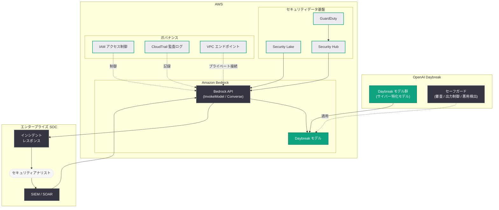

# Daybreak モデルが AWS で利用可能に: Amazon Bedrock を通じたエンタープライズサイバー防衛の展開

## メタデータ

| 項目 | 内容 |
|------|------|
| 発表日 | 2026-08-11 |
| ソース | OpenAI News |
| カテゴリ | 新機能 / サイバーセキュリティ / パートナーシップ |
| 公式リンク | https://openai.com/index/daybreak-models-are-now-available-on-aws |

> **注記:** 本記事のページは Cloudflare によるアクセス保護が有効であり、記事本文の直接取得ができなかった。本レポートは、RSS 概要「OpenAI and AWS are making Daybreak cybersecurity capabilities available through Amazon Bedrock to support enterprise security workflows」および過去の関連レポート群 (2026-04-28 AWS パートナーシップ、2026-05-11 Daybreak 発表、2026-06-23 Daybreak グローバル展開等) に基づいて構成されている。正確な詳細については公式ページを参照されたい。

## 概要

OpenAI と AWS は 2026 年 8 月 11 日、OpenAI のサイバーセキュリティブランド「Daybreak」のモデル群を Amazon Bedrock を通じて提供開始することを発表した。これにより、AWS をプライマリクラウドとして利用するエンタープライズ企業は、既存の AWS インフラストラクチャとセキュリティ運用基盤の中で、Daybreak のサイバー防衛能力を自社のセキュリティワークフローに直接統合できるようになる。

本発表は、2026 年 4 月 28 日の OpenAI-AWS パートナーシップ拡大 (GPT-5.5 と Codex の Bedrock 提供開始) と、2026 年 5 月 11 日に始動したサイバー防衛統合ブランド「Daybreak」という 2 つの戦略の合流点に位置づけられる。これまで Daybreak のサイバー特化モデル (GPT-5.4-Cyber、GPT-5.5-Cyber 等) は OpenAI API 経由の Trusted Access for Cyber プログラムを通じて提供されてきたが、Bedrock 経由の提供により、SOC (Security Operations Center) や SIEM といったエンタープライズのセキュリティ運用環境との統合が大幅に容易になる。

## 主な内容

### Amazon Bedrock を通じた Daybreak 提供の意義

Daybreak モデルの Bedrock 提供は、サイバー防衛 AI の「利用のしやすさ」を大きく前進させるものである。エンタープライズのセキュリティチームにとって、以下の点が重要な変化となる。

- **既存インフラ内での利用**: AWS 環境内で Daybreak の能力を呼び出せるため、機密性の高いセキュリティデータ (アラート、ログ、脅威情報) を外部に送出することなく分析できる
- **統一 API インターフェース**: Bedrock の標準 API を通じて、他の基盤モデルと同一のインターフェースで Daybreak モデルを利用可能
- **エンタープライズ統制との整合**: IAM によるアクセス制御、CloudTrail による監査ログ、VPC エンドポイントによるプライベート接続など、AWS の標準的なガバナンス機構がそのまま適用される
- **AWS セキュリティサービスとの近接性**: Amazon Security Lake、GuardDuty、Security Hub などに集約されたセキュリティデータと同一クラウド内で AI 分析を実行できる

### エンタープライズセキュリティワークフローの支援

RSS 概要で示されている通り、本提供の主眼は「エンタープライズセキュリティワークフローの支援」である。Daybreak がカバーするサイバー防衛機能 (過去の発表に基づく) は以下の領域に及ぶ。

| 領域 | 内容 |
|------|------|
| 脅威インテリジェンス分析 | MITRE ATT&CK に基づく脅威マッピング、IoC 分析、APT グループの TTP 分析 |
| 脆弱性研究と管理 | 脆弱性の発見支援、CVE 分析、大規模コードベースのセキュリティ監査 |
| インシデントレスポンス | アラートトリアージの自動化、検出から封じ込めまでの支援、フォレンジック分析 |
| 重要インフラ防衛 | IT/OT 統合環境の脅威分析、ICS/SCADA の監視と異常検知 |
| マルウェア解析 | バイナリ解析、マルウェアファミリーの分類と挙動分析 |

これらの機能が Bedrock 経由で利用可能になることで、セキュリティチームは既存の SOC ワークフロー (アラート対応、脅威ハンティング、インシデント調査) に AI による分析・自動化を組み込みやすくなる。

### Daybreak 戦略の進化における位置づけ

本発表は、2026 年に入って加速してきた OpenAI のサイバーセキュリティ戦略の最新ステップである。

| 日付 | 施策 | 位置づけ |
|------|------|----------|
| 2026-04-14 | Trusted Access for Cyber 拡大 | 基盤プログラムの確立 |
| 2026-04-24 | GPT-5.4-Cyber 限定リリース | 初期サイバー特化モデルの展開 |
| 2026-04-28 | OpenAI モデルの AWS (Bedrock) 提供開始 | マルチクラウド展開の始動 |
| 2026-05-07 | GPT-5.5-Cyber 展開 | 次世代サイバーモデルへの移行 |
| 2026-05-11 | Daybreak 統合ブランド発表 | 全施策のブランド統合 |
| 2026-06-23 | Daybreak: Securing the World | グローバル展開の本格化 |
| 2026-08-11 | **Daybreak モデルの AWS 提供** | **エンタープライズ流通チャネルの拡大** |

4 月 28 日の発表で GPT-5.5 と Codex が Bedrock に到来した際、サイバー特化モデルは対象外であった。今回の発表により、Daybreak というサイバー防衛ポートフォリオそのものが AWS のエンタープライズ顧客基盤に開かれたことになり、「防衛者への AI 能力の民主化」という Daybreak のミッションが、クラウドの流通チャネルを通じて実装される段階に入った。

### 安全性への配慮: デュアルユースリスクの管理

サイバーセキュリティモデルは本質的にデュアルユース (防御にも攻撃にも転用可能) の性質を持つ。OpenAI はこれまで、Trusted Access for Cyber プログラムによる審査済み防衛者への限定提供、出力制御、悪用検出といった多層的なセーフガードを講じてきた。

直近では、2026 年 8 月 7 日に次期モデル Astra の予備評価で Preparedness Framework の「Critical」サイバー能力の可能性が公表され、8 月 4 日には第三者によるサイバーセキュリティ評価に関する発表も行われるなど、サイバー能力の管理は OpenAI の安全性アジェンダの中心にある。Bedrock 経由の Daybreak 提供においても、AWS のアカウント管理・利用審査と OpenAI 側のアクセス管理を組み合わせた統制が適用されると考えられ、詳細な利用条件は公式ページおよび AWS のドキュメントで確認する必要がある。

## 技術的な詳細

### アーキテクチャ: Bedrock を通じた Daybreak 統合

以下の図は、Amazon Bedrock を通じて Daybreak モデルをエンタープライズセキュリティワークフローに統合する全体像を示している。



### コードサンプル: Bedrock 経由での脅威分析 (想定例)

Bedrock の標準 API を使用した Daybreak モデル呼び出しの想定例を示す。実際のモデル ID とパラメータは公式ドキュメントで確認されたい。

```python
import boto3
import json

# Amazon Bedrock ランタイムクライアントの作成
bedrock_runtime = boto3.client(
    "bedrock-runtime",
    region_name="us-east-1"
)

# Daybreak モデルによる脅威分析 (モデル ID は想定例)
response = bedrock_runtime.converse(
    modelId="openai.daybreak-cyber",
    messages=[
        {
            "role": "user",
            "content": [
                {
                    "text": (
                        "Analyze the following security alerts for potential "
                        "APT activity and map findings to MITRE ATT&CK:\n\n"
                        "- Scheduled task created: svchost_update.exe\n"
                        "- DNS queries to DGA-generated domains\n"
                        "- Beacon traffic on port 443\n"
                        "- LSASS memory access via unsigned process\n\n"
                        "Provide threat assessment and recommended "
                        "containment actions."
                    )
                }
            ]
        }
    ],
    inferenceConfig={
        "maxTokens": 4096,
        "temperature": 0.2
    }
)

print(response["output"]["message"]["content"][0]["text"])
```

### エンタープライズ統合のポイント

- **データレジデンシー**: AWS リージョン内での推論実行により、セキュリティログや脅威情報を組織のデータ境界内で処理できる
- **最小権限アクセス**: IAM ポリシーで Daybreak モデルへのアクセスをセキュリティチームの特定ロールに限定できる
- **監査とコンプライアンス**: すべてのモデル呼び出しが CloudTrail に記録され、セキュリティ運用の監査要件を満たす
- **課金の一元化**: Daybreak の利用料金が AWS の請求に統合され、セキュリティ予算の管理が簡素化される

## 開発者への影響

- **AWS ネイティブなセキュリティ AI 開発**: AWS 上でセキュリティツールやサービスを開発する事業者は、Azure や OpenAI API を別途契約することなく、Daybreak の能力を自社製品に組み込む道が開かれる
- **SOC 自動化の加速**: SIEM/SOAR パイプラインに Bedrock 経由で Daybreak を組み込むことで、アラートトリアージやインシデント調査の自動化を既存の AWS アーキテクチャの延長線上で実装できる
- **アクセス要件の確認が必要**: サイバー特化モデルはデュアルユースリスク管理のため利用審査を伴う可能性が高い。Trusted Access for Cyber との関係や Bedrock 上での利用申請プロセスを公式情報で確認する必要がある
- **マルチクラウド戦略の選択肢拡大**: OpenAI API (Trusted Access 経由) と Bedrock の両チャネルで Daybreak を利用できるようになり、組織のクラウド戦略に応じた柔軟な選択が可能になる

## 関連リンク

- [OpenAI 公式発表: Daybreak models are now available on AWS](https://openai.com/index/daybreak-models-are-now-available-on-aws)
- [Daybreak: Frontier AI for Cyber Defenders (公式ポータル)](https://openai.com/daybreak/)
- [Amazon Bedrock 公式ドキュメント](https://docs.aws.amazon.com/bedrock/)
- [OpenAI Safety](https://openai.com/safety)
- [OpenAI News](https://openai.com/news)

### 関連レポート

- [OpenAI モデル、Codex、Managed Agents が AWS に到来 (2026-04-28)](./2026-04-28-openai-models-codex-managed-agents-aws.md)
- [Daybreak: OpenAI サイバー防衛イニシアチブの統合ブランドが始動 (2026-05-11)](./2026-05-11-openai-daybreak-cyber-defenders.md)
- [Daybreak: Securing the World — グローバル展開 (2026-06-23)](./2026-06-23-daybreak-securing-the-world.md)
- [第三者によるサイバーセキュリティ評価 (2026-08-04)](./2026-08-04-third-party-cyber-evaluations-openai-models.md)
- [重大なサイバー能力の新たなフロンティアへの対応 (2026-08-07)](./2026-08-07-responding-next-frontier-critical-cyber-capabilities.md)

## まとめ

OpenAI と AWS は、サイバー防衛ブランド「Daybreak」のモデル群を Amazon Bedrock を通じて提供開始した。本発表の主要なポイントは以下の通りである。

- **エンタープライズへの流通チャネル拡大**: Daybreak のサイバー防衛能力が、AWS のエンタープライズ顧客基盤とセキュリティ運用環境に直接届くようになった
- **セキュリティワークフローとの統合**: Security Lake や SIEM/SOAR と同一クラウド内で AI 分析を実行でき、機密データを外部に送出せずに脅威分析・インシデント対応を支援できる
- **AWS ガバナンスの適用**: IAM、CloudTrail、VPC エンドポイントといった AWS 標準の統制機構のもとで、サイバー特化モデルを安全に運用できる
- **戦略の合流点**: 4 月の AWS パートナーシップと 5 月の Daybreak ブランド始動という 2 つの戦略が合流し、「防衛者への AI 能力の民主化」がクラウド流通の段階に入った

サイバー攻撃の高度化が進む中、フロンティア AI の防衛能力を企業が使い慣れたクラウド基盤上で利用できるようにする本発表は、防衛側の技術的優位性の確保という Daybreak のミッションを実運用レベルで前進させる重要な一歩である。利用にあたっては、審査プロセスや利用条件などの詳細を公式ページで確認されたい。
