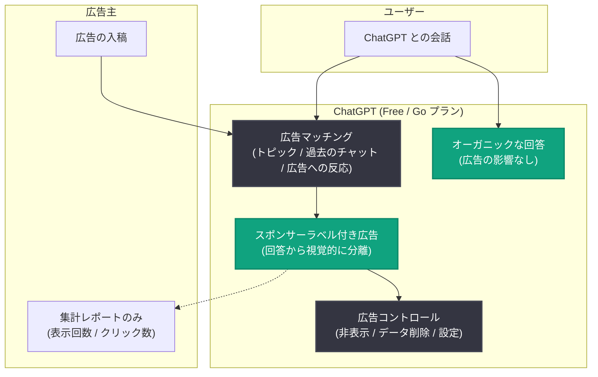

# ChatGPT 広告のテストと国際展開 - 無料アクセス維持のための新たな収益モデル

## メタデータ

| 項目 | 内容 |
|------|------|
| 発表日 | 2026-08-11 (初出: 2026-02-09) |
| ソース | OpenAI News |
| カテゴリ | Company (製品方針) |
| 公式リンク | https://openai.com/index/testing-ads-in-chatgpt |

## 概要

OpenAI は 2026 年 2 月 9 日に米国で ChatGPT 内広告のテストを開始し、段階的な拡大を経て、2026 年 8 月 11 日のアップデートで「ChatGPT Ads」が英国、メキシコ、ブラジル、日本、韓国の 5 か国で正式に開始されたことを発表した。広告は無料 (Free) および低価格 (Go) プランのログイン済み成人ユーザーが対象で、Plus、Pro、Business、Enterprise、Education の各プランには表示されない。

OpenAI は、広告収入によって無料・低価格プランのインフラ投資を支え、より多くの人が高品質な AI にアクセスできるようにすることを目的としていると説明している。その一方で、「回答の独立性」「会話のプライバシー」「ユーザーによるコントロール」という 3 つの原則を一貫して維持するとしている。

## 主な内容

### 展開のタイムライン

本記事は 2026 年 2 月の初出以降、複数回更新されており、段階的な展開の経緯が確認できる。

| 時期 | 内容 |
|------|------|
| 2026-02-09 | 米国でログイン済み成人ユーザー (Free / Go プラン) を対象に広告テストを開始 |
| 2026-03-26 | 初期結果が良好 (信頼指標への影響なし、低い広告非表示率) と報告。カナダ、オーストラリア、ニュージーランドへのパイロット拡大を発表 |
| 2026-05-07 | 英国、メキシコ、ブラジル、日本、韓国へのパイロット拡大計画を発表 |
| 2026-08-11 | 上記 5 か国で ChatGPT Ads が正式ローンチ。年内にさらに多くの市場へ拡大予定 |

2026 年 3 月時点の報告では、消費者の信頼指標への影響は見られず、広告の非表示 (dismiss) 率も低く、フィードバックに基づく広告関連性の改善が続いているとされている。

### 対象プランとオプトアウト

- **広告が表示される**: Free、Go プランのログイン済み成人ユーザー
- **広告が表示されない**: Plus、Pro、Business、Enterprise、Education プラン
- **オプトアウト**: 広告を見たくない場合は Plus / Pro プランへのアップグレード、または 1 日あたりの無料メッセージ数を減らす代わりに Free プランで広告をオプトアウトすることが可能

### 広告の仕組みと回答の独立性

広告は ChatGPT の回答内容に影響を与えず、回答はユーザーにとって最も有用な内容に最適化される。広告表示に関する仕組みは以下の通り。

- 広告は常に「スポンサー (sponsored)」として明示的にラベル付けされ、オーガニックな回答から視覚的に分離される
- 広告の選択は、会話のトピック、過去のチャット、過去の広告とのインタラクションに基づいてマッチングされる (例: レシピを調べている場合、ミールキットや食料品配達の広告が表示される)
- 複数の広告主が存在する場合、会話に最も関連性の高い広告が優先的に表示される

### プライバシー保護

広告はユーザーのプライバシーを尊重するよう設計されている。

- **広告主はチャットにアクセスできない**: チャット内容、チャット履歴、メモリ、個人情報は広告主に共有されない
- **集計情報のみ提供**: 広告主が受け取るのは表示回数やクリック数などの集計されたパフォーマンス情報のみ
- **未成年保護**: ユーザーが 18 歳未満と申告した場合、または 18 歳未満と予測される場合は広告を表示しない
- **センシティブなトピックの除外**: 健康、メンタルヘルス、政治などのセンシティブ・規制対象トピックの近くには広告を表示しない
- **ターゲティングの制限**: 狭いターゲティング広告を防ぐガードレールを設け、詐欺や誤解を招く広告のリスクを減らすため広告主プログラムへの参加を慎重に管理する

### ユーザーによるコントロール

ユーザーは ChatGPT に表示される広告を以下の方法でコントロールできる。

- 広告の非表示 (dismiss) とフィードバックの送信
- 特定の広告が表示された理由の確認
- 広告データのワンタップ削除
- 広告パーソナライゼーション設定の管理 (過去のチャットやメモリを広告に使用するかのトグルを含む)
- 広告履歴 (Ads History) の閲覧とクリア

### 長期的な価値と今後の展望

OpenAI は、ユーザーが選択肢を検討したり意思決定に向けて作業している場面では、会話型インターフェースの広告がより関連性が高く有用になり得るとしている。企業向けには、今後広告フォーマット、目的、購買モデルの拡充や、企業が ChatGPT 内で消費者とやり取りする新しい方法の構築を進めるとしており、興味のある企業は [openai.com/advertisers](https://openai.com/advertisers/) から登録できる。

## 広告表示の流れ

## ユーザー・企業への影響

- **日本のユーザー**: 2026 年 8 月 11 日より、日本の Free / Go プランのログイン済み成人ユーザーに広告が表示されるようになった。Plus 以上のプランでは引き続き広告なしで利用できる
- **無料ユーザー**: 広告収入により無料・低価格プランの品質と機能の向上が期待される。広告を望まない場合はオプトアウトの選択肢がある (無料メッセージ数の削減と引き換え)
- **企業・マーケター**: 日本を含む新市場で ChatGPT 広告への出稿機会が開かれた。会話の文脈に基づく高い関連性が特徴で、今後フォーマットや購買モデルの拡充が予定されている
- **開発者**: 本件は ChatGPT コンシューマー製品の変更であり、API には影響しない

## 関連リンク

- [Testing ads in ChatGPT (公式記事)](https://openai.com/index/testing-ads-in-chatgpt)
- [Our approach to advertising and expanding access (広告原則)](https://openai.com/index/our-approach-to-advertising-and-expanding-access/)
- [ChatGPT 広告主向けページ](https://openai.com/advertisers/)
- [OpenAI News](https://openai.com/news)

## まとめ

OpenAI は 2026 年 2 月の米国でのテスト開始から約半年で、ChatGPT 広告を英国、メキシコ、ブラジル、日本、韓国の 5 か国に正式展開した。広告は Free / Go プランの成人ユーザーのみが対象で、「回答は広告の影響を受けない」「会話は広告主に共有されない」「ユーザーが広告体験をコントロールできる」という 3 原則を掲げている。無料アクセスの維持・拡大を広告収入で支えるビジネスモデルへの本格的な移行であり、年内にはさらに多くの市場への拡大が予定されている。日本のユーザーにも直接影響する変更であるため、広告設定やオプトアウトの選択肢を把握しておくことが望ましい。
