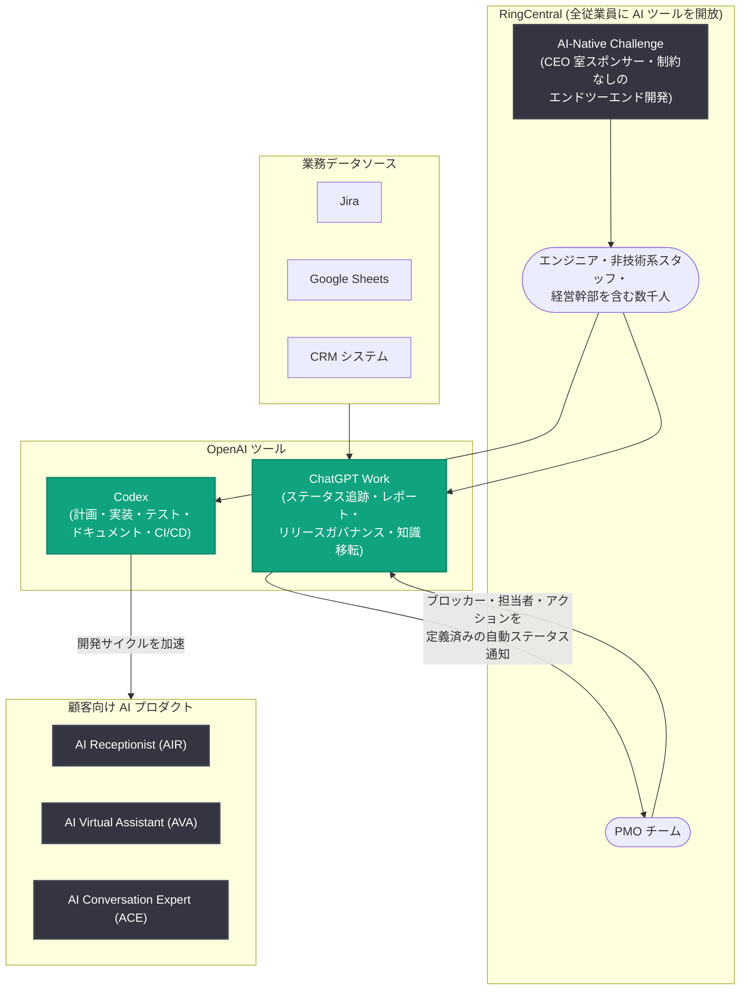

# RingCentral、ChatGPT Work と Codex でエンジニアリングからオペレーションまで AI ネイティブな働き方を構築

## メタデータ

| 項目 | 内容 |
|------|------|
| 発表日 | 2026-08-12 |
| ソース | OpenAI News |
| カテゴリ | 導入事例 (Customer Story) |
| 公式リンク | https://openai.com/index/ringcentral |

## 概要

ビジネスコミュニケーション分野で約 30 年の歴史を持ち、年間売上 26 億ドル超・世界中に数千人の従業員を擁するグローバル企業 RingCentral は、ChatGPT Work と Codex を全従業員に開放し、「AI ネイティブ」な働き方への転換を進めている。エンジニアリング経験の有無にかかわらず、社内の誰もがプロダクトやインフラを構築できる環境を整備した点が特徴である。

中核となる取り組みは、CEO 室がスポンサーとなった社内コンペティション「AI-Native Challenge」である。参加者全員に ChatGPT Work と Codex が提供され、ワークフローの制約なしにエンドツーエンドのプロジェクトを構築することが求められた。非技術系スタッフや経営幹部を含む数千人の従業員が動作するプロジェクトを完成させ、この経験は同社の AI プロダクト開発の加速と、PMO (プログラムマネジメントオフィス) を中心とする業務オペレーションの AI 化へと発展している。

## 導入の背景

### AI ネイティブ企業への転換

RingCentral は約 30 年にわたりビジネスコミュニケーション分野でイノベーションを続けてきた。同社はその伝統を発展させる形で、全従業員が ChatGPT Work と Codex を自由に試せる環境を用意し、AI ネイティブな働き方を全社に浸透させる戦略を採用した。

> "When you put real AI tools in everyone's hands, the whole company becomes a product organization. Every one of our products—including but not limited to our Agentic Voice AI portfolio of AIR, AVA, ACE—gets sharper as we compress the distance between an idea and a shipped feature, and that's exactly what AI-native development lets us do."
>
> (本物の AI ツールを全員の手に渡すと、会社全体がプロダクト組織になります。AIR、AVA、ACE をはじめとするエージェント型ボイス AI ポートフォリオを含むすべての製品は、アイデアから機能出荷までの距離を圧縮することで磨かれていきます。それこそが AI ネイティブ開発が可能にすることです)
>
> — Kira Makagon 氏 (RingCentral、President & Chief Operating Officer)

## 活用方法

### AI-Native Challenge: 全社的な AI フルエンシーの醸成

グローバルなエンジニアリング組織全体で AI 活用能力 (AI フルエンシー) を高めるため、RingCentral の CEO 室は「AI-Native Challenge」を主催した。取り組みの要点は以下のとおりである。

- **ツールの全員配布**: 参加者全員に ChatGPT Work と Codex を提供
- **制約のない課題設定**: ワークフローの指定など一切の制約なしに、完全なエンドツーエンドのプロジェクトを構築することを要求
- **開発ライフサイクル全体の体験**: 単なるコーディング演習ではなく、計画・実装からテスト、ドキュメント作成、CI/CD、イテレーションまで、AI ネイティブ開発のライフサイクル全体に没入させる設計
- **広範な参加と成果**: ほぼすべての参加者が動作するリポジトリを作成し、非技術系スタッフや経営幹部を含む数千人の従業員が動作するプロジェクトを完成

> "The clearest lesson from the challenge was that AI-native development isn't about replacing engineers—it's about amplifying them."
>
> (チャレンジから得られた最も明確な教訓は、AI ネイティブ開発とはエンジニアを置き換えることではなく、エンジニアを増幅することだということです)
>
> — RingCentral、プロジェクトを主導したエンジニアリングリーダー

同リーダーは、AI が開発サイクル全体を加速する一方で、プロダクト要件の策定、ビジネスコンテキストの提供、アーキテクチャの意思決定、すべての成果物のテストと検証といった役割は人間がループ内に残って担うと強調している。

### Codex による自社 AI プロダクト開発の加速

RingCentral にとってこのチャレンジは、「AI を社内で活用して顧客向けプロダクトをより速く開発する」という全社戦略の実践モデルでもある。同社は Codex を活用した同じアプローチを、自社の AI プロダクトポートフォリオの開発加速にも適用している。

| プロダクト | 内容 |
|-----------|------|
| RingCentral AI Receptionist (AIR) | AI 受付 |
| AI Virtual Assistant (AVA) | AI バーチャルアシスタント |
| AI Conversation Expert (ACE) | AI 会話エキスパート |

これらのエージェント型ボイス AI 製品群において、アイデアから顧客向け機能の出荷までの距離を短縮している。

### ChatGPT Work による PMO の日常業務運営

AI-Native Challenge のような取り組みに触発され、非エンジニアリング部門にも AI ネイティブな働き方が広がっている。PMO (プログラムマネジメントオフィス) は ChatGPT Work を用いて、「プログラムマネジメントのオペレーティングシステム」と呼べる仕組みを構築した。散在するメモやチャット履歴を、以下の AI ワークフローに置き換えている。

- ステータストラッキング
- レポーティング
- リリースガバナンス
- ナレッジトランスファー (知識移転)

> "ChatGPT brings my project context together. With ChatGPT Work, I can turn that context into actions and execution."
>
> (ChatGPT は私のプロジェクトコンテキストを 1 つにまとめてくれます。ChatGPT Work を使えば、そのコンテキストをアクションと実行に変えることができます)
>
> — Vaneet Seth 氏 (RingCentral、Senior Manager, R&D Efficiency, PMO)

代表的なアプリケーションが**ステータスレポートの自動化**である。PMO チームは ChatGPT Work を使い、Jira、Google Sheets、CRM システムなど複数のソースで追跡されている課題 (issue) から通知を生成するワークフローを構築した。「何が変わったのか」を尋ねながら会議に入るのではなく、ブロッカー、担当者、アクションがあらかじめ定義された状態で会議に臨めるようになった点が大きな違いである。

## AI 活用の構成

## 成果

記事で示されている主な成果は以下のとおりである。

| 項目 | 内容 |
|------|------|
| AI-Native Challenge の参加成果 | ほぼすべての参加者が動作するリポジトリを作成 |
| プロジェクト完成者 | 非技術系スタッフ・経営幹部を含む数千人の従業員が動作するプロジェクトを完成 |
| プロダクト開発 | Codex により AIR・AVA・ACE などの AI プロダクトのアイデアから出荷までの距離を短縮 |
| PMO 運営 | 手作業の調整を削減し、より多くのプロジェクトをより高い正確性で処理 |

実験への開かれた招待として始まった取り組み (数千人のエンジニアがゼロから構築) は、PMO のようなチームがプログラムを運営するためのオペレーション基盤へと成熟した。エンジニアリングとオペレーションのいずれでも、「従業員に AI を試す余地を与えることは、個人のスキルを高めるだけでなく、会社が稼働するためのインフラそのものを構築する」という同じパターンが成立していると記事は締めくくっている。

## 企業・導入担当者への影響

- **全員参加型のイネーブルメントモデル**: 特定チームへの限定導入ではなく、全従業員に ChatGPT Work と Codex を開放し、制約のないチャレンジ形式で AI フルエンシーを育成するアプローチの実例を提供している
- **経営層の直接的なスポンサーシップ**: CEO 室がチャレンジをスポンサーすることで、AI 活用を現場任せにせず全社戦略として推進する体制の重要性を示している
- **開発ライフサイクル全体での AI 活用**: コーディング支援にとどまらず、計画、テスト、ドキュメント、CI/CD、イテレーションまでを含む「AI ネイティブ開発ライフサイクル」の考え方を提示している
- **人間がループ内に残る役割分担**: 要件定義、ビジネスコンテキスト、アーキテクチャ判断、テストと検証は人間が担うという、AI と人間の協働モデルを明確にしている
- **非エンジニア部門への展開パターン**: エンジニアリング発の取り組みが PMO のステータスレポート自動化 (Jira・Google Sheets・CRM の横断) など業務オペレーションへ波及する道筋を示している

## 関連リンク

- [How RingCentral builds AI-native work from engineering to ops (OpenAI 公式)](https://openai.com/index/ringcentral)
- [ChatGPT Work](https://openai.com/chatgpt/work/)
- [Codex](https://openai.com/codex/)
- [RingCentral 公式サイト](https://www.ringcentral.com/)
- [OpenAI News](https://openai.com/news)

## まとめ

RingCentral は、ChatGPT Work と Codex を全従業員に開放し、CEO 室スポンサーの「AI-Native Challenge」を通じて、非技術系スタッフや経営幹部を含む数千人が動作するプロジェクトを完成させるという全社的な AI フルエンシーを実現した。同じ Codex 活用アプローチは AIR・AVA・ACE といった自社エージェント型ボイス AI 製品の開発加速にも適用され、アイデアから出荷までの距離を短縮している。さらに PMO は ChatGPT Work で Jira・Google Sheets・CRM を横断するステータスレポート自動化などの「プログラムマネジメントのオペレーティングシステム」を構築し、実験から始まった取り組みが業務のオペレーション基盤へと成熟した。エンジニアの置き換えではなく増幅という位置づけと、人間がループ内で判断と検証を担う協働モデルは、AI ネイティブ企業への転換を目指す組織の参考になる事例である。
