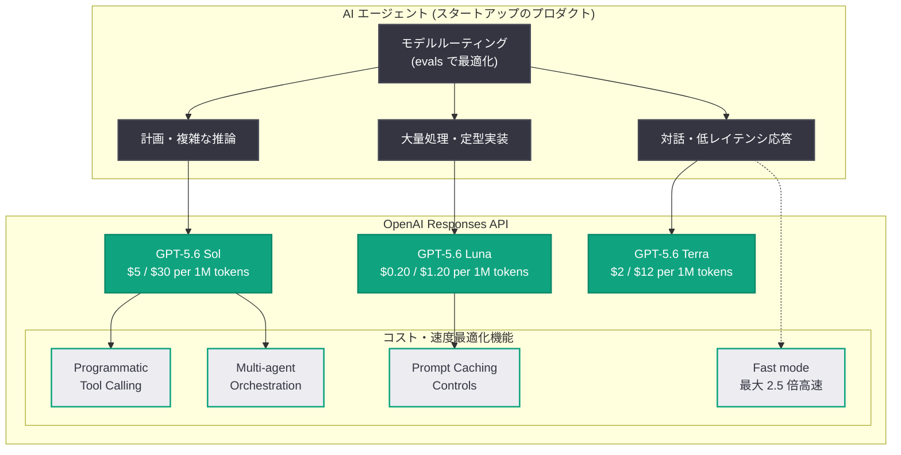

# The builder's guide to GPT-5.6 — スタートアップのためのモデル選択と Responses API 活用ガイド

## メタデータ

| 項目 | 内容 |
|------|------|
| 発表日 | 2026-08-13 |
| ソース | OpenAI News (Applied AI) |
| カテゴリ | 開発者向けガイド / ベストプラクティス |
| 公式リンク | https://openai.com/index/builders-guide-to-gpt-5-6 |

> **注**: 本レポート作成時点で記事本文の全文取得ができなかったため (Bot 保護による制限)、RSS 概要「Learn how startups use GPT-5.6 to build faster, more cost-efficient AI agents with smarter model selection and new Responses API capabilities.」と、GPT-5.6 に関する既報の公式発表 (2026-07-09 モデルファミリー発表、2026-07-30 料金改定と Fast mode 導入、2026-08-05 Fast mode 長文対応) に基づいて構成している。個別の事例企業名や記事固有の数値は原文で確認されたい。

## 概要

OpenAI は 2026 年 8 月 13 日、Applied AI カテゴリの記事として「The builder's guide to GPT-5.6」を公開した。スタートアップが GPT-5.6 ファミリーを使って、より高速でコスト効率の高い AI エージェントを構築するための実践ガイドであり、賢いモデル選択 (smarter model selection) と Responses API の新機能の活用が 2 本柱となっている。

GPT-5.6 は 2026 年 7 月 9 日に Sol (フラッグシップ) / Terra (バランス型) / Luna (効率型) の 3 層構成で発表され、7 月 30 日には Luna 80%・Terra 20% の大幅値下げと Fast mode の導入が行われた。本ガイドはこれらの発表を受けて、「どのステップにどのモデルを割り当て、どの API 機能でラウンドトリップとコストを削るか」という、エージェント構築の設計判断を体系化するものと位置づけられる。

## 主な内容

### 賢いモデル選択: Sol / Terra / Luna の使い分け

GPT-5.6 ファミリーは共通仕様 (1.05M トークンコンテキスト、128K トークン最大出力、6 段階の推論エフォート) を持ちながら、価格と知能のバランスが異なる 3 モデルで構成される。

| モデル | 位置づけ | 入力 (per 1M tokens) | 出力 (per 1M tokens) | 主な用途 |
|--------|----------|---------------------|---------------------|----------|
| GPT-5.6 Sol | フラッグシップ | $5.00 | $30.00 | 計画立案、複雑な推論、不確実性の解消 |
| GPT-5.6 Terra | バランス型 | $2.00 | $12.00 | 日常業務、チャットボット、コンテンツ生成 |
| GPT-5.6 Luna | 最速・最安 | $0.20 | $1.20 | 大量処理、分類、仕様が明確な実装作業 |

OpenAI が繰り返し強調しているのは「AI を効率的に使うことは成果 (outcome) の定義から始まる」という原則である。リスクの大きさ、エラーのコスト、緊急性、規模によって知能・速度・信頼性・コストの最適なバランスは決まり、それはワークフローのステップごとに変わり得る。評価 (evals) を使って「追加の知能が結果を実質的に改善する箇所」と「より速く低コストな処理で同じ品質を出せる箇所」を見極めることが推奨される。

参考として、Luna は 1 年前のフロンティア級モデルに匹敵する性能を約 6% のコストかつ約 9 倍の速度で提供するとされており、大量処理を伴うエージェントの経済性を大きく変えている。

### Responses API の新機能によるエージェント構築

GPT-5.6 世代で Responses API に追加された機能群は、エージェントのレイテンシとコストを削減する上で中心的な役割を果たす。

- **Programmatic Tool Calling**: モデルが JavaScript を記述・実行して複数ツールを協調させ、並列実行・ループ・条件分岐を単一リクエスト内で処理。複数ラウンドトリップを排してレイテンシとトークン消費を削減する
- **Multi-agent Orchestration (ベータ)**: ルートエージェントがサブエージェントを並列に起動・協調 (spawn_agent、send_message など 6 アクション)。専門化したサブエージェントへの分割が API レベルでサポートされる
- **Explicit Prompt Caching Controls**: キャッシュ動作を明示的に制御し、ヒット率を最適化。キャッシュ入力は通常入力の 10 分の 1 の価格であり、長いシステムプロンプトやツール定義を持つエージェントでは効果が大きい
- **推論の細粒度制御**: `reasoning.effort` (none〜max の 6 段階) と Pro モードにより、ステップの難易度に応じた推論リソース配分が可能
- **Fast mode**: `service_tier: "fast"` の指定で Standard 比最大 2.5 倍の速度 (価格 2 倍)。2026 年 8 月 5 日からは 272K トークン超の長文コンテキストにも対応

### スタートアップにとっての意味

RSS 概要が示す通り、本ガイドの想定読者は「速く、安く」動く必要のあるスタートアップである。7 月 30 日の値下げにより、Luna での大量処理 (ドキュメント分析、問い合わせ分類、定型実装) は従来比 80% 安で運用でき、Sol の Fast mode はユーザー体験に直結する応答時間を短縮する。限られた資金でエージェントプロダクトをスケールさせるための「モデルルーティング + API 機能活用」の型を示すことが、本ガイドの狙いといえる。

## 技術的な詳細

### モデルルーティングの基本パターン

コーディングエージェントを例にした、公式発表で示されている分担の型。

- **Sol**: 不確実性の解消、計画立案 (必要なら `reasoning.effort: "high"` 以上)
- **Luna**: 仕様が明確な変更の実装、テストの作成・実行、結果の評価

### コードサンプル

ステップごとにモデルを使い分けるエージェントの例 (Responses API)。

```python
from openai import OpenAI

client = OpenAI()

# ステップ 1: Sol で計画を立てる (高い推論エフォート)
plan = client.responses.create(
    model="gpt-5.6-sol",
    input="このリポジトリの障害レポートを分析し、修正計画を立ててください: ...",
    reasoning={"effort": "high"},
)

# ステップ 2: Luna で仕様が明確な実装を大量・低コストに実行
for task in parse_tasks(plan.output_text):
    result = client.responses.create(
        model="gpt-5.6-luna",
        input=f"次のタスクを実装してください:\n{task}",
        reasoning={"effort": "low"},
    )
    print(result.output_text)

# 応答時間が重要な対話パスでは Fast mode を指定
answer = client.responses.create(
    model="gpt-5.6-sol",
    input="ユーザーからの緊急の質問: ...",
    service_tier="fast",  # Standard 比で最大 2.5 倍高速 (価格 2 倍)
)
print(answer.output_text)
```

Programmatic Tool Calling でラウンドトリップを削減する例。

```python
response = client.responses.create(
    model="gpt-5.6-terra",
    input="最新の Python セキュリティ勧告を 3 件検索し、それぞれ詳細を取得して表にまとめてください。",
    tools=[
        {"type": "function", "name": "web_search", "description": "Web を検索する",
         "parameters": {"type": "object",
                        "properties": {"query": {"type": "string"}},
                        "required": ["query"]}},
        {"type": "function", "name": "fetch_url", "description": "URL の内容を取得する",
         "parameters": {"type": "object",
                        "properties": {"url": {"type": "string"}},
                        "required": ["url"]}},
    ],
    tool_choice="programmatic",  # モデルが JavaScript でツールを協調制御
)
print(response.output_text)
```

注: 上記は既報の公式発表に基づく利用イメージ。正確なパラメータは公式ドキュメントを参照。

## アーキテクチャ

コスト効率の高いエージェントの設計イメージ。ステップごとのモデルルーティングと Responses API 機能の組み合わせを示す。



## 開発者への影響

- **モデル選択が設計の中心課題になる**: 単一モデル前提の設計から、ステップごとに Sol / Terra / Luna を割り当てるルーティング設計へ移行し、evals で継続的に検証するプラクティスが標準になる
- **エージェントの単価が大幅に低下**: Luna の値下げ ($0.20 / $1.20 per 1M tokens) により、大量処理を含むエージェントの運用コストが従来比で大きく下がり、スタートアップでもスケールさせやすくなった
- **ラウンドトリップ削減の手段が揃った**: Programmatic Tool Calling とマルチエージェントオーケストレーションにより、従来はクライアント側で組んでいた協調ロジックを API 側に寄せられる
- **レイテンシ要件は Fast mode で対応**: ユーザー対話など応答時間が重要なパスのみ `service_tier: "fast"` を指定する選択的な適用が、コストと体験のバランスを取る現実的な方法になる
- **キャッシュ設計の重要性が増す**: 長いシステムプロンプトやツール定義を持つエージェントでは、Explicit Prompt Caching Controls によるヒット率最適化がコストに直結する

## 関連リンク

- [発表記事 (原文)](https://openai.com/index/builders-guide-to-gpt-5-6)
- [GPT-5.6 の発表](https://openai.com/index/gpt-5-6/)
- [GPT-5.6 で価格性能フロンティアを前進 (原文)](https://openai.com/index/advancing-the-price-performance-frontier-with-gpt-5-6)
- [Responses API リファレンス](https://platform.openai.com/docs/api-reference/responses)
- [Fast mode ガイド](https://developers.openai.com/api/docs/guides/fast-mode)
- [API 料金の詳細](https://openai.com/business/pricing/#api)
- 既存レポート: [GPT-5.6 モデルファミリーの発表 (2026-07-09)](2026-07-09-gpt-5-6-model-family.md) / [値下げと Fast mode 導入 (2026-07-30)](2026-07-30-gpt-5-6-price-performance-frontier.md) / [Fast mode 長文対応 (2026-08-05)](2026-08-05-fast-mode-long-context-support.md)

## まとめ

「The builder's guide to GPT-5.6」は、スタートアップが GPT-5.6 で高速かつコスト効率の高い AI エージェントを構築するための実践ガイドである。柱は 2 つあり、1 つはワークフローのステップごとに Sol (計画・複雑な推論) / Terra (バランス) / Luna (大量処理) を使い分けるモデルルーティングを evals で最適化すること、もう 1 つは Programmatic Tool Calling、マルチエージェントオーケストレーション、Prompt Caching Controls、Fast mode といった Responses API の新機能でラウンドトリップ・レイテンシ・コストを削ることである。7 月の大幅値下げと合わせて、限られたリソースでエージェントプロダクトをスケールさせるための設計指針がまとまった形となる。
