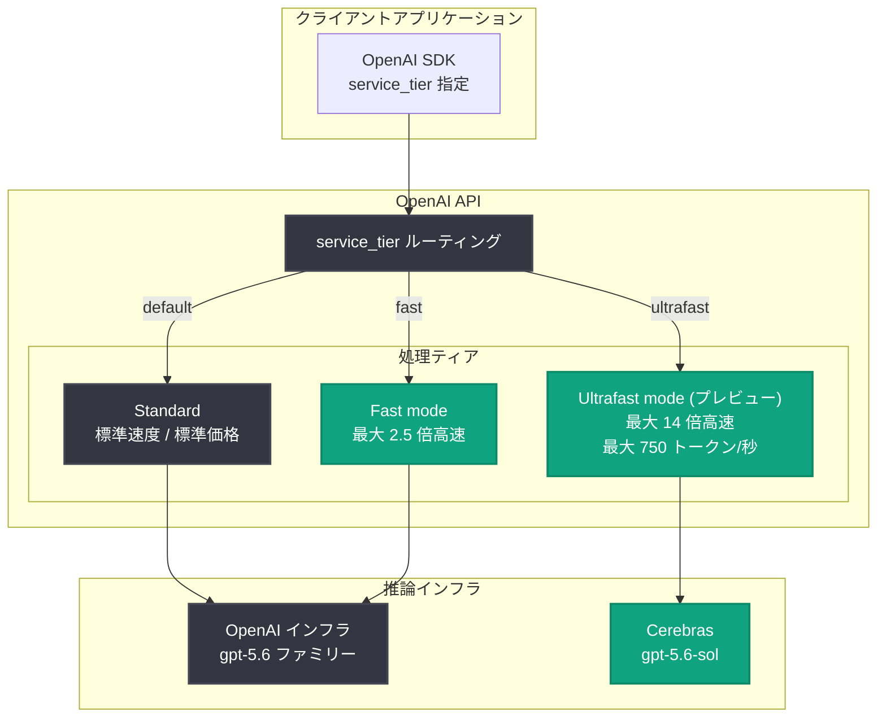

# Ultrafast mode プレビュー発表: GPT-5.6 Sol を最大 14 倍高速化 (Cerebras 提供、最大 750 トークン/秒)

## メタデータ

| 項目 | 内容 |
|------|------|
| 発表日 | 2026-08-13 |
| ソース | OpenAI News |
| カテゴリ | Product (API 更新) |
| 公式リンク | https://openai.com/index/previewing-ultrafast |

## 概要

OpenAI は 2026 年 8 月 13 日、OpenAI API の新しいサービスティア「Ultrafast mode」のプレビューを発表した。Ultrafast mode は GPT-5.6 Sol を最大 14 倍高速に実行するティアであり、Cerebras のインフラストラクチャを基盤として、最大 750 出力トークン/秒のスループットを実現する。

OpenAI API では 2026 年 7 月 30 日に Priority Processing を置き換える形で Fast mode (Standard 比で最大 2.5 倍) が導入され、8 月 5 日には長文コンテキスト対応が追加されるなど、推論速度を軸としたサービスティアの拡充が続いている (既存レポート: [Fast mode 導入と GPT-5.6 値下げ](2026-07-30-api-fast-mode-gpt-5-6-price-cuts.md)、[Fast mode 長文コンテキスト対応](2026-08-05-fast-mode-long-context-support.md) 参照)。今回の Ultrafast mode はその延長線上に位置する最上位の速度ティアであり、Fast mode の最大 2.5 倍をさらに大きく上回る速度を提供する。また、Cerebras という外部のウェハースケール推論ハードウェアを明示した点でも注目される発表である。

> **注記**: 本レポート作成時点で記事本文の全文取得ができなかったため、公式発表の RSS 概要と既存の Fast mode 関連情報に基づいて構成している。料金、対象 API、プレビューへの参加条件などの詳細は、末尾の公式リンクで最新情報を確認してほしい。

## 主な内容

### Ultrafast mode とは

RSS 概要では以下のように説明されている。

> "Preview Ultrafast, a new OpenAI API service tier that runs GPT-5.6 Sol up to 14× faster. Powered by Cerebras, it delivers up to 750 output tokens per second."

発表内容の要点は次の 3 点である。

- **新サービスティア**: OpenAI API の `service_tier` として提供される新しい処理ティア (プレビュー段階)
- **対象モデル**: GPT-5.6 Sol (`gpt-5.6-sol`)。GPT-5.6 ファミリーの最上位モデルが対象
- **速度**: 最大 14 倍の高速化、最大 750 出力トークン/秒

### Cerebras によるインフラストラクチャ

Ultrafast mode は Cerebras を基盤としている ("Powered by Cerebras")。Cerebras はウェハースケールチップによる超高速 LLM 推論で知られる企業であり、OpenAI が自社 API のサービスティアとして外部の推論インフラを明示するのは特徴的な動きである。GPU クラスタベースの推論と比較して、ウェハースケールアーキテクチャはメモリ帯域とチップ内通信の面で有利であり、トークン生成のスループットを大幅に引き上げられる。

### 既存サービスティアとの比較

OpenAI API の速度系サービスティアは、今回の発表で 3 段階の構成となる。

| 項目 | Standard | Fast mode | Ultrafast mode (プレビュー) |
|------|----------|-----------|---------------------------|
| 提供開始 | - | 2026-07-30 | 2026-08-13 (プレビュー) |
| 対象モデル | 全モデル | GPT-5.6 ファミリー等 | GPT-5.6 Sol |
| 速度 (Standard 比) | 1 倍 | 最大 2.5 倍 | 最大 14 倍 |
| スループット | - | - | 最大 750 出力トークン/秒 |
| 基盤 | OpenAI インフラ | OpenAI インフラ | Cerebras |
| 提供状態 | GA | GA | プレビュー |

単純計算では、最大 750 出力トークン/秒が Standard 比 14 倍に相当するため、Standard ティアの GPT-5.6 Sol は 50 トークン/秒台、Fast mode (最大 2.5 倍) は 130 トークン/秒台のオーダーとなり、Ultrafast mode は Fast mode と比較しても 5 倍超の高速化となる。

## 技術的な詳細

Fast mode と同様に、サービスティアは API リクエストの `service_tier` パラメータで指定する方式が採用されるとみられる。レスポンスオブジェクトの `service_tier` フィールドで、実際に使用されたティアを確認できる。

なお、プレビュー段階のため、正確なパラメータ値、対象エンドポイント (Responses API / Chat Completions API)、料金、レート制限、利用可能なアカウント条件は公式ドキュメントで確認が必要である。

### コードサンプル

Python (Responses API) での指定例。`service_tier` の正確な値はプレビュー参加時に公式ドキュメントで確認すること。

```python
from openai import OpenAI

client = OpenAI()

response = client.responses.create(
    model="gpt-5.6-sol",
    input="リアルタイム応答が必要な質問です。今日の会議の要点を 3 行でまとめてください。",
    service_tier="ultrafast",  # プレビュー: 正確な値は公式ドキュメントを参照
)

print(response.output_text)
print(response.service_tier)  # 実際に使用されたティアを確認
```

curl:

```bash
curl https://api.openai.com/v1/responses \
  -H "Authorization: Bearer $OPENAI_API_KEY" \
  -H "Content-Type: application/json" \
  -d '{
    "model": "gpt-5.6-sol",
    "input": "Hello!",
    "service_tier": "ultrafast"
  }'
```

## アーキテクチャ



## 開発者への影響

- **リアルタイム体験の質的な変化**: 750 出力トークン/秒は、長文の回答でもほぼ瞬時に生成が完了する速度である。音声エージェント、対話型 UI、コーディングアシスタントなど、体感レイテンシが UX を左右するアプリケーションで新しい設計が可能になる
- **最上位モデルを高速に利用可能**: 従来、速度を優先する場合は Luna などの小型モデルを選ぶトレードオフがあったが、Ultrafast mode ではフラッグシップの GPT-5.6 Sol の品質を保ったまま高速化できる
- **エージェントワークフローの高速化**: 多段のツール呼び出しや推論ステップを含むエージェント処理では、各ステップの生成速度が全体の所要時間を支配する。14 倍の高速化はマルチステップ処理の実用性を大きく引き上げる
- **プレビュー段階である点に注意**: 料金、レート制限、SLA、利用条件は未確定または限定的な可能性がある。本番ワークロードへの導入は GA を待つか、フォールバック (Fast mode / Standard) を用意した段階的な移行が望ましい
- **ティア選択戦略の再設計**: Standard / Fast / Ultrafast / Batch と選択肢が増えたため、ワークロードごとにレイテンシ要件とコストを整理し、`service_tier` を使い分ける戦略が重要になる

## 関連リンク

- [公式発表: Previewing Ultrafast mode](https://openai.com/index/previewing-ultrafast)
- [OpenAI API 料金ページ](https://developers.openai.com/api/docs/pricing)
- [Fast mode ガイド](https://developers.openai.com/api/docs/guides/fast-mode)
- [OpenAI API リファレンス](https://platform.openai.com/docs/api-reference)
- [Cerebras 公式サイト](https://www.cerebras.ai/)
- [既存レポート: Fast mode 導入と GPT-5.6 値下げ (2026-07-30)](2026-07-30-api-fast-mode-gpt-5-6-price-cuts.md)
- [既存レポート: Fast mode 長文コンテキスト対応 (2026-08-05)](2026-08-05-fast-mode-long-context-support.md)

## まとめ

2026 年 8 月 13 日に発表された Ultrafast mode は、GPT-5.6 Sol を最大 14 倍高速に実行し、最大 750 出力トークン/秒を実現する OpenAI API の新サービスティア (プレビュー) である。Cerebras のウェハースケール推論インフラを基盤とすることで、Fast mode (最大 2.5 倍) を大きく上回る速度を最上位モデルで提供する。リアルタイム性が重要なアプリケーションやマルチステップのエージェント処理に大きなインパクトを持つ一方、プレビュー段階のため料金や利用条件の詳細は公式ドキュメントでの確認が必要である。
