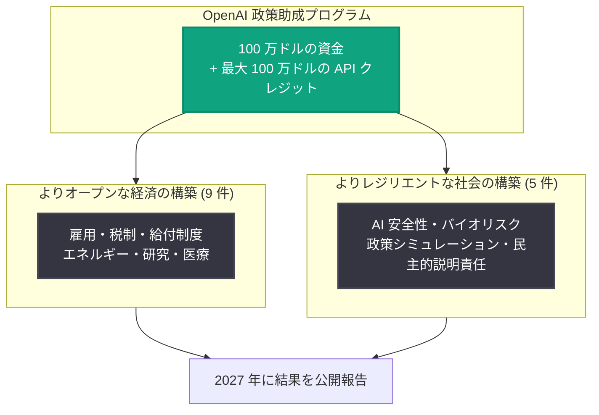

# 知能時代のための新しい政策アイデア: OpenAI が 14 の独立プロジェクトに資金提供

## メタデータ

| 項目 | 内容 |
|------|------|
| 発表日 | 2026-08-17 |
| ソース | OpenAI News |
| カテゴリ | Global Affairs (政策・社会) |
| 公式リンク | https://openai.com/index/new-policy-ideas-for-the-intelligence-age |

## 概要

OpenAI は、知能時代 (Intelligence Age) における経済的機会の拡大と社会的レジリエンスの強化を目的として、独立した研究・政策組織が主導する 14 のプロジェクトに助成金を提供すると発表した。これは 2026 年 4 月に発表した「Industrial Policy for the Intelligence Age (知能時代の産業政策)」での約束を実行するものであり、合計 100 万ドルの資金と最大 100 万ドルの API クレジットが、400 以上の応募の中から選ばれたプロジェクトに提供される。

OpenAI は、ChatGPT が世界で 10 億人に利用され、あらゆる主要年齢層にユーザーが広がっている一方で、技術への広いアクセスだけでは不十分であり、AI が「少数ではなく多数に奉仕する」かどうかは、社会がその展開と利益分配についてどう選択するかにかかっていると主張している。こうした選択は技術企業だけで行うべきではなく、民主的な制度と公開の議論を通じて形成されるべきであるという立場から、独立組織による政策研究への資金提供に踏み切った。

## 主な内容

### プログラムの全体像

| 項目 | 内容 |
|------|------|
| 資金規模 | 合計 100 万ドルの資金 + 最大 100 万ドルの API クレジット |
| 応募数 | 400 以上の個人・組織からの提案 |
| 採択数 | 14 プロジェクト |
| 対象地域 | 米国、EU、ブラジル、シンガポール、韓国 |
| 期間 | 6 か月間 (結果は 2027 年に報告予定) |

プロジェクトは大きく 2 つのカテゴリに分かれる。

### カテゴリ 1: よりオープンな経済の構築 (9 プロジェクト)

**1. American Enterprise Institute (米国企業研究所)**: AEI-Urban 超党派委員会「AI と米国労働力の未来」。AI が雇用とスキルに与える影響について、低・中・高の 3 段階の混乱シナリオを策定し、観測可能な混乱指標と政策対応集 (プレイブック) を結びつける。

**2. Centre for European Policy Studies (欧州政策研究センター)**: 「Sharing the AI Dividend (AI 配当の共有)」。AI 主導の生産性向上が欧州の労働者・企業・部門・地域・国にどう分配されるかを調査し、EU を米国と比較。新しい欧州社会投資モデルと適応型セーフティネットの政策原則を策定する。

**3. European Centre for International Political Economy (ECIPE)**: 「From Labour to Productive Ownership (労働から生産的所有へ)」。「Right to AI (AI への権利)」の実践的枠組みを開発し、従業員所有、市民投資、年金ベース所有、社会的富基金、知的財産参加などのモデルを比較する。

**4. Abundance Institute**: 「Energy Abundance, State by State (州ごとのエネルギー豊富化)」。データセンター需要に応じて米国各州が発電・送電をどう拡大しつつ地域に測定可能な利益をもたらせるかを比較し、公開の「Data Center Atlas」政策レイヤーを開発する。

**5. Progressive Policy Institute (進歩政策研究所)**: 「Person-based Benefits in the Age of Information (情報時代の個人ベース給付)」。退職・医療・休暇・教育・訓練・障害を対象とする、様々な就労形態に対応した個人ベースの給付制度を設計。職業の広範な変化によって発動する「livelihood insurance (生計保険)」のプロトタイプを作成する。

**6. Tax Foundation (税制財団)**: 「Tax Policy in the Age of AI (AI 時代の税制政策)」。AI 導入が労働所得、企業利益、キャピタルゲインなどの公的歳入源のバランスをどう変えるかを分析し、中立性・簡素性・透明性・安定性・経済効率性の観点から課税オプションを評価する白書を作成する。

**7. Windfall Trust**: AI 経済政策のための国別ワーキンググループ。米国、英国、カナダ、EU、ラテンアメリカでのネットワークを拡大し、様々な AI シナリオ下での財政・労働市場・福祉・競争力の問題を検討。国際経済への備えと調整に特化した国際ワーキンググループも立ち上げる。

**8. Instituto de Matemática Pura e Aplicada (IMPA、ブラジル)**: 「知能時代におけるレジリエントな研究の構築」。研究機関が AI アクセスを科学的進歩に転換するために必要な要素 (エンジニアリング支援、訓練、ガバナンス、計算資源、地域インフラ) を研究し、数学における信頼できる AI 利用ガイダンスを開発する。

**9. Hospital das Clínicas da FMUSP (HCFMUSP、ブラジル)**: 公立病院向け「People-First AI」臨床インフラ。ブラジルの統一保健システム (SUS) 向けに AI 対応臨床情報インフラのプロトタイプを導入前評価する。合成データまたは適切に匿名化されたデータのみを使用し、医師の判断と人間の監督を維持しながら検証する。

### カテゴリ 2: よりレジリエントな社会の構築 (5 プロジェクト)

**10. Institute for Security and Technology (IST)**: 制御不能な RSI (再帰的自己改善) に対する運用フレームワーク。技術的根拠のある定義、制御不能な自己改変の観測可能な指標、研究所間コミュニケーション用インシデント分類法、産業・政府調整のためのエスカレーション経路を開発する。

**11. Nuclear Threat Initiative (NTI)**: AI × バイオリスクのための国境を越えた情報共有の設計。NTI | bio が、AI 能力・リスク・緩和策の国際的な安全な共有の法的実現可能性を検証し、基本的な情報共有アーキテクチャを設計する。

**12. Council on Strategic Risks (CSR)**: 「Safer with People」。CSR の Converging Risks Lab が、国家安全保障専門家がフロンティア AI の安全性とガバナンスにおける組織的能力をどう構築できるかを検討し、監督と人間による有意義な制御の維持に関する公開分析を作成する。

**13. Nanyang Technological University (南洋理工大学、シンガポール)**: 監査可能な政府政策シミュレーションのためのプライバシー保護 LLM エージェント。個人レベルの金融取引データをプライバシー保護型の行動プロファイルに変換し、政府の給付や産業政策に対する世帯の反応を実施前にシミュレートする AI エージェント枠組みを開発する。

**14. Yonsei University (延世大学、韓国)**: AI による民主的説明責任。透明で人間が検証する AI 手法が、韓国の国会における監督機能の質の評価に役立つかを検証し、分析報告書、パイロットデータセット、コードブックを作成する。

## 技術的な詳細

本発表は API や製品機能の変更ではなく、政策研究への資金提供プログラムである。ただし技術的観点では以下の点が注目される。

- **API クレジットの提供**: 資金 (100 万ドル) に加え、最大 100 万ドルの API クレジットが提供され、各プロジェクトが OpenAI のモデルを研究に直接活用できる
- **プライバシー保護技術**: 南洋理工大学のプロジェクトは、個人金融データをプライバシー保護型プロファイルに変換する LLM エージェントを構築し、過去の政策への実際の反応や統計的ベンチマークに対して検証する
- **医療データの扱い**: HCFMUSP のプロジェクトは合成データまたは匿名化データのみを使用し、人間の監督を前提とした導入前評価を行う
- **RSI の測定枠組み**: IST のプロジェクトは、再帰的自己改善システムの観測可能な指標とインシデント分類スキーマの標準化を目指す

## 開発者への影響

本発表は直接的な API 変更を伴わないが、中長期的には以下の影響が考えられる。

- 各国の AI 政策 (税制、給付制度、エネルギー政策、安全規制) の議論が具体化し、AI を活用するビジネスの制度的環境に影響し得る
- 「Right to AI」や AI 配当の分配といった概念が政策枠組みとして検証され、AI アクセスの公共インフラ化に関する議論が進む可能性がある
- RSI やバイオリスクに関する測定・情報共有フレームワークは、将来のフロンティアモデル開発・運用の安全基準につながる可能性がある
- 研究結果は 2027 年に公開報告される予定であり、政策動向を追う開発者・企業にとって参照点となる

## 関連リンク

- [New policy ideas for the Intelligence Age (公式発表)](https://openai.com/index/new-policy-ideas-for-the-intelligence-age)
- [OpenAI Global Affairs](https://openai.com/global-affairs)
- [OpenAI News](https://openai.com/news)

## まとめ

OpenAI は、2026 年 4 月の「知能時代の産業政策」での約束を実行し、400 以上の応募から選ばれた 14 の独立プロジェクトに合計 100 万ドルの資金と最大 100 万ドルの API クレジットを提供する。プロジェクトは「よりオープンな経済の構築」(9 件) と「よりレジリエントな社会の構築」(5 件) の 2 カテゴリに分かれ、米国、EU、ブラジル、シンガポール、韓国の組織が参加する。期間は 6 か月で、結果は 2027 年に報告予定。OpenAI は、AI の展開と利益分配に関する選択は技術企業だけでなく民主的な制度と公開の議論を通じて形成されるべきであり、独立組織は OpenAI 自身の仮定にも異議を唱え、政府が採用できるアイデアの実験場となると位置づけている。
