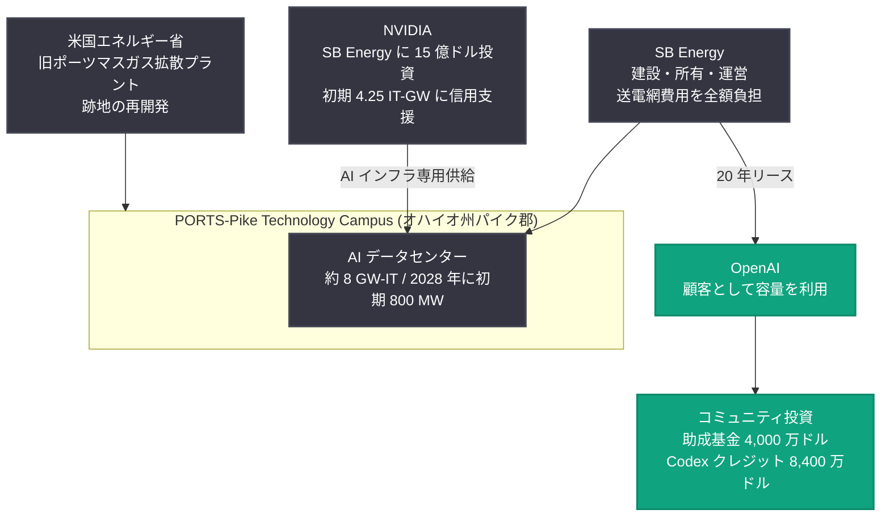

# OpenAI が PORTS-Pike プロジェクトに参画: オハイオ州南部で約 8 GW 級 AI データセンター容量を確保

## メタデータ

| 項目 | 内容 |
|------|------|
| 発表日 | 2026-08-17 |
| ソース | OpenAI News |
| カテゴリ | Global Affairs (インフラ / コミュニティ投資) |
| 公式リンク | https://openai.com/index/openai-joins-ports-pike-project |

## 概要

OpenAI は、オハイオ州パイク郡の PORTS-Pike Technology Campus において、約 8 ギガワット (IT) の AI コンピュートキャパシティを確保する契約を締結したと発表した。本プロジェクトは SB Energy、NVIDIA、米国エネルギー省 (DOE) との協業で進められ、かつて米国の産業と国家安全保障を支えた旧ポーツマスガス拡散プラント (Portsmouth Gaseous Diffusion Plant) の跡地 (DOE 管理の浄化済み用地と民有地) に建設される。

このプロジェクトは、2032 年までの 6 年間の建設期間中に 35,000 人の建設雇用と 2,500 人の長期運営雇用を創出する見込みである。OpenAI はコミュニティ助成基金への 4,000 万ドルの投資、オハイオ州の大学生向けに最大 8,400 万ドル相当の Codex クレジット提供などを表明しており、SB Energy の既存コミットメントと合わせてパイク郡およびオハイオ州住民に総額 1 億 6,000 万ドル超の便益をもたらすとしている。

## 主な内容

### プロジェクトの体制と各社の役割

- **SB Energy**: データセンターを建設・所有・運営し、OpenAI に対して 20 年間のリースで容量を段階的に提供する。送電網のアップグレードや新規送電線の費用も全額負担する
- **OpenAI**: 顧客としてサイトの容量を利用する。フロンティアモデルのトレーニングと製品需要の長期的な増加を見込んで契約しており、完成した容量が利用可能になった時点でのみ支払いを開始する。支払いは事業成長による収益・キャッシュフローと投資家からの調達資本でまかなう
- **NVIDIA**: SB Energy に 15 億ドルを投資し、初期の 4.25 IT-GW 分の土地・電力・建屋整備に対する信用支援を提供する。サイトは NVIDIA 製 AI コンピュートインフラを専用でホストする
- **米国エネルギー省 (DOE)**: 旧ポーツマスガス拡散プラントの連邦用地の再開発で協力する

なお、開発の進行は必要なインフラ、許認可、環境レビュー、資金調達の整備状況に依存するとされている。

### 雇用とコミュニティ投資

- **建設雇用**: 2032 年までの 6 年間の建設期間中に 35,000 人
- **長期運営雇用**: 2,500 人
- **地元優先**: OpenAI と SB Energy は地元の労働者、請負業者、サプライヤー、職能団体、サービス提供者を優先する方針
- **コミュニティ助成基金**: SB Energy の既存の 4,000 万ドルのコミュニティ合意に加え、OpenAI が追加で 4,000 万ドルを投資。使途は学校、公共安全、医療、公益事業、職業訓練、住宅、退役軍人支援、中小企業、勤労家庭支援など、地元住民の優先事項に基づいて決定される
- **税収**: プロジェクトのライフタイムを通じて数億ドル規模の州・地方税収を生み出す見込み。固定資産税収は主に公立学校を支援する

### 労働組合との連携と人材育成

PORTS-Pike Campus は北米建設労働組合 (North America's Building Trades Unions、NABTU) と覚書 (MOU) を締結した。オハイオ州建設職業評議会 (Ohio State Building and Construction Trades Council) とその加盟職種、地元の学校・大学、見習い制度、退役軍人団体、労働パートナー、職業訓練グループと協力し、住民が建設・技術・運営の職務に就けるよう支援する。

### オハイオ州の学生への Codex クレジット提供

OpenAI は 2026-2027 学年度に、オハイオ州の 4 年制大学・コミュニティカレッジ・技術学校に在籍する 18 歳以上の学生約 844,000 人を対象に、最大 8,400 万ドル相当の Codex クレジットを提供する。対象学生は ChatGPT アカウントを通じて一人あたり 100 ドルのクレジットを受け取り、AI を使ってソフトウェア開発や技術プロジェクトを実践的に学べる。エンジニアリング、製造、医療、教育、起業、技能職などのキャリアに向けたスキル構築を支援するのが狙いである。

詳細は [chatgpt.com/codex/ohio-college-students](https://chatgpt.com/codex/ohio-college-students/) で案内されている。

### エネルギーと水資源への配慮

- **エネルギーコストの自己負担**: プロジェクト固有のエネルギー・インフラ費用はプロジェクト側が負担し、オハイオ州や地域の他の電力利用者に転嫁しない。SB Energy による送電網投資は地域の電力網の強化にも寄与する
- **閉ループ空冷方式**: 冷却塔で継続的に水を消費する方式ではなく、水を循環利用する閉ループ・空冷方式を採用。冷却システム充填後の継続的な水使用量は、同規模の人員を支えるオフィスビル (洗面所、設備洗浄・保守、造園などを含む) と同程度になる見込みで、旧ガス拡散プラントの歴史的な水使用量を大幅に下回る
- **水インフラ**: DOE の既存のサイト内給水システムを活用しつつ、地元コミュニティと連携して新たな水インフラにも資金を提供する。サイト設計の確定後、想定水使用量を公表する
- **年次報告**: 地元雇用、コミュニティ投資、水使用、プロジェクト関連のエネルギー使用について、毎年報告書を公表する

### スケジュールと電力供給

最初の 800 メガワットは、主に既存の AEP (American Electric Power) インフラを活用して 2028 年に利用可能になる見込みである。それ以降の拡張には、天然ガス発電を含む新規発電所の系統接続、新規送電線と関連インフラが必要となる。SB Energy はプロジェクトの追加情報を [portscampus.com](https://portscampus.com/) で公開している。

### Ohio Community Compact

OpenAI は住民、地元当局、学校、企業、労働団体、コミュニティグループとの対話を継続し、「Ohio Community Compact」の策定を進める。この Compact は地元の優先事項を反映し、上記の原則をプロジェクトの進行に合わせて具体的かつ公開の施策に落とし込むものとなる。

## プロジェクト構造

## 技術的な詳細

### NVIDIA との共同技術白書

NVIDIA と OpenAI は、データセンターの設計・テスト・コミッショニングを通じて協業する。両社は PORTS-Pike で得た知見をまとめた技術白書を共同で発行する予定で、以下のテーマを扱う。

- レジリエントなインフラ設計
- データセンターコンポーネントの厳格な品質認定
- ソフトウェアレベルのワークロード管理

これらにより、クラスタスケールでのコンピュート可用性の向上、信頼性の向上、平均故障間隔 (mean time between interruptions) の延伸を実現し、次世代スーパーコンピュータ設計のモデルとなることを目指す。

### インフラの位置づけ

OpenAI は、PORTS-Pike のようなデータセンターを、チップ・電力・高速ネットワークとともに AI の物理的基盤と位置づけている。この容量は、より高性能なシステムの開発を可能にし、ChatGPT や Codex といったツールをより信頼性が高く、手頃で、多くの人々や企業が利用できるものにするために使われる。

## 開発者・ユーザーへの影響

- **コンピュート容量の拡大**: 約 8 GW-IT の容量確保により、フロンティアモデルのトレーニングと製品需要増への対応力が強化され、ChatGPT や API サービスの信頼性・可用性向上が期待される
- **オハイオ州の学生**: 対象となる約 844,000 人の学生は 2026-2027 学年度に 100 ドル分の Codex クレジットを受け取り、AI を活用した開発を実践的に学べる
- **業界への知見共有**: NVIDIA との共同技術白書により、大規模クラスタの信頼性設計に関する知見が公開され、次世代データセンター設計の参考になる

## 関連リンク

- [OpenAI joins PORTS-Pike project (公式発表)](https://openai.com/index/openai-joins-ports-pike-project)
- [PORTS Campus (SB Energy によるプロジェクト情報)](https://portscampus.com/)
- [オハイオ州学生向け Codex クレジット案内](https://chatgpt.com/codex/ohio-college-students/)
- [OpenAI News](https://openai.com/news)

## まとめ

OpenAI は SB Energy、NVIDIA、米国エネルギー省と連携し、オハイオ州パイク郡の旧ポーツマスガス拡散プラント跡地に約 8 GW-IT 規模の AI データセンター容量を 20 年リースで確保する。2028 年に最初の 800 MW が稼働予定で、2032 年までの建設期間中に 35,000 人の建設雇用と 2,500 人の長期運営雇用を創出する見込みである。OpenAI は 4,000 万ドルのコミュニティ助成基金と 8,400 万ドル相当の Codex クレジットを含む総額 1 億 6,000 万ドル超の地域便益を約束し、エネルギーコストの自己負担、閉ループ空冷による水資源への配慮、年次報告による透明性確保など、地域社会のパートナーとしての原則を掲げている。20 世紀に米国の産業成長を支えたこの地が、「Intelligence Era」のインフラ構築という新たな役割を担うことになる。
