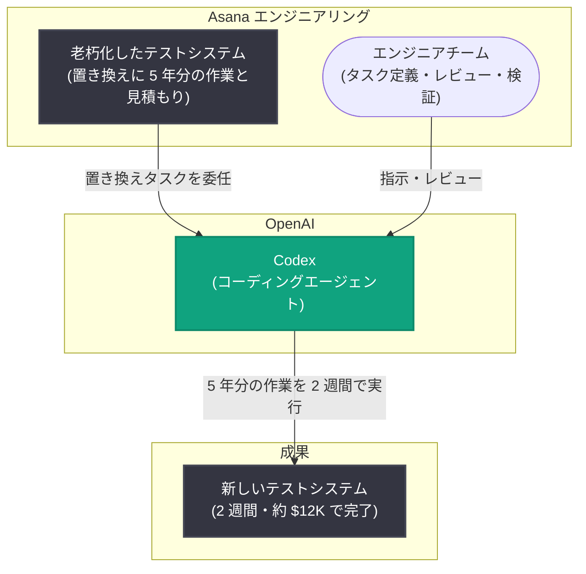

# Asana、Codex で 5 年分のエンジニアリング作業を 2 週間で完了

## メタデータ

| 項目 | 内容 |
|------|------|
| 発表日 | 2026-08-18 |
| ソース | OpenAI News |
| カテゴリ | 導入事例 (Customer Story) |
| 公式リンク | https://openai.com/index/asana |

> **注記**: 本レポートは OpenAI 公式 RSS フィード (OpenAI News) の一次情報に基づいて作成している。記事詳細ページはアクセス制限 (Cloudflare チャレンジ) により全文を取得できなかったため、本文中の事実関係は RSS で公開されているタイトルおよび概要に記載された内容に限定している。

## 概要

ワークマネジメントプラットフォームを提供する Asana は、OpenAI Codex を活用して老朽化したテストシステムの置き換えを 2 週間で完了した。この作業は本来 5 年かかると見積もられていたエンジニアリング作業であり、約 12,000 ドル (約 $12K) のコストで達成された。

大規模なレガシーシステムの移行は、影響範囲の広さと検証コストの高さから長期間の計画を要するのが一般的である。本事例は、AI コーディングエージェントである Codex を大規模なテストインフラの刷新という反復的かつ検証可能なタスクに適用することで、期間とコストの両面で桁違いの圧縮が可能であることを示す実例となっている。

## 主な内容

### 発表された事実 (RSS 一次情報)

公式 RSS で公開されている本事例のポイントは以下のとおりである。

| 項目 | 内容 |
|------|------|
| 企業 | Asana |
| 使用ツール | OpenAI Codex |
| 対象タスク | 老朽化したテストシステム (outdated testing system) の置き換え |
| 実際の所要期間 | 2 週間 |
| 従来の見積もり | 5 年分のエンジニアリング作業 |
| コスト | 約 12,000 ドル ($12K) |

### なぜテストシステムの置き換えが Codex に適していたか

テストコードの移行・書き換えは、次の特性から AI コーディングエージェントとの相性が良いタスク領域とされる。

- **タスクの並列分割が容易**: テストはファイル・スイート単位で独立性が高く、多数のタスクに分割してエージェントに並列で委任しやすい
- **成功条件が機械的に検証可能**: 変換後のテストが実行されてパスするかどうかで成果を自動判定でき、人間のレビュー負荷を絞り込める
- **反復的で人手では消耗するタスク**: 人間のエンジニアが数年単位で担うには単調な作業であり、エージェントへの委任効果が大きい

本事例の「5 年 → 2 週間」という圧縮は、こうした特性を持つ大規模移行タスクに Codex を組織的に適用した成果として位置づけられる。

## 取り組みの構図

## 成果

| 指標 | Before (見積もり) | After (Codex 活用) |
|------|------------------|-------------------|
| 所要期間 | 5 年分のエンジニアリング作業 | 2 週間 |
| コスト | 数年分のエンジニア工数 | 約 12,000 ドル |

期間ベースで約 130 分の 1 (5 年 ≒ 260 週間 → 2 週間) への圧縮であり、エンタープライズにおける技術的負債の解消コストを劇的に引き下げた事例といえる。

## 企業・開発者への影響

- **技術的負債解消の投資判断が変わる**: 「工数が大きすぎて着手できない」と棚上げされてきたレガシーシステムの刷新が、AI エージェントの活用により現実的な期間・予算で実行可能になる
- **テスト・移行系タスクは有力な適用領域**: 成功条件を自動検証できる大規模移行タスクは、Codex のようなコーディングエージェントの効果が定量的に示しやすい適用先である
- **ROI の定量化の好例**: 「5 年分の作業を 2 週間・約 $12K で完了」という具体的な数値は、社内で AI コーディングエージェント導入の稟議・投資判断を行う際の参照事例となる
- **人間の役割はタスク設計と検証へ**: エージェントに大規模タスクを委任する場合でも、タスクの分割設計、レビュー、最終検証は人間のエンジニアが担う体制が前提となる

## 関連リンク

- [Asana cleared 5 years of engineering work in 2 weeks with Codex (OpenAI 公式)](https://openai.com/index/asana)
- [Codex (OpenAI 公式)](https://openai.com/codex/)
- [Codex ドキュメント (OpenAI Platform)](https://platform.openai.com/docs/codex/overview)
- [Asana 公式サイト](https://asana.com/)
- [OpenAI News](https://openai.com/news)

## まとめ

Asana は OpenAI Codex を活用し、5 年分と見積もられていた老朽化テストシステムの置き換えを 2 週間・約 12,000 ドルで完了した。テストの移行のように、タスクを細かく分割でき、成果を機械的に検証できる大規模作業は AI コーディングエージェントの効果が最も定量的に現れる領域であり、本事例はその代表的な実証となっている。長年放置されてきた技術的負債の解消を現実的なコストで実行できることを示した点で、Codex の導入を検討する企業にとって重要な参照事例である。
