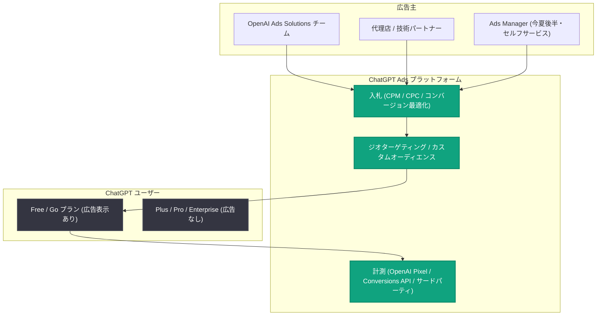

# ChatGPT Ads がヨーロッパ 31 市場に拡大

## メタデータ

| 項目 | 内容 |
|------|------|
| 発表日 | 2026-08-18 |
| ソース | OpenAI News |
| カテゴリ | Product (製品情報) |
| 公式リンク | https://openai.com/index/chatgpt-ads-expands-across-europe |

## 概要

OpenAI は、ChatGPT Ads をヨーロッパの 31 市場に拡大すると発表した。対象国にはドイツ、フランス、スペイン、イタリア、スウェーデン、ノルウェー、デンマーク、オランダ、オーストリアなどが含まれる。2 月にアメリカでパイロットを開始し、その後約 6 か月で 8 市場に追加展開してきた ChatGPT Ads にとって、今回のヨーロッパ展開は過去最大規模の拡大となる。

広告主は、ユーザーが ChatGPT 上で情報を探索し、選択肢を比較し、意思決定を行う場面でリーチできるようになる。当初は OpenAI Ads Solutions チーム、代理店パートナー、技術パートナー経由での利用となり、Ads Manager によるセルフサービスは今夏後半に提供予定である。

## 主な内容

### 対象市場と展開の経緯

- **2026 年 2 月**: アメリカでパイロットを開始
- **過去 6 か月**: 追加で 8 市場に拡大
- **今回**: ヨーロッパ 31 市場への拡大 (過去最大規模)
- 対象国の例: ドイツ、フランス、スペイン、イタリア、スウェーデン、ノルウェー、デンマーク、オランダ、オーストリア
- 提供形態: 当初は OpenAI Ads Solutions チーム、代理店パートナー、技術パートナー経由。Ads Manager によるセルフサービスは今夏後半に提供予定

### 広告の仕組み

- **表示対象**: 広告が表示されるのは Free プランと Go プランのユーザーのみ。Plus、Pro、Enterprise プランは広告なしを維持
- **入札方式**: CPM、CPC に加え、コンバージョン最適化に対応
- **ターゲティング**: ジオターゲティングとカスタムオーディエンスを導入
- **計測**: OpenAI Pixel、Conversions API、サードパーティ計測との統合を提供

### プライバシー保護 (広告原則)

OpenAI は広告展開にあたり、以下の原則を示している。

- 会話内容は広告主に非公開であり、顧客データの販売は行わない
- 広告は明確にラベル付けされ、ChatGPT の回答とは分離される。広告が回答内容に影響することはない
- ユーザーは広告のパーソナライゼーションを制御できる。広告なしの有料プランも選択肢として提供される

記事では、広告の目標について "ads should be useful to people as they pursue their goals and make decisions" (広告は人々の目標達成と意思決定に役立つべき) と述べられている。

## 数値まとめ

| 項目 | 数値 |
|------|------|
| 新規ヨーロッパ市場 | 31 か国 |
| アメリカでのパイロット開始 | 2026 年 2 月 |
| パイロット後の追加拡大市場 | 8 市場 |
| 展開期間 | 約 6 か月 |
| 利用広告主 | 数万規模のマーケター |

## アーキテクチャ

## 影響

### 広告主への影響

- ヨーロッパ 31 市場のユーザーに対し、探索・比較・意思決定の場面でリーチできるようになる
- CPM、CPC、コンバージョン最適化と複数の入札方式を選択でき、ジオターゲティングやカスタムオーディエンスで精緻な配信が可能になる
- OpenAI Pixel、Conversions API、サードパーティ計測との統合により、効果測定を既存のワークフローに組み込める
- 当初はパートナー経由での利用となるため、セルフサービス (Ads Manager) の提供 (今夏後半) までは OpenAI Ads Solutions チームや代理店との連携が必要になる

### ユーザーへの影響

- Free プランと Go プランのユーザーには広告が表示されるようになる。Plus、Pro、Enterprise プランは広告なしのまま
- 会話内容は広告主に共有されず、広告は明確にラベル付けされて回答とは分離される
- 広告のパーソナライゼーションはユーザー自身が制御でき、広告なしの有料プランという選択肢もある

### 開発者への影響

- コンバージョン計測に Conversions API が提供されるため、自社サイトやアプリへの OpenAI Pixel / Conversions API の実装が計測基盤の整備ポイントになる

## 関連リンク

- [ChatGPT Ads expands across Europe (公式発表)](https://openai.com/index/chatgpt-ads-expands-across-europe)
- [OpenAI News](https://openai.com/news)

## まとめ

ChatGPT Ads がヨーロッパ 31 市場に拡大され、2 月のアメリカでのパイロット開始以来、過去最大規模の展開となった。広告は Free / Go プランのユーザーのみに表示され、CPM / CPC / コンバージョン最適化の入札、ジオターゲティング、カスタムオーディエンス、OpenAI Pixel や Conversions API による計測に対応する。会話内容の非公開、広告の明確なラベル付け、パーソナライゼーションの制御といったプライバシー原則を掲げつつ、OpenAI は今後も新しい広告フォーマット、最適化ツール、計測ソリューションの開発を継続するとしている。
