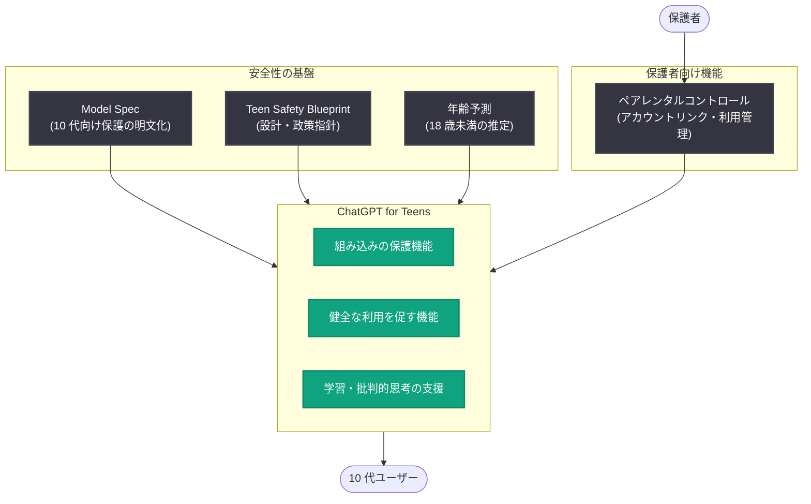

# ChatGPT for Teens 発表: 学習のために設計され、保護機能に支えられた 10 代向け ChatGPT

## メタデータ

| 項目 | 内容 |
|------|------|
| 発表日 | 2026-08-18 |
| ソース | OpenAI News |
| カテゴリ | 新機能 / プロダクト / 安全性 |
| 公式リンク | https://openai.com/index/chatgpt-for-teens |

## 概要

OpenAI は 2026 年 8 月 18 日、10 代のユーザーを対象とした専用体験「ChatGPT for Teens」を発表した。ChatGPT for Teens は、10 代が学び、批判的に思考し、自信を持って AI を活用できるよう支援することを目的としており、より強力な組み込みの保護機能 (built-in protections)、健全な利用を促す機能 (healthy-use features)、保護者向けの追加コントロールを備えている。

本発表は、2025 年 9 月のペアレンタルコントロール導入、2025 年 11 月の Teen Safety Blueprint、2025 年 12 月の Model Spec への 10 代向け保護の追加、年齢予測 (age prediction) への取り組みなど、OpenAI が段階的に進めてきた 10 代の安全性に関する一連の施策を統合し、専用プロダクトとして結実させたものである。同日には CodeAI とのパートナーシップも発表され、「最初の AI 世代」に向けた AI リテラシー教育との両輪で展開される。

## 主な内容

### 学習を中心に据えた設計

ChatGPT for Teens は「Built for learning (学習のために構築)」を掲げており、単なる機能制限版ではなく、10 代の学びに最適化された体験として設計されている。

- **学習支援**: 10 代が学習し、理解を深めることを支援する設計
- **批判的思考の育成**: AI の出力を鵜呑みにせず、批判的に思考する力を養う
- **自信を持った AI 活用**: AI を適切に使いこなすスキルの習得を支援

これは、同日発表された CodeAI パートナーシップにおける「単により多くの学生に AI を使ってもらうのではなく、より良い問いを立てられるよう支援する」という OpenAI の方針とも一致している。

### 強化された保護機能

「Backed by protections (保護機能に支えられた)」という位置づけのとおり、ChatGPT for Teens には以下の安全対策が組み込まれている。

| 保護レイヤー | 内容 |
|------------|------|
| 組み込みの保護機能 | 通常の ChatGPT よりも強力な、10 代向けに調整されたコンテンツ保護 |
| 健全な利用を促す機能 | 過度な利用を防ぎ、健全な AI との関わり方を促進する機能 |
| 保護者向けコントロール | 保護者が子どものアカウント利用を管理できる追加のコントロール |

### これまでの 10 代安全施策の集大成

ChatGPT for Teens は、OpenAI がこれまで公表してきた以下の取り組みの延長線上にある。

- **ペアレンタルコントロール (2025 年 9 月)**: 保護者と 10 代のアカウントをリンクし、利用を管理する仕組みを導入
- **年齢予測への取り組み (2025 年 9 月〜2026 年 1 月)**: ユーザーが 18 歳未満かどうかを推定し、適切な体験へ誘導する技術の開発
- **Teen Safety Blueprint (2025 年 11 月)**: 10 代の安全に関する政策・プロダクト設計の指針を公開
- **Model Spec への 10 代向け保護の追加 (2025 年 12 月)**: モデルの振る舞い仕様に 10 代保護の原則を明文化
- **AI リテラシー資料の公開 (2025 年 12 月)**: 10 代と保護者向けの AI リテラシー教材を提供
- **開発者向け 10 代安全ポリシー (2026 年 3 月)**: gpt-oss-safeguard を通じて、開発者が 10 代向けに安全な AI 体験を構築できるよう支援

## アーキテクチャ

ChatGPT for Teens を支える保護の全体像は以下のように整理できる。

## 開発者・利用者への影響

- **10 代ユーザーの体験変更**: 18 歳未満と判定またはリンクされたユーザーは、より強い保護機能を備えた専用体験に移行することが想定される
- **若年層向け AI 設計の参照モデル**: 「学習支援 + 保護機能 + 保護者コントロール」という 3 層構成は、若年層向け AI プロダクトを設計する開発者にとっての参考モデルとなる
- **教育分野での採用促進**: ChatGPT for Teachers や CodeAI パートナーシップと連動することで、学校・家庭双方での安全な AI 導入の選択肢が広がる
- **規制対応の先行事例**: 各国で進む未成年者のオンライン保護規制に対し、AI 事業者としての具体的な対応例を示すものとなる

## 関連リンク

- [Introducing ChatGPT for Teens (公式発表)](https://openai.com/index/chatgpt-for-teens)
- [Partnering with CodeAI (同日発表のパートナーシップ)](https://openai.com/index/partnering-with-codeai)
- [Introducing parental controls](https://openai.com/index/introducing-parental-controls)
- [Introducing the Teen Safety Blueprint](https://openai.com/index/introducing-the-teen-safety-blueprint)
- [Updating our Model Spec with teen protections](https://openai.com/index/updating-model-spec-with-teen-protections)
- [Our approach to age prediction](https://openai.com/index/our-approach-to-age-prediction)
- [AI literacy resources for teens and parents](https://openai.com/index/ai-literacy-resources-for-teens-and-parents)
- [OpenAI News](https://openai.com/news)
- [OpenAI 公式ドキュメント](https://platform.openai.com/docs)

## まとめ

ChatGPT for Teens は、10 代が学び、批判的に思考し、自信を持って AI を使えるよう支援する専用体験であり、強化された組み込み保護機能、健全な利用を促す機能、保護者向けの追加コントロールを備える。ペアレンタルコントロール、年齢予測、Teen Safety Blueprint、Model Spec の 10 代向け保護といった OpenAI のこれまでの安全施策を統合した集大成的なプロダクトであり、同日発表の CodeAI パートナーシップによる AI リテラシー教育と合わせて、「最初の AI 世代」が安全に AI と関わるための包括的な枠組みを構成している。

*注: 本レポートは OpenAI 公式 RSS フィードおよび関連する公式発表に基づいて作成した。*
