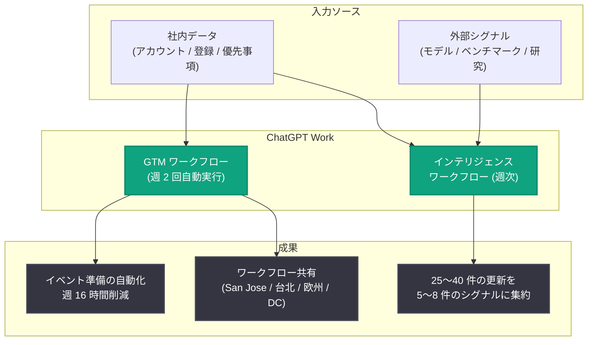

# NVIDIA が ChatGPT Work で専門知識をグローバルにスケール

## メタデータ

| 項目 | 内容 |
|------|------|
| 発表日 | 2026-08-18 |
| ソース | OpenAI News |
| カテゴリ | 導入事例 (ChatGPT Work) |
| 公式リンク | https://openai.com/index/nvidia/chatgpt-work |

## 概要

OpenAI は、NVIDIA が ChatGPT Work を活用して手作業の削減、業界動向シグナルの整理、成功したワークフローのグローバル展開を実現している導入事例を公開した。NVIDIA のナレッジワーカーは、情報の収集・整理に費やす時間を減らし、その情報に基づいて行動する時間を増やしている。

特に GTM (Go-To-Market) チームとソリューションアーキテクトチームでの活用が進んでおり、GTM チームは定型的なオペレーション業務を自動化し、ソリューションアーキテクトは急速に変化する外部の技術動向を NVIDIA の社内優先事項と結び付けるために ChatGPT を利用している。個人が構築したワークフローを他地域のチームへ再利用可能な形で共有できる点が、本事例の大きな特徴である。

## 主な内容

### GTM チーム: イベント準備業務の自動化

NVIDIA の GTM ストラテジストである Will Daney 氏は、グローバルの営業・事業開発・製品リーダーの戦略実行と測定を支援しており、NVIDIA の AI カンファレンスである GTC に向けたフィールド組織のサポートを定期的に担当している。

**Before**: GTC の準備には、アカウントリストの作成、登録状況のトラッキング、顧客・パートナー対応のためのアクション特定など、スプレッドシートでの膨大な作業が必要だった。イベント前の期間には、手作業の分析が業務時間の約 40% を占めていた。

**After**: この作業の多くを、週 2 回自動実行される ChatGPT Work のプロセスに置き換えた。12 週間の GTC 計画サイクル全体で、週あたり約 16 時間の削減を実現している。

さらに、ワークフローを自身で所有しているため、新しいツールの購買・導入・保守を待つことなく、イベントの変化に合わせて自ら適応できる。San Jose、台北、欧州、Washington, DC のイベントを担当する同僚にワークフローを共有し、各地域のニーズに合わせてカスタマイズされている。

> 「ChatGPT の本当の鍵は、すでに開発したワークフローを、ほぼオーバーヘッドなしにイベントごとに自動化できることだと思います」
>
> — Will Daney 氏 (Go-To-Market Strategist, NVIDIA)

### ソリューションアーキテクト: 情報過多からシグナルを抽出

NVIDIA マーケティング組織の AI オペレーションチームに所属する Rachita Jain 氏 (ソリューションアーキテクト) は、AI ワークフローの構築とチームの新ツール導入支援を担当している。新しいモデル、ベンチマーク、研究が毎日登場する業界のペースに追従することが課題だった。

情報自体は容易に入手できるが、どの動向が NVIDIA にとって重要かを判断し、社内のプロジェクト・議論・優先事項と結び付けることが難しい。Jain 氏は ChatGPT Work で、信頼できる外部ソースを社内コンテキストと併せてレビューし、意味のある重なりを特定して、行動につながるインサイトを提示するワークフローを構築した。

**成果**: 毎週約 25〜40 件の外部 AI アップデートを、5〜8 件の実行可能なシグナルへと絞り込んでいる。

> 「ChatGPT は受動的な読書を能動的なインテリジェンスに変えてくれました」
>
> — Rachita Jain 氏 (Solutions Architect, NVIDIA)

同じ環境がプロトタイピングにも活用されている。アイデアの検討からアプローチの探索、コードベースの作業、デバッグ、成果物の改善までを、ツールを切り替えることなく一貫して進められる。ある事例では、アイデアから動作するプロトタイプまで約 3〜5 日で到達した。個別のツールで手作業により構築した場合の見積もりは 2〜3 週間だった。

### 今後の展望: 成功パターンのスケール

次の機会は、すでに機能しているものをスケールさせることである。専門知識を再利用可能なワークフローに変換することで、NVIDIA の各チームは実証済みのプロセスを職能・イベント・地域を越えて適応でき、同時に業務に最も近い人々がプロセスの進化をコントロールし続けられる。

AI の状況が変化し続ける中、これらの共有ワークフローは、外部の動向と社内の優先事項をより迅速に結び付け、AI を活用した働き方をより多くの従業員に広げることに役立つ。目標は、チームが発見の解釈、コラボレーション、顧客支援につながる業務により多くの時間を使えるようにすることである。

> 「ChatGPT は私個人にとって本当にフォースマルチプライヤーです。まるでチームが自分のために働いてくれているようです。細かい作業から抜け出し、本当に重要な仕事に集中できるようになりました」
>
> — Will Daney 氏

## ワークフローの構造

## 導入効果のまとめ

| 項目 | Before | After |
|------|--------|-------|
| GTC 準備の手作業分析 | 業務時間の約 40% | 週 2 回の自動実行プロセスに置き換え |
| GTC 計画サイクル (12 週間) | 手作業中心 | 週あたり約 16 時間を削減 |
| 業界動向の把握 | 受動的な情報収集 | 週 25〜40 件を 5〜8 件の実行可能なシグナルに集約 |
| プロトタイプ開発 | 約 2〜3 週間 (手作業・複数ツール) | 約 3〜5 日 (ChatGPT Work で一貫作業) |
| ワークフローの展開 | 個人・単一イベントに限定 | 複数地域のチームへ共有・カスタマイズ |

## 企業ユーザー・開発者への影響

本事例は、ChatGPT Work をエンタープライズで活用する際の実践的なパターンを示している。

- **現場主導の自動化**: 業務に最も近い担当者が自らワークフローを構築・所有することで、ツールの購買・導入・保守を待たずに変化へ迅速に適応できる
- **ワークフローの再利用性**: 一度構築したワークフローを他地域・他チームへ共有し、ローカルのニーズに合わせてカスタマイズするスケールモデルが有効
- **情報過多への対処**: 外部ソースと社内コンテキストを組み合わせて重要なシグナルを抽出するアプローチは、変化の速い業界の情報収集業務全般に応用可能
- **一貫した構築環境**: アイデア検討からコーディング、デバッグ、改善までを単一環境で行うことで、サイドプロジェクトを数日で実用的な成果物へ発展させられる

## 関連リンク

- [How NVIDIA scales expertise with ChatGPT Work (公式記事)](https://openai.com/index/nvidia/chatgpt-work)
- [ChatGPT for Work](https://openai.com/chatgpt/enterprise/)
- [How NVIDIA engineers and researchers build with Codex (関連事例)](https://openai.com/index/nvidia)
- [OpenAI News](https://openai.com/news)
- [OpenAI ヘルプセンター](https://help.openai.com/)

## まとめ

NVIDIA は ChatGPT Work により、GTM チームのイベント準備業務を自動化して週約 16 時間を削減し、ソリューションアーキテクトは週 25〜40 件の外部 AI アップデートを 5〜8 件の実行可能なシグナルへ集約している。専門知識を再利用可能なワークフローとして共有し、地域や職能を越えて成功パターンをスケールさせるアプローチは、エンタープライズにおける AI 活用の実践的なモデルケースといえる。
