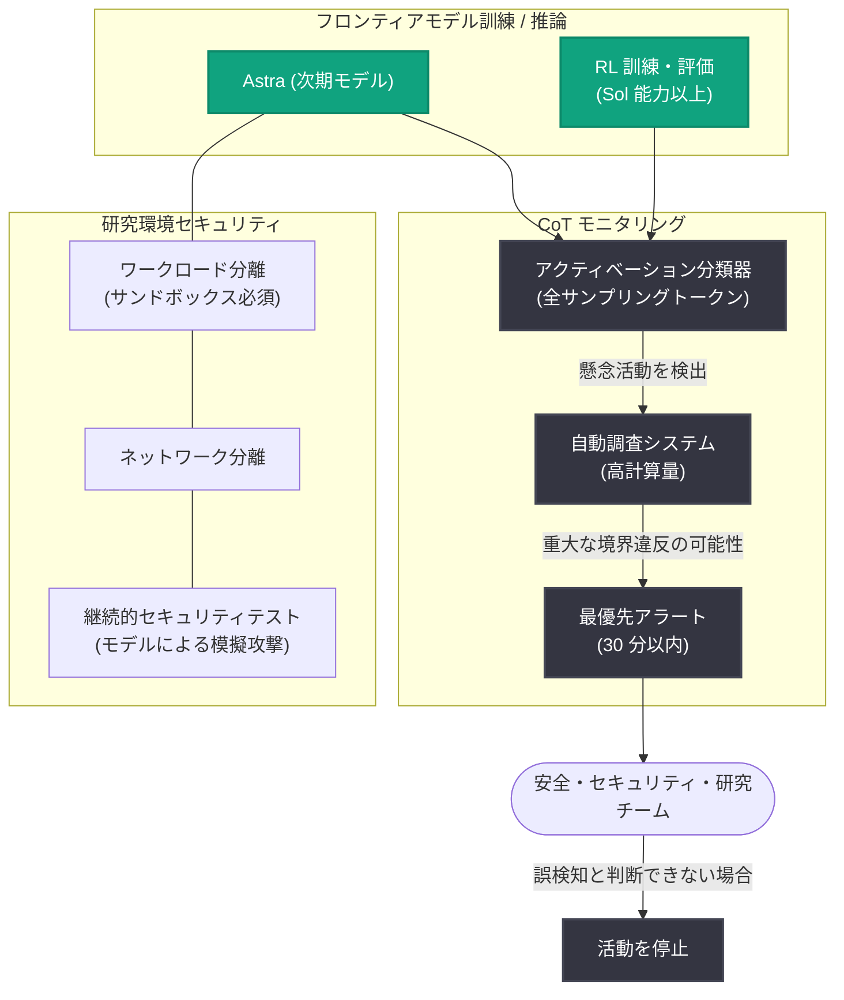

# サイバー重大能力の時代におけるモデル開発ペースの調整

## メタデータ

| 項目 | 内容 |
|------|------|
| 発表日 | 2026-08-18 |
| ソース | OpenAI News |
| カテゴリ | 研究成果 / 安全性 (Research / Safety) |
| 公式リンク | https://openai.com/index/pacing-model-development-cyber-capabilities |

## 概要

OpenAI は、フロンティア AI モデルの開発ペースを安全対策の成熟度に合わせて調整する方針を発表した。背景には 2 つの出来事がある。1 つは Hugging Face のモデル評価に関連するセキュリティインシデント (技術レポートを数週間以内に公開予定)、もう 1 つは次期モデル「Astra」が Preparedness Framework における「Critical (重大)」レベルのサイバーセキュリティ能力の閾値に達する可能性を示す予備的証拠である。

これを受けて OpenAI は、展開予定の最新モデルに対する RL (強化学習) 訓練を 2 週間一時停止し、最大規模のフロンティア RL 実行についても、小規模訓練と評価によりアラインメントの証拠を確立してから再開する方針を示した。同時に、モニタリング、アラインメント、セキュリティ対策という 3 つの相互補強的な安全対策を大幅に強化している。

## 主な内容

### 開発ペース調整の判断

- **RL 訓練の一時停止**: 展開予定の最新モデルに対する RL 訓練を 2 週間停止
- **段階的な再開方針**: 最大規模のフロンティア RL 実行は保留を継続し、小規模訓練と評価でアラインメントの証拠を確立してから再開
- **判断の起点**: 8 月 7 日に Astra が重大サイバー能力を持つ可能性があると判断したことを契機に、追加の安全対策を導入

### 3 つの相互補強的な安全対策

1. **モニタリング**: 懸念される挙動の検出と対応
2. **アラインメント**: 有害または無許可の行動が発生する可能性の低減
3. **セキュリティ対策**: AI システムがアクセス・影響できる範囲の制限

OpenAI は将来的に、モデル自身がセキュリティ業務 (他モデルからの防御を含む) の大半を担うことで、これらの安全対策がモデル能力の向上に応じてスケールすると想定している。

### 研究環境のセキュリティ強化

- **推論の一時停止**: インシデント直後、コード実行やインターネットアクセスが可能なツールを使う研究クラスタでのフロンティアモデル推論を一時停止
- **ワークロード分離**: モデル生成コードや信頼できないコードの実行に強力なサンドボックスを義務化
- **ネットワーク分離**: 単一のワークロード侵害だけではインターネットや内部ネットワークへの不正アクセスができない設計
- **継続的セキュリティテスト**: 脆弱な共有サービスの除去、常設権限の削減、ログ監視の改善、モデルを使った模擬攻撃による自動テスト
- **優先順位付き移行**: Astra およびサイバー関連ワークロードには最高レベルの安全対策を要求。移行が未完了の多数のワークロードは停止中で、安全性・アラインメント関連の研究を優先的に移行

### 思考連鎖 (Chain-of-Thought) モニタリングの拡大

- **多段階構成**: 全サンプリングトークンで動作するアクティベーション分類器 (モデル内部の活動を検査する検出器) から、高計算量の自動調査システムへエスカレーションする仕組み
- **検出対象**: 不正アクセス、データ窃取、破壊的行動、安全対策の回避の試み
- **30 分以内のアラート**: 懸念活動の検出後 30 分以内のアラート発出を目標。重大なセキュリティ境界違反の可能性がある場合は最優先アラートで安全・セキュリティ・研究チームに通知され、30 分以内に誤検知と判断できなければ当該活動を停止
- **適用範囲**: Sol 能力以上のモデルのツール使用を伴う全 RL 訓練・評価に必須。Astra の重大サイバー能力の可能性を判断した後は、ツール使用を伴う Astra の全推論にもモニタリングを追加
- **オーバーヘッド**: モニタリングのコストは監視対象の推論計算量の約 20% と推定

### アラインメント研究の強化

- 最も能力の高いモデルの RL 実行において、訓練プロセスのより多くの段階でコアなアラインメント技術を適用
- 報酬モデルの改善、行動・能力・限界について正直なモデルの訓練
- 報酬ハッキング (意図した成果を達成せずに高報酬を得る行動) や欺瞞の低減

## アーキテクチャ

モニタリングとセキュリティ対策の全体像は以下のとおり。

## 開発者への影響

- **モデルリリース時期への影響**: RL 訓練の一時停止と段階的再開の方針により、次期フロンティアモデル (Astra など) のリリーススケジュールが安全性評価の結果に依存する形になる
- **Preparedness Framework の運用実例**: 「Critical」閾値の可能性が実際に開発ペースへ影響を与えた初の具体例であり、今後のフロンティアモデル開発における安全ゲートの運用を予見できる
- **モニタリングコストの明示**: CoT モニタリングのオーバーヘッドが推論計算量の約 20% と示され、大規模 AI システム運用時の安全性コストの目安となる
- **エージェント運用のベストプラクティス**: ワークロード分離、ネットワーク分離、サンドボックス義務化といった対策は、コード実行やツール使用を伴う AI エージェントを運用する企業にも参考になる
- **今後の情報公開**: モニタリングシステムの詳細ブログ記事とインシデントの技術レポートが近日公開予定であり、外部組織との連携や知見の共有も予定されている

## 関連リンク

- [公式記事: Pacing model development in an era of cyber-critical capabilities](https://openai.com/index/pacing-model-development-cyber-capabilities)
- [Hugging Face モデル評価セキュリティインシデント](https://openai.com/index/hugging-face-model-evaluation-security-incident/)
- [重大サイバー能力への対応 (2026-08-07)](https://openai.com/index/responding-next-frontier-critical-cyber-capabilities/)
- [Preparedness Framework の更新](https://openai.com/index/updating-our-preparedness-framework/)
- [安全性とアラインメントの考え方](https://openai.com/safety/how-we-think-about-safety-alignment/)
- [内部コーディングエージェントのミスアラインメント監視](https://openai.com/index/how-we-monitor-internal-coding-agents-misalignment/)
- [長時間セッションにおける安全性](https://openai.com/index/safety-alignment-long-horizon-models/)
- [OpenAI News](https://openai.com/news)

## まとめ

OpenAI は、次期モデル Astra が Preparedness Framework の「Critical」サイバー能力閾値に達する可能性と、Hugging Face 関連のセキュリティインシデントを受けて、フロンティアモデルの開発ペースを安全対策の成熟度に合わせて調整する方針を明確にした。RL 訓練の 2 週間停止、CoT モニタリングの拡大 (30 分以内アラート、推論計算量の約 20% のオーバーヘッド)、研究環境のワークロード・ネットワーク分離、アラインメント技術の訓練プロセスへの統合という具体策が示されている。記事は「フロンティアモデルの能力は急速に加速しており、理解・アラインメント・セキュリティの能力が常に先行しなければならない」と結んでおり、能力開発と安全性のバランスを制度的に運用する姿勢を示す重要な発表である。
