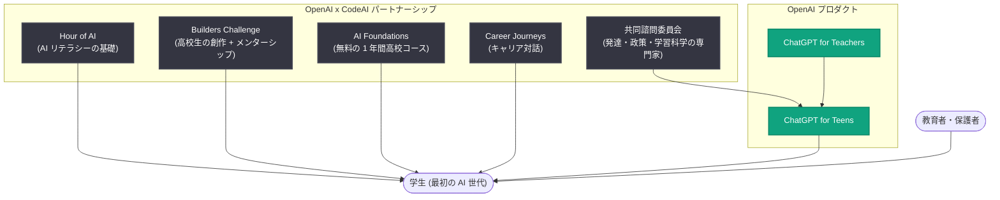

# CodeAI とのパートナーシップ: 「最初の AI 世代」の育成に向けた取り組み

## メタデータ

| 項目 | 内容 |
|------|------|
| 発表日 | 2026-08-18 |
| ソース | OpenAI News |
| カテゴリ | パートナーシップ / 教育 |
| 公式リンク | https://openai.com/index/partnering-with-codeai |

## 概要

OpenAI と CodeAI は、現在の学生たち、すなわち AI が日常生活の一部となる中で育つ「最初の AI 世代」に対し、AI リテラシーを身につけ、AI について批判的に思考し、責任を持って AI を使いこなし形作るためのスキルを育成するパートナーシップを発表した。

背景には、AI の「利用」と「理解」の間にある大きなギャップがある。大多数の学生がすでに AI を使用している一方で、全生徒が AI を理解するための技術的知識を学んでいると回答した高校のリーダーはわずか 16% にとどまる。また CodeAI の調査では、高校生の 75% が「AI の理解は将来ますます重要になる」と回答しており、教育現場での体系的な AI リテラシー教育の必要性が高まっている。

## 主な内容

### パートナーシップの目的

本パートナーシップの目標は、単に多くの学生に AI を使わせることではなく、若者が以下の力を身につけられるよう支援することにある。

- AI の仕組みを理解する
- AI の出力を批判的に評価する
- AI を責任を持って使用する

OpenAI の子ども発達責任者である Dr. Allison Mishkin は「私たちの目標は、単により多くの学生に AI を使ってもらうことではなく、より良い問いを立てられるよう支援することです」と述べ、批判的思考と責任ある利用の育成を強調している。また CodeAI の CEO である Karim Meghji は「すべての学生が AI が実際にどのように動くのかを知るべきです」と述べ、技術に疑問を持ち、誤りを見抜き、信頼の限界を知る基礎の重要性を指摘した。

### ChatGPT for Teens の立ち上げ

本パートナーシップは「ChatGPT for Teens」のローンチと同時に発表された。主な特徴は以下のとおり。

- 学習を中心に設計された 10 代向けの専用体験
- 批判的思考や理解の深化を支援する設計
- 健全な利用を促す機能や保護者向けの追加コントロールなど、10 代向けの保護機能を内蔵
- 既存の「ChatGPT for Teachers」や米国教員連盟 (AFT) との取り組みを基盤に構築

### 今後 1 年間の具体的な取り組み

| 取り組み | 内容 |
|---------|------|
| 共同諮問委員会の設立 | 子どもの発達、若者向け公共政策、学習科学の専門家が、新たなリスクや責任ある AI 実践について継続的に助言。ChatGPT for Teens の今後の開発にも反映 |
| AI リテラシーの基礎構築 | 「Hour of AI」を通じて数百万人の学生に AI の思慮深く責任ある使い方の基本を紹介 |
| Builders Challenge (初開催) | 高校生が AI で創作し、OpenAI チームからメンターシップを受け、支援教員とともに全国的な舞台で成果を発表 |
| 教室学習の支援 | CodeAI の無料の 1 年間高校コース「AI Foundations」の開発において、OpenAI の AI システム・安全性・責任ある利用の専門家が相談役として参画 |
| Career Journeys | 学生が OpenAI の研究者・エンジニア・リーダーから直接話を聞き、将来のビルダーや創作者としての自己像を描けるよう支援 |

## パートナーシップの全体像

## 開発者・教育関係者への影響

- **教育現場での AI 導入指針**: 高校向け無料コース「AI Foundations」や「Hour of AI」により、体系的な AI リテラシー教材へのアクセスが拡大する
- **10 代向けの安全設計の標準化**: ChatGPT for Teens の保護機能や保護者向けコントロールは、若年層向け AI プロダクトを設計する際の参考モデルとなる
- **専門家の知見の反映**: 共同諮問委員会による継続的な助言は、子どもの発達や学習科学の観点を AI プロダクト開発に組み込む先行事例となる
- **人材育成パイプライン**: Builders Challenge や Career Journeys を通じて、次世代の AI 開発者・創作者の裾野が広がる

## 関連リンク

- [Partnering with CodeAI to prepare the first AI generation (公式発表)](https://openai.com/index/partnering-with-codeai)
- [OpenAI News](https://openai.com/news)
- [OpenAI ChatGPT](https://chatgpt.com/)
- [OpenAI 公式ドキュメント](https://platform.openai.com/docs)

## まとめ

OpenAI と CodeAI のパートナーシップは、「最初の AI 世代」となる学生たちが AI を単に使うだけでなく、その仕組みを理解し、出力を批判的に評価し、責任を持って活用できるよう支援する包括的な教育イニシアチブである。ChatGPT for Teens のローンチと合わせ、共同諮問委員会、Hour of AI、Builders Challenge、AI Foundations コース、Career Journeys という 5 つの柱で今後 1 年間の取り組みが進められる。OpenAI は、若者の AI 時代への準備は共有責任であり、AI は教師や家族など信頼できる人々の指導を「置き換えるのではなく支援する」べきものと位置づけている。
