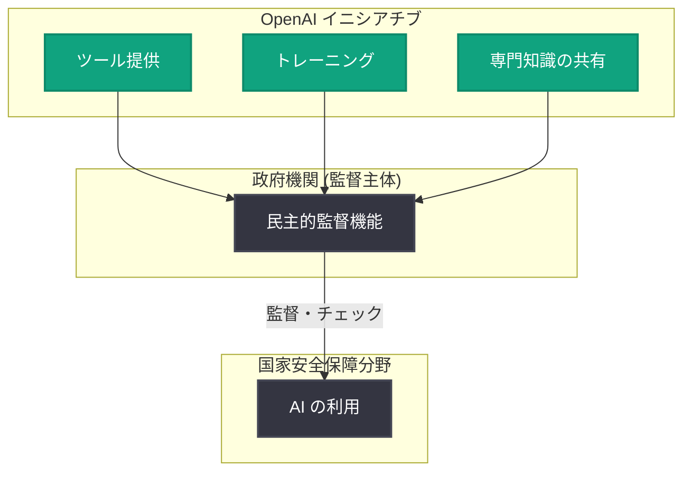

# 国家安全保障における民主的監督の強化 (Strengthening Democratic Oversight in National Security)

## メタデータ

| 項目 | 内容 |
|------|------|
| 発表日 | 2026-08-18 |
| ソース | OpenAI News |
| カテゴリ | Global Affairs (グローバル・アフェアーズ / ポリシー) |
| 公式リンク | https://openai.com/index/strengthening-democratic-oversight-in-national-security |

> **注記**: 本レポートは、OpenAI 公式 RSS フィード (OpenAI News) で確認した一次情報 (タイトル、公式説明文、カテゴリ、発表日時) に基づいて作成しています。記事本文の全文は取得できなかったため、公式に確認できた範囲の情報のみを記載しています。

## 概要

OpenAI は 2026 年 8 月 18 日、国家安全保障分野における AI の民主的監督 (democratic oversight) を強化するためのイニシアチブを発表しました。公式発表によると、このイニシアチブは政府機関に対してツール、トレーニング、専門知識 (expertise) を提供し、AI が国家安全保障の文脈で利用される際の監督体制を支援するものです。

AI の能力が急速に向上し、国家安全保障領域での AI 活用が拡大する中で、民主主義的な統治機構による適切な監督をいかに確保するかは、AI ガバナンスにおける重要課題の 1 つとなっています。本イニシアチブは、AI 開発企業である OpenAI 自身が、監督する側の政府・立法機関の能力構築 (キャパシティビルディング) を支援するという点で注目される取り組みです。

## 主な内容

### イニシアチブの目的

公式説明文で示されている本イニシアチブの柱は以下のとおりです。

- **民主的監督の強化**: 国家安全保障における AI 利用に対して、民主的な統治機構が実効的な監督を行えるようにする
- **政府機関への支援**: 監督の担い手となる政府機関 (government institutions) を対象とした支援を提供する

### 提供される支援の内容

公式発表では、政府機関への支援として次の 3 つが挙げられています。

| 支援内容 | 説明 |
|---------|------|
| ツール (Tools) | 監督業務を支援するためのツールの提供 |
| トレーニング (Training) | AI 技術と国家安全保障上の利用に関する教育・訓練 |
| 専門知識 (Expertise) | OpenAI が持つ AI に関する専門的知見の提供 |

### イニシアチブの構造 (概念図)

### 背景 (AI と国家安全保障をめぐる文脈)

OpenAI はこれまでも、国家安全保障と AI に関する取り組みを段階的に進めてきました。2024 年以降、米国政府機関向けの ChatGPT Gov の提供や、米国の国立研究所・政府機関との協力などを通じて、公共部門での AI 活用と安全性確保の両立を模索しています。本イニシアチブは、AI を「利用する側」の支援に加えて、AI を「監督する側」である民主的機関の能力向上に焦点を当てたものと位置付けられます。

## 開発者・組織への影響

本発表は API や製品の技術的変更ではなく、ポリシー・ガバナンス領域の発表であるため、開発者への直接的な技術的影響はありません。ただし、以下の観点で影響が想定されます。

- **公共部門関連の開発者**: 政府機関向けに AI ソリューションを提供する開発者・ベンダーにとって、監督体制やコンプライアンス要件が今後整備・明確化される可能性がある
- **AI ガバナンスの潮流**: AI 企業自身が監督機関の能力構築を支援するモデルは、今後の業界標準や規制の枠組みに影響を与える可能性がある
- **国家安全保障領域での AI 利用**: 民主的監督の枠組みが強化されることで、当該分野での AI 導入に対する社会的信頼と透明性の向上が期待される

## 関連リンク

- [公式発表: Strengthening democratic oversight in national security](https://openai.com/index/strengthening-democratic-oversight-in-national-security)
- [OpenAI News](https://openai.com/news)
- [OpenAI Global Affairs](https://openai.com/global-affairs/)
- [OpenAI Safety](https://openai.com/safety/)
- [OpenAI 公式ドキュメント](https://platform.openai.com/docs)

## まとめ

- OpenAI は 2026 年 8 月 18 日、国家安全保障における AI の民主的監督を強化するイニシアチブを発表した
- 政府機関に対してツール、トレーニング、専門知識を提供し、監督主体の能力構築を支援する
- カテゴリは Global Affairs であり、技術発表ではなく AI ガバナンス・ポリシー領域の取り組みである
- AI 企業が監督する側の民主的機関を支援するという点で、AI ガバナンスの新しいアプローチとして注目される
