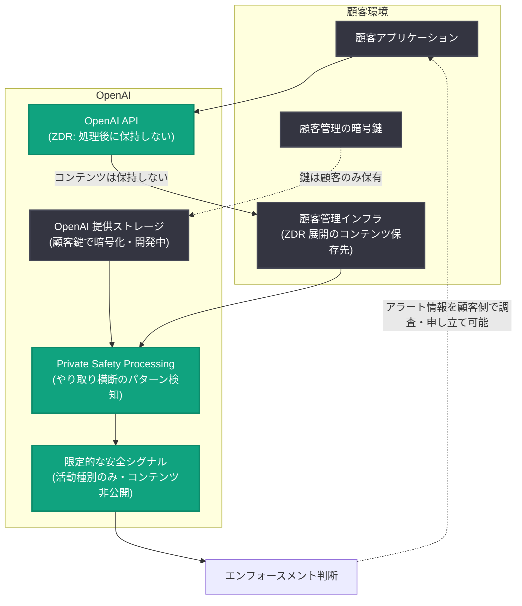

# フロンティアモデル向け Zero Data Retention の提供と Private Safety Processing のプレビュー

## メタデータ

| 項目 | 内容 |
|------|------|
| 発表日 | 2026-08-19 |
| ソース | OpenAI News |
| カテゴリ | Company (プライバシー / 安全性) |
| 公式リンク | https://openai.com/index/offering-zero-data-retention-for-frontier-models |

## 概要

OpenAI は、対象となる API 顧客向けの Zero Data Retention (ZDR) の約束を再確認した。ZDR では、リクエスト処理後にプロンプトやモデルの応答を OpenAI が保持せず、顧客コンテンツは OpenAI の担当者によるレビューの対象にならない。また、エンタープライズ顧客のデータは、顧客が明示的にオプトインしない限りモデルの学習には使用されない。

あわせて OpenAI は、新しい安全性の仕組みである Private Safety Processing をプレビューとして発表した。モデルがより長く複雑なタスクを担うようになると、深刻なリスクが複数のやり取りにまたがって初めて可視化される場合がある。既存の ZDR 互換の安全システムは各やり取りを個別に評価するが、Private Safety Processing は、OpenAI の担当者が元のコンテンツにアクセスすることなく、関連するやり取り全体のパターンを特定できるように設計されている。

## 主な内容

### 安全システムが進化する必要がある理由

最も深刻な AI 安全リスクは、単一のやり取りだけでは必ずしも可視化されない。潜在的に有害な意図は、複数のやり取りをまとめて見たときに初めて明らかになることが多い。記事では、次のようなリスクが挙げられている。

- 悪意ある行為者がセーフガードを繰り返し探る (プロービング)
- 複数のアカウントをまたいだ協調的な行動
- 脅威を日常的なリサーチとして偽装する行為
- エージェント型タスクの過程で発生するリスク (例: 停止を指示された後も動作を継続し、ユーザーの意図から逸脱するケース)

AI システムがより長く複雑なタスクを担うにつれ、正当な活動と悪用を区別し、AI エージェントが意図された権限の範囲内に留まることを保証するうえで、こうした広い文脈の重要性が増している。

一方で、最近の一部のフロンティアモデルの展開では、安全性モニタリングのために機微なコンテンツを AI プロバイダーが保持することを顧客に求めるものがあった。多くの組織にとって、こうした要件はセキュリティ上の義務やサービス利用者への約束と矛盾する。Private Safety Processing は、OpenAI が ZDR の提供を継続できるように設計されている。

### Private Safety Processing の仕組み

Private Safety Processing は、ZDR やその他の展開で既に使用されている自動化された保護機能を基盤とし、それを関連するやり取り全体に拡張する。ポイントは以下のとおり。

1. **コンテンツの保存場所は 2 通り**: ZDR 展開では顧客コンテンツは顧客が管理するインフラに留まる。加えて、OpenAI のインフラ上に顧客管理の鍵で暗号化して保存するオプションも開発中である
2. **鍵は顧客が管理**: OpenAI 提供のストレージを使う場合でも、暗号鍵は顧客が管理し、OpenAI の担当者は鍵のコピーを持たないため、元のコンテンツにアクセスできない
3. **限定的な安全シグナルのみを受信**: リスクが特定された場合、OpenAI は関与する活動の種類を示す狭く定義されたシグナルのみを受け取る。これは既存の安全システムと同様の仕組みで、エンフォースメント (強制措置) の要否判断に使用される。フラグが立てられた場合でも、OpenAI の担当者は顧客コンテンツへのアクセス権を得ない
4. **顧客側での調査と申し立て**: 顧客は自社システム内の情報を用いてアラートやエンフォースメントの決定を調査できる。申し立て、正当な活動の説明、検証済みの悪用に関する調査への協力を行いたい場合は、関連情報を OpenAI と共有することを選択できる

### 顧客とともに構築するプライバシーと安全性

OpenAI が協働する組織は、金融記録、健康データ、機密事業計画、独自研究など、各セクターで最も機微な情報を扱っている。Private Safety Processing は、業界・地域・企業規模を問わず、こうした顧客からのフィードバックによって形作られている。

Glean の CISO である Sunil Agrawal 氏は、「エンタープライズにおける AI 導入は、選択したサービスの範囲を超えた直接的・派生的な利用がない、顧客によるデータ管理にかかっている。OpenAI の学習不使用の約束と ZDR により、Glean は OpenAI と共に構築する確信を得ている」とコメントしている。

## 技術的な詳細

- **ZDR の保証内容**: リクエスト処理後にプロンプト・応答を保持しない。顧客コンテンツは OpenAI 担当者のレビュー対象外。エンタープライズ顧客データは明示的なオプトインがない限り学習に不使用
- **既存システムとの違い**: 既存の ZDR 互換安全システムは各やり取りを個別に評価するのに対し、Private Safety Processing は関連するやり取りをまたぐパターンを自動システムで特定する
- **提供状況**: 現在、早期顧客とテスト中。2026 年 9 月にロールアウト開始と技術ホワイトペーパーの公開を予定

## アーキテクチャ

## 開発者への影響

- **ZDR を利用する API 顧客は既存の約束を維持できる**: プロンプト・応答の非保持、担当者レビューの対象外、オプトインなしの学習不使用という保証が、より高度な安全性モニタリングと両立する
- **規制・コンプライアンス要件との整合**: 金融・医療などの機微データを扱う組織は、コンテンツを AI プロバイダーに保持させることなく、複数のやり取りにまたがる悪用検知の恩恵を受けられる
- **運用面の予見性**: リスク検知時に OpenAI が受け取るのは活動種別を示す限定的なシグナルのみで、顧客は自社システムの情報でアラートを調査し、必要に応じて情報共有を選択できる
- **今後のスケジュール**: Private Safety Processing のロールアウトと技術ホワイトペーパーの公開は 2026 年 9 月に予定されており、OpenAI は既存の約束への影響の説明や計画に必要な時間・サポートを提供するとしている

## 関連リンク

- [Offering Zero Data Retention for frontier models (公式記事)](https://openai.com/index/offering-zero-data-retention-for-frontier-models)
- [Our principles (OpenAI)](https://openai.com/index/our-principles/)
- [OpenAI News](https://openai.com/news)
- [OpenAI 公式ドキュメント](https://platform.openai.com/docs)

## まとめ

OpenAI は、対象となる API 顧客向けの Zero Data Retention の約束 (処理後の非保持、担当者レビューの対象外、オプトインなしの学習不使用) を再確認するとともに、Private Safety Processing をプレビューとして発表した。この仕組みにより、顧客コンテンツを顧客管理のインフラまたは顧客管理の鍵で暗号化されたストレージに置いたまま、自動システムが複数のやり取りにまたがる悪用パターンを検知し、OpenAI には限定的な安全シグナルのみが渡される。ロールアウトと技術ホワイトペーパーの公開は 2026 年 9 月に予定されている。
