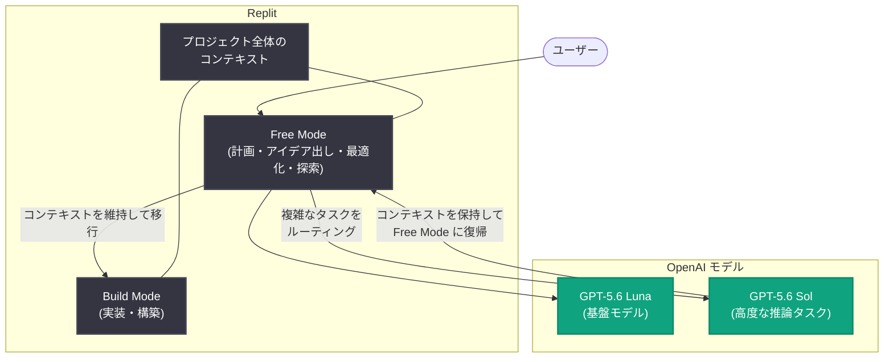

# Replit が GPT-5.6 Luna を活用した Free Mode でソフトウェア開発の裾野を拡大

## メタデータ

| 項目 | 内容 |
|------|------|
| 発表日 | 2026-08-19 |
| ソース | OpenAI News |
| カテゴリ | Startup (事例紹介) |
| 公式リンク | https://openai.com/index/replit |

## 概要

Replit は、OpenAI の GPT-5.6 Luna を基盤とする「Free Mode」を発表し、数百万人規模の無料ユーザーに提供を開始した。Free Mode では、使用量 (クレジット) を消費することなく、アイデアを動作するソフトウェアへと変換するための高速な回答・提案・フィードバック・分析を利用できる。トークンコストを気にせずに誰もがソフトウェア開発を始められる環境を目指した取り組みである。

Replit にとってモデルコストは、ソフトウェア開発の民主化における最後の障壁の一つだった。GPT-5.6 Luna の価格性能比と大規模環境での安定した推論、および OpenAI による最近の値下げにより、無料枠でも実用的な AI 支援を経済的に成立させることが可能になった。

## 主な内容

### Free Mode の機能

Free Mode では以下が可能となる。

- 使用量 (クレジット) を消費せずに、高速な回答・提案・フィードバック・分析を取得
- Agent がユーザーのプロジェクト全体のコンテキストを理解
- Build Mode へ移行する前の計画・アイデア出し・最適化・探索を支援
- 探索と構築を同一環境内で連続的に実行できる設計

### モデルルーティング: GPT-5.6 Luna と GPT-5.6 Sol

Free Mode は 2 つのモデルを組み合わせて動作する。

- **GPT-5.6 Luna**: Free Mode の基盤モデル。価格性能比と大規模での安定した推論が特徴
- **GPT-5.6 Sol**: より高度な推論が必要なタスクへルーティングされる上位モデル。処理後はプロジェクトのコンテキストを保持したまま Free Mode に戻る

タスクの複雑さに応じて軽量モデルと高性能モデルを切り替えるアーキテクチャの実例となっている。

### OpenAI とのパートナーシップの背景

Replit は GPT-3 の初期ユーザーであり、自然言語によるソフトウェア開発の黎明期から OpenAI のモデルを活用してきた。両社は「技術的背景に関係なく、アイデアを持つ誰もがソフトウェアを作れるようにする」という目標を共有している。

Replit CEO の Amjad Masad 氏は次のように述べている。

> "Thanks to OpenAI and the price cuts that you made recently, you made it possible for us to offer it to millions of users"

Masad 氏はまた、ソフトウェアを構築できる人の数を 100 倍に増やすことの意義に言及している。OpenAI CEO の Sam Altman 氏は、インターネットにアクセスできる誰もがプロダクトやスタートアップを構築できる世界が実現すれば、前例のない起業ブームが起きると述べている。

## アーキテクチャ

## 開発者への影響

- **参入障壁の低下**: 非エンジニアや初心者が無料でアプリやエージェントの開発を試せるようになる
- **ワークフローの統合**: アイデア検討 (Free Mode) から実装 (Build Mode) まで、コンテキストを失わずに移行できる
- **コスト構造の変化**: モデルの価格性能向上により、無料枠でも実用的な AI 支援が経済的に成立する
- **モデルルーティングの実例**: タスクの複雑さに応じて軽量モデル (Luna) と高性能モデル (Sol) を切り替える設計は、AI アプリケーション構築の参考になる

## 関連リンク

- [OpenAI 公式記事: Replit expands access to software creation with GPT-5.6 Luna](https://openai.com/index/replit)
- [Replit](https://replit.com)
- [OpenAI News](https://openai.com/news)

## まとめ

Replit の Free Mode は、GPT-5.6 Luna の価格性能比を活かし、トークンコストを気にせず誰もがソフトウェア開発を始められる環境を数百万人の無料ユーザーに提供する取り組みである。高度な推論が必要な場合は GPT-5.6 Sol へルーティングし、コンテキストを保持したまま Free Mode に戻る設計により、探索から構築までを同一環境で連続的に行える。モデルコストの低下がソフトウェア開発の民主化を後押しする具体例として、他の AI アプリケーション開発者にとっても示唆に富む事例と言える。
