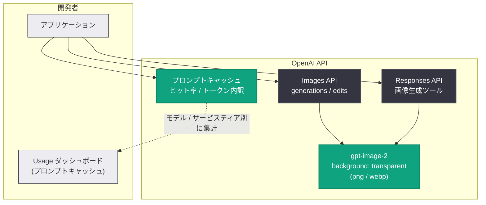

# API アップデート: プロンプトキャッシュダッシュボードと gpt-image-2 透過背景

## メタデータ

| 項目 | 内容 |
|------|------|
| 発表日 | 2026-08-20 |
| ソース | OpenAI API Changelog |
| カテゴリ | API 更新 / 新機能 |
| 公式リンク | https://developers.openai.com/api/docs/changelog |

## 概要

2026 年 8 月 20 日、OpenAI API Changelog に 2 件の更新が追加された。1 件目は、プロンプトキャッシュの利用状況を可視化する**プロンプトキャッシュダッシュボード**のリリースである。キャッシュヒット率の推移や、キャッシュ読み取り / 書き込み / 非キャッシュのトークン内訳を確認でき、モデルとサービスティアで絞り込みが可能となった。

2 件目は、画像生成モデル **gpt-image-2** (および日付付きスナップショット `gpt-image-2-2026-04-21`) における**透過背景 (transparent backgrounds) のプレビュー提供開始**である。Images API と Responses API の画像生成ツールで利用でき、`background` パラメータに `transparent` を指定し、出力形式に `png` または `webp` を使用する (`jpeg` は非対応)。

## 主な内容

### 1. プロンプトキャッシュダッシュボード (Feature)

OpenAI プラットフォームの Usage ページに、プロンプトキャッシュ専用のダッシュボードが追加された。Changelog では "Track your cache hit rate over time, cache reads per write" と説明されており、以下の指標を確認できる。

- **キャッシュヒット率の推移**: 時系列でのヒット率の変化を追跡
- **書き込みあたりのキャッシュ読み取り数 (cache reads per write)**: キャッシュ書き込みがどの程度再利用されているかの指標
- **トークン内訳**: キャッシュ読み取り / キャッシュ書き込み / 非キャッシュの各トークン量を表示し、改善の余地 (opportunities to improve) を特定できる
- **フィルタリング**: モデル別・サービスティア別に指標を絞り込み可能 ("Filter metrics by model and service tier.")

ダッシュボードは https://platform.openai.com/usage?usage_section=prompt-caching からアクセスできる。

#### プロンプトキャッシュの背景知識

プロンプトキャッシュは、1,024 トークン以上のプロンプトに対して自動的に有効化される仕組みである (公式ガイドより: "By default, caching is enabled automatically for prompts that are 1,024 tokens or longer.")。キャッシュヒットはプロンプトの**前方一致 (exact prefix matches)** に対してのみ発生するため、静的な指示や例をプロンプトの先頭に置き、可変コンテンツを末尾に置くことが推奨されている。

料金面では、GPT-5.6 以降のモデルにおいてキャッシュ済み入力トークンは非キャッシュ入力トークンの 0.1 倍で課金され、キャッシュへの書き込みトークンは 1.25 倍で課金される。ダッシュボードで内訳を把握することは、コスト最適化に直結する。

キャッシュの利用状況は、これまでも API レスポンスの `usage.prompt_tokens_details` (Chat Completions) や `usage.input_tokens_details` (Responses) 内の `cached_tokens` で個別リクエストごとに確認できたが、今回のダッシュボードにより組織全体の傾向を俯瞰できるようになった。

### 2. gpt-image-2 の透過背景プレビュー (Update)

画像生成モデル gpt-image-2 で、透過背景の生成がプレビューとして利用可能になった。

| 項目 | 内容 |
|------|------|
| 対象モデル | `gpt-image-2`、`gpt-image-2-2026-04-21` |
| 対象エンドポイント | `v1/images/generations`、`v1/images/edits`、`v1/responses` (画像生成ツール) |
| 設定方法 | `background` パラメータに `transparent` を指定 |
| 対応出力形式 | `png` (デフォルト)、`webp` |
| 非対応出力形式 | `jpeg` ("jpeg does not support transparent backgrounds.") |
| 提供状況 | プレビュー ("Transparent backgrounds are now available in preview") |

公式の画像生成ガイドによると、`background` パラメータは `transparent` / `opaque` / `auto` の指定に対応している。

## 技術的な詳細

### コードサンプル

以下は公式ガイドの生成例に `background` パラメータを追加した例である。

```python
from openai import OpenAI
import base64

client = OpenAI()

result = client.images.generate(
    model="gpt-image-2",
    prompt="A cute robot mascot sticker",
    background="transparent",
    output_format="png",  # または "webp" ("jpeg" は非対応)
)

image_base64 = result.data[0].b64_json
with open("mascot.png", "wb") as f:
    f.write(base64.b64decode(image_base64))
```

Responses API の画像生成ツールでも同様に透過背景を指定できる。

### アーキテクチャ



## 開発者への影響

- **キャッシュ効率の可視化によるコスト最適化**: これまで個別リクエストの `cached_tokens` でしか把握できなかったキャッシュ利用状況を、組織全体で時系列に確認できる。ヒット率が低い場合は、プロンプト構造の見直し (静的コンテンツの前方配置) や `prompt_cache_key` の設定といった改善につなげやすくなった
- **モデル / サービスティア別の分析**: フィルタ機能により、どのモデル・どのサービスティアでキャッシュが効いていないかを特定でき、ワークロードごとの最適化判断が容易になる
- **透過背景によるアセット生成の効率化**: ステッカー、アイコン、UI 素材、合成用素材など、背景の切り抜きが必要だったユースケースで後処理が不要になる。既存の gpt-image-2 利用コードに `background="transparent"` を追加するだけで利用できる
- **出力形式の制約に注意**: 透過背景を使う場合は `png` または `webp` を指定する必要がある。`jpeg` を指定しているパイプラインでは変更が必要
- **プレビュー段階である点に留意**: 透過背景はプレビュー提供のため、挙動や仕様が変更される可能性がある

## 関連リンク

- [OpenAI API Changelog](https://developers.openai.com/api/docs/changelog)
- [プロンプトキャッシュダッシュボード](https://platform.openai.com/usage?usage_section=prompt-caching)
- [プロンプトキャッシュガイド](https://developers.openai.com/api/docs/guides/prompt-caching)
- [画像生成ガイド (Customize image output)](https://developers.openai.com/api/docs/guides/image-generation#customize-image-output)

## まとめ

今回の更新は、運用面と機能面の両方で開発者の利便性を高めるものである。プロンプトキャッシュダッシュボードは、キャッシュヒット率やトークン内訳をモデル・サービスティア別に可視化し、API コストの最適化を支援する。gpt-image-2 の透過背景プレビューは、`background` に `transparent` を指定するだけで `png` / `webp` の透過画像を生成でき、画像アセット制作のワークフローを簡素化する。透過背景はプレビュー段階のため、本番利用時は仕様変更の可能性に留意したい。
